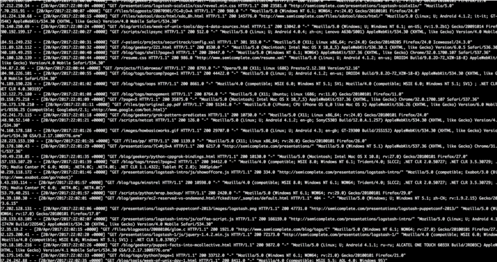

Kibana
---

## Section Objectives

* Install Kibana
* Configure common Kibana tasks
* Get familiar with Kibana functionality

Notes:

---

## What is Kibana

* Kibana is an open source analytics and visualization platform
  - Works on top of Elasticsearch. 
* It can be used to 
  - Search
  - View
  - Interact 
* Data
  - Structured
  - Unstructured

Notes:

---

## What is Kibana?

---

## Kibana UI

* Presentation types
  - Histograms
  - Charts
  - Graphs
  - Tables
  - Maps

Notes:

---

## Kibana Features

* Seamless integration with Elasticsearch 
* Understanding of data by representing it with
  - bar charts
  - line and scatter plots
  - Histograms
  - pie charts
  - maps
* Integrates with Elasticsearch analytics
* Allows to
  - Create
  - Save
  - Share
  - Export
  - Embed visualized data for

Notes:

---

## Kibana and Elastic Stack

<!-- {"left" : 0.71, "top" : 2.06, "height" : 4.32, "width" : 8.83} -->

Notes:

---

## What is What

* Beats is a lightweight importer of data directly into Elasticsearch
* Logstash is an ETL data pipeline
* Kibana is a user interface
  - Visualize
  - Slice and dice data
  - Manage and monitor the entire stack

Notes:

---

## Example of ELK Data Pipeline

<!-- {"left" : 0.62, "top" : 1.85, "height" : 5.36, "width" : 9.02} -->

Notes:

---

## X-Pack

* Commercial extension for Elasticsearch
* Subscription pricing
* More later

<!-- {"left" : 1.02, "top" : 2.97, "height" : 4.9, "width" : 8.21} -->

Notes:

---

## Now for Kibana. Say you have logs

<!-- {"left" : 0.51, "top" : 2.09, "height" : 4.88, "width" : 9.23} -->

Notes:

---

## Here is How You Would Like Them

<!-- {"left" : 0.58, "top" : 1.72, "height" : 4.95, "width" : 9.09} -->

Notes:

---

## With X-Pack You Can Do Even More

<!-- {"left" : 0.55, "top" : 1.66, "height" : 4.87, "width" : 9.16} -->

Notes:

---

## Lab: Install Kibana

* Please do this lab: 

  - `kibana/install.md`

Notes:

---

## For Kibana Configuration

<!-- {"left" : 0.4, "top" : 1.98, "height" : 3.86, "width" : 9.44} -->

Notes:

---

## Ways to Ingest Data

* Files
* Bulk ingest
* Beats
* Logstash
* But for our lab, we will use existing data

Notes:

---

## Configure Kibana File Pattern

<!-- {"left" : 0.35, "top" : 1.69, "height" : 5.05, "width" : 9.54} -->

Notes:

---

## Configure

<!-- {"left" : 6.96, "top" : 1.05, "height" : 5.56, "width" : 3.14} -->

* Click on "Configure"
* Observe the prominent fields and their value distribution
* Investigate fields, such as
  - geo.src
  - extension
  - Etc.

Notes:

---

## Time Range

* Time range control is at the top right
* Investigate the effect of time range controls

<!-- {"left" : 0.13, "top" : 2.78, "height" : 3.51, "width" : 9.99} -->

Notes:

---

## Time Picker

* Relative time picker
* Or absolute
* Or auto refresh

<!-- {"left" : 0.65, "top" : 2.94, "height" : 4.73, "width" : 8.94} -->

Notes:

---

## Search in Kibana with Lucene Syntax

<!-- {"left" : 0.48, "top" : 1.79, "height" : 4.97, "width" : 9.3} -->

Notes:

---

## Expand the Document and Analyze the Data

<!-- {"left" : 0.38, "top" : 1.79, "height" : 5.07, "width" : 9.48} -->

Notes:

---

## Filter for Specific Geography

<!-- {"left" : 0.79, "top" : 1.26, "height" : 0.77, "width" : 8.67} -->

<!-- {"left" : 0.46, "top" : 2.81, "height" : 4.97, "width" : 9.32} -->

Notes:

---

## Lucene Query Syntax

<!-- {"left" : 0.48, "top" : 1.58, "height" : 4.97, "width" : 9.29} -->

Notes:

---

## Experiment with Queries

* What would this query do?

<!-- {"left" : 0.17, "top" : 1.66, "height" : 0.42, "width" : 9.91} -->

* What other queries can you suggest?

Notes:

---

## Structured Filters

<!-- {"left" : 0.32, "top" : 1.45, "height" : 5.31, "width" : 9.62} -->

Notes:

---

## Structured Filters Capabilities

* Choose the field in the UI as a dropdown
* Choose condition, e.g. IS ONE OF
* Provide the value
* Save the query
* Add another filter:	
  - Field
  - Relationship
  - Value
* View surrounding documents (in time)

Notes:

---

## Visualizations

<!-- {"left" : 0.19, "top" : 1.29, "height" : 4.88, "width" : 9.87} -->

Notes:

---

## Visualization Types

* Basic charts
* Data
* Maps
* Time series

Notes:

---

## Counting the Document with a Line Chart

<!-- {"left" : 0.5, "top" : 1.29, "height" : 4.43, "width" : 9.25} -->

Notes:

---

## Visualize Traffic vs Bytes Count

<!-- {"left" : 0.52, "top" : 1.29, "height" : 4.91, "width" : 9.22} -->

Notes:

---

## Let us Change the Looks

<!-- {"left" : 0.39, "top" : 1.29, "height" : 4.81, "width" : 9.46} -->

Notes:

---

## Pie Chart – Response Codes

<!-- {"left" : 0.46, "top" : 1.29, "height" : 5.63, "width" : 9.32} -->

Notes:

---

## Dashboards – Just Add Visualizations

<!-- {"left" : 0.48, "top" : 1.29, "height" : 5.05, "width" : 9.3} -->

Notes:

---

## Sharing Kibana Dashboards

<!-- {"left" : 0.26, "top" : 1.29, "height" : 4.78, "width" : 9.72} -->

Notes:

## Lab: Kibana tour

* Please do this lab: 

  - `kibana8/2-capabilities.md`

---

