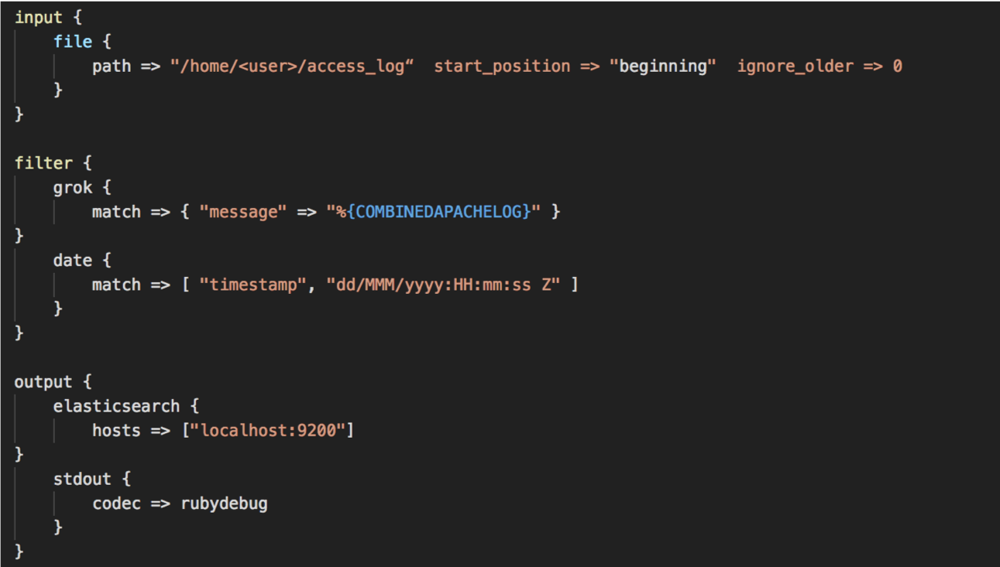
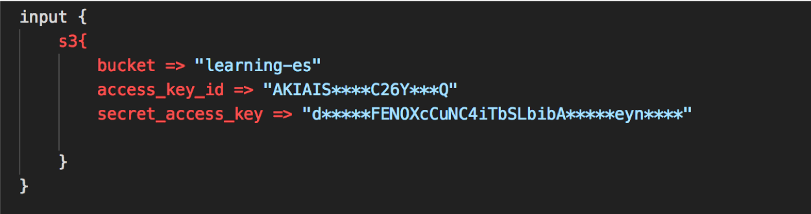

# Logstash


---


# Logstash Intro

---


## Logstash


* Logstash is very powerful 
  - supports many systems
  - multiple in/out simultaneously.

---

## Powerful Features


* Logstash **parses, transforms,** and **filters** data as it passes through.
* It can **derive structure** from unstructured data
* It can **anonymize** personal data or exclude it entirely
* It can do **geo-location** lookups
* It can scale across many nodes
* It guarantees at-least-once delivery
* It absorbs throughput from load spikes

* See https://www.elastic.co/guide/en/logstash/current/filter-plugins.html  for the huge list of filter plugins.


* Can serve as buffer between source and destination


---

## Logstash - Input Sources


* elastic beats – cloudwatch – couchdb – drupal – elasticsearch –  windows event log – shell output – local files – ganglia – gelf –  gemfire – random generator – github – google pubsub – graphite –  heartbeats – heroku – http – imap – irc – jdbc – jmx – kafka –
  lumberjack – meetup – command pipes – puppet – rabbitmq –  rackspace cloud queue – redis – relp – rss – s3 – salesforce –  snmp – sqlite – sqs – stdin – stomp – syslog – tcp – twitter – udp
– unix sockets – varnish log – websocket – wmi – xmpp – zenoss
– zeromq

---


## Data Sources


<!-- {"left" : 1.02, "top" : 2.33, "height" : 4.41, "width" : 8.21} -->


Notes:


---

## Logstash - Output

* boundary – circonus – cloudwatch – csv – datadoghq –  elasticsearch – email – exec – local file – ganglia – gelf –  bigquery – google cloud storage – graphite – graphtastic –  hipchat – http – influxdb – irc – jira – juggernaut – kafka –  librato – loggly – lu
mberjack – metriccatcher – mongodb –  nagios – new relic insights – opentsdb – pagerduty – pipe  to stdin – rabbitmq – rackspace cloud queue – redis –  redmine – riak – riemann – s3 – sns – solr – sqs – statsd
– stdout – stomp – syslog – tcp – udp – webhdfs –
websocket – xmpp – zabbix - zeromq


---

## Typical Usage


---

## Logstash Architecture

<!-- {"left" : 0.62, "top" : 2.65, "height" : 3.76, "width" : 9.01} -->


Notes:


---

## For Data Processing

* Filter plugins
data-processing.png

<!-- {"left" : 1.02, "top" : 2.35, "height" : 4.37, "width" : 8.21} -->


Notes:


---

## Data Emission

* Outputs

<!-- {"left" : 1.02, "top" : 2.34, "height" : 4.37, "width" : 8.21} -->


Notes:


---

## Stability

<!-- {"left" : 1.02, "top" : 2.34, "height" : 4.37, "width" : 8.21} -->


Notes:


---

## Pipelines


<!-- {"left" : 1.02, "top" : 2.34, "height" : 4.48, "width" : 8.21} -->


# Installing Logstash

---

## Installing Logstash


---

## Configuring Logstash



* Input = log location
* Start_position
* Ignore_older
* Set timestamp format being used in access_log
* Send to Elasticsearch & standard out


Notes:

sudo vi /etc/logstash/conf.d/logstash.conf


---

## Running Logstash

* cd /usr/share/logstash/

* sudo bin/logstash -f /etc/logstash/conf.d/logstash.conf

---

# Logstash XML Processing

---

## Logstash – XML Filter


* Takes an XML and parses to a data structure, or alternatively patterned into fields
* Currently maintained plugin for Logstash
* Lots of online examples of using it to do tasks based on XML from a variety of sources 


---

## XML Filter Xpath example

* Assume you have the following XML 

```xml
<note date="2018-09-01"> <to>someone@gmail.com</to> <from>another.person@email.com</from> </note> 
```


```json
xpath => [ "xpath-syntax", "destination-field" ]
```

```json
xpath => [
  "/note/from/text()", "from,
  "/note/to/text()", "to,
  "/note/@date", "date"
]

```

* Values returned by XPath parsing from xpath-syntax will be put in the destination field
* Multiple values returned will be pushed onto the destination field as an array.


---

## Preprocess Example w/ Ruby

```json

ruby {  
     code => "
	require 'nokogiri'def iterative(ele)
        	ele.children.each do |tempNode|
        		if tempNode.text?
        			puts tempNode.content
        		else
        			iterative(tempNode)
        		end
        	end
        end
        xml_doc = Nokogiri::XML.parse(event.get('xml-data'))
        iterative(xml_doc)"
      }

```

Note:

If you want to mask data prior to processing into Elasticsearch


---

# Logstash with Mysql


---

## Jdbc Driver

* Get a mysql connector from https://dev.mysql.com/downloads/connector/j/


* `get https://dev.mysql.com/get/Downloads/Connector-J/mysql-connector-java-5.1.42.zip`

* `unzip mysql-connector-java-5.1.42.zip`


---

## Configure Logstash


---

## Lab: Logstash & Mysql


* Lab 13: Install Logstash and integrate with MySQL


---

# Logstash with s3

---

## What is s3

* Amazon web services’ **simple storage service** cloud-based distributed storage system

---

## Integration is Easy





---

# Logstash with Kafka

Notes:

https://docs.confluent.io/current/connect/connect-elasticsearch/docs/elasticsearch_connector.html

---

## What is **Kafka**

* Apache kafka
* Open-source stream processing platform
* High throughput, low latency
* Publish/subscribe
* Process streams
* Store streams
* Has a lot in common with logstash, really.

---

## Integration is Easy


---


