# Mappings


# Creating Mappings
---

## What is a Mapping?

* A mapping is a **schema definition.**
* Elasticsearch has reasonable defaults, but sometimes you need to customize them.

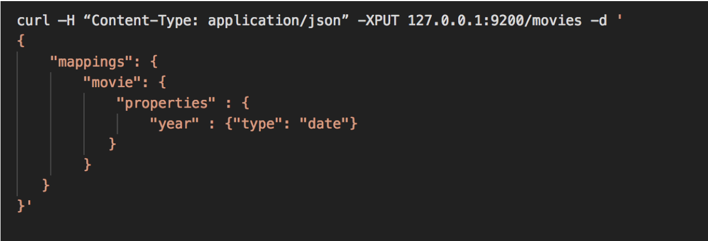

* NOTE : Content-Type is now required in Elasticsearch 6.x+

Notes:
Mapping is a schema definition which tells Elasticsearch how to index your data.  
Most of the time it can figure out the correct type of mapping for your data (strings, floating point numbers, integers etc..) 
Sometimes we have to give it a hint.  We want the "release date" to specifically be a date field. 
Movie data type: year = type date, not just string
Preferred to explicitly tell Elasticsearch since that reduces instances of the implied mapping identifying a more generic or incorrect type.

---

## Elasticsearch 5 Syntax

* In Elasticsearch 5 it was possible to send a REST request without the Content-Type. Elasticsearch would then "sniff" the content and set the type based on that. 


Notes:

Mapping is a schema definition which tells Elasticsearch how to index your data.  
Most of the time it can figure out the correct type of mapping for your data (strings, floating point numbers, integers etc..) Some types such as timestamp and decimal, may not be correctly inferred
Sometimes we have to give it a hint.  We want the "release date" to specifically be a date field. 

This ability to enforce strict content-type checking has existed since Elasticsearch 5.3 via the http.content_type.required configuration setting. In 5.x it is optional, and defaults to false, in Elasticsearch 6.0, that setting defaults to true, and there is no way to disable it.

https://dzone.com/articles/elastic-stack-6-what-you-need-to-know
https://aws.amazon.com/about-aws/whats-new/2017/12/elasticsearch-6-0-now-available-on-amazon-elasticsearch-service/
https://www.elastic.co/guide/en/elasticsearch/reference/6.0/breaking-changes-6.0.html
https://www.elastic.co/guide/en/elasticsearch/reference/6.0/removal-of-types.html


---

## Elasticsearch Syntax


* There are two reasons this changed. 
* Clarity
  - Sending plain text content to API that doesn't support it returns.
* `Content-Type header [text/plain] is not supported`

* In Elasticsearch 5 if you sent plain text that started with a curly brace and the letter "a" it would assume it was JSON, but when it tried to parse that, it would fail and the error message would look more like: 

* `Unexpected character ('a' (code 97)): was expecting double-quote to start field name`

Notes:

Elasticsearch 5 did some magic to try and figure out what type of content you were sending. 
This led to bad error messages.
Plain text sent.. ES5 sees it has curly braces and assumes it's JSON but it isn't so get syntax error back.

As Elasticsearch has evolved the development team made a conscious decision to favor reliability and predictability over leniency. 


---

## Elasticsearch Syntax

* There are two reasons this changed. 
* Security

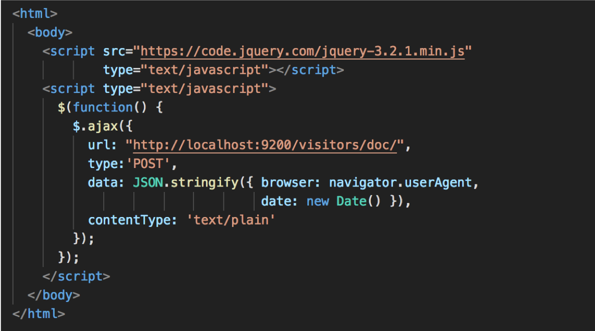

* JSON sent as text/plain
* Cross Origin Resource Sharing


Notes:

Security: 
Simple HTML page that posts a document to Elasticsearch without authenticating. 
Sending JSON as Plain Text

Strict checking of content-type is also useful as a layer of protection against Cross Site Request Forgery attacks.
If you run an out-of-the-box install of Elasticsearch 5 on your local computer, and then open up the page noted in the slide, in your web browser, it will add a new document in your Elasticsearch cluster that stores your browser's User Agent and the time that you loaded the page. That's not so scary, but with minimal changes we could make that same page overwrite or delete existing documents.


---

## Common Mappings


Notes:


Different field types
Text does NOT equal keyword.  Text is indexed and returns partial matches, keyword is only the full keyword.
Is a field indexed? true or false? 
Fields that are indexed for full text search, specify how it is broken up. 
broken up by whitespace, etc.. 


---

## More about Analyzers


* **Character Filters**
  - remove HTML encoding, convert & to and

* **Tokenizer**
  - split strings on whitespace / punctuation / non-letters

* **Token filter**
  - lowercasing, stemming, synonyms, stopwords

Notes:

Character filters: If apply same analyzer to search query and data that is indexed it will return better results. 
Example: Search for data using ampersand, or 'and' and get same results. 
tokenizer: Splits strings up certain ways, language specific tokenizing etc.. 
token filter: case insensitive (lowercase everything), stemming (box, boxed, boxing can all match).
stopwords (and, a, the) stops these words from being indexed. (stopwords can have side effects)


---

## Choices for Analyzers

* **Standard**
  - splits on word boundaries, removes punctuation,  lowercases. good choice if language is unknown

* **Simple**
  - splits on anything that isn't a letter, and lowercases

* **Whitespace**
  - splits on whitespace but doesn't lowercase

* **Language (i.e. english)**
  - accounts for language-specific stopwords and  stemming

Notes:

Standard: default
if you don't know language it's good to stick with. (supports foreign language)
Simple
Splits on anything that isn't a letter and it lowercases everything. 
Whitespace
Splits on whitespace, punctuation is preserved.
Language specific (specify in English, or any other language) 


---

## Lab03: Create Year Mapping

* Log into VM 
* Use curl to create mapping for year field.
* Confirm it was created successfully

---

# Hacking Curl

---

## Make Life Easier


* From your home directory:

* Two ways

* Alias 
`alias curl="/usr/bin/curl -H 'Content-type: application/json' "`

* **Or wrap the command** 

```text
mkdir bin  cd bin
vi curl (Hit I for insert mode)

#!/bin/bash
/usr/bin/curl –H "Content-Type: application/json" "$@"

Esc – wq! – enter

chmod a+x curl
```

Notes:

As I mentioned in Elasticsearch 6 they started requiring Content-Type every single type you connect to the API. This can become tedious 

There are a couple ways to get around this. 
Install httpie and use it 
Create a shell script that automatically passes JSON Content-Type to curl. 


---

## Make Life Easier

* Delete an index
* **curl -XDELETE 127.0.0.1:9200/movies** 

Notes:

As I mentioned in Elasticsearch 6 they started requiring Content-Type every single type you connect to the API. This can become tedious 

There are a couple ways to get around this. 
Install httpie and use it 
Create a shell script that automatically passes JSON Content-Type to curl. 


---

## Remember


* Without this hack, you need to add

* `-H "Content-Type: application/json"`

* to every curl command!

* The rest of the course assumes you have  this in place.

Notes:

Don't do this in production, it is a hack that is only applicable to this course. 


---

# Import **one document**

---

## Insert

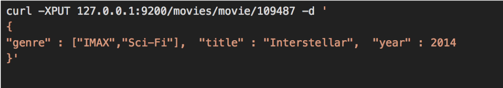


Notes:

Now that we have our mapping created let's go ahead and insert a movie

---

## 


Notes:

Now that we have our mapping created let's go ahead and insert a movie

---

# Import Many Documents
---

## Ison Bulk Import

* **`curl -XPUT	127.0.0.1:9200/_bulk –d '`**

```text
{ "create" : { "_index" : "movies", "_type" : "movie", "_id" : "135569" } }
{ "id": "135569", "title" : "Star Trek Beyond", "year":2016 , "genre":["Action", "Adventure", "Sci-Fi"] }
{ "create" : { "_index" : "movies", "_type" : "movie", "_id" : "122886" } }
{ "id": "122886", "title" : "Star Wars: Episode VII - The Force Awakens", "year":2015 , "genre":["Action", "Adventure", "Fantasy", "Sci-Fi", "IMAX"] }
{ "create" : { "_index" : "movies", "_type" : "movie", "_id" : "109487" } }
{ "id": "109487", "title" : "Interstellar", "year":2014 , "genre":["Sci-Fi", "IMAX"] }
{ "create" : { "_index" : "movies", "_type" : "movie", "_id" : "58559" } }
{ "id": "58559", "title" : "Dark Knight, The", "year":2008 , "genre":["Action", "Crime", "Drama", "IMAX"] }
{ "create" : { "_index" : "movies", "_type" : "movie", "_id" : "1924" } }
{ "id": "1924", "title" : "Plan 9 from Outer Space", "year":1959 , "genre":["Horror", "Sci-Fi"] } '
```

Notes:

This is an example of importing multiple documents at once. 
The format is kinda funny because if you remember every document gets hashed to a specific shard. 
Elasticsearch goes through this one document at a time, sends it off to whatever shard is storing data related to this type. 

---

## lab04: import documents

* Log into VM 
* Index a document in Elasticsearch
* Index a collection of documents in Elasticsearch

---

# Updating Documents

Notes:

We've covered indexing new documents using JSON format in REST API. 
We tried to insert Interstellar twice and it gave us an error. 
Elasticsearch documents are immutable, they can not be changed after creation. 


---

## versions


* Every document has a _version field Elasticsearch documents are immutable. When you update an existing document:
  - a new document is created with an incremented _version
the old document is marked for deletion

Notes:

So while you can't change the original document, you can update it and Elasticsearch will create a new version.
New version created with incremented version number, old version is marked for deletion, and Elasticsearch deletes it in the future.


---

## Partial Update API 

* Lab: 
  - Look at document for Interstellar
  - Run curl command to output Interstellar document data


<br/>

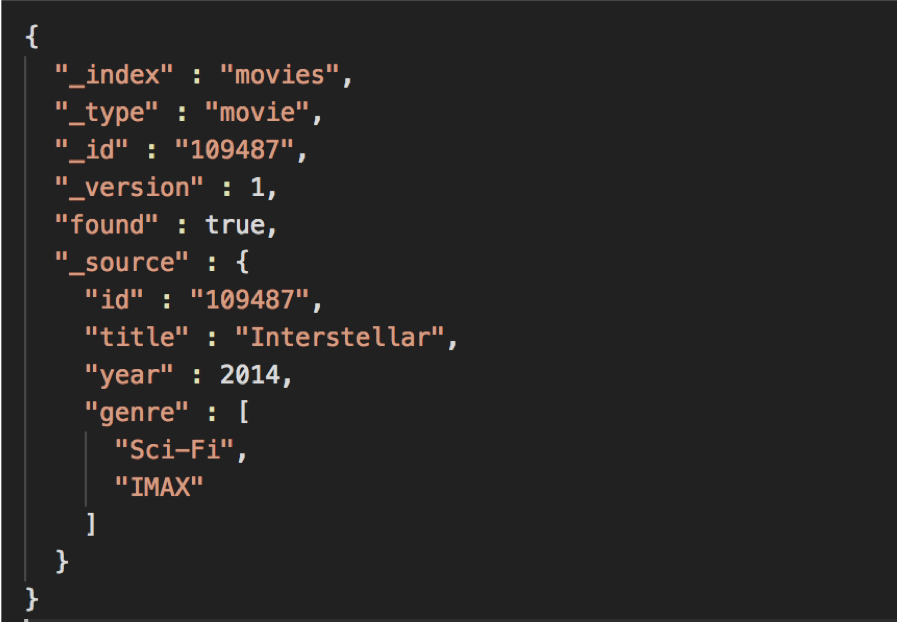


Notes:

Point out the _version and other fields. 

To update we need to run a POST command 


---

## Partial Update apAPIi


* Send data to REST API using `POST` verb Update title for movie with id 109487 
* New version of document created
* Old version deleted (eventually)

Notes:

When a POST command is run to update the document some fun stuff happens. 


---

## Lab05: updates on documents

* Log into VM 
* Index a document in Elasticsearch
* Index a collection of documents in Elasticsearch


---

# Deleting Documents

---

## It couldn't be easier.

* Just use the DELETE method:

* `curl -XDELETE 127.0.0.1:9200/movies/movie/12345`

Notes:

Just like with PUT, GET and POST, REST has a verb for DELETE and it does exactly what you might think.. deletes things. 

This command will delete movie with id 58559

---

## Lab: delete document

* **Now let's delete the Dark Knight**

* First: Find out movie ID

 

* Second: Delete it!
 
 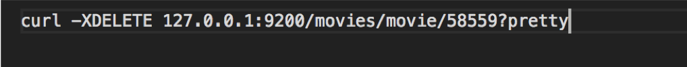

* Third: Confirm it was deleted

 

Notes:

Now let's do a class lab where we find out the ID of the "Dark Knight" and then delete it. 

After deleting it let's confirm it is gone by running our search query again. 

---

## Exercise

* **Insert, Update,** and then **delete** a movie  of your choice into the movies index!

Notes:

Create a fictitious movie about whatever you want
Dog
Friends
Family
Vacation.. whatever 
Then search to confirm it was created 
After that update it, any of the fields (title, year, genre) 
Finally delete it, search to confirm it was deleted. 

---

# Dealing with Concurrency

Notes:

Distributed systems can mess up concurrency. what happens when two clients are trying to do the same thing at same time? 
Who wins? 

---

## The Problem

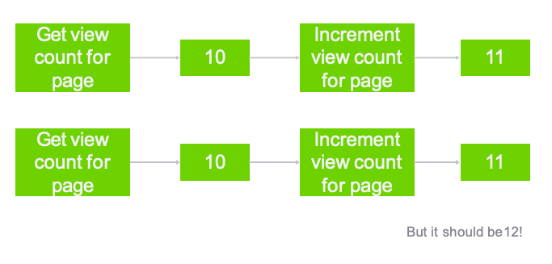


Notes:

Two different clients both running distributed web sites 
Check page count at same time and see 10
Both check page count through Elasticsearch 
Both send update of view count 11 to Elasticsearch at same time....  this is wrong, should be 12 for 2nd client.
]If there's a lot of people hitting your Elasticsearch at the same time this kind of issue can happen. 

Also known as eventually consistency. 


---

## Optimistic Concurrency Control

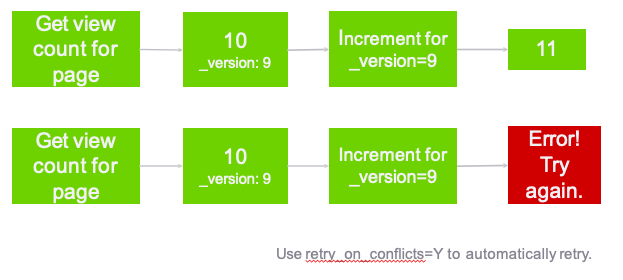


Notes:

optimistic concurrency control uses the version field to avoid this situation. 
So we have 2 clients that are viewing the page count at the same time, they both see 10, _version: 9
When they POST a new page count value, it specifies it's for version 9, so one of the clients updates it to 11
2nd client tries to update it explicitly for version 9, but Elasticsearch says "Nope, I'm on version 10 now"
Client then starts over, pulls current page count, version 10, POSTS 12. 
Retry on conflicts (automatically retry if it fails) 

---

## Lab 6

* Lab6: Versions & Conflict Resolution

---
# Controlling **full-text search**

---

## Using Analyzers

* **sometimes text fields should be exact-match**
  - use keyword mapping type to suppress analyzing (exact match only)
  - Use text type to allow analyzing

* **search on analyzed fields will return anything  remotely relevant**
  - depending on the analyzer, results will be  case-insensitive, stemmed, stopwords  removed, synonyms applied, etc.
  - searches with multiple terms need not
match them all

Notes:

New in Elasticsearch 6 you need to make a decision when a field contains text. 
Define as 2 types
searched as exact text
returns partial match. (analyzers) 


---

## Changing Mappings


* Can not change mapping on existing index
* Have to delete index and start over 

* New mapping of "keyword" for "genre"

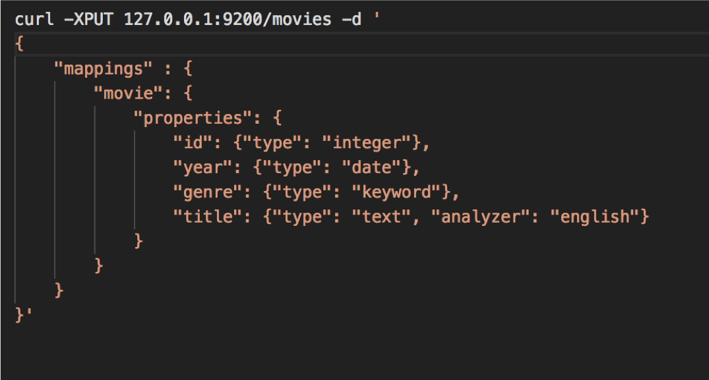

* New analyzer of "english" for "title"

Notes:

Now that we changed the type to "keyword" for genre we will NOT get partial matches. 


---

# Data Modeling

Notes:

In distributed systems the advice is to 'de-normalize' your data. 
Cassandra 
MongoDB 
etc.. 

Why is this? 
Elasticsearch gives you options.. either way works. 


---

## Strategies for Relational Data

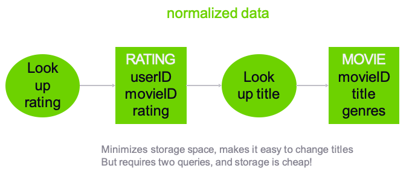


Notes:

Traditional normalized data..
Ratings data only had userID, movieID rating & timestamp. 
Look up rating -> find movieID, but doesn't include Title. 
2 requests per look-up, this is because we don't want to duplicate all titles for each rating. 
Very easy to update or change data (will movie titles change frequently?) 
Clusters (don't worry about storage, it's cheap) 
Additional latency for 2 queries can be a problem. 


---

## Strategies for Relational Data

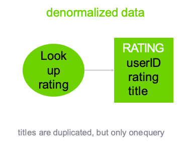


Notes:

Here I have Title in every single rating
takes up disk space but who cares
Single query pulls down all info we want. 
Changing title would suck, have to look through all rating and update it. 
Only need to change title if there is a typo or mistake. 
Much faster (single query) 


---

## Strategies for **Relational Data**

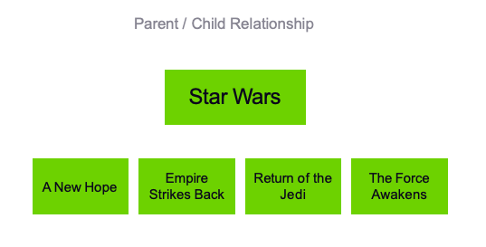


Notes:
How do we do relationships in Elasticsearch? 
Model relationship between Star Wars Franchise and movies that are part of it. 
Parent/Child relationship


---

## Strategies for Relational Data

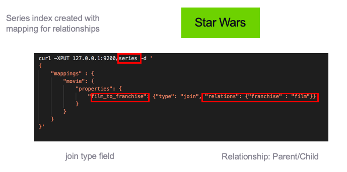

Notes:

Create a new index called "series" and add a new mapping for relationships. 


---

## Strategies for **Relational Data**

* ES6: Parents/Children all in same shard
* Forcing everything to be indexed to shard 1. 
* Use relationships minimally.

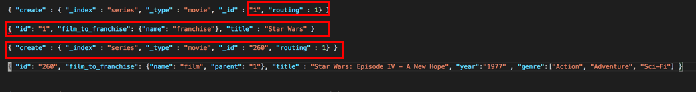

* Parent created: Franchise
* Fields for child created 

Notes:

Routing forces Elasticsearch to store the documents in the same shard.
First line creates the parent relation. 
Each child "film_to_franchise" field is set to 1, which is the ID of the parent. 
You'll see the field is "film" and it's parent is '1', which we defined originally.. 

---

# Relationships
[Relationships](./Relationships.md)

---

## Lab: Analyzers & Relational data

* Lab 7:  Create new index mapping
* Lab 8: Create index for relational data

