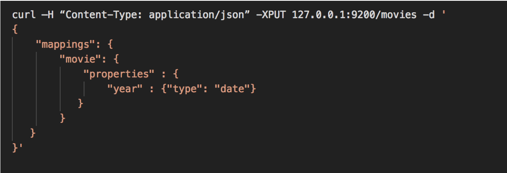
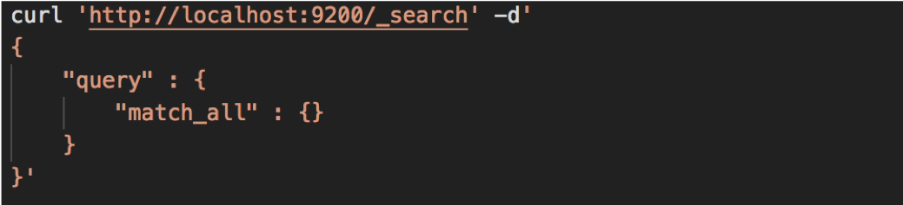

# Lab Setup 

---

# Installing Elastic

---

## How to install elastic

 * There are several ways to install elastic
   - using `apt` or `yum`
   - installing from tarball.

---

## Lab 1: Install Elastic

---

# Examining Movielens

---

## Movielens

* **Movielens** is a free dataset of movie ratings gathered from movielens.org. It contains user ratings, movie metadata, and user metadata. Let's download and examine  the data files from movielens.org

Notes:

Elasticsearch is all about interacting with a lot of data
So far we added Shakespeare's works but that's not enough to see the true power of Elasticsearch. 
Let's add this sample movie data to it as well. 

---

## Lab02: download MovieLens data

* Visit GroupLens website
* Download small data set 
* Look through sample data files

---
# Creating Mappings
---

## What is a Mapping?

* A mapping is a **schema definition.**
* Elasticsearch has reasonable defaults, but sometimes you need to customize them.

* NOTE : Content-Type is now required in Elasticsearch 6.x+

Notes:
Mapping is a schema definition which tells Elasticsearch how to index your data.  
Most of the time it can figure out the correct type of mapping for your data (strings, floating point numbers, integers etc..) 
Sometimes we have to give it a hint.  We want the “release date” to specifically be a date field. 
Movie data type: year = type date, not just string
Preferred to explicitly tell Elasticsearch since that reduces instances of the implied mapping identifying a more generic or incorrect type.

---

## Elasticsearch 5 Syntax

* In Elasticsearch 5 it was possible to send a REST request without the Content-Type. Elasticsearch would then “sniff” the content and set the type based on that. 

Notes:

Mapping is a schema definition which tells Elasticsearch how to index your data.  
Most of the time it can figure out the correct type of mapping for your data (strings, floating point numbers, integers etc..) Some types such as timestamp and decimal, may not be correctly inferred
Sometimes we have to give it a hint.  We want the “release date” to specifically be a date field. 

This ability to enforce strict content-type checking has existed since Elasticsearch 5.3 via the http.content_type.required configuration setting. In 5.x it is optional, and defaults to false, in Elasticsearch 6.0, that setting defaults to true, and there is no way to disable it.

https://dzone.com/articles/elastic-stack-6-what-you-need-to-know
https://aws.amazon.com/about-aws/whats-new/2017/12/elasticsearch-6-0-now-available-on-amazon-elasticsearch-service/
https://www.elastic.co/guide/en/elasticsearch/reference/6.0/breaking-changes-6.0.html
https://www.elastic.co/guide/en/elasticsearch/reference/6.0/removal-of-types.html

---

## Elasticsearch Syntax

* There are two reasons this changed. 
* Clarity
  - Sending plain text content to API that doesn't support it returns.
* `Content-Type header [text/plain] is not supported`

* In Elasticsearch 5 if you sent plain text that started with a curly brace and the letter “a” it would assume it was JSON, but when it tried to parse that, it would fail and the error message would look more like: 

* `Unexpected character ('a' (code 97)): was expecting double-quote to start field name`

Notes:

Elasticsearch 5 did some magic to try and figure out what type of content you were sending. 
This led to bad error messages.
Plain text sent.. ES5 sees it has curly braces and assumes it's JSON but it isn't so get syntax error back.

As Elasticsearch has evolved the development team made a conscious decision to favor reliability and predictability over leniency. 

---

## Elasticsearch Syntax

* There are two reasons this changed. 
* Security

* JSON sent as text/plain
* Cross Origin Resource Sharing

Notes:

Security: 
Simple HTML page that posts a document to Elasticsearch without authenticating. 
Sending JSON as Plain Text

Strict checking of content-type is also useful as a layer of protection against Cross Site Request Forgery attacks.
If you run an out-of-the-box install of Elasticsearch 5 on your local computer, and then open up the page noted in the slide, in your web browser, it will add a new document in your Elasticsearch cluster that stores your browser's User Agent and the time that you loaded the page. That's not so scary, but with minimal changes we could make that same page overwrite or delete existing documents.

---

## Common Mappings

Notes:

Different field types
Text does NOT equal keyword.  Text is indexed and returns partial matches, keyword is only the full keyword.
Is a field indexed? true or false? 
Fields that are indexed for full text search, specify how it is broken up. 
broken up by whitespace, etc.. 

---

## More about Analyzers

* **Character Filters**
  - remove HTML encoding, convert & to and

* **Tokenizer**
  - split strings on whitespace / punctuation / non-letters

* **Token filter**
  - lowercasing, stemming, synonyms, stopwords

Notes:

Character filters: If apply same analyzer to search query and data that is indexed it will return better results. 
Example: Search for data using ampersand, or 'and' and get same results. 
tokenizer: Splits strings up certain ways, language specific tokenizing etc.. 
token filter: case insensitive (lowercase everything), stemming (box, boxed, boxing can all match).
stopwords (and, a, the) stops these words from being indexed. (stopwords can have side effects)

---

## Choices for Analyzers

* **Standard**
  - splits on word boundaries, removes punctuation,  lowercases. good choice if language is unknown

* **Simple**
  - splits on anything that isn't a letter, and lowercases

* **Whitespace**
  - splits on whitespace but doesn't lowercase

* **Language (i.e. english)**
  - accounts for language-specific stopwords and  stemming

Notes:

Standard: default
if you don't know language it's good to stick with. (supports foreign language)
Simple
Splits on anything that isn't a letter and it lowercases everything. 
Whitespace
Splits on whitespace, punctuation is preserved.
Language specific (specify in English, or any other language) 

---

