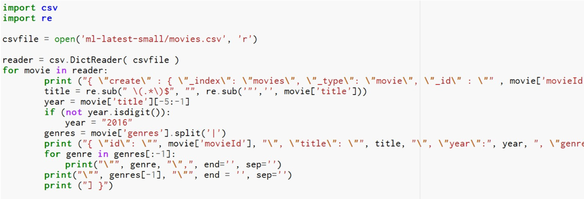
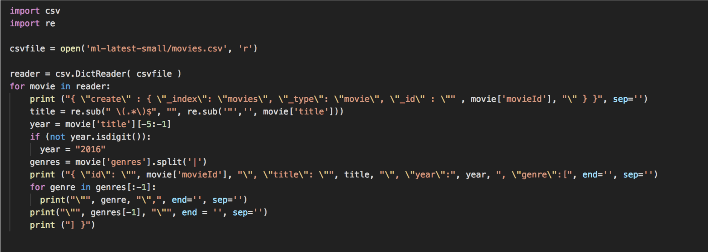
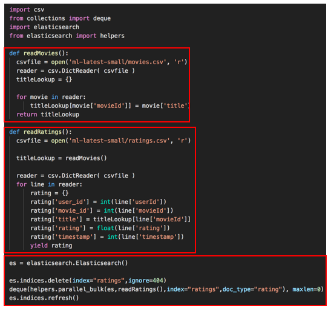
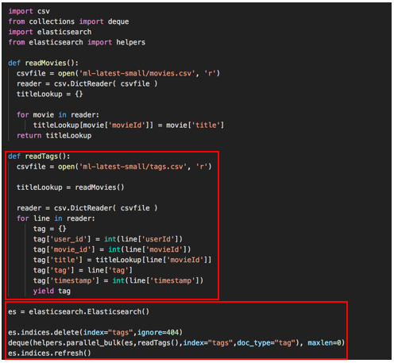

# Python API

---

## Importing Data


* Stand-alone **scripts** can submit bulk documents via REST API

* **Logstash** and **beats** can stream data from logs, S3, databases, and more
AWS systems can stream in data via **lambda** or **kinesis firehose** **kafka, spark,** and more have Elasticsearch integration add-ons


---

# Importing **via script / json**
---

## Python Import

* Read in data from some distributed filesystem
* Transform it into JSON bulk inserts
* Submit via HTTP / REST to your elasticsearch cluster




---

## Python Example:



---


---

## Client Libraries

* Free elasticsearch client libraries are available for pretty much any language.

  - Java has a client maintained by elastic.co
  - Python has an elasticsearch package
  - Ruby: `elasticsearch-ruby`
  - Several choices for scala
  - Elasticsearch.pm module for perl

* You don't have to wrangle JSON.


```python
es = elasticsearch.Elasticsearch()
es.indices.delete(index="ratings",ignore=404)  
deque(helpers.parallel_bulk(es,readRatings(),index="ratings",doc_t  
es.indices.refresh()
```


---

## Python Full Script



* Function to read Movies
  - Open csv
  - Build dictionary
  - Match movieid with title
* Function to read Ratings
  - Open csv
  - Build dictionary
  - Match movieid with title
* Create ES instance, 
* Delete ratings table 
* Load ratings into "ratings" index. 


---

## Lab: Python Scripts


* Lab 12: Python scripts to import data

* We will also do the exercise on the next slide. 


---

## Python - Tags

* Exercise
  - write a script to import the tags.csv  data from ml-latest-small into a new  “tags” index.

---

## One Solution



```python
tag = line ['tag'] instead of float line (no longer a number) 
````

---


