# Query Syntax

---

# Query-line Search

Notes:

Shortcut for playing around with Elasticsearch. 
Query-lite 


---

## “Query Lite”


* Proper JSON query 

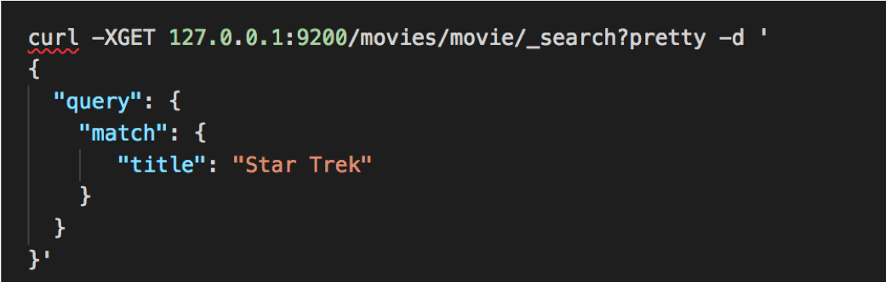


* Proper JSON query 

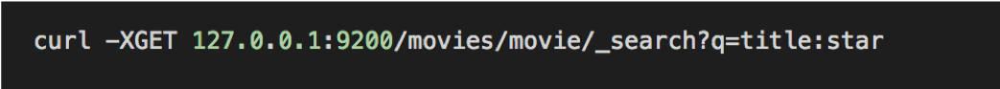


Notes:
Sometimes it's easier to query the API by adding options to the URL directly. 

GET request Search 'movie' index, 'movie' type, q= <query> in this case it's title with term 'star'
Can be more complex also.. q=Year greater than 2010 and title 'Trek'
If you understand query lite syntax there's not a lot you can do with it. 


---

## It’s not Always Simpler.


* Spaces etc. need to be URL encoded.

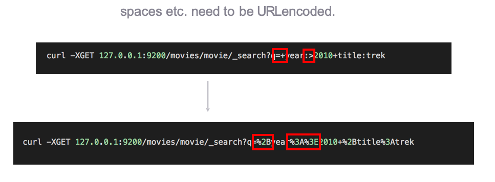


Notes:

It looks much easier to use the top query instead of writing a JSON block, but there's actually a lot more to it.
Sometimes it makes sense to use query lite, but most the time JSON block is much cleaner. 
Makes it much more difficult to read and understand what's going on. 


---

## And it Can be Dangerous.

* **Cryptic** and tough to debug
* Can be a **security issue** if exposed to end users
* **Fragile** – one wrong character and you’re hosed.
* **But it’s handy for quick experimenting.**

Notes:

Don't use it in production! 
Tough to read, and debug: powerful but challenging 
Security issue if end users are inputting data to server, possibly bringing down your cluster. 
Fragile, mess up a character and things happen that you aren't expecting. 


---

## Learn More.

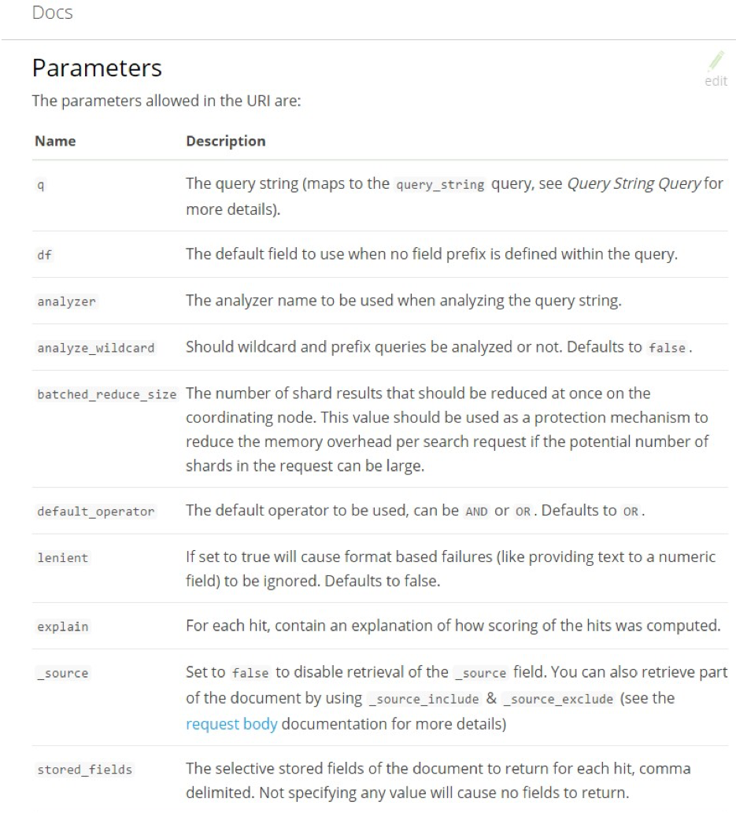

* This is formally called “URI  Search”. Search for that on the Elasticsearch  documentation.

* It’s really quite powerful, but again is only appropriate for quick “curl tests”.


---

# Request Body Search


---

## Request Body Search

* How you’re supposed to do  it

* Query DSL is in the request body as JSON
(yes, a GET request can have a body!)

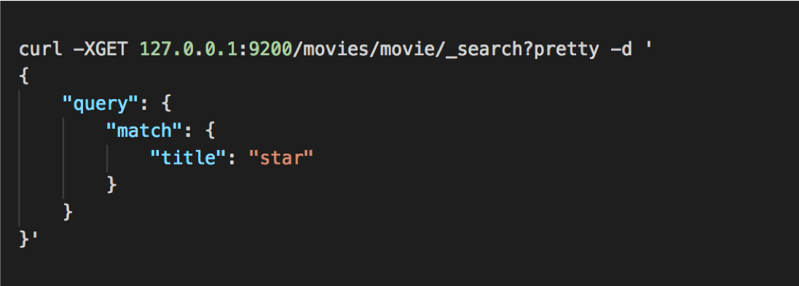

Notes:

Same search we did in last section, but this time we're going to use the proper JSON 
Takes a little bit to get used to JSON syntax but much easier to read.


---

## Queries and Filters

* **Filters** ask a yes/no question of your data  **queries** return data in terms of relevance

* use filters when you can – they are faster and cacheable.


Notes:

Filters and queries are different! 

queries: When search for term "Trek" you would use query, because you want results in terms of relevance. 

filters: when all you need is a yes or not,   much faster, cacheable results. 

---

## Example: Boolean Query with a Filter


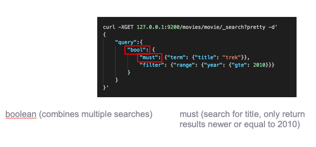

Notes:

using the same search as last time to find movies 
bool = combines things together.
year greater than 2010, and has trek in the title.

in our last search we used '&' to search for newer than 2010 and title trek 
must does that.  
---

## Some Types of Filters

```text
term: filter by exact values
{“term”: {“year”: 2014}}

terms: match if any exact values in a list match
{“terms”: {“genre”: [“Sci-Fi”, “Adventure”] } }

range: Find numbers or dates in a given range (gt, gte, lt, lte)
{“range”: {“year”: {“gte”: 2010}}}

exists: Find documents where a field exists
{“exists”: {“field”: “tags”}}

missing: Find documents where a field is missing
{“missing”: {“field”: “tags”}}

bool: Combine filters with Boolean logic (must, must_not, should)
```

---

## Some Types of Queries

```text
match_all: returns all documents and is the default. Normally used with a filter.
{“match_all”: {}}

match: searches analyzed results, such as full text search.
{“match”: {“title”: “star”}}

multi_match: run the same query on multiple fields.
{“multi_match”: {“query”: “star”, “fields”: [“title”, “synopsis” ] } }

bool: Works like a bool filter, but results are scored by relevance.

```

Notes:

query bool: instead of filtering results that don't match it will score results by relevance 


---

## Boosting Results

* When searching across multiple fields, we may want to boost the scores in a certain field. In the example below, we boost scores from the summary field by a factor of 3 in order to increase the importance of the summary field.

```text
POST /shakespeare/_search
{
    "query": {
        "multi_match" : {
            "query" : “lear",
            "fields": ["title", "summary^3"]
        }
    },
    "_source": ["title", "summary", "publish_date"]
}

```

Notes:

query bool: instead of filtering results that don't match it will score results by relevance 


---

## Syntax Reminder

* queries are wrapped in a “query”: { } block,  filters are wrapped in a “filter”: { } block.

* you can combine filters inside queries, or queries inside filters too.

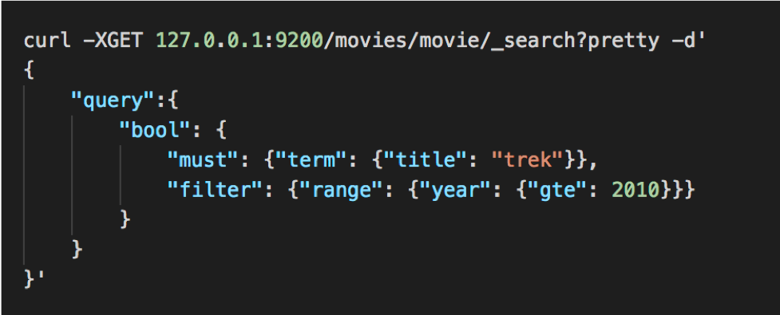


Notes:

We're going to have a boolean within our query, with a must clause and term query where title must be trek
Also passing range filter where we test to make sure year is greater than or equal to 2010.


---

# Phrase Search
---

## Phrase Matching

* Must find all terms, in the right order.

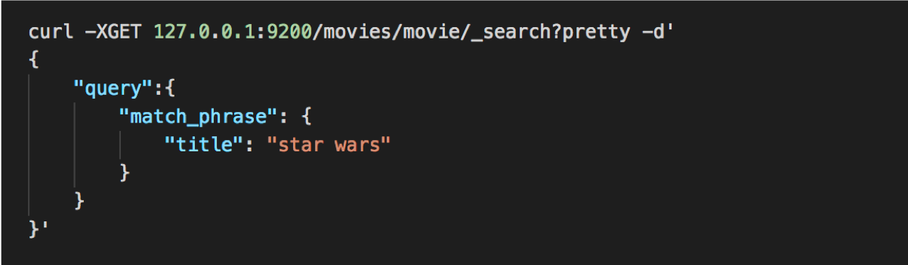


Notes:

This example does a phrase match against title "star wars"
In inverted index it doesn't just store that a given search term occurs inside a document, it stores the order they occur in.
That allows for phrase searches and not just single words or partial word searches. 


---

## Slop

* Order matters, but you’re OK with some words being in between the terms:

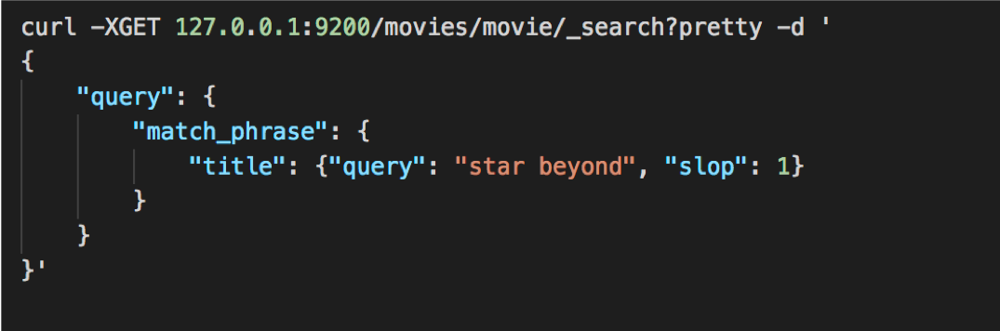


* The **slop** represents how far you’re willing to let a term move to satisfy a
phrase (in either direction!)

* Another example: “quick brown fox” would match “quick fox” with a slop of 1.

Notes:

If you want a little more flexibility and have different words within phrase. 
Slop defines how far you want it to move in any direction. 
Star beyond with slop=1 would match Start Trek beyond, or Star Wars beyond. 
It allows reversal also, so you can match "beyond star, or beyond trek"


---

## Proximity Queries

* Remember this is a query – results are sorted by relevance.

* Just use a really high slop if you want to get any documents that contain the words in your phrase, but want documents that have the words closer together scored higher.

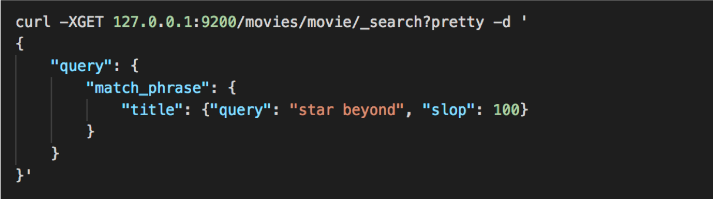


Notes:

Higher relevance if terms are closer together. 
Star and beyond appear close together, returns all of them, but assigned higher relevance if the terms are closer together. 


---

## Lab: Phrase & Slop

* Lab 9: URI, JSON, Phrase and Slop searches

---

## Exercise

* Search for “Star Wars” movies  released after 1980, using both a **URI search** and **a request body search.**

---

# Pagination

Notes:

Building a big website, with lots of results and you want to return them 1 page at a time
Amazon
Google
Reddit
more! 

---

## Specify “From” and  “Size”


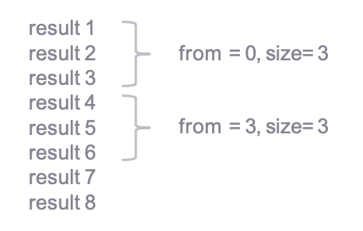

Notes:

From starts from 0, size of 3 means just display 3 results. 
Paginate to page 2, query would have "from =3", size = 3" 
Page 3 = "from = 6, size of 3 


---

## Pagination Syntax

* URI Search 

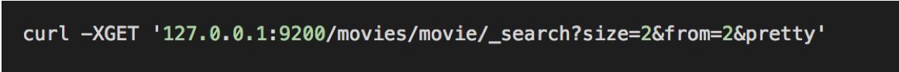


* JSON body

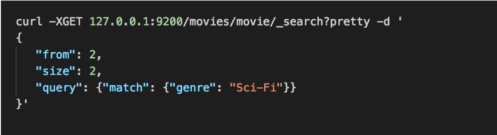

---

## Beware

* Deep pagination can **kill performance.**

* Every result must be **retrieved, collected, and sorted.**

* Enforce an **upper bound** on how many results you’ll return to users.


Notes:

10373 - 10383 does not only collect 10 results. It has to figure out everything before it can do that. 
Enforce an upper bound (so no one overloads your system) 
---
# Sorting

Notes:

Sorting by alphabetical or numerical, is something that we want to do sometimes. 

---

## Sorting your results is  usually quite simple.

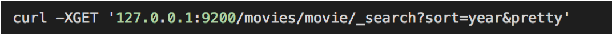

Notes:

This command sorts the movies by release date.


---

## Unless you’re dealing with strings.

* A **text** field that is **analyzed** for full-text search can’t be used to sort document
* This is because it exists in the inverted index as individual terms, not as the entire string.

Notes:

Text field provides partial matching, fuzzy queries etc, can't be used for sorting documents.
Full text stores everything so we can do partial matching so it can't sort by it. 


---

## Unanalyzed copy using the keyword type.

* To sort analyzed field you must make a copy using keyword type and sort by that.

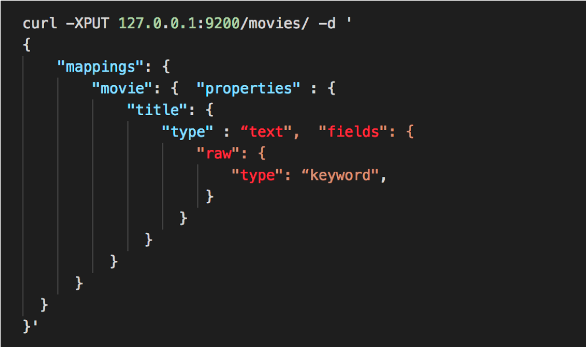


Notes:

To sort an analyzed field make an unanalyzed copy so you can sort that using Keyword type.
Create a subfield that is not analyzed, so you would have 2 copies. 
Title field = analyzed text, and a field called raw which is keyword, not analyzed 
There are many reasons you would want an unanalyzed field and sorting is just one of them.

---

## Raw keyword field

* Now you can sort on the unanalyzed raw field. 

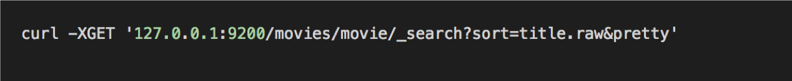


* Sadly, you cannot change the mapping on an existing index.

* You’d have to delete it, set up a new mapping, and re-index it.

* Like the number of shards, this is something you should think
about before importing data into your index.

Notes:

To apply this we would have to delete our index and re-create it with raw mapping. 
Plan for this before importing data. 

---

# More with Filters

Notes:

Let's take a look at more complex filter queries. 

---

## Complex Filtered Query

* Science fiction movies without term "trek" in the title, released between the years of 2010 and 2015

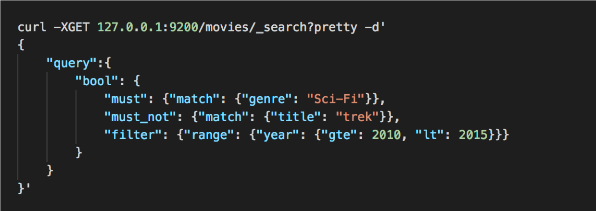

---

## Exercise

* Search for science fiction movies  before 1960, sorted by title.

Notes:

boolean query searching for sci-fi genre, filter for movies before 1960, and sorting by title. 
Remember the trick for sorting non-analyzed data. 


---
# Fuzziness

Notes:
Fuzziness is a way to deal with typo's and misspellings 

---
## Fuzzy matches

* A way to account for typos and misspellings

* The **levenshtein distance** accounts for:

  - **Substitutions** of characters (interstellar -> intersteller)
  - **Insertions** of characters (interstellar -> insterstellar)
  - **Deletion** of characters (interstellar -> interstelar)

* All of the above have an edit distance of 1.


Notes:

Most search engines can deal with typo's misspellings etc.. .

levenshtein edit distance - Quantifies common typos and misspellings
3 different classes: substitutions, insertions and deletions. 
If we had an edit distance of 1, means 1 extra character is added, changed, or removed.  

---

## The Fuzziness Parameter

* Example of Interstellar being misspelled by 2 characters. 
  - fuzziness = 2, so we can tolerate 2 errrors.

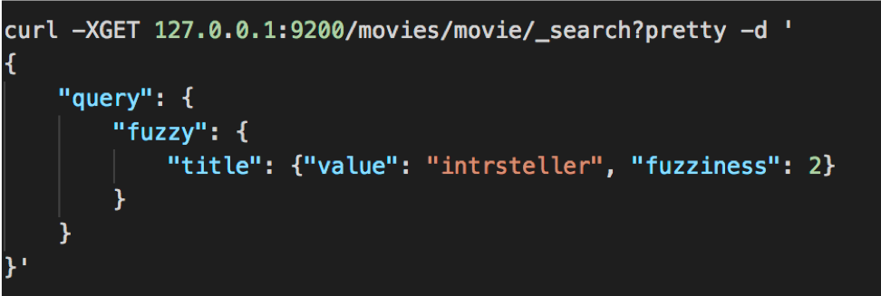

Notes:

In this example we are specifying fuzziness = 2, which means we will tolerate 2 typos. 

---

## AUTO fuzziness

* Fuzziness: AUTO

  - **0** for **1-2** character strings
  - **1** for **3-5** character strings
  - **2** for **anything else**

Notes:

There's also an auto fuzziness option which works for most things. 
1-2 characters you don't want to tolerate any misspellings because you won't be able to figure out original word. 
3-5 characters we will tolerate 1 wrong 
and 2 for anything above that. 


---

# Partial Matching
---

## Prefix Queries on Strings

* If we remapped **year** field to be a string, we could do a simple query as below. 

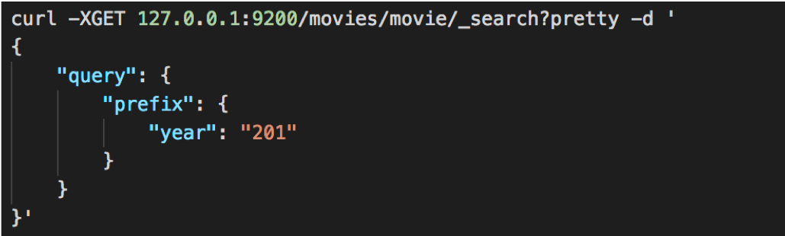

Notes:

For the above query to work we would need to remap the year field to a string type. 

201 would match 2011, 2012, 2013 etc.. 

---

## Wildcard Queries

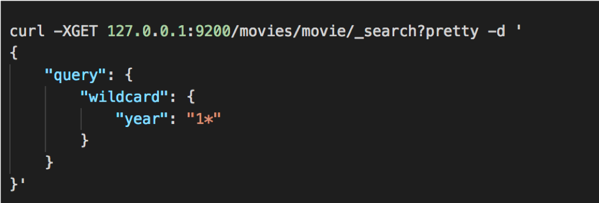


Notes:

wildcard query of year "1*" would return hits for anything beginning with 1. 

Could also do something like 
"year": "19*3“ or “year”:”19?3”

---

## Regexp Queries

```bash
curl -H 'Content-Type: application/json' -XGET '10.0.2.15:9200/shakespeare/_search?pretty' -d '
{
"query" : {
"regexp" : {
"play_name" : "H[a-z]*t"
}
},
    "_source": ["play_name"]
}
'
```


# Search as You Type


Notes:

search as you type wikipedia, google etc.. 

---

## Search-as-you-type

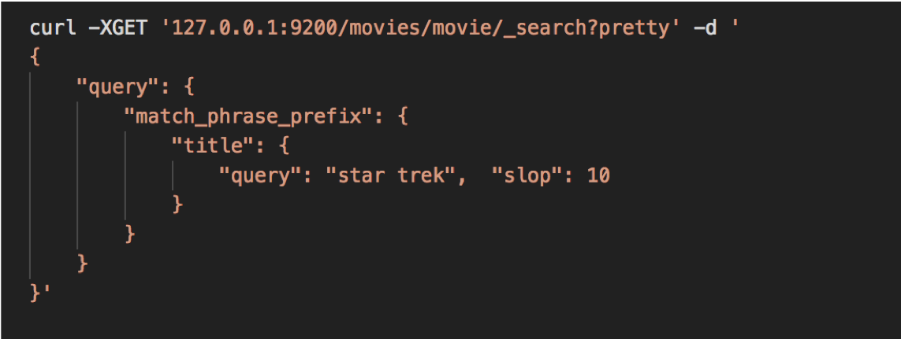


Notes:

don't have to index data, just using prefix search like in last lab. 
Resource intensive, if large scale you want to index the solution. 


---

## Index with N-grams

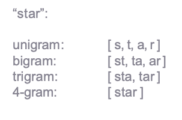

* Edge n-grams are built only on the beginning of each term.

Notes:

All we care about for autocomplete are the beginning of the term. 
if computing just the edge n-grams for star, only a single,  s, st, sta, star 


---

## Indexing N-grams

* Create an “autocomplete” analyzer

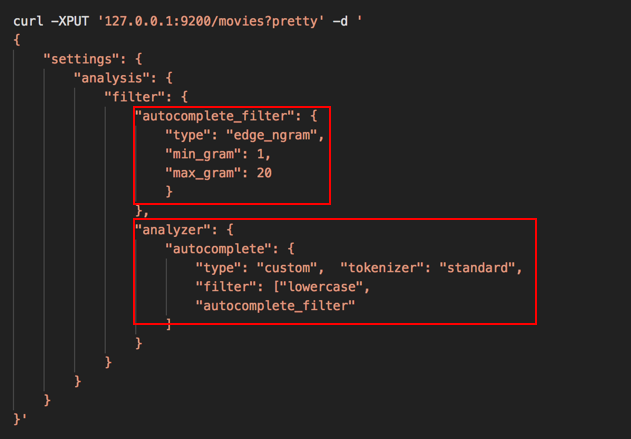

* filter for edge n-grams min = 1 max = 20 

* custom analyzer, in addition to standard lowercase filter also has autocomplete filter (n-grams)


Notes:

Create custom analyzer/filter 
up to 20 letters long 


---

## Map your Field  

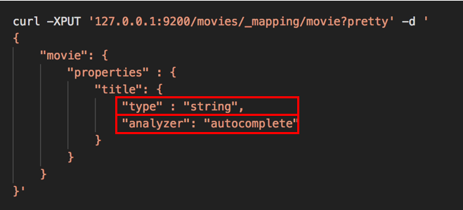


* Title is of type "string" and uses our custom analyzer "autocomplete


Notes:


Now creating a mapping, tell it to use autocomplete analyzer 


---

## N-grams only on Index

* Use n-grams only on the index side or query will also get split into n-grams, and we’ll get results for  everything that matches ‘s’, ‘t’, ‘a’, ‘st’, etc.

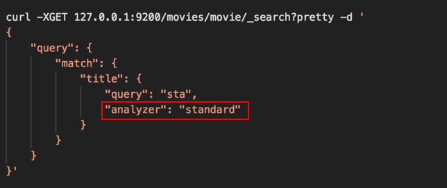

* Analyzer = standard so don't split up what was typed into n-grams.

Notes:

want to use standard for queries, don't want it split up into n-grams.

---

## Completion Suggester


* You can also upload a list of all possible completions ahead of time  using **completion suggester.**

  - Most customizable 
  - Reliable results
  - Most control

* Suggesters
  - Completion – auto-complete/search-as-you-type
  - Term – spell correction
  - Phrase – did-you-mean


---

## Lab: Query tips

* Lab 10: Pagination, sorting, filtering and fuzzy matching
* Lab 11: Prefix/wildcard and auto-completion

---

