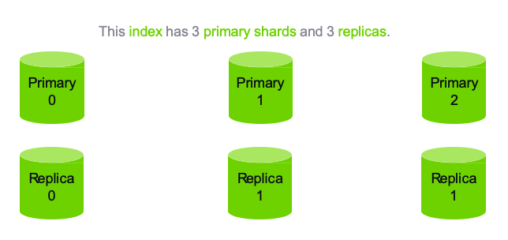

# Quizes

---

# Shards

---

## Number of Shards Quiz

* How many total shards does the code on the right create?

Notes:

How many shards are we creating here? 

Answer: 6, 3 primary and 1 replica of each. 

---

## Primary and Replica Shards

Notes:

We specified we wanted 3 shards and 1 replica but this really means 
3 - Primary shards 
1 replica per primary shard. 

---

# Schema

---

## 1. The schema for  your documents are defined by...

* The index
* The type
* The document itself

---

## 1. The schema for  your documents are defined by...

* The index
* **The type**
* The document itself

---

## 2. What purpose do inverted indices serve?

* They allow you to search phrases in reverse order
* They quickly map search terms to documents
* They load balance search requests across your cluster

---

## 2. What purpose do  inverted indices serve?

* They allow you to search phrases in reverse order
* **They quickly map search terms to documents**
* They load balance search requests across your cluster

---

## 3. 

* 8
* 15
* 20

* **An index configured for 5 primary  shards and 3 replicas would have  how many shards in total?**

---

## 3. 

* 8
* 15
* **20**

* **An index configured for 5 primary  shards and 3 replicas would have  how many shards in total?**

Notes:
Remember that if we have 3 replicas for each primary that would be a total of 4 shards for each primary.  5 * 4

---

## 4. 

* True
* False

* **Elasticsearch is built only for full-text search of documents.**

---

## 4. 

* True
* **False**

* **Elasticsearch is built only for full-text search of documents.**

Notes:

In text retrieval, full text search refers to techniques for searching a single computer-stored document or a collection in a full text database. Full-text search is distinguished from searches based on metadata or on parts of the original texts represented in databases (such as titles, abstracts, selected sections, or bibliographical references).

