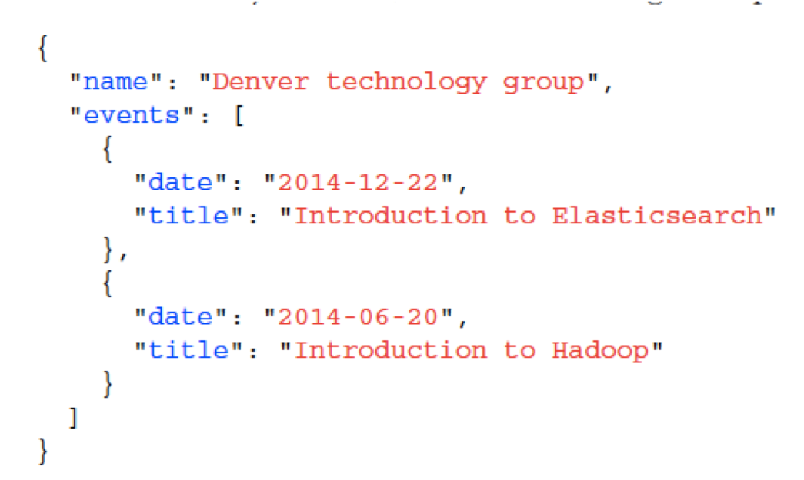
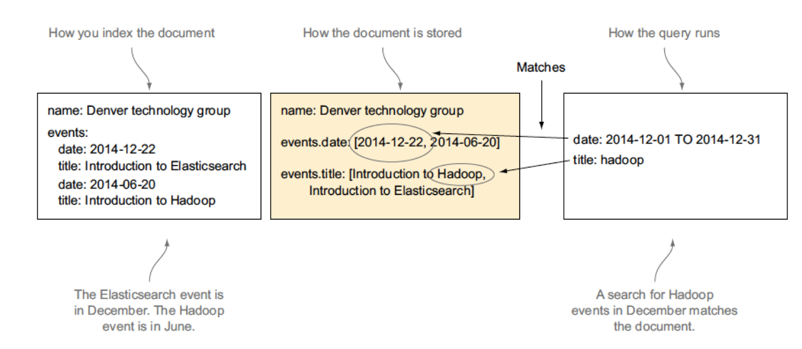
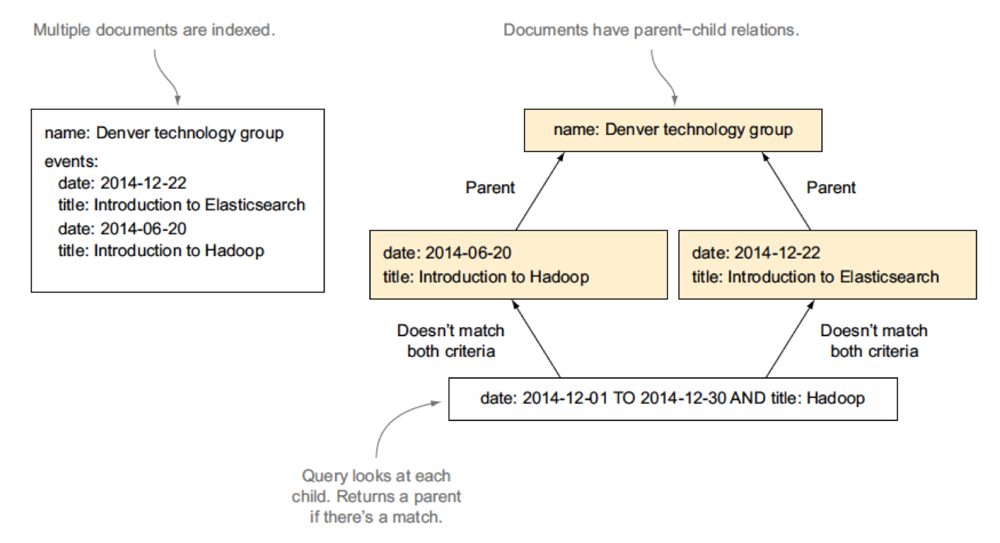
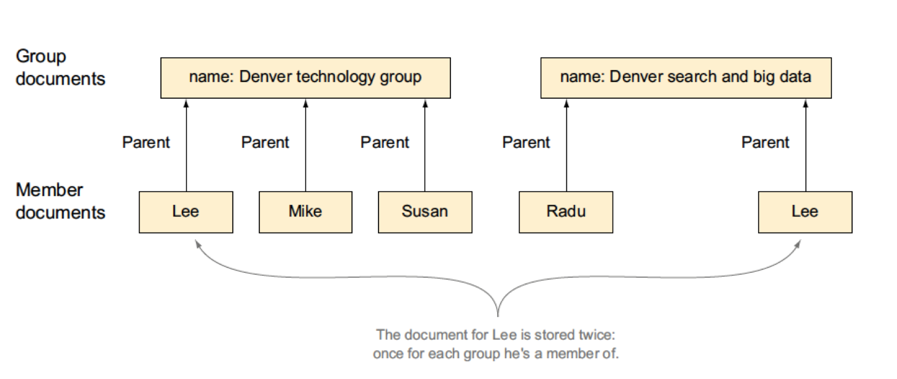
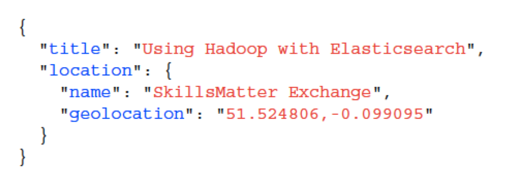
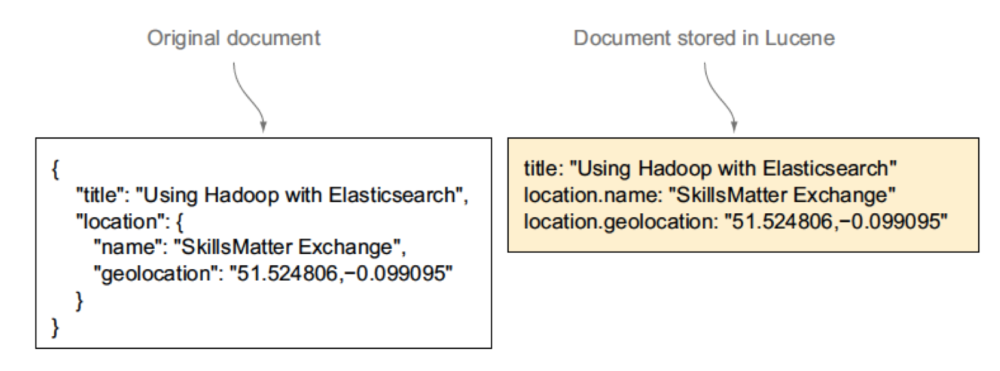
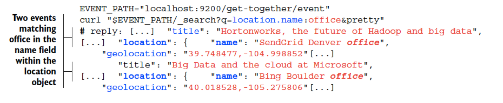
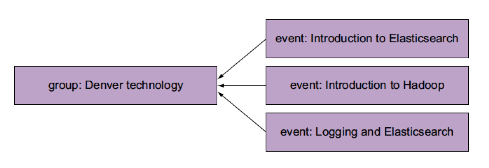

# Relationships
---

## Section Objectives

* Objects and arrays of objects
* Nested mapping, queries, and filters
* Parent mapping
  - `has_parent`
  - `has_childqueries`
  - Filters
* Denormalization techniques

Notes:

---

## Defining Relationships

* Object Type
* Nested Documents
* Parent-Child
* Denormalization
* Application-side Joins

Notes:

---

## Relationship Through Object Type

* Object with its own fields and values 
  - As value of a field in your document
* Example
  - Address field – make it an object!
  - City
  - Postal code
  - Street name
  - Maybe, array of addresses

Notes:

---

## Problems with Relations through Object Type

* All the data is stored in the same document
* So matches for a search can go across subdocuments
* Example
  - city=Paris AND street_name=Broadway
  - Can return an event that's hosted in New York and Paris
  - But there's no Broadway street in Paris

Notes:

---

## Nested Documents

* Index the same JSON  document but 
* Keep your addresses in separate Lucene documents
* Example
  - city=New York AND street_name=Broadway
  - return correct result

Notes:

---

## Parent-child

* Groups as parents of events 
  - indicate which event hosts which group.
* Allowa to search for 
  - events hosted by groups in your area
  - groups that host events about Elasticsearch

Notes:

---

## Denormalization

* Represent many-to-many relationships
* Other options work only on one-to-many
* Example
  - All groups have members
  - Members could belong to multiple
  - Duplicate one side of the relationship
  - Including all the members of a group in that group's document

Notes:

---

## Application-side Joins

* Works well when you have less data
* Instead of duplicating members	for all groups they're part of
  - Store them separately and include only their ID s in the groups
* Two queries
  - First, on members to filter those matching member criteria
  - Then take their ID
  - include them in the search criteria for groups

Notes:

---

## Object Type Example

<!-- {"left" : 0.25, "top" : 1.13, "height" : 4.91, "width" : 8.21} -->

Notes:

---

## Nested Type Example

<!-- {"left" : 0.69, "top" : 2.09, "height" : 3.87, "width" : 8.87} -->

Notes:

---

## Parent-Child Relationship Example

<!-- {"left" : 0.77, "top" : 2.17, "height" : 4.73, "width" : 8.72} -->

Notes:

---

## Denormalization Example

<!-- {"left" : 0.44, "top" : 2.55, "height" : 3.96, "width" : 9.36} -->

Notes:

---

## Objects as Field Values

<!-- {"left" : 0.29, "top" : 1.11, "height" : 2.94, "width" : 8.21} -->

Notes:

---

## Implementation

* We are familiar with Lucene and we may ask
  - How can Elasticsearch documents be hierarchical?
  - Lucene supports only flat structures?
* Objects mapping:
  - Elasticsearch flattens hierarchies internally
  - Puts each inner field with its full path
  - Makes it a separate field in Lucene

Notes:

---

## Objects Mapped to Lucene

<!-- {"left" : 0.54, "top" : 2.35, "height" : 3.41, "width" : 9.18} -->

Notes:

---

## Searching in Objects - Diagram

<!-- {"left" : 0.26, "top" : 1.72, "height" : 2.01, "width" : 9.73} -->

Notes:

---

## Denormalization Explained

<!-- {"left" : 0.28, "top" : 2.13, "height" : 3.35, "width" : 9.69} -->

Notes:

---

## Relationship - Summary

* Object mapping, mostly useful for one-to-one relationships
* Nested documents and parent-child structures
  - deal with one-to-many relationships
* Denormalizing and application-side joins
  - Mostly helpful with many-to-many relationships

