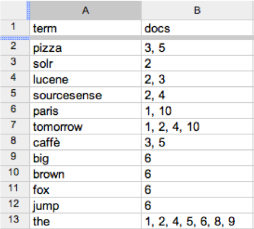

# Search introduction
---

## Section Objectives

* Understand the place of search
* Get familiar with inverted index

Notes:

---

## Information Retrieval

* **Search** is about **Information Retrieval** (IR)
* **IR** is 
  - finding material (usually documents) 
  - of an unstructured nature (usually text) 
  - that satisfies an information need 
  - from within large collections (usually stored on computers)" 
  - P. Nayak, Stanford University

Notes:

---

## Character of IR

* IR returns relevant information
* Usually, it comes from unstructured data

<!-- {"left" : 1.02, "top" : 2.56, "height" : 4.52, "width" : 8.21} -->

Notes:

---

## NASA – a Case in Point

<!-- {"left" : 0.39, "top" : 1.41, "height" : 2.12, "width" : 9.46} -->

* NASA employs 50,000 engineers
* Some people leave, new people come
* NASA made search a central point of new employee orientation
  - (We taught them SOLR ;: a few years back)
* Now new engineers can search for the exact manuals the need to start with

Notes:

---

## How is IR different from SQL?

<!-- {"left" : 5.99, "top" : 1.02, "height" : 2.76, "width" : 4.13} -->

* IR returns relevant information
* Usually it is ranked by relevance
  - Such as “What do we have related to this case”
* By contrast, SQL returns ALL of the data
* SELECT * FROM * MY_BOOKS

Notes:

---

## IR metrics

<!-- {"left" : 6.68, "top" : 1, "height" : 4.09, "width" : 3.47} -->

* How good is an IR system?
* **Precision:** Fraction of retrieved docs that are relevant to user’s information need
  - In short, how much junk do I get?
* **Recall:** Fraction of relevant docs in collection that are retrieved
  - In short, how much gold am I missing?

Notes:

---

## Lab: Precision and Recall

* Please do this lab: 

- `precision-recall/README.md`

Notes:

---

## How is Search Done?

* Inside all of search functionality…
* There is usually a mechanism called
* **Inverted Index**

<!-- {"left" : 2.8, "top" : 3.15, "height" : 4.19, "width" : 4.65} -->

Notes:

---

## What is Inverted Index?

* Each document has an **id** and a list of **terms**
* For each **term** we must store a **list of all documents** that contain this term
* Identify each document by its **id**

<!-- {"left" : 3.01, "top" : 3.7, "height" : 3.81, "width" : 4.23} -->

Notes:

---

## Lab: Building Inverted Index

* Please do this lab: 
  - `inverted_index/README.md`

