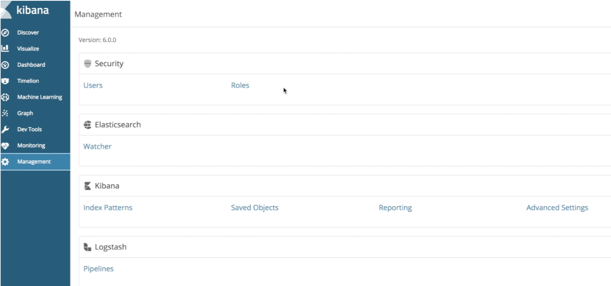
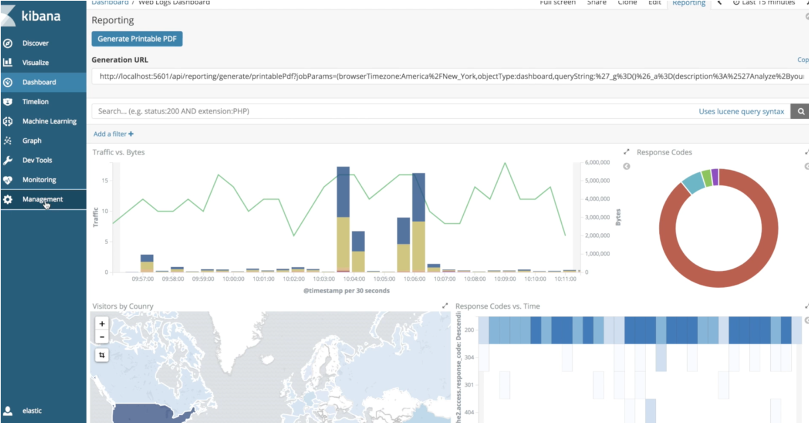

# X-Pack: Monitoring with Elastic
---

## What was X-pack?

* An elastic stack extension
* Security, monitoring, alerting, reporting, graph, and machine  learning
* Formerly shield / watcher / marvel
* Only parts can be had for free – requires a paid Platinum license or trial  otherwise


---


## X-Pack

* Commercial extension for Elasticsearch
* Subscription pricing
* More later

<!-- {"left" : 1.02, "top" : 2.97, "height" : 4.9, "width" : 8.21} -->


Notes:


---

## Now for Kibana. Say you have logs

<!-- {"left" : 0.51, "top" : 2.09, "height" : 4.88, "width" : 9.23} -->


Notes:


---

## Here is How You Would Like Them

<!-- {"left" : 0.58, "top" : 1.72, "height" : 4.95, "width" : 9.09} -->


Notes:


---

## With X-Pack You Can Do Even More

<!-- {"left" : 0.55, "top" : 1.66, "height" : 4.87, "width" : 9.16} -->


Notes:


---

## Kibana With X-Pack

* (bin/kibana-plugin install xpack)

<!-- {"left" : 0.54, "top" : 2.26, "height" : 5.13, "width" : 9.17} -->


Notes:


---

## What is Added in X-Pack

* Machine Learning
* Graph
* Monitoring
* Management
  - Security
* Much more...


Notes:


---

## Security

<!-- {"left" : 0.23, "top" : 1.45, "height" : 4.6, "width" : 9.8} -->


Notes:


---

## Dashboard Sharing with Reporting


<!-- {"left" : 0.36, "top" : 1.48, "height" : 5, "width" : 9.52} -->


Notes:


---


## Install x-pack on Earlier Versions of Elastic Stack (pre 6.5)


```bash
cd /usr/share/elasticsearch
sudo bin/elasticsearch-plugin install x-pack
sudo vi /etc/elasticsearch/elasticsearch.yml  (Add xpack.security.enabled:false)
sudo /bin/systemctl stop elasticsearch.service  
sudo /bin/systemctl tart elasticsearch.service

cd /usr/share/kibana/
sudo -u kibana bin/kibana-plugin install x-pack  
sudo /bin/systemctl stop kibana.service
sudo /bin/systemctl start kibana.service

```

---

## Lab: Install X-Packs

* Lab 17: Install X-Packs


