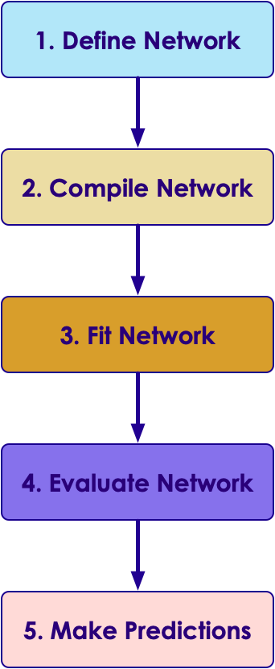

# Introduction to Keras

---

## Lesson Objectives

* Understand Keras framework

* Understand how Keras works with Deep Learning frameworks


Notes:  
Reference : https://en.wikipedia.org

---

## Code

```bash
# if using Anaconda Python  (highly recommended)
$  conda install tensorflow
$  conda install keras

```


```python
import keras
print("keras version ", keras.__version__)
```

```json
{
    "image_data_format": "channels_last",
    "epsilon": 1e-07,
    "floatx": "float32",
    "backend": "tensorflow"
}
```

---
## Image

Here is a typical Keras workflow.  This is pretty common workflow for most neural networks



---

## Code & Image

```python
import matplotlib.pyplot as plt

# Plot training & validation accuracy values
plt.plot(history.history['acc'])
if 'val_acc' in history.history:
  plt.plot(history.history['val_acc'])
plt.title('Model accuracy')
plt.ylabel('Accuracy')
plt.xlabel('Epoch')
plt.legend(['Train', 'Test'], loc='upper left')
plt.show()
```


---

## Table

| Library    | Line Count | Character Count  (no spaces) | Avg. character  count per line |
|------------|------------|------------------------------|--------------------------------|
| Tensorflow | 31         | 2162                         | 70                             |
| Keras      | 22         | 1018                         | 46                             |
|            |            |                              |                                |

Notes:

Large notes -

The tensor processing unit was announced in May 2016 at Google I/O, when the company said that the TPU had already been used inside their data centers for over a year.[1][2] The chip has been specifically designed for Google's TensorFlow framework, a symbolic math library which is used for machine learning applications such as neural networks.[3] However, Google still uses CPUs and GPUs for other types of machine learning.[1] Other AI accelerator designs are appearing from other vendors also and are aimed at embedded and robotics markets.
---
