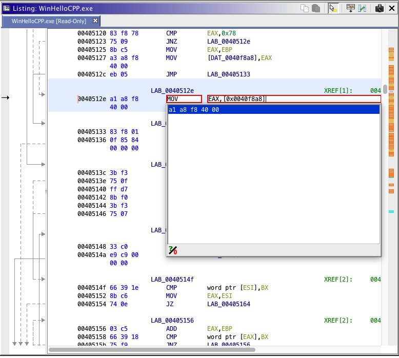
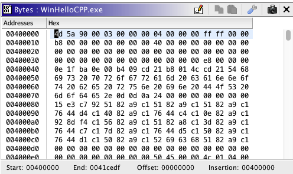
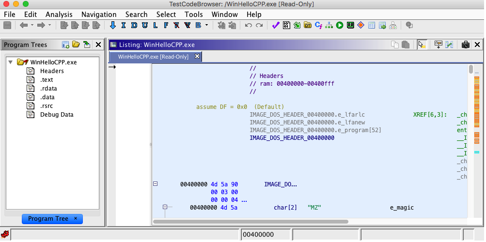
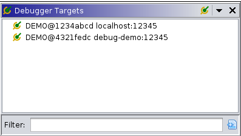
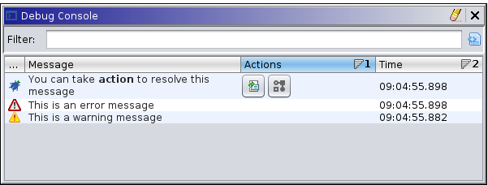
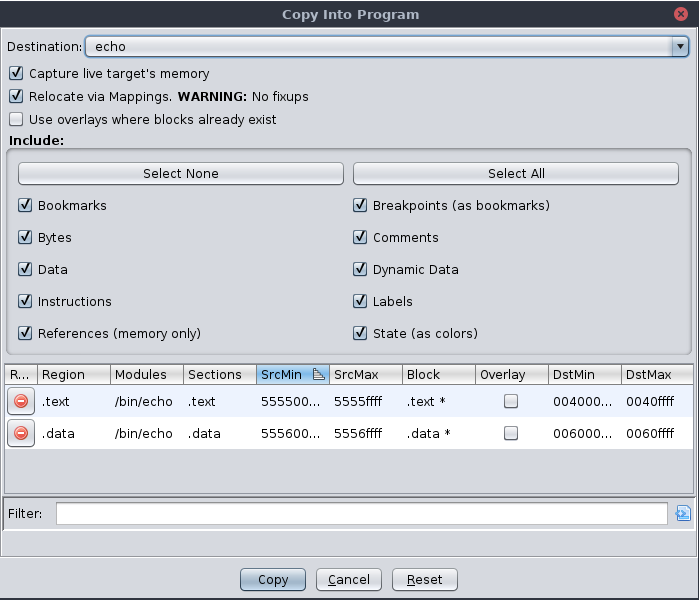
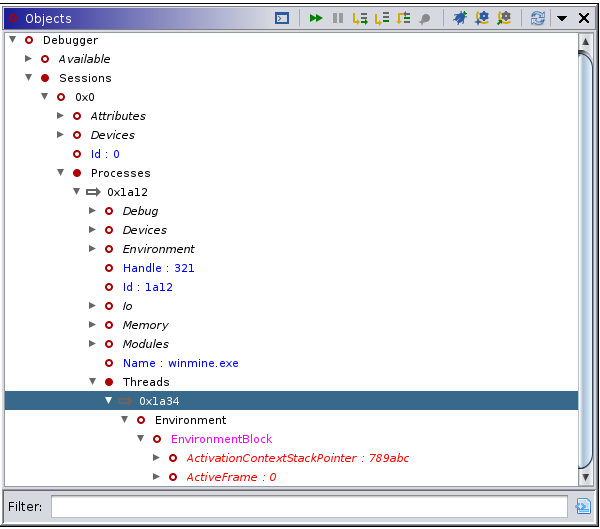
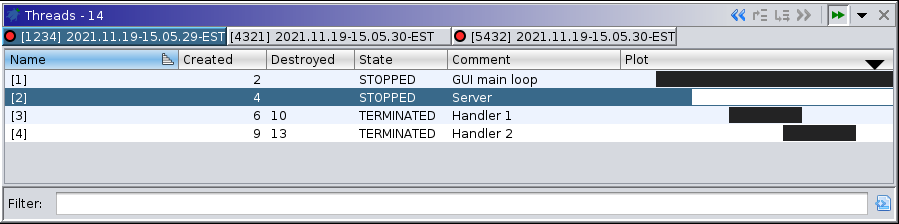
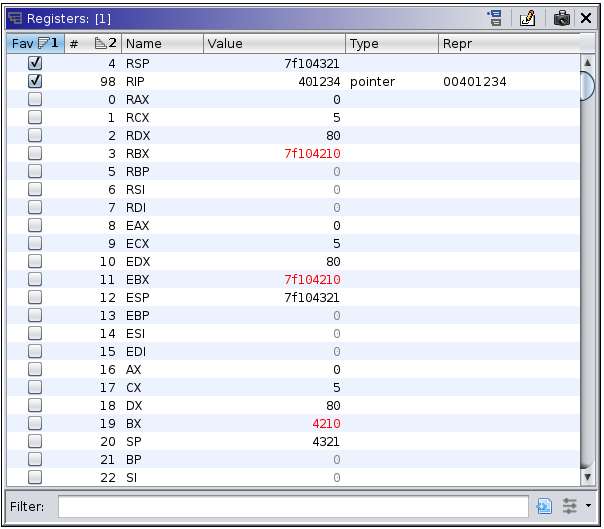

# Ghidra functionality walk-through

---

# Ghidra functionality

---

## Assembler

---

## The Byte Viewer

---

## Listing View

---

## Debugger: Targets

* The Debugger is a collection of plugins comprising Ghidra's Dynamic Analysis Framework. 
* This includes a platform for connecting to and controlling debuggers. 
* Ghidra is not a debugger in itself, but rather, it relies on existing 3rd-party debuggers, their APIs, wire protocols, and/or command-line interfaces. Such connectors are pluggable, allowing Ghidra to be extended and integrated with additional debuggers.

---

## Debugger: Console

---

## Debugger: Copy Actions

---

## Debugger: Commands and Objects

---

## Debugger: Threads and Traces

---

## Debugger: Trace Management

---

## Assembly

---

## Assembly

---

## Assembly

---

## Assembly

---

## Assembly

---

## Assembly

---

## Assembly

---

## Assembly

---

## Assembly

---

## Assembly

---

## Assembly

---

## Assembly

---

## Assembly

---

## Assembly

---

## Assembly

---

## Assembly

---

## Assembly

---

## Assembly

---

## Assembly

---

## Assembly

---

## Assembly

---

## Assembly

---

## Assembly

---

## Assembly

---

## Assembly

---

## Assembly

---

## Assembly

---

## Assembly

---

## Assembly

---

## Assembly

---

## Assembly

---

## Assembly

---

## Assembly

---

## Assembly

---

## Assembly

---

## Assembly

---

## Assembly

---

## Assembly

---

## Assembly

---

## Assembly

---

## Assembly

---

## Assembly

---

## Assembly

---

## Assembly

---

## Assembly

---

## Assembly

---

## Assembly

---

## Assembly

---

## Assembly

---

