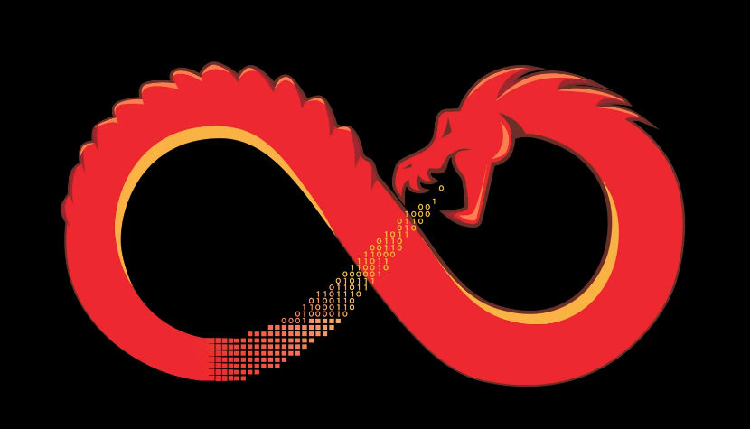
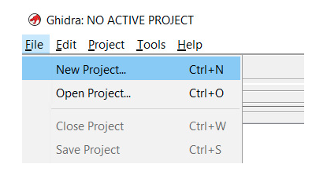
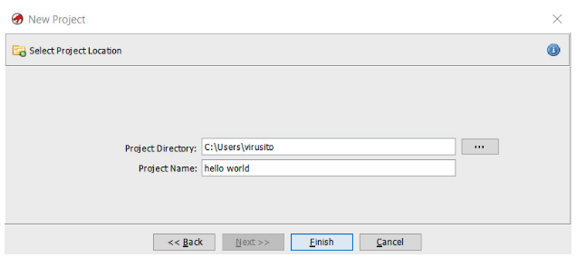
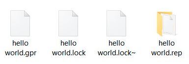
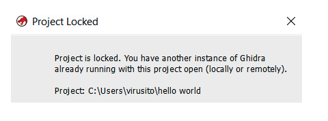

# Introduction to Ghidra

## What we will cover in this section
* WikiLeaks Vault 7
* Ghidra versus IDA and many other competitors
* Ghidra overview
* Install

---

## WikiLeaks Vault 7
* March 7, 2017, WikiLeaks started to leak Vault 7
* The biggest leak of confidential documents on the US Central Intelligence Agency (CIA).
* 24 parts
  * Year Zero, Dark Matter, Marble, Grasshopper, HIVE, Weeping Angel, Scribbles, Archimedes, AfterMidnight and Assassin, Athena, Pandemic, Cherry Blossom, Brutal Kangaroo, Elsa, OutlawCountry, BothanSpy, Highrise, UCL/Raytheon, Imperial, Dumbo, CouchPotato, ExpressLane, Angelfire, and Protego.

Notes:

According to RiskyBiz, it was a more complicated mystery

---

## NSA logo for Vault 7


Notes:

* While Michael Vincent Hayden, the director of the CIA between 2006 and 2009 and director of the NSA between 1999 and 2005, as the spokesperson, did not confirm or deny the authenticity of this enormous leak, some NSA intelligence officials anonymously did leak the material.

---

## Ghidra

* The existence of Ghidra was leaked in the first part of Vault 7: Year Zero
* Together with
  * how Apple's iPhone, Google's Android, devices Microsoft's Windows devices, and even Samsung TVs are turned into covert microphones. 



Notes:

* This first part consists of a huge leak of documents and files stolen from the CIA's Center for Cyber Intelligence in Langley, Virginia. The leak's content is about the CIA's malware arsenal, zero-day weaponized exploits, and how Apple's iPhone, Google's Android, devices Microsoft's Windows devices, and even Samsung TVs are turned into covert microphones.

--- 

## In Wikileaks

* Ghidra was referenced three times
* Showing
  * install 
  * step-by-step tutorial (with screenshots) of how to perform a manual analysis of a 64-bit kernel cache by using Ghidra
  * The latest Ghidra version available at the time, which was Ghidra 7.0.2.

## NSA release
* RSA Conference 2019 in San Francisco
* Rob Joyce, senior advisor for cybersecurity at NSA
* "Get your free NSA reverse engineering tool!"
* Ghidra program binaries

---

## Other features announced
* Team collaboration on a single project feature
* The capabilities to extend and scale Ghidra
* The generic processor model, also known as SLEIGH
* The two working modes: interactive and non-GUI
* The powerful analysis features of Ghidra

---

## Finally, release

* https://ghidra-sre.org.
* The first version of Ghidrawas Ghidra 9.0. 
* Ghidra's website is probably not available to visitors outside the US
  * you can access it by using a VPN
  * or an online proxy such as HideMyAss (https://www.hidemyass.com/)

---

## Unfortunate incident

* A few hours after the release
  * the first Ghidra vulnerability was published by Matthew Hickey, also known as @hackerfantastic, at 1:20 AM, March 6, 2019.

---

## He tweeted

```text
Ghidra opens up JDWP in debug mode 
listening on port 18001, 
you can use it to execute 
code remotely (Man facepalming). 
to fix change line 150 of support/launch.sh
from * to 127.0.0.1

```

Notes:

* Then, a lot of suspicions about the NSA and Ghidra arose. However, taking into account the cyber-espionage capabilities of the NSA, do you think the NSA needs to include a backdoor in its own software in order to hack its users?

* Obviously, no. They don't need to do this because they already have cyber-weapons for that.

* You can feel comfortable when using Ghidra; probably, the NSA only wanted to do something honorable to improve its own image and, since Ghidra's existence was leaked by WikiLeaks, what better way to do that than to publish it at RSA Conference and release it as open source?

## Ghidra versus IDA
* many other competitors
  * IDA
  * Binary Ninja
  * Radare2
* there are good reasons to start learning Ghidra.

---

## Ghidra advantages

* It is open source and free (including its decompiler).
* It supports a lot of architectures (which maybe the framework you are using does not support yet).
* It can load multiple binaries at the same time in a project. This feature allows you to easily apply operations over many related binaries (for example, an executable binary and its libraries).
* It allows collaborative reverse engineering by design.

---

## Ghidra advantages, cont'd

* It supports big firmware images (1 GB+) without problems.
* It has awesome documentation that includes examples and courses.
* It allows version tracking of binaries, allowing you to match functions and data and their markup between different versions of the binary.
* But learn them all!

---


# Install

* Download the latest version of Ghidra 
* [https://ghidra-sre.org/](https://ghidra-sre.org/)


---

## Unzipped content

* __docs__: Ghidra documentation and some extremely useful resources, such as learning Ghidra courses for all levels, cheatsheets, and a step-by-step installation guide
* __Extensions__: Optional Ghidra extensions allowing you to improve its functionality and integrate it with other tools
* __Ghidra__: The Ghidra program itself
* __GPL__: Standalone GPL support programs
* __licenses__: Contains licenses used by Ghidra
* __server__: Contains files related to Ghidra Server installation and administration
* __support__: Allows you to run Ghidra in advanced modes and control how it launches, including launching it to be debugged
* __ghidraRun__: The script used to launch Ghidra on

---

## How I installed Ghidra
* Installed Java Corretto
* Unzipped the ZIP file
* Move it to `/usr/local/ghidra_10.1.1`
```text
/usr/local/bin/ghidraRun -> 
/usr/local/ghidra_10.1.1/ghidraRun
```

---

## Overview of Ghidra's features
* Creating a new Ghidra project
* Importing files to a Ghidra project
* Performing and configuring Ghidra analysis
* Ghidra CodeBrowser
* Customizing Ghidra
* More Ghidra functionalities

---

## Creating a new Ghidra project

* Ghidra doesn't work with files directly
* Instead, Ghidra works with projects

---

## Project options

* projects can be non-shared or shared projects.
* We want to analyze a hello world program without collaboration with other reverse engineers
  * we will choose Non-Shared Project
  * and then click on the Next>> button. 
* Then, the program asks us to choose a project name (hello world) and where to store it:

## Choosing a project name and directory


---

## Ghidra project structure


## Single-user projects

* A Ghidra project (the *.gpr file) can only be opened by a single user
* If you try to open the same project twice at the same time
* The concurrency lock implemented using the hello world.lock and hello world.lock~ files 
* It will prevent you from doing so


---

## Importing files to a Ghidra project

---

## Quiz

* Is there one reverse engineering framework that is absolutely better than the others? What problems does Ghidra solve better than most frameworks? Cite some strengths and weaknesses.

Notes: 

* Frameworks have their strengths and weaknesses
* Ghidra advantages are listed on the slide

---

## Quiz

* How can you configure the disassembly view to enable PCode?

Notes:

* TODO

---

## Quiz

* What is the difference between the disassembly view and the decompiler view?

Notes:

* TODO

---


## Decompile to C code

* For that, let us use the c1 image in the labs


---

## Understanding C code


---

## Editing C code


---

## Snapshots in VM

* Best practice
* Analyzing in a VM
* Creating snapshots
* Restoring to a previous snapshot
  * If the virus made a change to it

---

## Snapshots jump


---

## Steps

* Shut down the Kali VM
* Restore the previous snapshot
* Boot the Kali VM
* Exercise
  * Create a folder
  * Restore the previous snapshot
  * The folder is gone!

---

