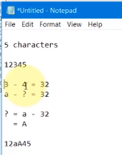

# Working with Ghidra deeper

# ASCII and Hex

## Working with the c3


* Go to `main` function
* Do the usual signature adjustment

## Let's run c2

```shell
./c3
Please provide the secret pasSword!
```

* Looking at the code
  * We see where this comes from


---

## Let's give it an argument

```text
./c3 abc
Come on now ...  you should expect betTer from us!
```

---

## Hex calculations


---

## Solving the password equation



---

## ASCII

* [https://www.asciitable.com/](https://www.asciitable.com/)


---

## Therefore...


---

## Lab: Hex

* Lab05
* [https://github.com/elephantscale/ghidra-labs/tree/main/lab05](https://github.com/elephantscale/ghidra-labs/tree/main/lab05)

