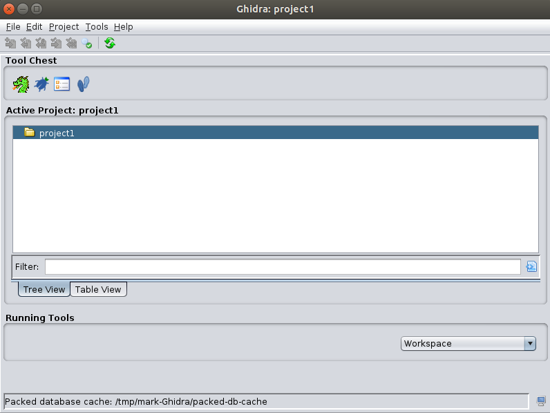
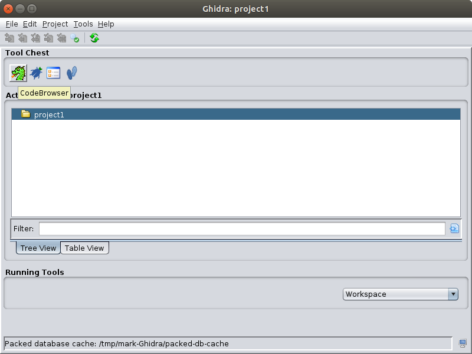
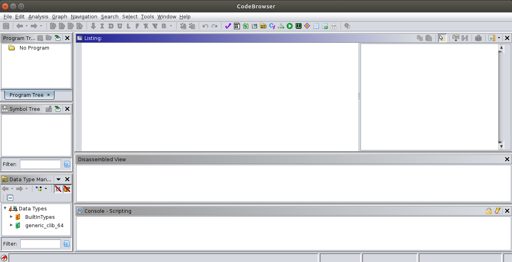
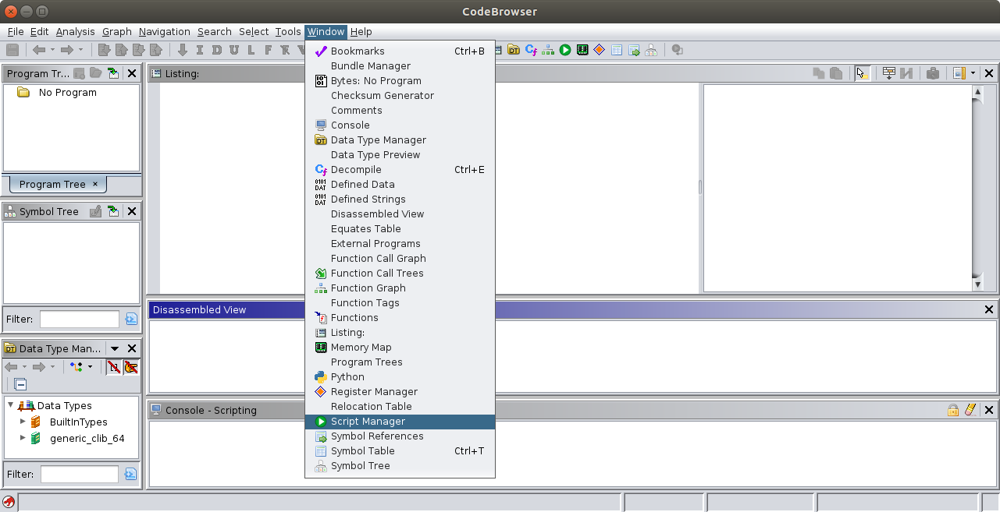
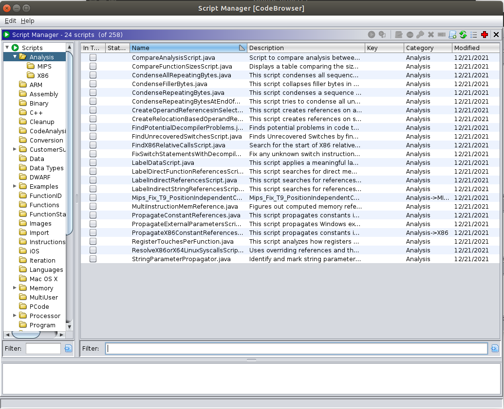
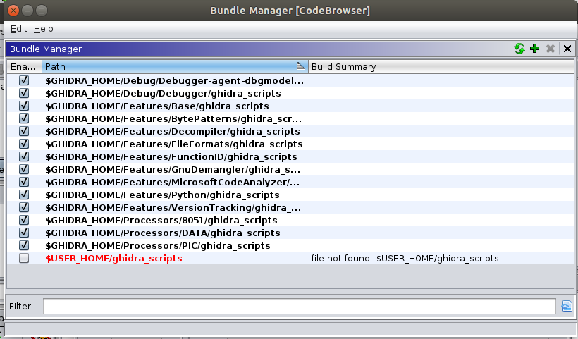

# Ghidra scripting

## Ghidra scripts 

* Ghidra scripts allow you to automate RE tasks when analyzing binaries
* In this section, we will have an overview
  * how to use scripts from CodeBrowser in a hello world program
* Our starting point here is a hello world program loaded into Ghidra's CodeBrowser
  * Ghidra intro

---

## Ghidra script arsenal

* There are a few hundreds of scripts
  * it is usually more than enough to cover the main automation needs.
* Once you know the arsenal
  * you may want to know how it works
  * we will have an overview of the Ghidra script 
  * to understand its internals
* You can develop your own scripts

---

## Our plan

* Exploring the Ghidra scripts arsenal
* Analyzing the Ghidra script class and the API
* Writing your own Ghidra scripts

---

## Open Script Manager

* Start with the Project window

---

## Click on CodeBrowser

---

## In the CodeBrowser

---

## To Script Manager

* Click on Window
* Choose ScriptManager

---

## In Script Manager

* On the left in the folder browser
* All these scripts are categorized by folder
* Showing the scripts each one contains

---

## Environmental variables

---

## Start playing with scripts

* This is a very good starting point to experiment with existing scripts. 
* You can analyze and edit all of them by using Ghidra. 
* It will allow you to understand how they work and how to adapt them to your needs.

---

