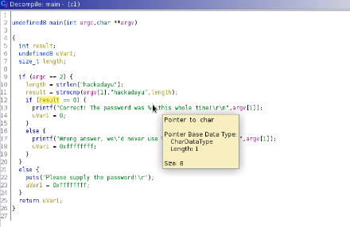
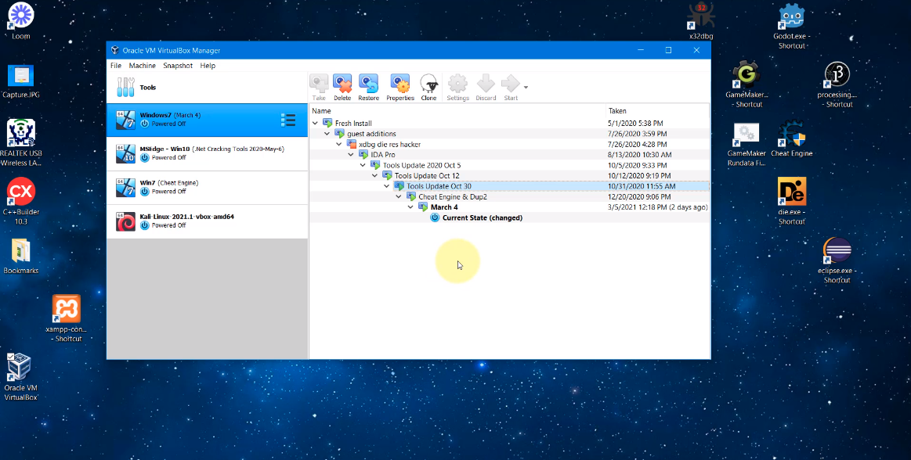

# Using Ghidra

## Decompile to C code

* For that, let us use the c1 image in the labs

---

## Understanding C code

---

## Editing C code

---

## Snapshots in VM

* Best practice
* Analyzing in a VM
* Creating snapshots
* Restoring to a previous snapshot
  * If the virus made a change to it

---

## Snapshots jump

---

## Steps

* Shut down the Kali VM
* Restore the previous snapshot
* Boot the Kali VM
* Exercise
  * Create a folder
  * Restore the previous snapshot
  * The folder is gone!

---

