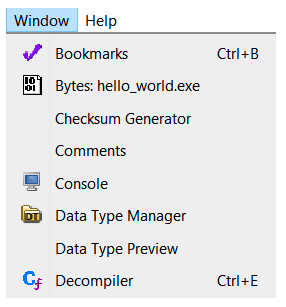
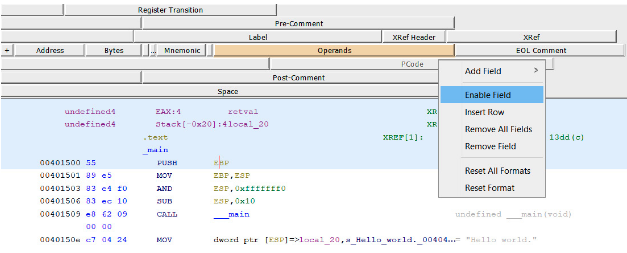
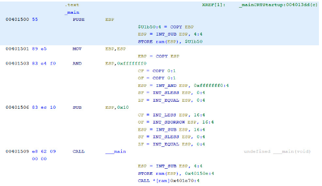
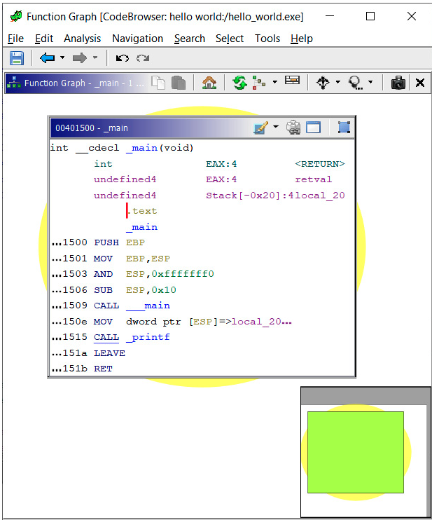
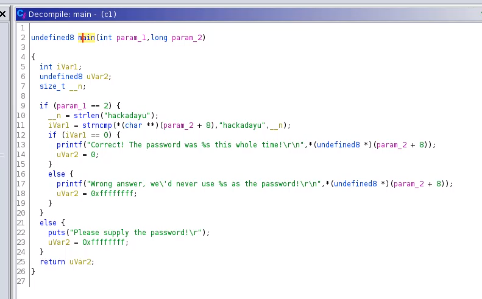
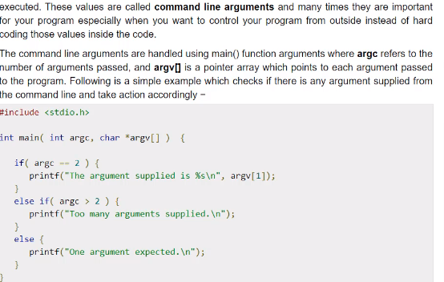
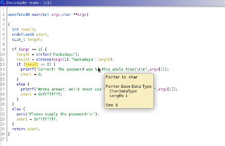
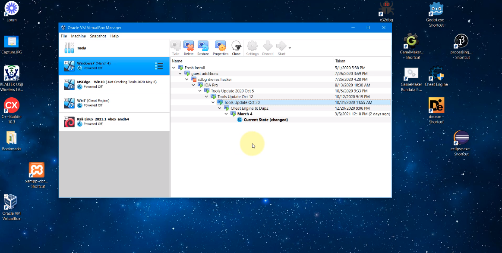

# Working with Ghidra

## Lab: Code analysis

* Lab03
* [https://github.com/elephantscale/ghidra-labs/tree/main/lab03](https://github.com/elephantscale/ghidra-labs/tree/main/lab03)

---

## Customizing Ghidra

* customize the disassembly view by moving fields
* add new fields
* extend the size of a field in the disassembly listing
* etc.

---

## PCode

* develop assembly language-agnostic tools
* develop automated analysis tools in a more comfortable language

---

## PCode enabled

* If it is enabled
  * PCode will be shown in the listing
  * PCode is less human-readable 
  * but sometimes better for scripting reverse engineering tasks

---

## With PCode

---

## More Ghidra functionalities (graph)

---

## Lab: Analyze variables

* Lab04
* [https://github.com/elephantscale/ghidra-labs/tree/main/lab04](https://github.com/elephantscale/ghidra-labs/tree/main/lab04)

---

## Quiz

* Is there one reverse engineering framework that is absolutely better than the others? What problems does Ghidra solve better than most frameworks? Cite some strengths and weaknesses.

Notes: 

* Frameworks have their strengths and weaknesses
* Ghidra advantages are listed on the slide

---

## Quiz

* How can you configure the disassembly view to enable PCode?

Notes:

* TODO

---

## Quiz

* What is the difference between the disassembly view and the decompiler view?

Notes:

* Many are confused by the terms decompiler and disassembler. As with most confusion of this type, most just use the words interchangeably. Don't do that; they are not the same.

* A decompiler takes one from a binary to source code–or something similarly high-level that can easily be read by humans.
* A disassembler takes one from binary to assembler–which is much lower level and is more difficult to read for humans.

---

# Using Ghidra in VM

## Decompile to C code

* For that, let us use the c1 image in the labs

---

## Understanding C code

---

## Editing C code

---

## Snapshots in VM

* Best practice
* Analyzing in a VM
* Creating snapshots
* Restoring to a previous snapshot
  * If the virus made a change to it

---

## Snapshots jump

---

## Steps

* Shut down the Kali VM
* Restore the previous snapshot
* Boot the Kali VM
* Exercise
  * Create a folder
  * Restore the previous snapshot
  * The folder is gone!

---

## Summary

* Origins
* Install
* Structure
* Main functionalities

---

## Congrats on completion

---