# Git for Developers


---
## Agenda


 * What we will learn

     - Terminology

     - Basic operations

     - Changes, staging, commit

     - Merge and conflict resolution


Notes: 


---

## Section - Terminology


<!-- {"left" : 1.02, "top" : 2.51, "height" : 4.61, "width" : 8.21} -->


Notes: 


---

## What is Version Control?


 * Management of changes

 * Why is it important?

     - Revert code changes
     - Never loose code
     - Maintain multiple versions of a product
     - See the difference between two (or more) versions of your code
     - Prove that a particular change broke or fixed a piece of code
     - Review the history of some code
     - Submit a change to someone else's code
     - Share your code, or let other people work on your code
     - See how much work is being done, and where, when and by whom
     - Experiment with a new feature without interfering with working code
     - More?


Notes: 


---

## Version control system examples


 * Server-based

     - CVS

     - PVCS

     - SourceSafe

     - Subversion

 * Distributed

     - Git

     - Mercurial


Notes: 


---

## Aside: a little history


 * < 2005: Linux using BitKeeper

 * 2005: BitKeeper unfriends Linux

 * Linus Torvalds and team design Git (uncouth person)

     - Speed

     - Simple design

     - Support for non-linear development

     - Distributed (you can work on the plane)

     - Handle large projects efficiently (speed and data size)


Notes: 


---

## Cartoon – Linus Torvalds


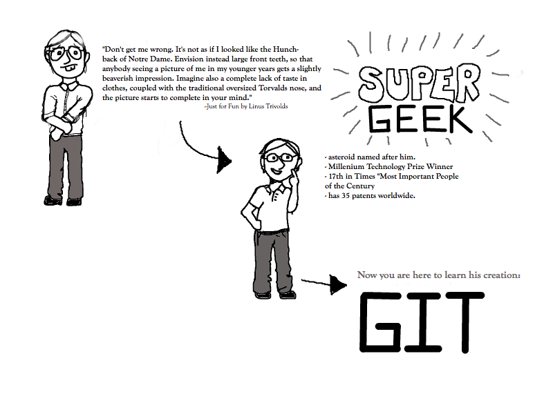 <!-- {"left" : 0.9, "top" : 1.65, "height" : 6.34, "width" : 8.45} -->


Notes: 


---

## What’s the difference?

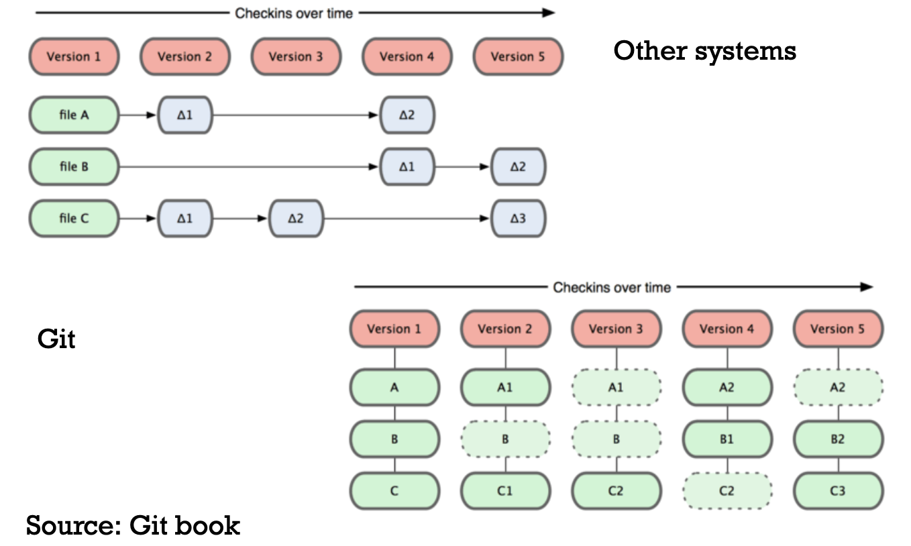 <!-- {"left" : 0.6, "top" : 2.11, "height" : 5.42, "width" : 9.05} -->


Notes: 


---

## Terminology


 * Key concepts

     - Repository

     - Working Copy

     - Index/Staging area

     - Blobs, Trees

     - Cloning

     - Remotes

     - Pulling + Pushing

     - Local history vs. Public history


Notes: 


---

## How we will approach the terms


 * Define

 * Give examples

 * Hands-on


Notes: 


---

## Repository


 * A set of files and directories

 * Historical record of changes in the repository

 * A set of commit objects

 * A set of references to commit objects, called heads

 * Let us give examples of what qualifies as a repository

     - A copy of a project directory?

     - CVS? Subversion?

 * Git is a complete repository, either local and remote


Notes: 


---

## Working copy


 * A.k.a “working directory,” is a single checkout of one version of the project


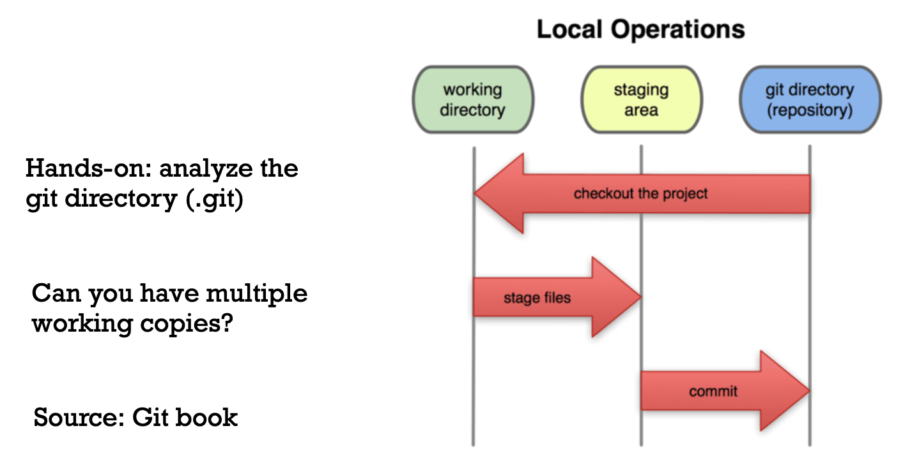 <!-- {"left" : 0.46, "top" : 2.43, "height" : 4.79, "width" : 9.34} -->


Notes: 


---

## Index and Staging areas


 * Index and Staging area are the same

 * It is a simple file in the Git directory

 * Stores information about the next commit


Notes: 


---

## Blobs, Trees

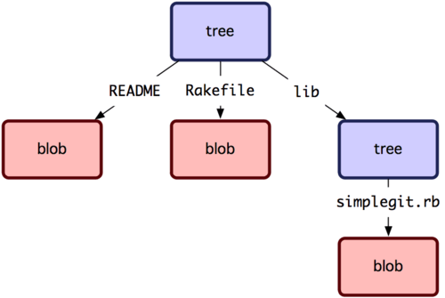 <!-- {"left" : 2.54, "top" : 1.41, "height" : 3.47, "width" : 5.17} -->

 * Git is a key-value data store

 * You can store a value and get back a key

 * There are Git internals

 * All we need to know is “tree” and “blob”


Notes: 


---

## Lab 01 – Install git


 * Please do all steps in Lab 01:

 * https://github.com/elephantscale/git-labs/tree/main/lab01


Notes: 


---

## Put and get values


 * Put value, observe the key you get in return

 * $ echo 'test content' | git hash-object -w –stdin

 * Find the file:

 * $ find .git/objects -type f

 * (SHA-1)

 * Get it back

 * git cat-file –p (SHA-1)


Notes: 


---

## Lab 02


 * Please do all steps in lab 02:

 * https://github.com/elephantscale/git-labs/tree/main/lab02


Notes: 


---

## Cloning


 * Getting a copy of the existing get repository (quick, what is repository?)

 * How? git clone <url>

 * Example:

 * $ git clone git://github.com/schacon/grit.git

 * Exercises

     - clone on the command line 

     - clone in your preferred Git UI (i.e. Eclipse Git, SmartGit, etc.)

     - See the following lab


Notes: 


---

## Lab 03


 * Please do all steps in lab 03:

 * https://github.com/elephantscale/git-labs/tree/main/lab03


Notes: 


---

## Cloning vs ‘checkout’


 * In subversion, this would be  **checkout** . Difference?

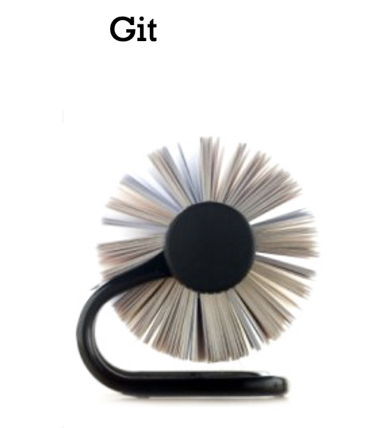 <!-- {"left" : 1.14, "top" : 3.11, "height" : 4.06, "width" : 3.49} --> &nbsp; &nbsp; &nbsp;  <!-- {"left" : 5.01, "top" : 3.01, "height" : 4.16, "width" : 4.1} -->


Notes: 


---

## Remotes


 * Versions of your project that are hosted on the Internet or network – that’s how you collaborate

 * Remotes can be

     - Multiple

     - Read only or read-write

     - Try

        * git remote

        * origin – This is where you clone your project from


Notes: 


---

## Pulling + Pushing

 <!-- {"left" : 6.2, "top" : 1.33, "height" : 4.73, "width" : 3.6} -->

 * Pulling – from a branch on a remote

 * Fetching – all that you don’t have yet

 * Pushing – back to the branch on a remote


Notes: 


---

## Lab 04


 * Please do all steps in lab 04

 * https://github.com/elephantscale/git-labs/tree/main/lab04

 * Note, however, that the simples way to work is to always use

 * git commit –a

 * command


Notes: 


---

## Local history vs. Public history


 * Local history is on your laptop

 * You can

     - Change commits

     - Change commit messages

     - Reorder

     - Squash

 * However

     - Be careful pushing this to the public history

     - Because other developers may end up having to merge


Notes: 


---

## Section – Basic Git Operations

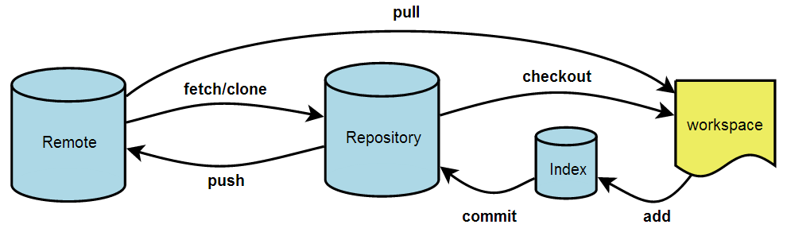 <!-- {"left" : 1.06, "top" : 3.31, "height" : 2.44, "width" : 8.13} -->


Notes: 


---

## Viewing a commit in UI


 * Execute the commands below

 * In Git Bash

 * gitk

 * Or

 * Tools-Git Shell

 * gitk

 * To view a specific commit

 * git show 5809 (first few letters of the SHA-1)


Notes: 


---

## Switching branches


 * git checkout <branch-name>

 * Try switching between your branches

 * Try switching branches to your friend’s

 * Describe what happens when you switch a branch


Notes: 


---

## Switching branches – practical scenario


 * A day in the life of a web developer

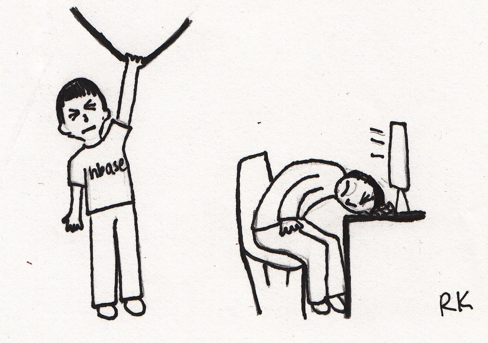 <!-- {"left" : 1.02, "top" : 2.22, "height" : 5.77, "width" : 8.21} -->


Notes: 


---

## Morning


 * Do work on a web site.

 * Create a branch for a new story you’re working on.

 * Do some work in that branch.

 * Let us try that. 

 * Work on the text file of your choice

 * Create a branch for a new story your-name_new

 * Do some work in that branch.


Notes: 


---

## Afternoon


 * Emergency fix is required in your branch your-name!

 * Switch back to your production branch.

 * Create a branch to add the fix.

 * Test, merge the hotfix branch into your-name, and push to production.

 * Switch back to your original story and continue working.

 * Let us do that (following lab)


Notes: 


---

## Lab 05


 * Please do all steps in lab 05

 * https://github.com/elephantscale/git-labs/tree/main/lab05


Notes: 


---

## Section: making changes, staging, and committing


 <!-- {"left" : 1.1, "top" : 1.9, "height" : 5.85, "width" : 8.05} -->


Notes: 


---

## Making changes, staging and committing – in-depth look


 * Staging a commit

 * Making a commit

 * Pushing your change

 * Undoing latest local commit

 * Reverting a commit


Notes: 


---

## Staging a commit	


 * Review: what happens in staging?

 * Answer: your changes go to the staging area

 * Do commands

 ```text
git status

  	git add <file>

  	git commit –a

  Interactive

 	git add -i
```
<!-- {"left" : 0, "top" : 2.8, "height" : 2.9, "width" : 3.77} -->

Notes: 


---

## Making a commit


 * Commit is a record of your changes in a Git directory (repository)

 * Making a commit is moving the branch point (master in this case) to the next snapshot

 <!-- {"left" : 2.38, "top" : 4.24, "height" : 2.76, "width" : 5.49} -->


Notes: 


---

## Commits


 * What are the differences and similarities between a commitment and a commit?

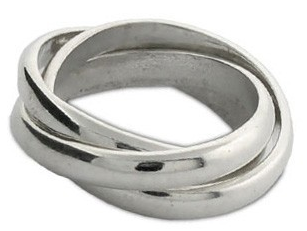 <!-- {"left" : 2.97, "top" : 3.2, "height" : 3.24, "width" : 4.3} -->


Notes: 


---

## Commit features


 * Permanence

     - Commit leaves a record

     - Commit goes into the Git area

     - Commit can be further recorded in a remote

 * Impermanence

     - Commits can be taken back (undone locally or reverted)

     - Commits can be erased (rebase)


Notes: 


---

## How does branching and merging work


 * Let’s go back to our morning-afternoon scenario. In brief…

 * Working on your issue

 * Get interrupted with the production fix

 * Fix the production, go back to your issue


Notes: 


---

## This is where you start

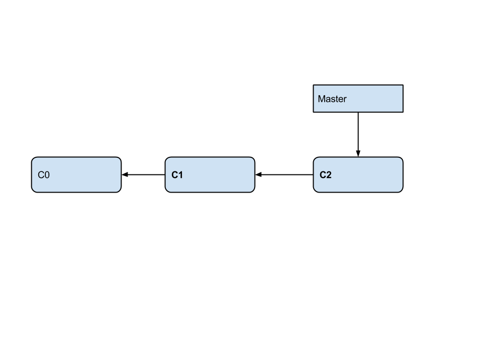 <!-- {"left" : 0.44, "top" : 1.35, "height" : 7.03, "width" : 9.38} -->


Notes: 


---

## Prepare to work on your feature

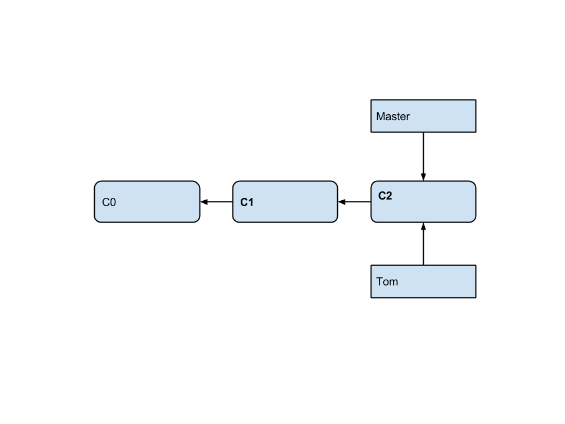 <!-- {"left" : 0.35, "top" : 1.17, "height" : 7.17, "width" : 9.56} -->

 * git checkout tom -b


Notes: 


---

## Commit your new changes

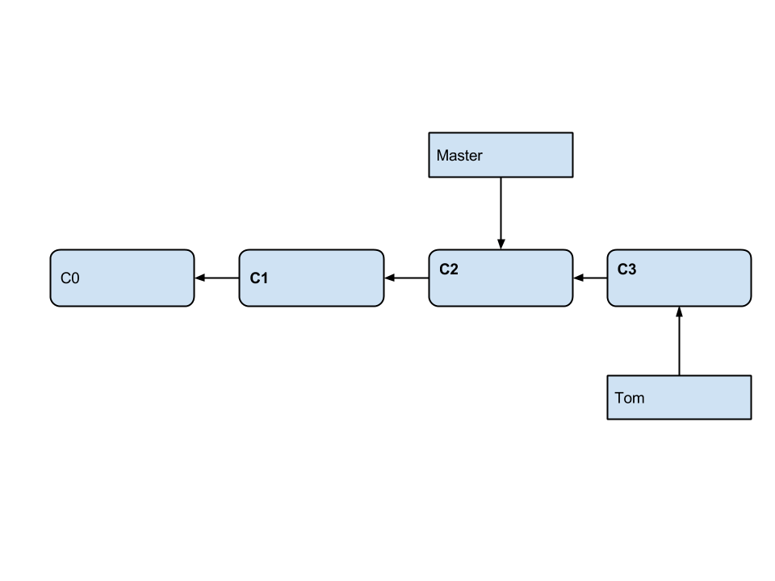 <!-- {"left" : 0.62, "top" : 1.16, "height" : 6.76, "width" : 9.01} -->

 * git commit -a


Notes: 


---

## Work on hotfix

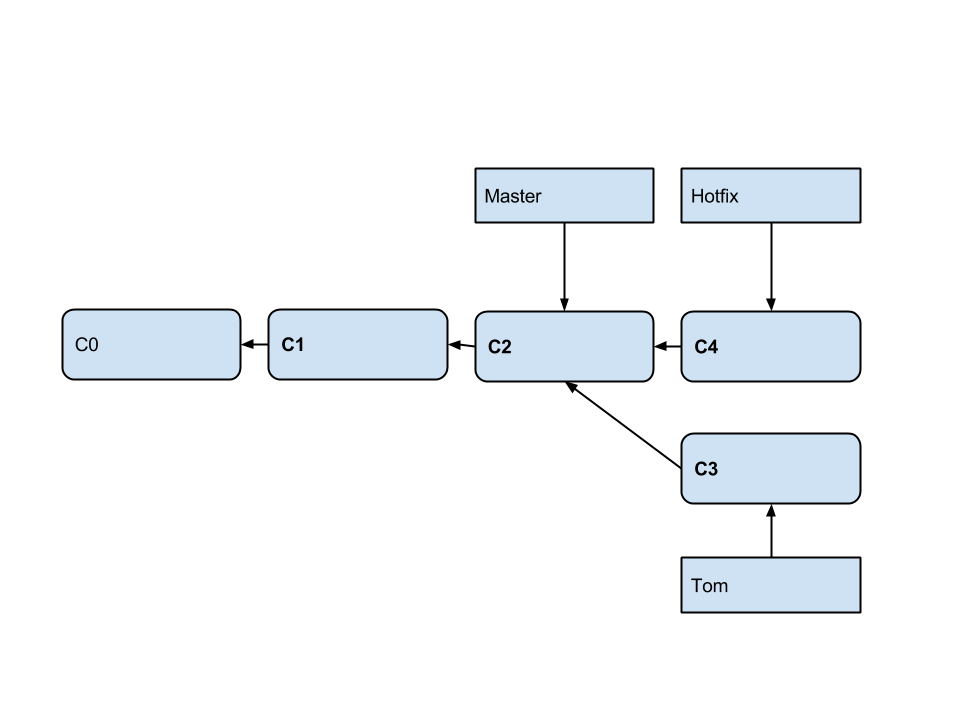 <!-- {"left" : 0.76, "top" : 0.45, "height" : 6.54, "width" : 8.72} -->

 * $ git checkout -b hotfix
 * Switched to a new branch 'hotfix'
 * $ do your work
 * $ git commit -a -m 'urgent fix'


Notes: 


---

## Merge hotfix

 <!-- {"left" : 0.76, "top" : 1.26, "height" : 6.54, "width" : 8.72} -->

 * git checkout master

 * git merge hotfix


Notes: 


---

## And now, clean up!

 <!-- {"left" : 0.72, "top" : 1.23, "height" : 6.61, "width" : 8.82} -->

 * git branch -d hotfix


Notes: 


---

## Pushing your change

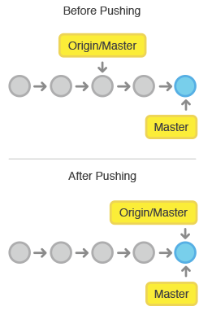 <!-- {"left" : 5.71, "top" : 1.26, "height" : 6.29, "width" : 4.24} -->

 * git push <remote> <branch>

 * or simply

 * git push


Notes: 


---

## Pushing – do not use force


 * As good practice, do not do this

 * git push <remote> --force

 * When can it happen?

 * Did not pull but want to push

 * Rebase (we will mention it later)


Notes: 


---

## Undoing latest local commit


 * Can you do this?

 * git undo-commit

 * Yes, if prior you type

 * git config --global alias.undo-commit 'reset --soft HEAD^'

 * Another way:

 * git reset --soft HEAD~1


Notes: 


---

## Undo staging


 * Say you did this and added too much

 * `git add .`

 * Here is how you can extricate yourself

 * `git rm -r --cached .`

 * In the future, you may do ‘add’ interactively

 * `git add -n .`

 * Try this: create a file, add it, then undo the staging


Notes: 


---

## Revert commit


 * To go to a previous commit

 * `git checkout 0d1d (start of your hash)`

 * Careful! To go back and delete all subsequent commits

 * `git reset --hard 0d1d (start of the commit hash)`


Notes: 


---

## Section: Merge and Conflict resolution


 <!-- {"left" : 2, "top" : 1.7, "height" : 6.25, "width" : 6.25} -->

Notes: 


---

## Merge and Conflict resolution


 * How merge conflicts happen

 * Preventing merge conflicts

 * How to resolve a merge conflict


Notes: 


---

## How merge conflicts happen


 * Change a file in one branch

 * Chart the same file in another branch – same line!

 * Now merge one branch into the other

```text
git checkout branch1 –b – now edit the file

git checkout branch2 –b – now edit the file

git merge branch1

Auto-merging <your-file>

CONFLICT (content): Merge conflict in <your file>

Automatic merge failed; fix conflicts and then commit
```
<!-- {"left" : 0, "top" : 2.69, "height" : 3.29, "width" : 9.07} -->

Notes: 


---

## How to resolve a merge conflict


 * Git writes markers in the file

 * You edit that file

 * git add <file>


Notes: 


---

## Conflict message example

```text
 git status

 # # On branch branch1

 # # You have unmerged paths.

 # #   (fix conflicts and run "git commit")

 # #

 # # Unmerged paths:

 # #   (use "git add ..." to mark resolution)

 # #

 # # both modified:      <your file>

 # #

 # no changes added to commit (use "git add" and/or "git commit -a")
```
<!-- {"left" : 0, "top" : 1.6, "height" : 4.93, "width" : 9.32} -->

Notes: 


---

## What you will see


```text
Threshold events

 <<<<<<< HEAD

 two

 =======

 three

 >>>>>>> branch-a

```
<!-- {"left" : 0, "top" : 1.6, "height" : 4.02, "width" : 4.16} -->


Notes: 


---

## Lab 06


 * Please do all steps in lab 06

 * https://github.com/elephantscale/git-labs/tree/main/lab06


Notes: 


---

## Preventing merge conflicts


 * Simple

     - Go with small iterations, in a branch, then merge and delete that branch

     - Do not forget to pull often

 * Advanced

     - `git pull rebase.` Git will:

     - Undo (unwind your commits)

     - Pull remote commits

     - Replay your local commits

     - You fix the conflicts if any

     - `git rebase continue`


Notes: 


---

## Tagging


 *  **tags**  - symbolic names for a given  *revision* . They always point to the same object (usually: to the same revision); they do not change.

 *  **branches**  - symbolic names for  *line of development* . New commits are created on top of branch. The branch pointer naturally advances, pointing to newer and newer commits.

 * (C) Elephant Scale 2021

Notes: 


---

## Vincent Van Gogh. Siesta

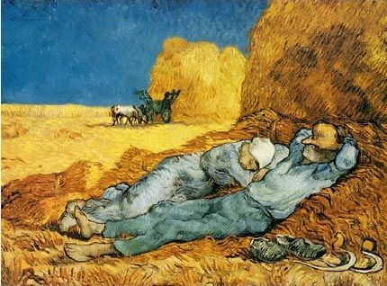<!-- {"left" : 1.09, "top" : 1.84, "height" : 5.97, "width" : 8.07} -->


Notes: 


---

## Detail


 <!-- {"left" : 5.76, "top" : 1.32, "height" : 2.43, "width" : 4.23} --> 

 * Painted late in life

 * Copied after Millet

 * Added his own artistic intensity

 <!-- {"left" : 7.01, "top" : 3.96, "height" : 4.72, "width" : 2.99} -->


Notes: 


---

## Pull requests


 * Git has no branch security

 * Anyone can work in his friend’s branch, then commit

 * How do you add not-trusted developers to the team?	

     - New developers may be given read-only access

     - Then will fork the project but won’t be able to commit the changes

     - They then issues a git pull request


Notes: 


---

## Lab 07


 * Please do all steps in lab 07

 * https://github.com/elephantscale/git-labs/tree/main/lab07


Notes: 


