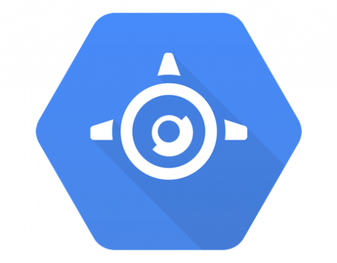
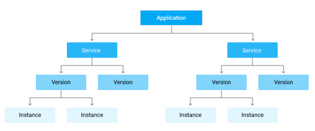
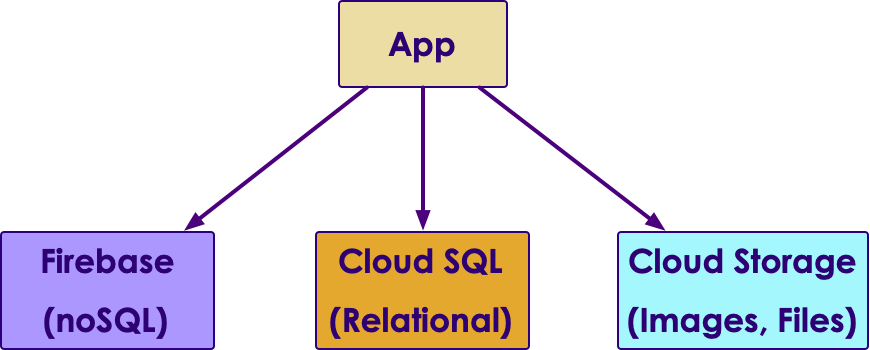

# Google App Engine

    

---

## Objectives
- Introduction to Google App Engine
- App Engine features
- Writing apps

---

## App Engine Intro

 <!-- TODO shiva -->
   

- App Engine is Google's application platform

- Fully managed and hosted on the Google Cloud platform

- Easy to build and deploy application

- No need to manage infrastructure of application

Notes:

---

## App Engine Features

- Many popular languages supported

- Allows for custom runtimes with Docker containers

- Allows for different supported libraries

- Fully managed infrastructure

- Multiple app versions existing at once

- Splitting requests between different app versions

Notes:

---

## App Engine Environments

- Two different options for applications

- **Standard Environment**
    - Application run in sandbox

    - Can handle rapid scaling

    - Must use runtime environment of a supported language

    - Can run at low cost or no cost. Application can scale to 0 when traffic is not expected

Notes:

---
## App Engine Environments

- **Flexible Environment**
    - Application run within a Docker container on virtual machine on Compute Engine

    - Can handle consistent traffic, deal with traffic fluctuations, or scale up and down gradually

    - Can use a custom runtime or code written in a non-supported language but must be in a Docker container

    - Uses resources of project in Compute Engine.

Notes:

---

## Standard Supported Languages

- In the Standard Environment, the following languages are supported as runtime environment languages
  - Go
  - PHP
  - Java
  - Python
  - Node.js
  - Ruby

<!-- TODO shiva -->
 &nbsp; &nbsp;
 &nbsp; &nbsp;
 &nbsp; &nbsp;
 &nbsp; &nbsp;
 &nbsp; &nbsp;

Notes:

---
## Python Web Frameworks

- Many of the popular Python web frameworks are supported
    - Django
    - CherryPy
    - Pyramid
    - Flask
    - web2py
    - webapp2

- Python third-party libraries can also be used but must be uploaded with application source code

 &nbsp; &nbsp;
 &nbsp; &nbsp;

Notes:

---
## Components of an Application

<!-- TODO shiva -->
   

- An application resource is tied to a specific Google Cloud Project

- The application is a container that has the service, version, and instance resource

- Application resources are created in a specified Region

- App uploaded with code, settings, credentials and metadata

- Every application has at least the default service but different services can be deployed to split a large app into parts

Notes:
Source: https://cloud.google.com/appengine/docs/standard/python3/an-overview-of-app-engine

---

## Components of an Application

- Versions:
  - Multiple versions of apps are supported.
  - Traffic can be routed to certain versions or split between them
  - Allows for easy testing and rollback

- Instances  
  - Versions run on Instances
  - App Engine will scale app to match traffic Loading
  - Scale up: increases number of instances to maintain performance
  - Scale down: reduce amount of inactive instances and minimize costs

Notes:

---
## Instances

- Provide the resources hosting your application

- Application can run on one or multiple instances with requests distributed between the instances

- Instance Types
  - Dynamic: based on current needs
  - Resident: always running

Notes:

---

## Instance Scaling Types

- Affect how instances are created

- **Automatic**
  - Makes new dynamic instances depending on response latencies and request rate.

- **Basic**
  - Makes dynamic instances when the app gets a request. Instance is shut down when app is idle.

- **Manual**
  - Uses resident instances that run the explicitly specified number of instances

Notes:

---

## Instance States

- Auto-scaled instances are always running

- Manual or basic instances can be either stopped or running

- **Startup**
  - A service instance is created by a empty HTTP GET request by the App Engine
    - Runs a program indefinitely
    - Initializes an instance before it receives additional traffic

Notes:

---

## Instance States

- **Shutdown:**
  - by manually stopping an instance
  - deploying a new version to the service
  - instance using too much memory
  - application exceeded instance hours
  - the instance moved by App Engine to another machine

  - The App Engine typically keeps manual and basic instances continually running

Notes:

---

## Python 3 Runtime Environment

- Almost any python library can be deployed with the application

- App Engine uses pip (Python package manager) to install every library defined in requirements.txt file in app's directory

- These are installed upon app deployment

Notes:

---

## Python 3 Runtime Environment

- Configuration file:
  - application configuration is specified by app.yaml file
  - minimum specification in the configuration file is the runtime language

- Startup
    - runtime is started using the entrypoint field
    - an optional entry point can be specified using web servers such as gunicorn, uwsgi and Tornado

Notes:

---

## Data Storage

- Can use Google Cloud service or another storage service.
- Third-party databases can also be connected to an App Engine instance

- Google Cloud Storage
  - Cloud Firestore (NoSQL)
  - Cloud SQL for Relational
  - Cloud Storage to write files, read, store static files in the runtime environment

Notes:

---
## Conclusion

- App Engine is a fully managed and hosted application service on the Google Cloud

- There is no requirement to work with application infrastructure

- App services will automatically scale up and down based on load

- Most popular language runtimes are supported such as Python

- Can connect to different data storage structures including Cloud SQL

Notes:

---
## Lab: Working With App Engine 1

<!-- {"left" : 6.76, "top" : 0.88, "height" : 4.37, "width" : 3.28} -->

* **Overview:**
    - Work with App Engine

* **Approximate run time:**
    - 20-30 mins

* **Instructions:**
    - Follow instructions for **APP-ENGINE-1** lab

Notes:

---
## Lab: Working With App Engine 2

<!-- {"left" : 6.76, "top" : 0.88, "height" : 4.37, "width" : 3.28} -->

* **Overview:**
    - Work with App Engine

* **Approximate run time:**
    - 20-30 mins

* **Instructions:**
    - Follow instructions for **APP-ENGINE-2** lab

Notes:

---

## Review and Q&A

<!-- {"left" : 8.24, "top" : 1.21, "height" : 1.28, "width" : 1.73} -->

- Let's go over what we have covered so far

- Any questions?

<!-- {"left" : 2.69, "top" : 4.43, "height" : 3.24, "width" : 4.86} -->
