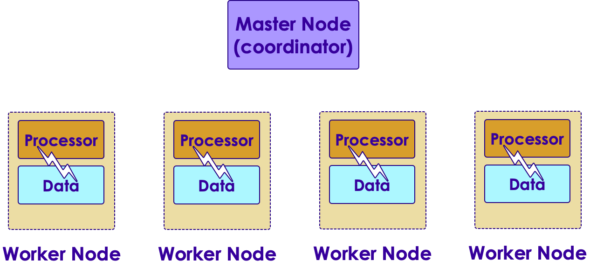

# Google Big Query

<!-- {"left" : 3.85, "top" : 6.2, "height" : 2, "width" : 4.69} -->

---

## Objectives

<!-- TODO shiva -->
<!-- {"left" : 3.85, "top" : 6.2, "height" : 2, "width" : 4.69} -->

* Understand Google Big Query

* Learn to use Big Query

---

## Data warehouses

<!-- TODO shiva -->
<!-- {"left" : 3.85, "top" : 6.2, "height" : 2, "width" : 4.69} -->

* Organizations rely on data warehouses to store and query the data they have

* Data originates from many sources, but eventually ends up the data warehouse

* Data warehouses support variety of query mechanisms -- mainly SQL

Notes:

---

## Traditional Data Warehouses

<!-- TODO shiva -->

<!-- {"left" : 3.85, "top" : 6.2, "height" : 2, "width" : 4.69} -->

* In house data warehouses are domintad by companies like IBM, Oracle, SAP ..etc

* However, as the data sizes grew, traditional data warehouses were unable to keep up or became very pricey

---

## Hadoop

<!-- TODO shiva -->
<!-- {"left" : 3.85, "top" : 6.2, "height" : 2, "width" : 4.69} -->

<!-- {"left" : 3.85, "top" : 6.2, "height" : 2, "width" : 4.69} -->

* Around 2006, Yahoo developed Hadoop

* Hadoop re-imagined data warehouse architecture
    - data is distributed data across many machines (nodes)
    - processing is also distributed across nodes
    - Most of the processing works on 'local data'

* This allowed Hadoop massive scale

* Hadoop can store and process massive amounts of data (Petabytes) on thousands of nodes

* Hadoop quickly became **the on-premise data lake** for big data

---

## Hadoop's Strengths

* Hadoop can tolerate hardware failures; and can automatically recover

* Hadoop is proven to scale to Petabytes of data on thousands of nodes (largest cluster was operated by Yahoo at 5000 nodes)

* Hadoop is proven at scale at companies like Facebook, Yahoo and Ebay

* Also Hadoop is open source with commercial support available (Cloudera)

<!-- TODO shiva -->
<!-- {"left" : 3.85, "top" : 6.2, "height" : 2, "width" : 4.69} -->

---

## Hadoop's Challenges

* Building a Hadoop cluster involves significant capital expense(machines, data center, ops) up front

* Operating a medium to large cluster, requires a very skilled devops team

* Also expanding a Hadoop cluster (say going from 50 nodes to 100 nodes) takes quite a bit of planning

---

## Data Warehouse Landscape in 2018

* Trend: Cloud based data warehouses are becoming prominent

<!-- TODO shiva -->
<!-- {"left" : 3.85, "top" : 6.2, "height" : 2, "width" : 4.69} -->

---

## Cloud Data Warehouses

* Amazon Cloud
    - Redshift

* Azure
    - SQL Data Warehouse

* Google
    - BigQuery

* Snowflake (cloud neutral)

<!-- TODO shiva -->
 &nbsp;  &nbsp;
 &nbsp;  &nbsp;
 &nbsp;  &nbsp;
 &nbsp;  &nbsp;

---
## Cloud Data Warehouse Advantages

* No infrastructure to maintain!

* Almost 'infinite' scale (store as much data as possible)

* Backups and disaster recovery built in

* All the best practices are implemented (security, access ..etc)

---

# Google BigQuery

---
## Lab: Doing XYZ

<!-- {"left" : 6.76, "top" : 0.88, "height" : 4.37, "width" : 3.28} -->

* **Overview:**
    - Work with xyz

* **Approximate run time:**
    - 20-30 mins

* **Instructions:**
    - Please complete A, B, C

Notes:

---

## Review and Q&A

<!-- {"left" : 8.24, "top" : 1.21, "height" : 1.28, "width" : 1.73} -->

* Let's go over what we have covered so far

* Any questions?

<!-- {"left" : 2.69, "top" : 4.43, "height" : 3.24, "width" : 4.86} -->
