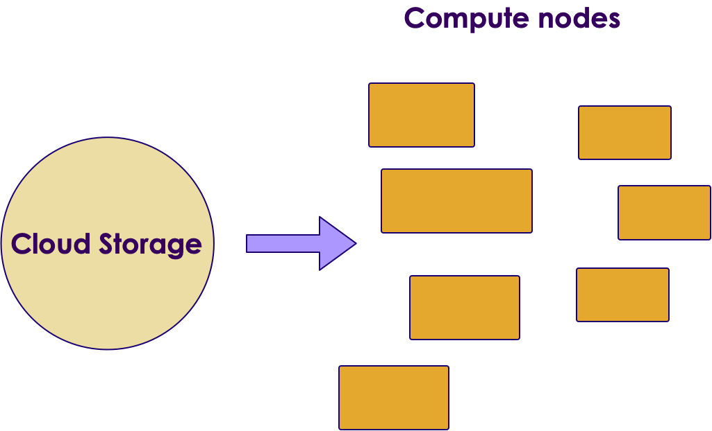

# Google Big Query

<!-- {"left" : 3.85, "top" : 6.2, "height" : 2, "width" : 4.69} -->


---

## Objectives

<!-- {"left" : 5.88, "top" : 1.03, "height" : 1.99, "width" : 4.68} -->


* Understand Google Big Query

* Learn to use Big Query

---

## Data warehouses

<!-- {"left" : 5.78, "top" : 1.1, "height" : 3.03, "width" : 4.26} -->

* Organizations rely on data warehouses to store and query the data they have

* Data originates from many sources, but eventually ends up the data warehouse

* Data warehouses support variety of query mechanisms -- mainly SQL

Notes:

---

## Traditional Data Warehouses

<!-- {"left" : 5.91, "top" : 1.1, "height" : 4.27, "width" : 4.17} -->

* In house data warehouses are domintad by companies like IBM, Oracle, SAP ..etc

* However, as the data sizes grew, traditional data warehouses were unable to keep up or became very pricey

---

## Hadoop

<!-- {"left" : 8.56, "top" : 0.98, "height" : 0.37, "width" : 1.58} -->

<!-- {"left" : 6.94, "top" : 1.42, "height" : 1.48, "width" : 3.25} -->

* Around 2006, Yahoo developed Hadoop

* Hadoop re-imagined data warehouse architecture
    - data is distributed data across many machines (nodes)
    - processing is also distributed across nodes
    - Most of the processing works on 'local data'

* This allowed Hadoop massive scale

* Hadoop can store and process massive amounts of data (Petabytes) on thousands of nodes

* Hadoop quickly became **the on-premise data lake** for big data

---

## Hadoop's Strengths

* Hadoop can tolerate hardware failures; and can automatically recover

* Hadoop is proven to scale to Petabytes of data on thousands of nodes (largest cluster was operated by Yahoo at 5000 nodes)

* Hadoop is proven at scale at companies like Facebook, Yahoo and Ebay

* Also Hadoop is open source with commercial support available (Cloudera)

<!-- {"left" : 2.07, "top" : 5.32, "height" : 2.78, "width" : 6.12} -->


---

## Hadoop's Challenges

* Building a Hadoop cluster involves significant capital expense(machines, data center, ops) up front

* Operating a medium to large cluster, requires a very skilled devops team

* Also expanding a Hadoop cluster (say going from 50 nodes to 100 nodes) takes quite a bit of planning

---

## Data Warehouse Landscape in 2018

* Trend: Cloud based data warehouses are becoming prominent

<!-- {"left" : 2.47, "top" : 2.41, "height" : 5.54, "width" : 5.31} -->


---

## Cloud Data Warehouses

* Amazon Cloud
    - Redshift

* Azure
    - SQL Data Warehouse

* Google
    - BigQuery

* Snowflake (cloud neutral)


<!-- {"left" : 0.24, "top" : 5.69, "height" : 0.87, "width" : 1.64} --> &nbsp;  &nbsp; <!-- {"left" : 2.08, "top" : 5.76, "height" : 0.72, "width" : 2.22} --> &nbsp;  &nbsp; <!-- {"left" : 4.13, "top" : 5.48, "height" : 1.29, "width" : 3.03} --> &nbsp;  &nbsp;  <!-- {"left" : 6.97, "top" : 5.77, "height" : 0.72, "width" : 3.04} -->


---
## Cloud Data Warehouse Advantages

* No infrastructure to maintain!

* Almost 'infinite' scale (store as much data as possible)

* Backups and disaster recovery built in

* All the best practices are implemented (security, access ..etc)

---

# Introducing Google BigQuery

<!-- {"left" : 3.9, "top" : 6.61, "height" : 2.23, "width" : 5.23} -->


---

## Google BigQuery

* **Fully managed** data warehouse

* Allows **scalable** analysis of Big Data
    - Start small, grow to Petabytes

* **Cost effective**
    - Pay for usage

* **Server-less**
    - No machines to spin up and manage

* **SQL**
    - Query structured data using ANSI SQL

* https://cloud.google.com/bigquery

---

## BigQuery Intro

<!-- {"left" : 7.6, "top" : 1, "height" : 3.32, "width" : 2.53} -->


* Product page: https://cloud.google.com/bigquery

* Documentation: https://cloud.google.com/bigquery/docs

* Book: **Google BigQuery: The Definitive Guide**  ([Oreilly](https://www.oreilly.com/library/view/google-bigquery-the/9781492044451/),  [Amazon](https://www.amazon.com/Google-BigQuery-Definitive-Warehousing-Analytics/dp/1492044466/))

* https://github.com/GoogleCloudPlatform/bigquery-utils : handy scripts

* [Intro video](https://www.youtube.com/watch?v=ufJ2W3EHIgA)

<!-- {"left" : 2.83, "top" : 5.67, "height" : 2.6, "width" : 4.59} -->


---

## BigQuery Features

* **Server-less**
    - Google does all the provisioning behind the scenes
    - No need to worry about spinning up machine, maintaining them and shutting them down


<!-- {"left" : 0.28, "top" : 4, "height" : 2.15, "width" : 4.21} --> &nbsp;  &nbsp; <!-- {"left" : 4.72, "top" : 4, "height" : 2.15, "width" : 5.25} -->


---

## BigQuery Features

* **Separation of Compute and Storage**
    - This architecture allows to scale up compute resources as needed
    - Also same storage can feed the compute - no need to replicate data

<!-- {"left" : 1.29, "top" : 3.45, "height" : 4.65, "width" : 7.67} -->


---

## BigQuery Features

* **Petabyte Scale**
    - Start small, and scale up to Petabyte scale

* **Automatic Backup and Restore**
    - BigQuery automatically replicates data across regions
    - Seven-day change history is maintained
    - So data can be restored easily

---

## BigQuery Features

* **Real time analytics**
    - use **Streaming API** to insert real time data very quickly
    - Examples could be : location data, sensor data, IOT device data
    - Inserted data is ready for analysis immediately
    - Can also leverage **Google Pub/Sub** technology to directly stream into BigQuery

<!-- {"left" : 0.35, "top" : 4.3, "height" : 2.39, "width" : 5.61} --> &nbsp;  &nbsp; <!-- {"left" : 6.29, "top" : 4.3, "height" : 2.39, "width" : 3.61} -->


---

## BigQuery Features

* **High Availability**
    - Data is highly available, replicated across multiple locations
    - All this is handled automatically and transparently
    - No extra charge, and no additional setup!

<!-- {"left" : 7.31, "top" : 2.77, "height" : 2.27, "width" : 3.03} -->


* **Standard SQL**
    - **"Every one knows SQL"**
    - ANSI-2011 SQL is supported
    - Also JDBC/ODBC interfaces are provided, so we can integrate third party apps

---

## Datasets Readily Availble


* BigQuery comes pre-loaded with many datasets: public and premium

<!-- {"left" : 8.54, "top" : 1.81, "height" : 1.61, "width" : 1.61} --> <!-- {"left" : 8.6, "top" : 3.31, "height" : 1.48, "width" : 1.48} --><!-- {"left" : 8.6, "top" : 4.61, "height" : 1.48, "width" : 1.48} -->


* Public Datasets
    - NASA data
    - NOAA weather data
    - Census data
    - https://cloud.google.com/public-datasets

<!-- {"left" : 8.83, "top" : 6.68, "height" : 0.91, "width" : 1.02} --> <!-- {"left" : 7.62, "top" : 6.68, "height" : 0.91, "width" : 0.91} -->


* Commercial data providers
    - Accuweather
    - Dow Jones
    - https://cloud.google.com/commercial-datasets


---

## BigQuery Advanced Features

* Machine Learning (BigQuery ML)
    - Build models on structured and semi-structured data

* BI Engine
    - Blazing fast **in memory** analytics
    - Sub-second latencies
    - Integrates with **Data Studio**

* Geo-Spatial Analysis (GIS)
    - Analyze location centric data
    - e.g. where are my users located?

---

## BigQuery Architecture

* To scan **1TB of data in 1 second**, we need to run
    - 10,000 disk drives
    - 5,000 processors
    - simultaneously

* Cloud platform's **economy of scale** makes this possible

* [BigQuery white paper](https://cloud.google.com/files/BigQueryTechnicalWP.pdf)
---

## BigQuery Architecture

* BigQuery runs on compute instances called **Dremel**

* [Reference](https://www.troposphere.tech/wp-content/uploads/2019/06/BigQuery-Query-Optimization-with-Troposphere.pdf?x10155)

<!-- {"left" : 0.52, "top" : 3.68, "height" : 2.89, "width" : 9.22} -->


---
## Dremel Architecture

<!-- {"left" : 1.16, "top" : 1.04, "height" : 3.83, "width" : 7.94} -->


* [Reference](https://www.troposphere.tech/wp-content/uploads/2019/06/BigQuery-Query-Optimization-with-Troposphere.pdf?x10155)

---
## Query Execution Examples


<!-- {"left" : 1.14, "top" : 1.17, "height" : 3.71, "width" : 7.97} -->

* [Reference](https://www.troposphere.tech/wp-content/uploads/2019/06/BigQuery-Query-Optimization-with-Troposphere.pdf?x10155)

---

## BigQuery Architecture

* BigQuery uses **columnar data structure**
* Columnar format is optimized for aggregate queries (see next slid)
* Here is an example of how we can represent the same data in row format and columnar format

<!-- {"left" : 0.54, "top" : 4, "height" : 1.71, "width" : 4.05} --> &nbsp; &nbsp; <!-- {"left" : 5.13, "top" : 4, "height" : 2.15, "width" : 4.58} -->


<!-- {"left" : 2.73, "top" : 6.32, "height" : 1.86, "width" : 4.78} -->


---

## BigQuery Pricing

| Pay as you Go                            | Flat Pricing                                                      |
|------------------------------------------|-------------------------------------------------------------------|
| $5 per TB                                | Starts at $10,000/month for a dedicated reservation of 500 slots. |
| First terabyte (1 TB) per month is free* | $30 per month per slot for Flex slots.                            |

<!-- {"left" : 0.25, "top" : 1.17, "height" : 1.69, "width" : 9.75} -->

* On demand pricing is billed for **Number of bytes read**

* FREE operations:  Loading data, copying data

* https://cloud.google.com/bigquery/pricing

---
## Datasets

* BigQuery works with datasets

* We can create our own dataset or query pre-existing datasets

* Pre-existing datasets
    - Some one shared datasets with you
    - Public datasets hosted by Google

---

## Public Datasets

* These are large datasets hosted by Google Cloud

* We can use them without incurring any 'storage' charges (just pay for compute)

* Examples of public datasets
    - Austin crime data (2014 - 15)
    - Bitcoin blockchain transactions
    - US Federal Election campaign finance
    - COVID-19 public dataset
    - https://cloud.google.com/public-datasets


---

## Querying a Public Dataset


<!-- {"left" : 5.14, "top" : 1.3, "height" : 2.2, "width" : 4.77} -->


* Let's analyze **austin_bikeshare** data
    - You can find this under **bigquery-public-data** project

* The **bikeshare_trips** table
    - 1.2 M records
    - about 125 Meg in size

---

## Dataset Schema and Data

* Let's look at **schema** and **preview** some data

<!-- {"left" : 1.02, "top" : 2.02, "height" : 3.18, "width" : 8.21} -->


<!-- {"left" : 1.02, "top" : 5.63, "height" : 2.77, "width" : 8.21} -->


---
## Querying

* Let's find the top-10 type of subscribers who rent bikes
* **Job information** tells us more details
    - The query is done in 0.5 secs!

```sql
SELECT subscriber_type , count(*) as trip_count
FROM `bigquery-public-data.austin_bikeshare.bikeshare_trips`
group by subscriber_type
order by trip_count desc
LIMIT 10
```
<!-- {"left" : 0, "top" : 2.62, "height" : 1.65, "width" : 10.25} -->


<!-- {"left" : 0.87, "top" : 4.78, "height" : 3.3, "width" : 2.77} --> &nbsp; &nbsp; <!-- {"left" : 5.01, "top" : 4.84, "height" : 3.47, "width" : 4.37} -->


---

## Importing Our Data

```bash
# make the dataset
$   bq --location=US mk flight_data

# create a table definition
# we are asking bq to auto detect the schema
bq mkdef --source_format=CSV \
   --autodetect \
   gs://elephantscale-public/data/flight-data/raw/2015/* \
   > /tmp/mytable.json

# create an external table `flight_data.2015_data`
bq mk --external_table_definition=/tmp/mytable.json \
   flight_data.2015_data

```
<!-- {"left" : 0, "top" : 1.37, "height" : 3.99, "width" : 10.25} -->

* Here are some sample queries

```sql

-- simple preview of data
SELECT  *
FROM `PROJECT_ID.flight_data.2015_data`

-- carrier count
SELECT CARRIER, COUNT(*) as cnt
FROM `PROJECT_ID.flight_data.2015_data`
GROUP BY CARRIER
ORDER BY cnt DESC
```
<!-- {"left" : 0, "top" : 5.82, "height" : 2.9, "width" : 7.28} -->

---

## Lab: Using BigQuery

<!-- {"left" : 6.76, "top" : 0.88, "height" : 4.37, "width" : 3.28} -->


* **Overview:**
    - Work with BigQuery

* **Approximate run time:**
    - 1 hr

* **Instructions:**
    - Please complete the following labs
    - Instructor to demo: **BIGQUERY-1**: Query a public dataset (IRS-990)
    - **BIGQUERY-2**: Query another public dataset (austin-bikeshare)
    - **BIGQUERY-3**: Importing our own data into BigQuery


Notes:

---

## Review and Q&A

<!-- {"left" : 8.24, "top" : 1.21, "height" : 1.28, "width" : 1.73} -->

<!-- {"left" : 5.48, "top" : 3.2, "height" : 3.24, "width" : 4.86} -->


* Let's go over what we have covered so far

* Any questions?
