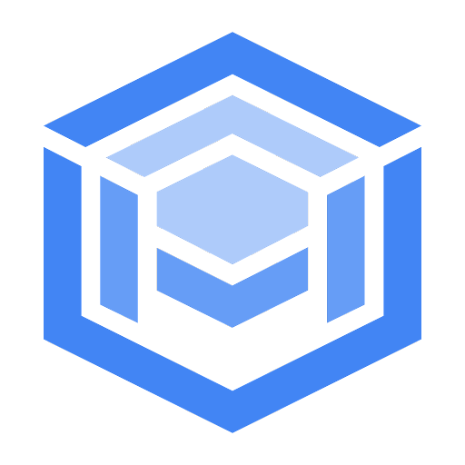

# Google Cloud AlloyDB

<!-- {"left" : 5.1, "top" : 6.2, "height" : 2.18, "width" : 2.18} -->

---

## About This Class

* Introduction to Alloy DB

* Alloy DB Vs. Cloud SQL

* Using Alloy DB

---

## Alloy DB

* AlloyDB and Cloud SQL are two relational database management systems (RDBMS) offered by Google Cloud Platform (GCP)

* Both are fully-managed services that handle the administration and scaling of databases

However, there are differences in their architecture, features, and pricing, which we will explore in this presentation

---

## Overview

* Fully compatible with PostgreSQL, providing flexibility and true portability for your workloads

* AlloyDB is built on top of Google Cloud Spanner

* It offers high availability, scalability, and strong consistency across multiple regions and zones

* AlloyDB supports standard SQL, ACID transactions, and automatic sharding for horizontal scaling

* It also includes features like point-in-time recovery, read replicas, and cross-region replication

---

##  AlloyDB vs. Cloud SQL - Architecture

* AlloyDB is built on top of Spanner's globally-distributed architecture, which provides strong consistency and scalability across multiple regions and zones

* Cloud SQL is built on top of Compute Engine's virtual machines, which provide a simpler and more flexible architecture, but with less consistency guarantees

---

##  AlloyDB vs. Cloud SQL - Features

* AlloyDB supports advanced features like automatic sharding, cross-region replication, and TrueTime API, which are not available in Cloud SQL

* Cloud SQL supports multiple database engines (MySQL, PostgreSQL, SQL Server) and provides a simple, familiar interface for developers

---
##  AlloyDB vs. Cloud SQL - Pricing

* AlloyDB is priced based on storage, compute, and network usage, and is generally more expensive than Cloud SQL

* Cloud SQL is priced based on the size of the instance, with additional charges

---
## Lab: Launching a AlloyDB

<!-- {"left" : 6.76, "top" : 0.88, "height" : 4.37, "width" : 3.28} -->

* **Overview:**
    - Work and setup AlloyDB 

* **Approximate run time:**
    - 60 mins

* **Instructions:**
    - Follow instructions for **QW** lab

Notes:

---

## Review and Q&A

<!-- {"left" : 8.24, "top" : 1.21, "height" : 1.28, "width" : 1.73} -->

* Let's go over what we have covered so far

* Any questions?

<!-- {"left" : 2.69, "top" : 4.43, "height" : 3.24, "width" : 4.86} -->
