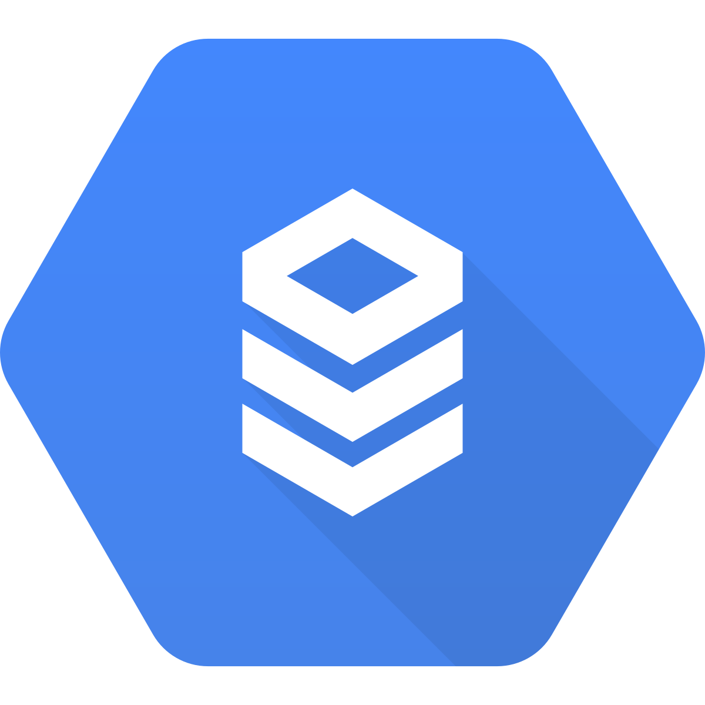

# Google Cloud SQL


<!-- TODO shiva -->
<!-- {"left" : 4.37, "top" : 7, "height" : 1.19, "width" : 3.65} -->


---

## About This Class

* Introduction to Cloud SQL

* Cloud SQL features

* Using Cloud SQL


Notes:

---
## Google Cloud SQL

<!-- TODO shiva -->
<!-- {"left" : 6.31, "top" : 1.38, "height" : 0.91, "width" : 3.79} -->

 * Cloud SQL is a full managed relational database instance.

 * Fully managed database service that makes it easy to set up, maintain, manage, and administer your relational database on Google Cloud Platform.  

 * Supported databases
   - [MySQL](https://www.mysql.com/)
   - [PostgreSQL](https://www.postgresql.org/)
   - [MS SQL Server](https://www.microsoft.com/en-us/sql-server/)

<!-- TODO shiva -->
 &nbsp;  &nbsp; <!-- {"left" : 6.31, "top" : 1.38, "height" : 0.91, "width" : 3.79} -->
 &nbsp; &nbsp; <!-- {"left" : 6.31, "top" : 1.38, "height" : 0.91, "width" : 3.79} -->
 &nbsp; &nbsp; <!-- {"left" : 6.31, "top" : 1.38, "height" : 0.91, "width" : 3.79} -->


Notes:


---

## Easy Management

* Easy-to-manage relational database in the cloud

* Automates database provisioning, storage capacity management, and other time-consuming tasks   

* Ensures reliability and security with built-in automation for high availability, backups, and security updates

* Cloning database instances on the fly and point-in-time recovery

* Plus a 24/7 Site Reliability Engineering team

* Easy integration with App Engine, Compute Engine, Kubernetes, and BigQuery

---

## Secure and Compliant

 <!-- {"left" : 5.84, "top" : 1.16, "height" : 3.49, "width" : 4.33} -->

* Automatic data encryption at rest and in transit.

* Private connectivity with Virtual Private Cloud and user controlled network access, includes firewall protection.

* Compliant with [SSAE 16](http://ssae16.com/), [ISO 27001](https://en.wikipedia.org/wiki/ISO/IEC_27001), PCI DSS v3.0, and HIPPA.

Notes:


---

## Setup in minutes

* Spin up an instance using UI or CLI

* Built in migration tools import data in just a few minutes.

<!-- TODO shiva -->
> "Using Google App Engine and Google Cloud SQL make our applications go live in half the time and have provided us with hassle-free control over all processes.  The shift to Google Cloud SQL has allowed us to focus on making our applications even better. "   
-Yogesh Agarwal, CEO, Daffodil


Notes:


---
## Scale as you go

* With Cloud SQL you can choose a machine to scale up
    - upto 400GB RAM and 30TB storage

* Scale out by having multiple replicas

<!-- TODO shiva -->
 <!-- {"left" : 5.84, "top" : 1.16, "height" : 3.49, "width" : 4.33} -->

---


## Easy Connectivity

* Standard command line tools:  
__`mysql, psql`__ etc...

* Standard connection drivers (JDBC / ODBC)

* Supported languages:  
__`Java, Python, PHP, Node.js, GO, Ruby`__

---

## Cloud SQL Launch Checklist

<!-- TODO shiva -->
 <!-- {"left" : 5.84, "top" : 1.16, "height" : 3.49, "width" : 4.33} -->

* The checklist is broken down into three sections.
    - Architecture Design and Development
    - Alpha Testing
    - Final launching


---
## Checklist: Architecture Design and Development

*  This part of checklist requires most time to complete.

*  Assess the performance characteristics of Cloud SQL and the service's limitations and restrictions.

*  Ensure your DevOps team is familiar with the Cloud Console and Cloud SDK.

*  Consult Cloud SQL community support for information and practical advice on Cloud SQL.

*  Subscribe to the Cloud SQL announce group.  Posts are made to this group for service updates, issues, and incident reports.  

---

## Checklist: Alpha Testing

*  Use when you are close to code complete.

*  Want to get initial metrics about application.  

* Remain current on the drivers that provide data access for your development platform.

* Load test, early, and realistically.   

* If you are connecting from Compute Engine, make sure the firewall behavior related to idle connections does not harm the application.

*  Observe the connection limits for the App engine apps.

*  Make sure there is a strategy in place for doing schema changes and the impact of doing them is well understood.  

---
## Checklist: Final Launch

<!-- TODO shiva -->
 <!-- {"left" : 5.84, "top" : 1.16, "height" : 3.49, "width" : 4.33} -->

*  Use before and shortly before and during your launch.

* There are no Cloud SQL specific activities for launch.

* If you have followed the checklist to this point you are ready for the applications launch.

---

## Cloud SQL API

```bash

# Show the list of potential machine types:
$ gcloud sql tiers list

# Create an instance
$ gcloud sql instances create db1 --database-version=MYSQL_5_7   \
    --tier=db-n1-standard-2 --region=us-central1

# Set password
gcloud sql users set-password root --host=% --instance db1 --password 'secret1'

# stop / restart
$  gcloud sql instances restart db1
$  gcloud sql instances stop db1

```

---
## Lab: Launching a Cloud SQL

<!-- {"left" : 6.76, "top" : 0.88, "height" : 4.37, "width" : 3.28} -->


* **Overview:**
    - Work with Cloud SQL

* **Approximate run time:**
    - 20-30 mins

* **Instructions:**
    - Follow instructions for **CLOUD-SQL-1** lab


Notes:

---
## Lab: Working With Cloud SQL

<!-- {"left" : 6.76, "top" : 0.88, "height" : 4.37, "width" : 3.28} -->


* **Overview:**
    - Work with Cloud SQL

* **Approximate run time:**
    - 20-30 mins

* **Instructions:**
    - Follow instructions for **CLOUD-SQL-2** lab


Notes:

---

## Review and Q&A

<!-- {"left" : 8.24, "top" : 1.21, "height" : 1.28, "width" : 1.73} -->


* Let's go over what we have covered so far

* Any questions?

<!-- {"left" : 2.69, "top" : 4.43, "height" : 3.24, "width" : 4.86} -->
