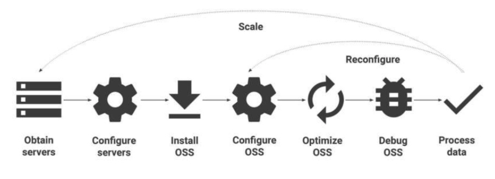
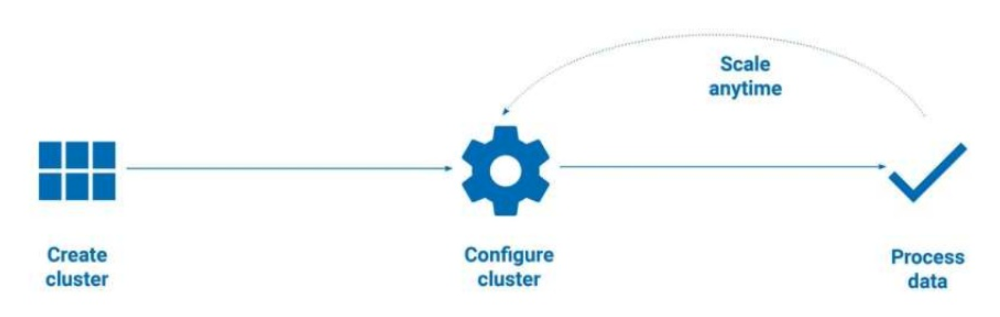

# Google Dataproc

<!-- {"left" : 3.06, "top" : 6.23, "height" : 2.24, "width" : 2.24} -->


---

## Objectives

- Understanding Dataproc
- Dataproc features
- Dataproc in action

---

## Dataproc

* Google Cloud Dataproc is a easy to use, fast, low cost, and fully managed service that lets you run Spark and Hadoop on the Google Cloud Platform.  

* Cloud Dataproc clusters have an agent to manage the Cloud Datproc cluster.  

* Dataproc uses Compute Engine, Cloud Storage, and Cloud Ops tools.  

<!-- {"left" : 1.43, "top" : 5.25, "height" : 1.49, "width" : 2.79} --> &nbsp;  &nbsp; <!-- {"left" : 5.49, "top" : 5.6, "height" : 0.78, "width" : 3.33} -->


Notes:

---

## Spark & Hadoop Clusters

* Easily create and scale clusters

* Spark
  - PySpark
  - Spark SQL
  
* Hadoop
  - MapReduce
  - Hive
  - Pig

<!-- {"left" : 1.02, "top" : 5.17, "height" : 2.7, "width" : 8.21} -->


---

## Traditional Spark and Hadoop Clusters

<!-- {"left" : 0.53, "top" : 2.86, "height" : 3.34, "width" : 9.19} -->


---
## Google Cloud Dataproc


<!-- {"left" : 0.33, "top" : 3.3, "height" : 3.04, "width" : 9.58} -->


---

## Fast and Scalable

 <!-- {"left" : 6.44, "top" : 1.17, "height" : 3.58, "width" : 3.58} -->

* Cloud Dataproc clusters can be created quickly (typically couple of minutes)

* Resized at any time, 

* Can scale from between three nodes to hundreds of nodes 

* and supports many machine types  (more CPU cores for compute intensive workloads,  more memory for memory intensive workloads)


---

## Low Cost

 <!-- {"left" : 5.53, "top" : 1.12, "height" : 2.31, "width" : 4.52} -->

* Low and fixed price

* Minute-by-minute billing

* Fast cluster provisioning, execution, and removal.

* Ability to manually scale clusters based on needs

* Preemptible instances  (See 'Compute Cloud' section for details)


---
## Integrated With Other Services

* Dataproc integrates with 
  - Cloud Storage 
  - Big Table 
  - Big Query 
  - and more

<!-- {"left" : 0.72, "top" : 3.89, "height" : 4.1, "width" : 8.82} -->
 


---

## Dataproc Features

* Automated Cluster Management
  - Dataproc clusters are stable, scalable, and speedy
  - Managed deployment, logging, and monitoring 

* Resizable Clusters
  - Create and scale clusters quickly with various virtual machine types, disk sizes, number of nodes, and networking options.

* Autoscaling Clusters
   - Dataproc Autoscaling provides a mechanism for automating cluster resource management, and enables automatic addition and subtraction of cluster workers (nodes).

---

## Dataproc Features 

* Cloud Integrated
  - Built-in integration with Cloud Storage, BigQuery, Bigtable, Stackdriver Logging, Stackdriver Monitoring, and AI Hub, giving you a complete and robust data platform.

* Versioning
   - Image versioning allows you to switch between different versions of Apache Spark, Apache Hadoop, and other tools.

* Highly available
   - Run clusters in high availability mode with multiple master nodes, and set jobs to restart on failure to ensure your clusters and jobs are highly available.

---

## Dataproc Features 

* Enterprise Security
  - When you create a Dataproc cluster, you can enable Hadoop Secure Mode via Kerberos by adding a Security Configuration.
  - Also,GCP and Dataproc offer additional security features that help protect your data.

* Cluster Scheduled Deletion
  - To help avoid incurring charges for an inactive cluster, you can use Cloud Dataproc's scheduled deletion
  - Provides options to delete a cluster after a specified cluster idle period, at a specified future time, or after a specified time period.
  - E.g.  delete cluster if no jobs are submitted in last 2 hours

---
 
## Dataproc Features 

* Automatic or Manual Configuration
   - Dataproc automatically configures hardware and software, but also gives you manual control.

* Developer Tools
   - Multiple ways to manage a cluster, including an easy-to-use web UI, the Cloud SDK, RESTful APIs, and SSH access.

* Initialization Actions
   - Run initialization actions to install or customize the settings and libraries you need when your cluster is created.
   - E.g. Run `install-hbase.sh` during initialization

---

## Dataproc Features

 <!-- {"left" : 7.95, "top" : 1.31, "height" : 4.72, "width" : 2.24} -->
 
* Use optional components to install and configure additional components on the cluster.

* Optional components are integrated with Dataproc components and fully configured and functional

* Available optional components 
  - [Jupyter](https://jupyter.org/):  Python Notebook development environment
  - [Zeppelin](https://zeppelin.apache.org/): Another notebook environment for Spark, Scala, SQL
  - [Druid](https://druid.apache.org/): Real time analytics database 
  - [Presto](https://prestodb.io/) - Fast, distributed SQL engine for Big Data
  - and other open source software components related to the Apache Hadoop and Apache Spark ecosystem.

---

## Dataproc Features 

* Custom Images
  - Dataproc clusters can be provisioned with a custom image that includes your pre-installed Linux operating system packages.
  - E.g. if we need a certain python version or python package, we can setup a custom VM and then use that image

* Flexible Virtual Machines
   - Clusters can use custom machine types and preemptible virtual machines to make them the perfect size for your needs.
   - Compute optimized instances: for compute intensive tasks 
   - Memory optimized instances: for memory intensive workloads
   - GPU instances: for high intensive workloads (machine learnin: for memory intensive workloads
   - GPU instances: for high intensive workloads (e.g. machine learning)
   - [Reference](https://cloud.google.com/compute/docs/machine-types)

---

## Dataproc Features 

* Component Gateway and Notebook Access
   - Dataproc Component Gateway enables secure, one-click access to Dataproc default and optional component web interfaces running on the cluster.

* Workflow Templates
   -  Dataproc workflow templates provide a flexible and easy-to-use mechanism for managing and executing workflows.
   - A Workflow Template is a reusable workflow configuration that defines a graph of jobs with information on where to run those jobs.

---

## Cloud Dataproc Workload


|                                          Copy Data to GCS                                         |                                          Update file prefix                                         |                                              Use Cloud Dataproc                                             |
|:-------------------------------------------------------------------------------------------------:|:---------------------------------------------------------------------------------------------------:|:-----------------------------------------------------------------------------------------------------------:|
| Copy your data to Google Cloud Storage(GCS) by installing the connector or by copying manually.   | Update the file location prefix in your scripts from  hdfs:// to gcs:// to access your data in GCS. | Create a Cloud Dataproc cluster and run your job on the cluster against the data you copied to GCS.  Done. |

<!-- {"left" : 0.25, "top" : 1.65, "height" : 1.77, "width" : 9.75} -->

---

## Using Dataproc API

```bash 
## 1 master + 3 worker nodes
$ gcloud dataproc clusters create cluster1 \
     --region us-central1 --zone us-central1-b \
     --master-machine-type n1-standard-4 --master-boot-disk-size 500 \
     --num-workers 3 --worker-machine-type n1-standard-4 \
     --worker-boot-disk-size 500 \
     --image-version 1.4
```
<!-- {"left" : 0, "top" : 1.42, "height" : 1.91, "width" : 10.25} -->

```bash 
## installing optional components: Anaconda & Jupyter
$ gcloud dataproc clusters create cluster1 \
     --region us-central1 --zone us-central1-b \
     --master-machine-type n1-standard-4 --master-boot-disk-size 500 \
     --num-workers 3 --worker-machine-type n1-standard-4 \
     --worker-boot-disk-size 500 \
     --image-version 1.4 \
     --optional-components ANACONDA,JUPYTER
```
<!-- {"left" : 0, "top" : 3.84, "height" : 2.15, "width" : 10.25} -->

---

## Lab: Dataproc 1

<!-- {"left" : 6.76, "top" : 0.88, "height" : 4.37, "width" : 3.28} -->


* **Overview:**
    - Setup Dataproc

* **Approximate time:**
    - 15-30 mins

* **Instructions:**
    - Please follow instructions for **DATAPROC-1**

Notes:

---
## Lab: Dataproc 2

<!-- {"left" : 6.76, "top" : 0.88, "height" : 4.37, "width" : 3.28} -->


* **Overview:**
    - Opening a jupyter notebook on dataproc cluster

* **Approximate time:**
    - 15-30 mins

* **Instructions:**
    - Please follow instructions for **DATAPROC-2**

---

## Review and Q&A

<!-- {"left" : 8.24, "top" : 1.21, "height" : 1.28, "width" : 1.73} -->


- Let's go over what we have covered so far

- Any questions?

<!-- {"left" : 2.69, "top" : 4.43, "height" : 3.24, "width" : 4.86} -->
