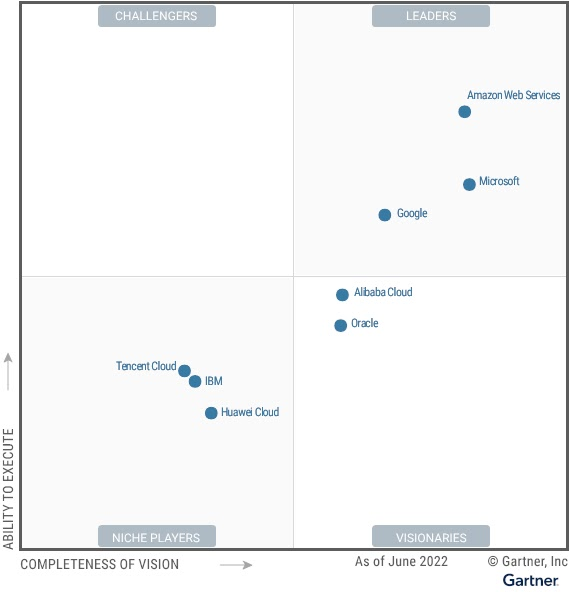
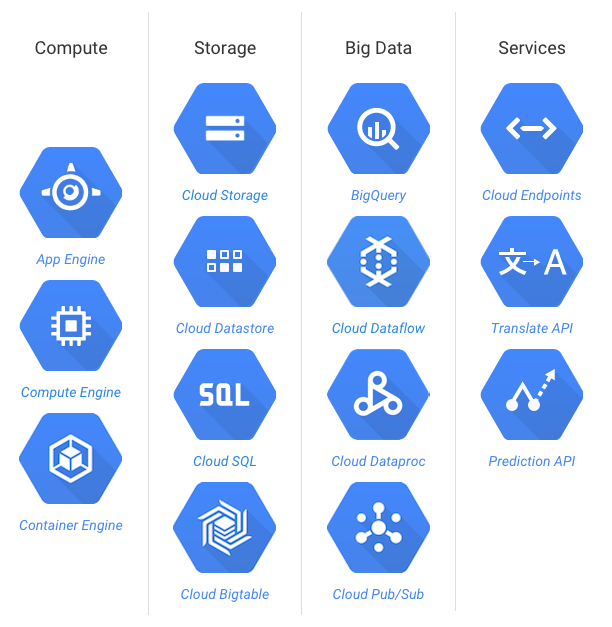

# Google Cloud Intro

<!-- {"left" : 4.37, "top" : 7, "height" : 1.19, "width" : 3.65} -->

---

## Objectives
- Learn about advantages of Cloud Computing 
- Learn about fetures of Google Cloud

---

## Cloud Advantages

[Cloud-Advantages.md](Cloud-Advantages.md)

---

# Google Cloud Features

---

## Google Cloud Features
- No infrastructure management

- Automatic scale

- Pay only for use

- Integrated logging and monitoring

- Ease of use (development, debugging, deploying)

- Basically **Platform as Service**

---

## Google Cloud vs. Others

<!-- {"left" : 5.8, "top" : 1.04, "height" : 4.64, "width" : 4.44} -->  

- Source: [Gartner Magic Quadrant for Cloud Infrastructure as a Service 2019](https://cloud.google.com/gartner-cloud-infrastructure-as-a-service/)

---

## Google Cloud Services Overview

<!-- {"left" : 1.95, "top" : 1.57, "height" : 6.5, "width" : 6.34} -->  

---

## Google Cloud Services Overview

* __Compute:__ Scalable VMs

* __Storage:__ Scalable, 'unlimited' storage

* __Databases:__ Relational databases

* __Networking:__ Build your own networking

* __Big Data:__ Analyze huge amount of data

* __Machine Learning:__ Scalable ML platform

---

## Google Cloud Resource Hierarchy

<!-- {"left" : 1.58, "top" : 1.48, "height" : 3.7, "width" : 7.09} -->  

- Source: https://cloud.google.com/billing/docs/concepts

- Source: https://cloud.google.com/docs/enterprise/best-practices-for-enterprise-organizations

---

## Google Cloud Resource Hierarchy

<!-- {"left" : 5.22, "top" : 1.09, "height" : 2.59, "width" : 4.97} -->  

- Domain

- Organization

- Folders

- Projects

- Resources

- Labels

- Billing

---

## Google Cloud Resources: Domain

<!-- {"left" : 5.25, "top" : 1.04, "height" : 2.56, "width" : 4.92} -->  

- Domain identifies your company

- If the domain is linked to a [GSuite](https://gsuite.google.com/) or [Cloud Identity](https://cloud.google.com/identity/) account

- Domains are managed by [Google Admin Console](https://admin.google.com)

- Reference : https://cloud.google.com/billing/docs/concepts

---

## Google Cloud Resources: Organization & Folders

<!-- {"left" : 5.5, "top" : 1.04, "height" : 2.43, "width" : 4.67} -->  

* A domain can have multiple organizations

* E.g. company.com can have following orgs
    - Marketing
    - Engineering
    - Customer support
    - ..etc

* Also helps to contain billing per organization

* __Folders__ are used to organize projects

* Reference: https://cloud.google.com/billing/docs/concepts
---

## Google Cloud Resources: Projects

<!-- {"left" : 5.5, "top" : 1.04, "height" : 2.43, "width" : 4.67} -->  

* __Projects__ are required to use any resources and services

* All resources (VMs, DBs) belong to ONE project

* Projects also allow access control for users

* Billing can be setup per project basis

* Reference : https://cloud.google.com/billing/docs/concepts

---

# Google Cloud Use Cases

---

## Google Cloud Customers and Use Cases

* https://cloud.google.com/customers/  
* [Target use case video](https://www.youtube.com/watch?v=djQIFqY5cJ4&feature=youtu.be)
- [HSBC use case](https://www.youtube.com/watch?v=W8oTEyogAwo&feature=youtu.be)

 

<!-- {"left" : 0.55, "top" : 4.46, "height" : 0.82, "width" : 3.08} --> &nbsp;  &nbsp;
<!-- {"left" : 4.19, "top" : 3.62, "height" : 2.49, "width" : 1.87} --> &nbsp;  &nbsp;
<!-- {"left" : 6.93, "top" : 4.49, "height" : 0.75, "width" : 2.78} -->  

---

## Lab: Access Google Cloud

<!-- {"left" : 6.76, "top" : 0.88, "height" : 4.37, "width" : 3.28} -->

* **Overview:**
    - Get access to Google Cloud environmnet

* **Approximate run time:**
    - 15 mins

* **Instructions:**
    - Please follow instructions for
    - **Getting started / Setup Google cloud**

Notes:

---
## Lab: Setup a Working Project

<!-- {"left" : 6.76, "top" : 0.88, "height" : 4.37, "width" : 3.28} -->

* **Overview:**
    - Create a working project we will use for this class

* **Approximate run time:**
    - 15 mins

* **Instructions:**
    - Please follow instructions for
    - **Getting started / Project setup**

Notes:

---

## Review and Q&A

<!-- {"left" : 8.24, "top" : 1.21, "height" : 1.28, "width" : 1.73} -->

- Let's go over what we have covered so far

- Any questions?

<!-- {"left" : 2.69, "top" : 4.43, "height" : 3.24, "width" : 4.86} -->
