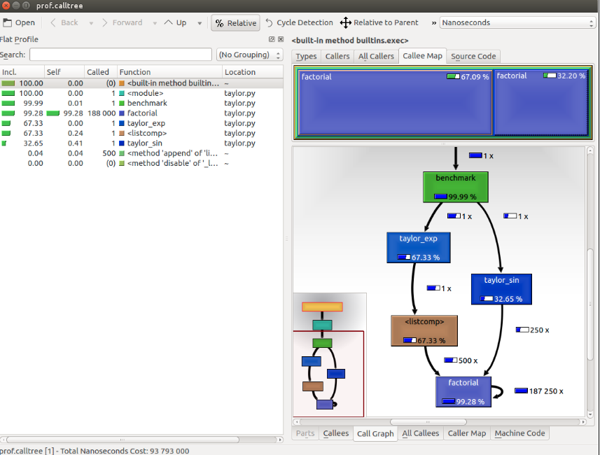

# High-Performance Python

---
## Introduction

* The Python programming language has seen a huge surge in popularity in recent years

* However, the reference Python interpreter, CPython, is generally regarded as inefficient when compared to lower-level languages

* Over the years, many strategies have been developed to overcome CPython's performance shortcomings. 
    * This course aims to fill this gap 
    * Achieve strong performance out of your Python programs


Notes:

Python is easy to learn. 
You’re probably here because now that your code runs correctly, you need it to run faster. You like the fact that your code is easy to modify and you can iterate with ideas quickly. The trade-off between easy to develop and runs as quickly as I need is a well-understood and often-bemoaned phenomenon. There are solutions.    

---
    
## Benchmarking and Profiling

* Recognizing the slow parts of your program 
    * the single most important task for speeding up your code
 
* In most cases, the code that causes the application to slow down
is a very small fraction of the program. 

* Locating those critical sections and focus on the parts that need improvement 
    * without wasting time in micro-optimization.
    
---
## Definitions

* Profiling 
    * the technique that allows us to pinpoint the most resource-intensive spots in an application. 

* Profiler 
    * a program that runs an application and monitors how long each function takes to execute, 
    * detects the functions in which your application spends most of its time.

* Python profiling tools
    * **cProfile** module
    * line_profiler third-party package
    * memory_profiler 
    * KCachegrind to graphically display the data produced by various profilers
    
    
---
## Designing your application
* First, write your code without bothering with small optimizations:

*"Premature optimization is the root of all evil."*
- Donald Knuth


---

## Code-optimizing mantras
* Make it run
    * Produces the correct results
* Make it right
    * Solid design
* Make it fast
    * Now focus on performance optimization
    
---
## Design a simulator


---

## One particle


---

## Particle class
```python
    class Particle: 
        def __init__(self, x, y, ang_vel): 
            self.x = x 
            self.y = y 
            self.ang_vel = ang_vel
```
---

## Make particles rotate

```text
    v_x = -y / (x**2 + y**2)**0.5
    v_y = x / (x**2 + y**2)**0.5

```
---

## Simulator explained

1. Calculate the direction of motion ( v_x and v_y).
1. Calculate the displacement (d_x and d_y), which is the product of time step, angular velocity, and direction of motion.
1. Repeat steps 1 and 2 enough times to cover the time t.

---

## Particle simulator (pseudo code)
```python
    class ParticleSimulator: 
        def __init__(self, particles): 
            self.particles = particles 
        def evolve(self, dt): 
            timestep = 0.00001 
            nsteps = int(dt/timestep) 
     
            for i in range(nsteps):
                for p in self.particles:
                    # 1. calculate the direction 
                    # 2. calculate the displacement 
                    # 3. repeat for all the time steps
```
---
## Visualize the motion plan
1. Set up the axes
    * use the plot function to display the particles
1. Write an initialization function
1. Create a FuncAnimation instance 
1. Run the animation with `plt.show()`

---

## Visualize the motion - pseudo code
```python
def visualize(simulator): 
        X = [p.x for p in simulator.particles] 
        Y = [p.y for p in simulator.particles] 

        fig = plt.figure() 
        ax = plt.subplot(111, aspect='equal') 
        line, = ax.plot(X, Y, 'ro') 

        def init(): 

        def animate(i): 
            simulator.evolve(0.01) 
            X = [p.x for p in simulator.particles] 
            Y = [p.y for p in simulator.particles] 

            line.set_data(X, Y) 
            return line, 

        anim = animation.FuncAnimation(... 
        plt.show()
```
---
## Test visualize
```python
    def test_visualize(): 
        particles = [Particle(0.3, 0.5, 1), 
                     Particle(0.0, -0.5, -1), 
                     Particle(-0.1, -0.4, 3)] 

        simulator = ParticleSimulator(particles) 
        visualize(simulator) 

    if __name__ == '__main__': 
        test_visualize()
```
---

## Lab
* Run the code design lab

`python-high-performance-labs/modeling`


---
    
## Writing tests and benchmarks
* Optimizing a program is hard 
    * commonly requires employing multiple strategies
    * bugs may easily be introduced
     
* We need a solid test suite
    * ensure that the implementation is correct at every iteration
    
---

## Our test

* Take three particles
* Simulate them for 0.1 time units
* compare the results with those from a reference implementation
* To test `evolve` we will write `test_evolve`

---

## Test evolve code 
```python
    def test_evolve(): 
        particles = [Particle( 0.3,  0.5, +1), 
                     Particle( 0.0, -0.5, -1), 
                     Particle(-0.1, -0.4, +3)] 

        simulator = ParticleSimulator(particles) 

        simulator.evolve(0.1) 

        p0, p1, p2 = particles 

        def fequal(a, b, eps=1e-5): 
            return abs(a - b) < eps 

        assert fequal(p0.x, 0.210269) 
        # more tests here

    if __name__ == '__main__': 
        test_evolve()
```    
    
---

## Benchmarking plan
* representative benchmark
    * instantiate a thousand Particle objects
    * with random coordinates and angular velocity
    * feed them to a ParticleSimulator class
     
* let the system evolve for 0.1 time units

## Benchmark code
```python
from random import uniform 

    def benchmark(): 
        particles = [Particle(uniform(-1.0, 1.0), 
                              uniform(-1.0, 1.0), 
                              uniform(-1.0, 1.0)) 
                      for i in range(1000)] 

        simulator = ParticleSimulator(particles) 
        simulator.evolve(0.1) 

    if __name__ == '__main__': 
        benchmark()
```

---
## Lab
* Run the testing lab

`python-high-performance-labs/testing`

---

## Timing your benchmark
```shell script
$ time python <your-program>
```
* You will get something like
```text
real    0m1.051s
user    0m1.022s
sys     0m0.028s
```

---
## 'time' command output
* real: 
    * The actual time spent running the process from start to finish
* user: 
    * The cumulative time spent by all the CPUs during the computation
* sys: 
    * The cumulative time spent by all the CPUs during system-related tasks
    
* Note
    * `user` + `sys` might be greater than `real`
    
---

## timeit
* `timeit` module runs a snippet of code in a loop
* for n times
* measures the total execution times
* repeats the same operation r times 
    * (by default, the value of r is 3) 
* records the time of the best run

---
## IPython
* IPython is a Python shell
* Improves the interactivity of the Python interpreter
* (We will try it in the "timing" lab)
* Can run as Jupyter Notebook

---
## Lab
* Run the timing lab

`python-high-performance-labs/timing`

---
## Finding bottlenecks with cProfile

* The `profile` module
    * written in pure Python 
    * adds a significant overhead to the program execution
* The `cProfile` module
    * the main profiling module
    * interface equivalent to profile
    * written in C, has a small overhead
    * suitable as a general purpose profiler.

---
## cProfile
   
* cProfile module can be used in three different ways:   
    *   From the command line
    *   As a Python module
    *   With IPython

* Basic use

```text
$ python -m cProfile simul.py
```

---

## cPython options

* To sort the output

```text
$ python -m cProfile -s tottime simul.py
```
* -o option

```text
$ python -m cProfile -o prof.out simul.py
```

*  The format that cProfile uses is readable by the stats module and other tools

--- 


## Reading profile info with KCachegrind
* Generate output info

```text
$ python -m cProfile -o prof.out taylor.py
```
* convert the output file with pyprof2calltree and launch KCachegrind
```text
$ pyprof2calltree -i prof.out -o prof.calltree
$ kcachegrind prof.calltree 
```

---
## Output of KCachegrind


---

## Optimizing our code
* For most remarkable results, improve the algorithms used
    * (We will change the way we calculate particle positions)
* Minimizing the number of instructions by changing the order
* Efficient use of Python structures

---

## What is next in optimization?

* Additional ways to address code optimization with include
    * Computational complexity
    * Working with Lists and deques
    * Using Dictionaries
    * Sets
    * Heaps and priority queues
    * Use caching
    * Memory optimization
* What is your favorite Python optimization?    

## Lab
* Run the profiling lab

`python-high-performance-labs/profiling`