# Performance optimization       

# Scaling, horizontal and vertical

## Scaling Plans

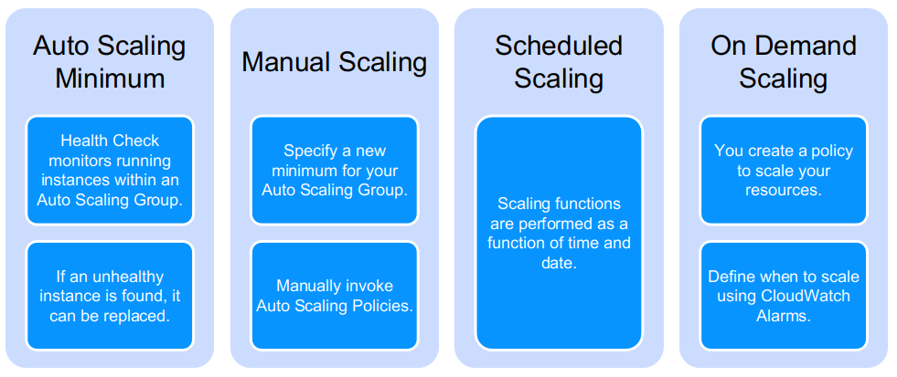

For more, look [here](https://docs.aws.amazon.com/autoscaling/ec2/userguide/scaling_plan.html#scaling_typesof)

---

## RDMA

* RDMA stands for Remote Direct Memory Access
* Zero-copy networking 
    * by enabling the network adapter to transfer data from the wire directly to application memory or 
    * from application memory directly to the wire
* [Wiki on RDMA](https://en.wikipedia.org/wiki/Remote_direct_memory_access)

## RDMA on Azure

* Most of the HPC VM sizes (HBv2, HB, HC, H16r, H16mr, A8 and A9) feature a network interface for remote direct memory access (RDMA) connectivity
* OS
    * Linux and Windows
* Infiniband, drivers
* MPI (Message Passing Interface)
* RDMA network address space
    * The RDMA network in Azure reserves the address space 172.16.0.0/16. To run MPI applications on instances deployed in an Azure virtual network, make sure that the virtual network address space does not overlap the RDMA network.
    
---

## Optimizing performance on BigQuery

* Four Key Elements of Work

    * **I/O** — How many bytes did you read?
    * **Shuffle** — How many bytes did you pass to the next stage?
        * Grouping — How many bytes do you pass to each group?
    * **Materialization** — How many bytes did you write to storage?
    * **CPU work** — User-defined functions (UDFs), functions
    

    
---
## Avoid Input / Output Wastefulness

* Advice for BigQuery, your situation may be different
    * Do not SELECT *, use only the columns you need
    * Filter using WHERE as early as possible in your queries
    * Do not use ORDER BY without a LIMIT
    
   

---

## Data skew

* Data skew in BigQuery
    * But applicable to many areas or data handling, e.g. Spark
    * Filter your dataset as early as possible (this avoids overloading workers on JOINs)
    * BigQuery will automatically attempt to reshuffle workers that are overloaded with data
        * You may have to it yourself in other situations

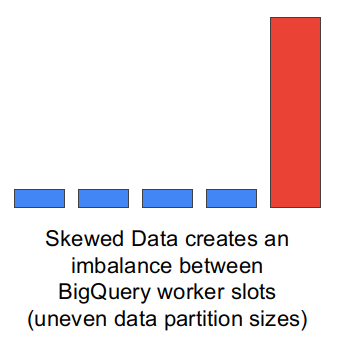

---         

## Careful use of GROUP BY

* Again, BigQuery but applicable in many SQL situations

    * Best when the number of distinct groups is small (fewer shuffles of data). 
    * Grouping by a high-cardinality unique ID is a bad idea.
      
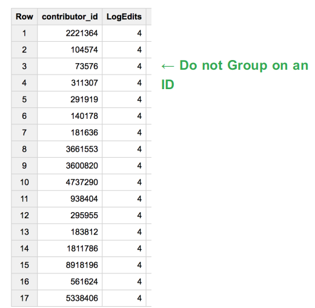

---     

## Debugging, Monitoring, and Performance Tuning

* Stackdriver is a Google tool
* However, it is cross-cloud
    * and a good tool to explain the issues
* October 2020, rebranded as **Google Cloud Operations**
* **Important**: please take the following slides as an approach example even if you do not use the Google cloud

---                   
## What Stackdriver does

* Combines metrics, logs, and metadata
    * On Google Cloud Platform (GCP)
    * On Amazon Web Services
     * on-premises infrastructure
     * or a hybrid cloud
     
* Allows to
    * understand service behaviors and issues
    * from a single comprehensive view of your environment
    * take action if needed
    
---

## Google Stackdriver

* A multicloud service
* An example to discuss the issues

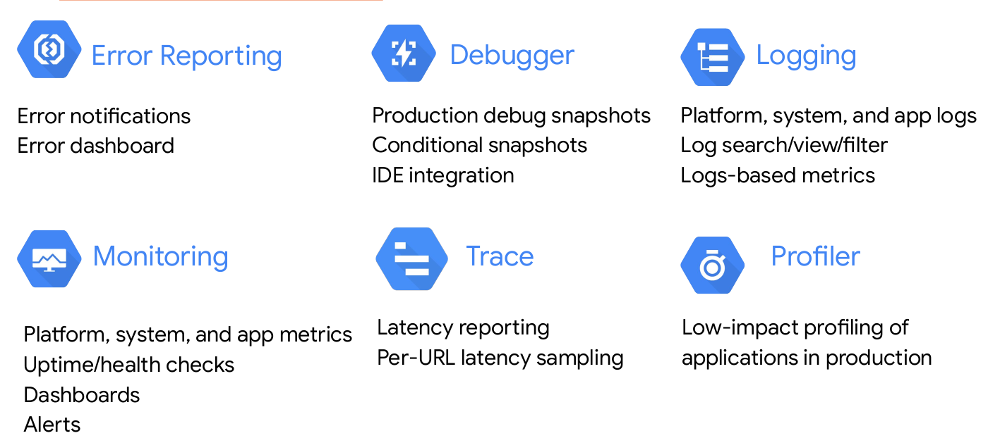

Notes:

* Stackdriver includes features such as Stackdriver Logging, Stackdriver Monitoring,
Stackdriver Trace, Stackdriver Error Reporting, and Stackdriver Debug. These
diagnostic features are well-integrated with each other. This helps you connect and
correlate diagnostics data easily.
* Stackdriver Profiler uses statistical techniques, and low-impact instrumentation that
runs across all production application instances to provide a complete picture of an
application’s performance without slowing it down. Stackdriver Profiler helps you
identify and eliminate potential performance issues.
  
---

## Increase application reliability

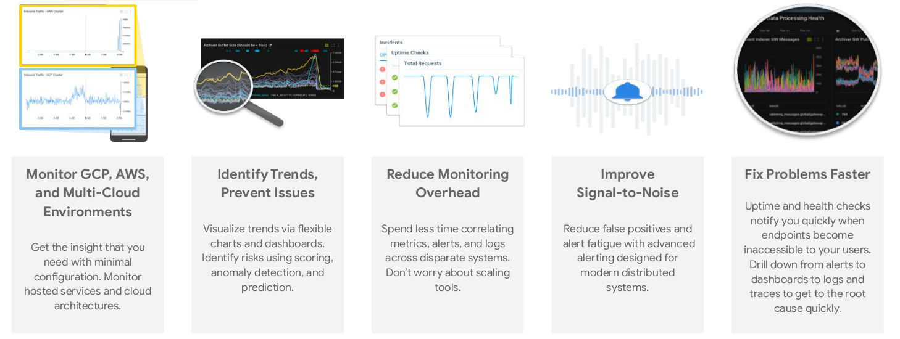

Notes:

* Stackdriver helps increase reliability by giving users the ability to monitor GCP and
multi-cloud environments to identify trends and prevent issues. With Stackdriver, you
can reduce monitoring overhead and noise to fix problems faster.

---
    

## Performance Management Tools

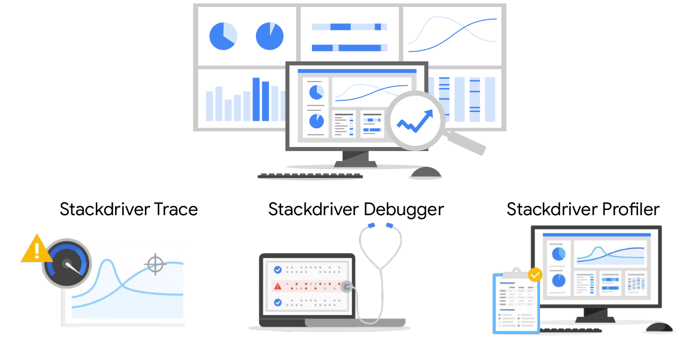

Notes:

* The three products that make up Stackdriver APM are: Stackdriver Trace, Stackdriver
Profiler, and Stackdriver Debugger. Stackdriver APM includes advanced tools to help
developers reduce latency and cost for every application.
* As a developer, how do you make your applications faster and more reliable? By
understanding in detail how they behave in production. Stackdriver APM uses some
of the same tools Google’s own Site Reliability Engineering (SRE) teams use, to give
you insights into how your code runs. This lets you take action to optimize code, and
fix problems, whatever cloud you’re using.
* All of the Stackdriver APM tools work with code and applications running on any cloud
or even on-premises infrastructure. No matter where you run your application, you
now have a consistent, reasonably priced APM toolkit to monitor and manage
application performance. We charge for Stackdriver APM tools based only on the
amount of data collected, and offer generous free tiers making them accessible for
any project.

---

## Stackdriver Trace

* Distributed tracing

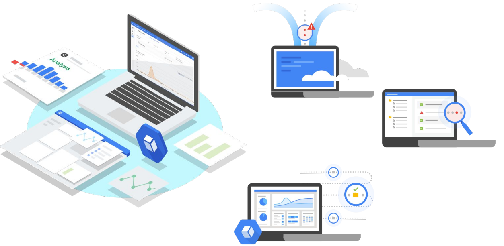

Notes:

* Based on the tools Google uses on our own production services, Stackdriver Trace
shows you how requests propagate through your application. You can inspect detailed
latency information for a single request or view aggregate latency for your entire
application. Using the various tools and filters provided, you can quickly find where
bottlenecks are occurring and more quickly identify their root cause.
* Stackdriver Trace is a distributed tracing system that collects latency data from your
applications and displays it in the Google Cloud Platform Console. You can track how
requests propagate through your application and receive detailed near real-time
performance insights. Stackdriver Trace automatically analyzes all of your
application's traces to generate in-depth latency reports to surface performance
degradations, and can capture traces from all of your VMs, containers, or App Engine
projects.
* Using Stackdriver Trace, you can inspect detailed latency information for a single
request or view aggregate latency for your entire application. Using the various tools
and filters provided, you can quickly find where bottlenecks are occurring and more
quickly identify their root cause. Stackdriver Trace is based off of the tools used at
Google to keep our services running at extreme scale.

* Stackdriver Trace's language-specific SDKs can analyze projects running on VMs
(even those not managed by Google Cloud Platform). The Trace SDK is currently
available for Java, Node.js, Ruby, and Go, and the Trace API can be used to submit
and retrieve trace data from any source. A Zipkin collector is also available, which
allows Zipkin tracers to submit data to Stackdriver Trace. Projects running on App
Engine are automatically captured.
Because Stackdriver Trace collects latency data from App Engine, HTTP(S) load
balancers, and applications instrumented with the Stackdriver Trace API, it can help
you answer the following questions:
How long does it take my application to handle a given request?
Why is it taking my application so long to handle a request?
Why do some of my requests take longer than others?
What is the overall latency of requests to my application?
Has latency for my application increased or decreased over time?
What can I do to reduce application latency?
What are my application's dependencies?
---

## Stackdriver Profiler

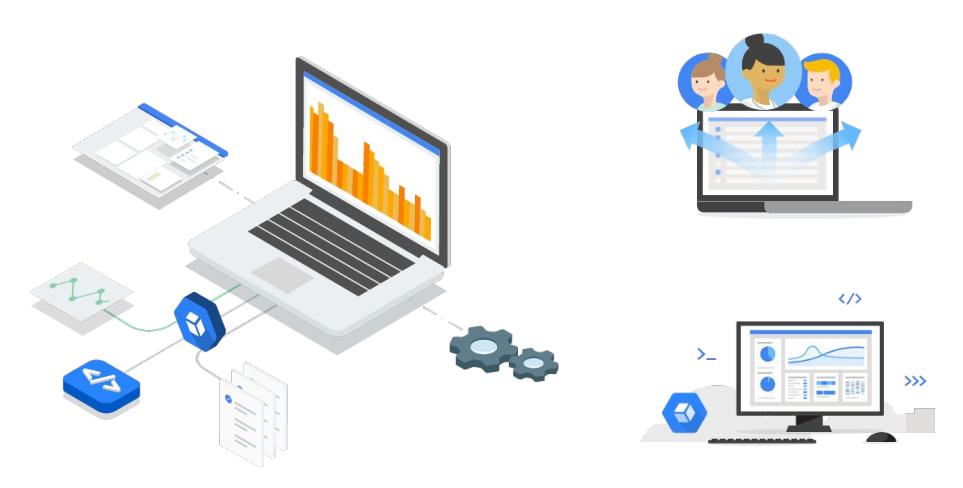

Notes:

* Stackdriver Profiler monitors CPU and heap to help you identify latency and
inefficiency using interactive graphical tools, so you can improve application
bottlenecks and reduce resource consumption. Google uses the same technology
every day to identify inefficiently written code on services like Search and Gmail.
* Poorly performing code increases the latency and cost of applications and web
services every day, without anyone knowing or doing anything about it. Stackdriver
* Profiler changes this by continuously analyzing the performance of CPU or
memory-intensive functions executed across an application. Stackdriver Profiler
presents the call hierarchy and resource consumption of the relevant function in an
interactive flame graph that helps developers understand which paths consume the
most resources and the different ways in which their code is actually called.
While it’s possible to measure code performance in development environments, the
results generally don’t map well to what’s happening in production. Many production
profiling techniques either slow down code execution or can only inspect a small
subset of a codebase. Stackdriver Profiler uses statistical techniques and extremely
low-impact instrumentation that runs across all production application instances to
provide a complete picture of an application’s performance without slowing it down.
Stackdriver Profiler allows developers to analyze applications running anywhere,
including GCP, other cloud platforms, or on-premises, with support for Java, Go,
Node.js, and Python. 

---

## Four golden signals

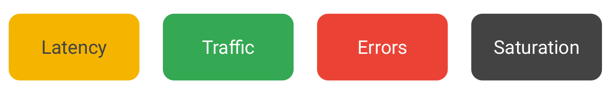

Notes:

* After you identify the resources to monitor, and define service
level indicators and objectives, you can create dashboards to view
metrics for your application. Create dashboards that include the four
golden signals: Latency, Traffic, Errors, and Saturation.
* Latency. This is the amount of time it takes to serve a request. Make sure to
distinguish between the latency for successful
and unsuccessful requests. For example, an HTTP error that occurs due
to a loss of connection to a database or another back end service,
might be solved really quickly. However, because an HTTP 500 error
indicates a failed request, including 500 errors in your overall
latency, might result in misleading metrics.
* Traffic is a measure of how much demand is placed on your system. It's measured as
a system
specific metric. For example, web server traffic is measured as the
number of HTTP or HTTPS request per second. Traffic to a NoSQL
database is measured as the number of read or write operations per
second.
* Errors indicate the number of failed requests. Criteria for
failure might be anything like an explicit error, such as a HTTP 500
error, or a successful HTTP 200 response but with incorrect content.
It might also be a policy error. For example your application promises aresponse time of one second, but some requests take over a second.
* Saturation indicates how full your application is, or what resources
are being stretched and reaching target capacity. Systems can degrade
in performance before they achieve 100% utilization. So
make sure to set utilization targets carefully.

---
## Presentation on E-CAS
* [E-CAS public](https://drive.google.com/drive/folders/1MDS2WfVlTvQ6HPV9xYwZqxxkq7l1rt10)

---

## AWS CloudWatch

* A monitoring service for AWS cloud resources and the applications you run on AWS
* Visibility into resource utilization, operational performance, and overall demand patterns
* Custom application-specific metrics of your own
* Accessible via AWS Management Console, APIs, SDK, or CLI

Notes:

* CloudWatch lets you view graphs, set alarms to troubleshoot, spot trends, and take automated action based on the state. It is accessible via the AWS Management Console, APIs, SDK or CLI. You can customize with your own metrics or use a sample template found online. 
  
--- 

## Amazon CloudWatch Facts

* Monitor other AWS resources 
    * View graphics and statistics 
* Set Alarms

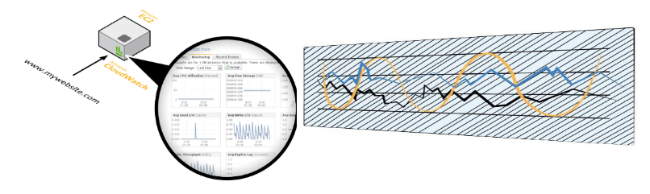

Notes:

* For Amazon EC2 instances, Amazon CloudWatch basic monitoring collects and reports metrics for CPU utilization, data transfer, and disk usage activity from each Amazon EC2 instance at a five-minute frequency. Amazon CloudWatch detailed monitoring provides these same metrics at one-minute intervals, and also enables data aggregation by Amazon EC2 AMI ID and instance type. 
* Set alarms on any of your metrics to receive notifications. You can also use Auto Scaling to add or remove Amazon instances. 
* For more information, see:
* http://docs.aws.amazon.com/AmazonCloudWatch/latest/DeveloperGuide/AlarmThatSendsEmail.html 
* https://aws.amazon.com/cloudwatch/details/#other-aws-resource-monitoring 
* https://aws.amazon.com/blogs/aws/new-cloudwatch-events-track-and-respond-to-changes-to-your-aws-resources/ 

---

## Amazon CloudWatch Architecture

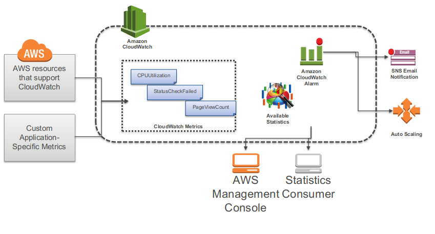

Notes:

* Amazon CloudWatch is a metrics repository. AWS products put metrics into the repository and you retrieve statistics based on the metrics. Statistics can be graphically presented in the CloudWatch console.
  
---

## CloudWatch Metrics Examples

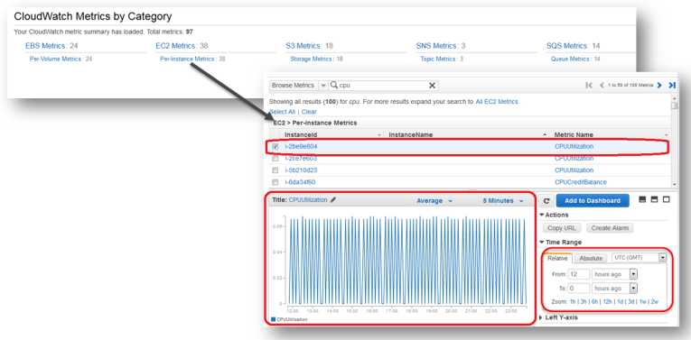
  
---

## CloudWatch Alarms

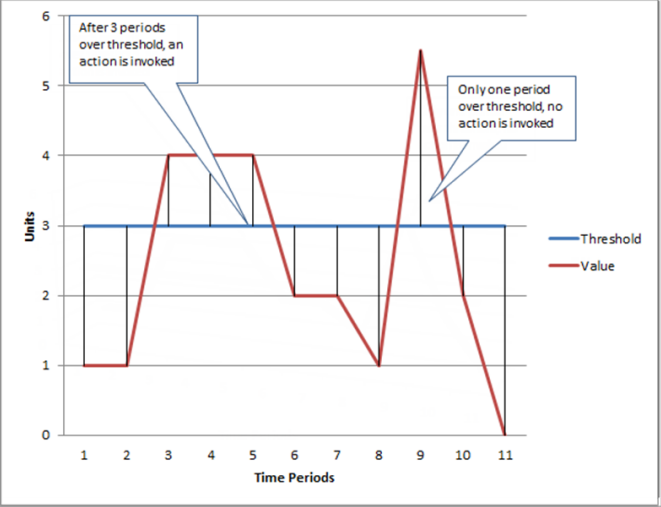
  
Notes:

* You can create a CloudWatch alarm that sends an Amazon Simple Notification Service (SNS) message when the alarm changes state. An alarm watches a single metric over a time period you specify, and performs one or more actions based on the value of the metric relative to a given threshold over a number of time periods. The action is a notification sent to an Amazon SNS topic or Auto Scaling policy. Alarms invoke actions for sustained state changes only. CloudWatch alarms will not invoke actions simply because they are in a particular state, the state must have changed and been maintained for a specified number of periods. 
* In the slide, the alarm threshold is set to 3 and the minimum breach is 3 periods. The alarm invokes its action only when the threshold is breached for 3 consecutive periods. In the figure, this happens with the third through fifth time periods, and the alarm is triggered. At period six, the value dips below the threshold, and the state is set to OK. Later, during the ninth time period, the threshold is breached again, but not for the necessary three consecutive periods. Consequently, the alarm's state remains OK.
  
---

## Supported AWS Services

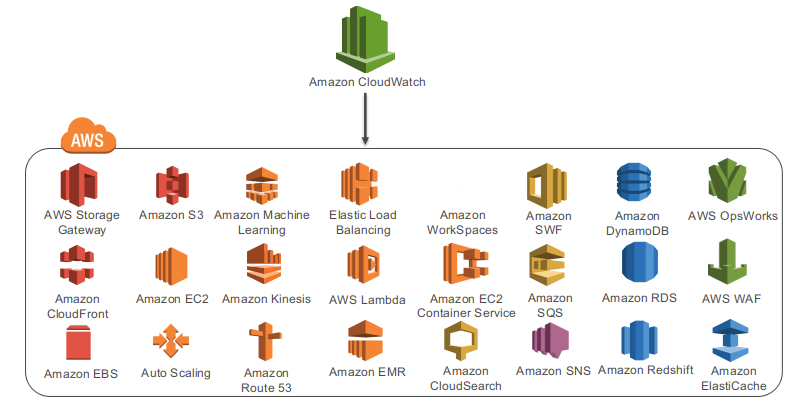

[Full info](http://docs.aws.amazon.com/AmazonCloudWatch/latest/DeveloperGuide/supported_services.html )

---

## Azure Monitor

* Azure Monitor 
    * A platform for collecting, analyzing, visualizing, 
    * Taking action based on the metric and logging data from your entire Azure and on-premises environment

* Part of a suite
    * Azure Advisor
    * Azure Monitor
    * Azure Service Health
   
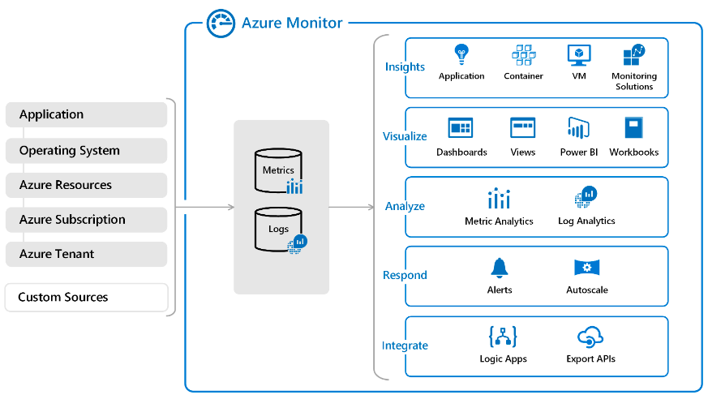

---

## Quiz

* You want to be alerted when new recommendations to improve your cloud environment are available. Which service will do this?

    * A. Azure Advisor

    * B. Azure Monitor

    * C. Azure Service Health
    
Notes:

* A. 
* Azure Advisor can alert you when new recommendations are available.

---

## Quiz    

* Which service provides official outage root cause analyses (RCAs) for Azure incidents?
    * A. Azure Advisor

    * B. Azure Monitor

    * C. Azure Service Health
    
Notes:

* C.     
* Azure Service Health provides incident history and RCAs to share with your stakeholders.

## Quiz

* Which service is a platform that powers Application Insights, monitoring for VMs, containers, and Kubernetes?

    * A. Azure Advisor

    * B. Azure Monitor

    * C. Azure Service Health
    
Notes:

* B.
* Azure Monitor is the platform used by Application Insights.

---        
## Background slides

---

## SRE

* SRE stands for Site Reliability Engineering
* SRE is an area that was recently developed at Google
* It studies stability and scalability
* Its tenets are
    * A significant portion of a software system’s lifespan is spent in use, not in design or implementation. 
    * This calls in question the conventional wisdom that insists that software engineers focus primarily on the design and development of large-scale computing systems?
    * SRE teaches how and why the DevOps commitment to the entire lifecycle can enable the company to successfully build, deploy, monitor, and maintain some of the largest software systems in the world.     

---

## SRE books

* Free on Google site [here](https://sre.google/books/)

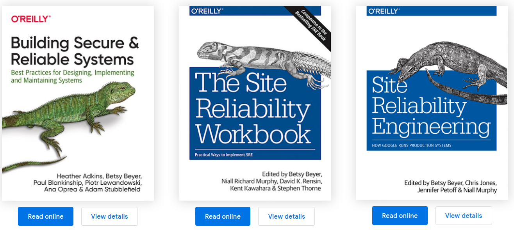

---

## SRE 1

* Introduction
    - The Sysadmin Approach to Service Management
    - Google’s Approach to Service Management: Site Reliability Engineering
    - Tenets of SRE
    - Demand Forecasting and Capacity Planning
    - Efficiency and Performance
   
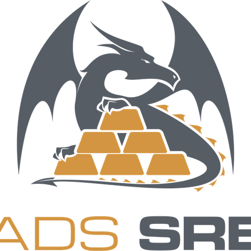
     
---

## SRE 2

* Principles
    - Embracing Risk
    - Managing Risk
    - Motivation for Error Budgets
    - Benefits
* Service Level Objectives
    - Service Level Terminology
    - Indicators in Practice
    - What Do You and Your Users Care About?
    - Agreements in Practice
    
    
---

## SRE 3

* Eliminating Toil
    - Toil Defined
    - Why Less Toil Is Better
* Monitoring Distributed Systems     
    - Why Monitor?
    - Setting Reasonable Expectations for Monitoring
    - Symptoms Versus Causes
    - Black-Box Versus White-Box
    - As Simple as Possible, No Simpler
    - Bigtable SRE: A Tale of Over-Alerting
    - Gmail: Predictable, Scriptable Responses from Humans

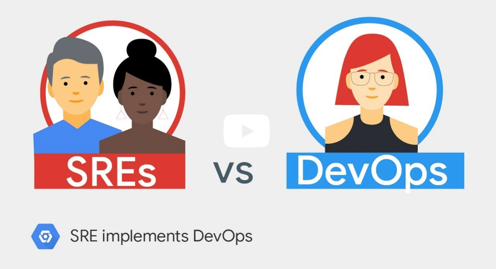    

---     

## Congrats on completion

---