# Data Analytics
---

# Spark overview

---

## Spark overview
* TODO insert Spark intro slides

# Spark on AWS

---

## Apache Spark on Amazon EMR

* "Amazon EMR is the best place to run Apache Spark." 
* You can quickly and easily create managed Spark clusters from the 
  * AWS Management Console
  *  AWS CLI, or the 
  *  Amazon EMR API
  * **Let's do a demo!**
  
---

Notes:

Amazon EMR is the best place to run Apache Spark. You can quickly and easily create managed Spark clusters from the AWS Management Console, AWS CLI, or the Amazon EMR API. Additionally, you can leverage additional Amazon EMR features, including fast Amazon S3 connectivity using the Amazon EMR File System (EMRFS), integration with the Amazon EC2 Spot market and the AWS Glue Data Catalog, and EMR Managed Scaling to add or remove instances from your cluster. AWS Lake Formation brings fine-grained access control, while integration with AWS Step Functions helps with orchestrating your data pipelines. EMR Studio (preview) is an integrated development environment (IDE) that makes it easy for data scientists and data engineers to develop, visualize, and debug data engineering and data science applications written in R, Python, Scala, and PySpark. EMR Studio provides fully managed Jupyter Notebooks, and tools like Spark UI and YARN Timeline Service to simplify debugging. EMR Notebooks make it easy for you to experiment and build applications with Spark. If you prefer, you can use Apache Zeppelin to create interactive and collaborative notebooks for data exploration using Spark.

---

## Features and benefits

* Fast performance
* Apache Spark natively supports Java, Scala, SQL, and Python
* Create diverse workflows

Notes:

* Fast performance
* EMR features Amazon EMR runtime for Apache Spark, a performance-optimized runtime environment for Apache Spark that is active by default on Amazon EMR clusters. Amazon EMR runtime for Apache Spark can be over 3x faster than clusters without the EMR runtime, and has 100% API compatibility with standard Apache Spark. This improved performance means your workloads run faster and saves you compute costs, without making any changes to your applications.
* By using a directed acyclic graph (DAG) execution engine, Spark can create efficient query plans for data transformations. Spark also stores input, output, and intermediate data in-memory as resilient dataframes, which allows for fast processing without I/O cost, boosting performance of iterative or interactive workloads.
* Develop applications quickly and collaboratively
* Apache Spark natively supports Java, Scala, SQL, and Python, which gives you a variety of languages for building your applications. Also, you can submit SQL or HiveQL queries using the Spark SQL module. In addition to running applications, you can use the Spark API interactively with Python or Scala directly in the Spark shell or via EMR Studio, or Jupyter notebooks on your cluster. Support for Apache Hadoop 3.0 in EMR 6.0 brings Docker container support to simplify managing dependencies. You can also leverage cluster-independent EMR Notebooks (based on Jupyter) or use Zeppelin to create interactive and collaborative notebooks for data exploration and visualization. You can tune and debug your workloads in the EMR console which has an off-cluster, persistent Spark History Server.
* Create diverse workflows
* Apache Spark includes several libraries to help build applications for machine learning (MLlib), stream processing (Spark Streaming), and graph processing (GraphX). These libraries are tightly integrated in the Spark ecosystem, and they can be leveraged out of the box to address a variety of use cases. Additionally, you can use deep learning frameworks like Apache MXNet with your Spark applications. Integration with AWS Step Functions enables you to add serverless workflow automation and orchestration to your applications.

---

## Integration with Amazon EMR feature set

* Submit Apache Spark jobs with the EMR Step API,
* use Spark with EMRFS to directly access data in S3, 
* save costs using EC2 Spot capacity,
* use EMR Managed Scaling to dynamically add and remove capacity

Notes:

Submit Apache Spark jobs with the EMR Step API, use Spark with EMRFS to directly access data in S3, save costs using EC2 Spot capacity, use EMR Managed Scaling to dynamically add and remove capacity, and launch long-running or transient clusters to match your workload. You can also easily configure Spark encryption and authentication with Kerberos using an EMR security configuration. Additionally, you can use the AWS Glue Data Catalog to store Spark SQL table metadata or use Amazon SageMaker with your Spark machine learning pipelines. EMR installs and manages Spark on Hadoop YARN, and you can also add other big data applications on your cluster. EMR with Apache Hudi lets you more efficiently manage change data capture (CDC) and helps with privacy regulations like GDPR and CCPA by simplifying record deletion. Click here for more details about EMR features.

---

## Spark on Amazon EMR

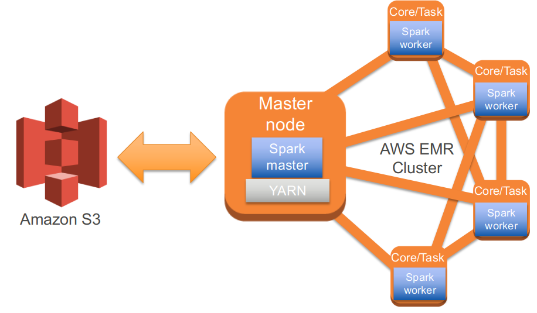

Notes:

* When you deploy Spark on Amazon EMR, the Spark processing engine is deployed to each node in the cluster. You interact with the Scala interpreter and/or a shell by connecting to the master node over SSH. In this scenario, the Spark framework replaces the MapReduce framework. Spark and Spark SQL may still interact with HDFS, if needed, but ideally, the nodes pull their input data directly from Amazon S3.

---
## Benefits of Spark and Spark SQL on Amazon EMR

* Ease of use
  * Spark can be installed at launch with Amazon EMR AMI v3.8+, and Amazon EMR Release 4.0+
  * Deploy small and large Spark clusters in minutes
* Amazon EMR container management
  * Node recovery in case of failures
  * Automatic log collection in Amazon S3 for analysis, debugging

Notes:

* Ease of use
* Launching a Spark cluster can be done easily in minutes using the console or the command-line tools. As of EMR AMI v3.8.0, Spark is now officially supported on Amazon EMR and can be installed at the same time that your EMR cluster is being launched.
* Container managed service
* As a container managed service, Amazon EMR recovers failed nodes for you. To support debugging and problem determination, cluster logs are aggregated and written to Amazon S3 for you based on the bucket name you provide when the cluster is created.

---    

## Spark on Amazon EMR compared on on-prem

* Low cost
  * Run clusters inexpensively
  * Increase memory, CPU capacity cheaply by adding task nodes using spot instances
  * Run Spark on Amazon EMR at no additional charge
* AWS service integration
  * Create RDDs and DataFrames directly from and save them directly to Amazon S3
  * Use CloudWatch, Ganglia to monitor cluster
* Amazon EMRFS integration
  * Directly access data in and push logs to Amazon S3

Notes:

* Low cost
* After launching an initial Spark/Spark SQL cluster with core nodes, you can add additional processing capacity to the cluster using task instances. By bidding on instances in the spot market, you can greatly reduce the cost of adding additional nodes. When your processing is complete, you can terminate the added task instances and stop paying for them.
* Service integration
* Amazon EMR integration with Amazon S3 allows you to create RDDs and DataFrames from Amazon S3 with sc.textFile OR sc.sequenceFile.

---

## Spark metrics and CloudWatch

* Monitor Spark metrics with CloudWatch
* Setup CloudWatch alarms and get notified if CPU, memory metrics reached your threshold
  * Receive notification via email, SNS, HTTP API call
* Examples:
  * Monitor memory usage with JvmHeapUsed metric
  * Monitor load using Amazon EMR TotalLoad metric
* Take manual or automated actions
  * Manually add task nodes to increase capacity

---

## Quiz

* When you deploy a cluster with Spark and Spark SQL, the Spark framework replaces the MapReduce framework.

  * A. True
  * B. False

Notes:

* A.

---

## Quiz

* Name two benefits of running Spark and Spark SQL on Amazon EMR.

Notes:

* Ease of use
* Container management
* Integration with other AWS services
* Low cost

---

# Azure Databricks

---

## Azure Databricks

* Fully-managed,
* cloud-based Big Data and Machine Learning platform

* Databricks, an end-to-end, managed Apache Spark platform 
* optimized for the cloud

Notes:

* Azure Databricks is a fully-managed, cloud-based Big Data and Machine Learning platform, which empowers developers to accelerate AI and innovation by simplifying the process of building enterprise-grade production data applications. Built as a joint effort by the team that started Apache Spark and Microsoft, Azure Databricks provides data science and engineering teams with a single platform for Big Data processing and Machine Learning.

* By combining the power of Databricks, an end-to-end, managed Apache Spark platform optimized for the cloud, with the enterprise scale and security of Microsoft's Azure platform, Azure Databricks makes it simple to run large-scale Spark workloads.

---

## Optimized environment

* High-speed connectors to Azure storage services, such as Azure Blob Store and Azure Data Lake
*  Auto-scaling and auto-termination of Spark clusters to minimize costs
*  Caching
*  Indexing
*  Advanced query optimization

Notes:

To address the problems seen on other Big Data platforms, Azure Databricks was optimized from the ground up, with a focus on performance and cost-efficiency in the cloud. The Databricks Runtime adds several key capabilities to Apache Spark workloads that can increase performance and reduce costs by as much as 10-100x when running on Azure, including:

* High-speed connectors to Azure storage services, such as Azure Blob Store and Azure Data Lake
* Auto-scaling and auto-termination of Spark clusters to minimize costs
* Caching
* Indexing
* Advanced query optimization
* By providing an optimized, easy to provision and configure environment, Azure Databricks gives developers a performant, cost-effective platform that enables them to spend more time building applications, and less time focused on managing clusters and infrastructure.

---

## Who is Databricks with MS?

* Databricks was founded by the creators of Apache Spark, Delta Lake, and MLflow.

* Over 2000 global companies use the Databricks platform across big data & machine learning lifecycle.

* Databricks Vision: Accelerate innovation by unifying data science, data engineering and business.

* Databricks Solution: Big Data Analytics Platform

---

## Databricks parts not Open-Source?

* Databricks Workspace - Interactive Data Science & Collaboration
* Databricks Workflows - Production Jobs & Workflow Automation
* Databricks Runtime
* Databricks I/O (DBIO) - Optimized Data Access Layer
* Databricks Serverless - Fully Managed Auto-Tuning Platform
* Databricks Enterprise Security (DBES) - End-To-End Security & Compliance

---

## Azure Databricks

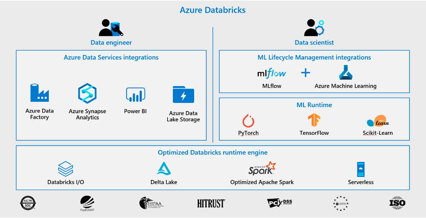

Notes:

Scala, Python, Java, R & SQL
Besides being able to run in many environments, Apache Spark makes the platform even more approachable by supporting multiple languages:
Scala - Apache Spark's primary language
Python - More commonly referred to as PySpark
R - SparkR (R on Spark)
Java
SQL - Closer to ANSI SQL 2003 compliance
Now running all 99 TPC-DS queries
New standards-compliant parser (with good error messages!)
Subqueries (correlated & uncorrelated)
Approximate aggregate stats
With the DataFrames API, the performance differences between languages are nearly nonexistent (especially for Scala, Java & Python).

---

## Spark on Azure

* Azure Databricks
  * Fully-managed version of the open-source Apache Spark analytics and data processing engine. Azure Databricks is an enterprise-grade and secure cloud-based big data and machine learning platform.
  * Databricks provides a notebook-oriented Apache Spark as-a-service workspace environment, making it easy to manage clusters and explore data interactively

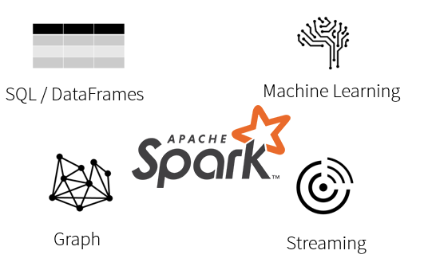
---

## Azure Spark optimizations

* High-speed connectors to Azure storage services, such as Azure Blob Store and Azure Data Lake
* Auto-scaling and auto-termination of Spark clusters to minimize costs
* Caching
* Indexing
* Advanced query optimization

---

## Databricks runtime (not open source)

* Databricks Workspace - Interactive Data Science & Collaboration
* Databricks Workflows - Production Jobs & Workflow Automation
* Databricks Runtime
* Databricks I/O (DBIO) - Optimized Data Access Layer
* Databricks Serverless - Fully Managed Auto-Tuning Platform
* Databricks Enterprise Security (DBES) - End-To-End Security & Compliance

---

## Quiz

* How many drivers does a Cluster have?

  * A. A Cluster has one and only one driver.

  * B. Two, running in parallel

  * C. Configurable between one and eight

Notes:

* A.
* A Cluster has one and only one driver.

---

## Quiz

* Spark is a distributed computing environment. Therefore, work is parallelized across executors. At which two levels does this parallelization occur?

  * A. The executor and the slot

  * B. The Driver and the Executor

  * C. The slot and the task

Notes:

* A.
* The first level of parallelization is the executor - a Java virtual machine running on a node, typically, one instance per node. Each executor has a number of slots to which parallelized tasks can be assigned to it by the driver.

---

## Quiz

* What type of process are the driver and the executors?

  * A. Java processes

  * B. Python processes

  * C. C++ processes

Notes:

* A.
* The driver and the executors are Java processes.

# Spark on Google

## GCP Dataproc eases Hadoop management

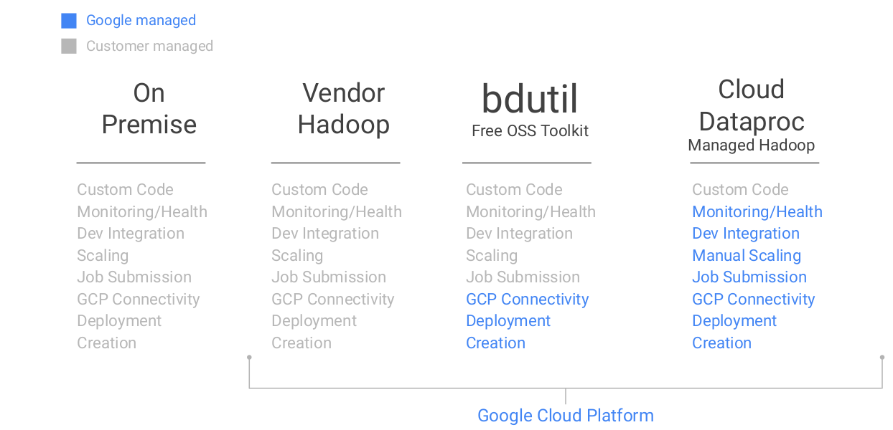

---

## Typical Dataproc deployments involve...

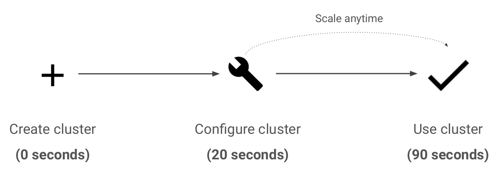

---

## Dataproc runs open source tools 

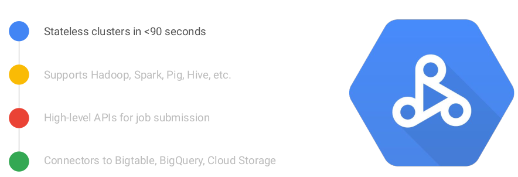

---

## Create a cluster from the console 

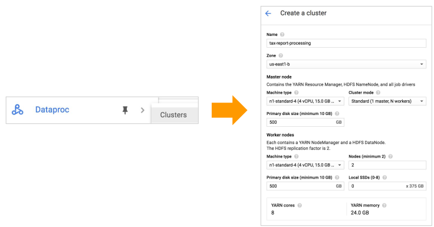

---

## Give the cluster a unique name 

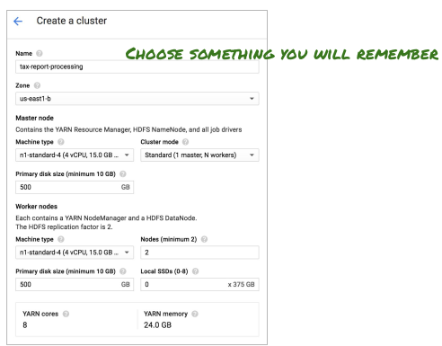

---

## One cluster per job

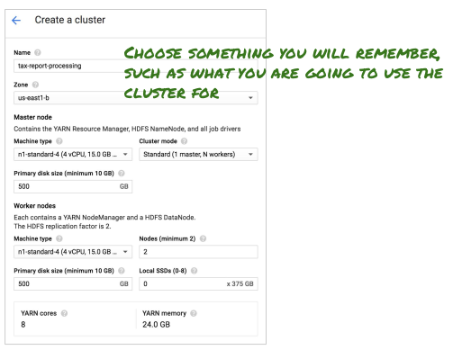

---

## The zone is very, very important

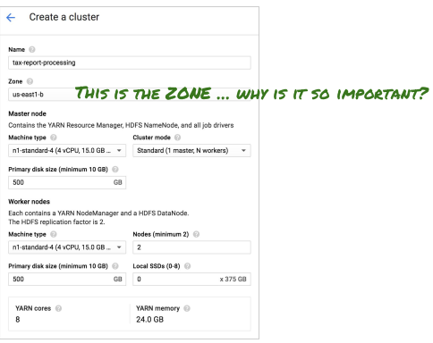

---

## The zone is where the compute nodes will live

---

## Match your data location with your compute location (same region)

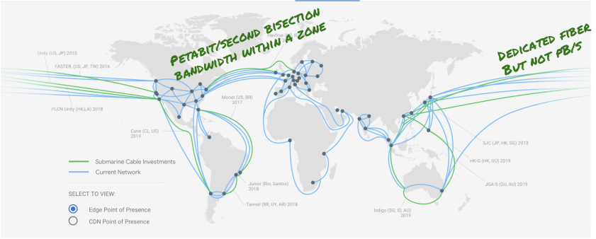

---

## Three cluster configurations possible

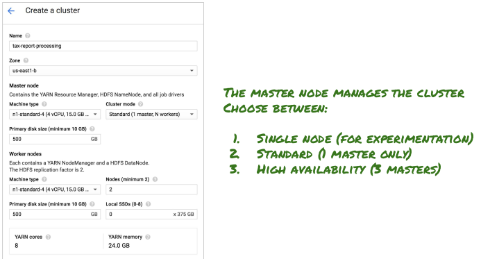

---

## HDFS file system is available, but don’t use it

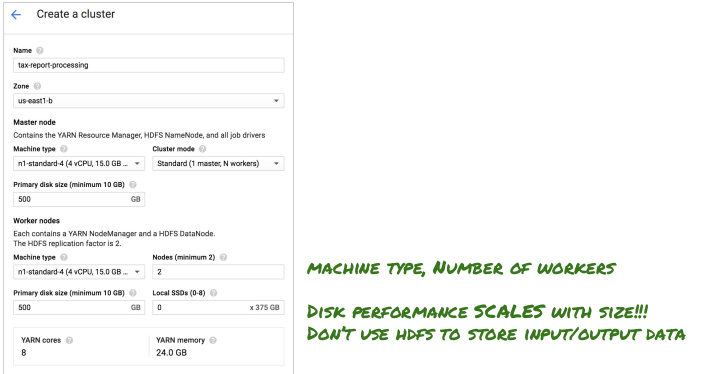

---

## You can customize the Dataproc cluster

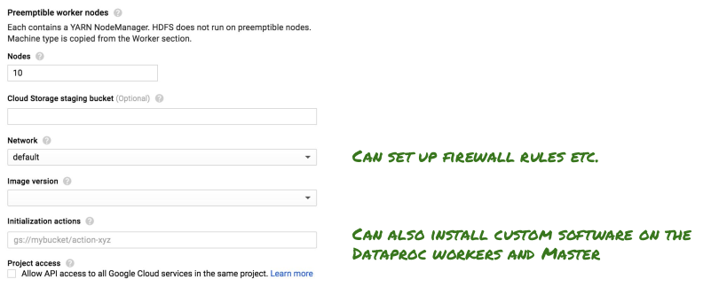

---

## Most things you can do from the web console...

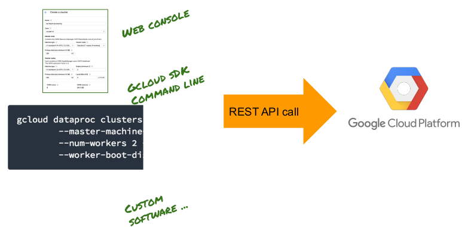

---

## Creating a cluster using gcloud SDK

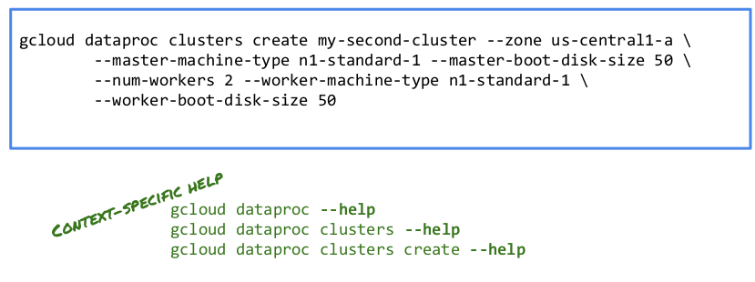

---

## Congrats on completion

---