# Cloud native workflows 

---

## Cloud native workflows

* Batch workflows
  * AWS batch
  * Azure batch
* Data processing pipelines    
  * GCP processing pipelines
  * GCP data lifecycle

---

# AWS batch

---

## AWS Batch

* Fully managed batch processing at any scale
* enables developers, scientists, and engineers to easily and efficiently run hundreds of thousands of batch computing jobs on AWS
* There is no additional charge for AWS Batch

Notes:

AWS Batch enables developers, scientists, and engineers to easily and efficiently run hundreds of thousands of batch computing jobs on AWS. AWS Batch dynamically provisions the optimal quantity and type of compute resources (e.g., CPU or memory optimized instances) based on the volume and specific resource requirements of the batch jobs submitted. With AWS Batch, there is no need to install and manage batch computing software or server clusters that you use to run your jobs, allowing you to focus on analyzing results and solving problems. AWS Batch plans, schedules, and executes your batch computing workloads across the full range of AWS compute services and features, such as AWS Fargate, Amazon EC2 and Spot Instances.

There is no additional charge for AWS Batch. You only pay for the AWS resources (e.g. EC2 instances or Fargate jobs) you create to store and run your batch jobs.

---

## Benefits

* Fully managed
* Integrated with AWS
* Cost optimized resource provisioning

Notes:

AWS Batch eliminates the need to operate third-party commercial or open source batch processing solutions. There is no batch software or servers to install or manage. AWS Batch manages all the infrastructure for you, avoiding the complexities of provisioning, managing, monitoring, and scaling your batch computing jobs.
Integrated with AWS
AWS Batch is natively integrated with the AWS platform, allowing you to leverage the scaling, networking, and access management capabilities of AWS. This makes it easy to run jobs that safely and securely retrieve and write data to and from AWS data stores such as Amazon S3 or Amazon DynamoDB. You can also run AWS Batch on AWS Fargate, for fully serverless architecture, eliminating the need to manage compute infrastructure.
Cost optimized resource provisioning
AWS Batch provisions compute resources and optimizes the job distribution based on the volume and resource requirements of the submitted batch jobs. AWS Batch dynamically scales compute resources to any quantity required to run your batch jobs, freeing you from the constraints of fixed-capacity clusters. AWS Batch will utilize Spot Instances or submit to Fargate Spot on your behalf, reducing the cost of running your batch jobs further.

---


## Life sciences: Drug screening for biopharma

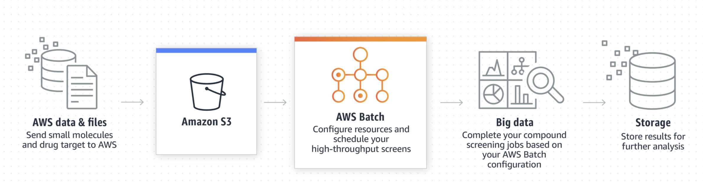

---

# Azure batch

---

## Azure Batch

* Cloud-scale job scheduling and compute management
  *  Scale to tens, hundreds, or thousands of virtual machines
  *  Cloud-enable batch and HPC applications
  *  Stage data and execute compute pipelines
  *  Choose Linux or Windows to run jobs
  *  Autoscale on work in the queue
  *  Pay for what you use with no capital investment

---

## Benefits

* Get batch computing power when you need it
* Choose your operating system and tools
* Cloud-enable your cluster applications
* Imagine running at 100x scale

Notes:

Get batch computing power when you need it
Batch processing began with mainframe computers and punch cards. Today, it still plays a central role in business, engineering, science, and other areas that require running lots of automated tasks—processing bills and payroll, calculating portfolio risk, designing new products, rendering animated films, testing software, searching for energy, predicting the weather, and finding new cures for disease. Previously, few people had access to the computing power for these scenarios. With Azure Batch, that power is available to you when you need it, without any capital investment.

Choose your operating system and tools
Choose the operating system and development tools you need to run your large-scale jobs on Batch. Batch gives you a consistent management experience and job scheduling, whether you select Windows Server or Linux compute nodes, but it lets you take advantage of the unique features of each environment. With Windows, use your existing Windows code, including Microsoft .NET, to run large-scale compute jobs in Azure. With Linux, choose from popular distributions including CentOS, Ubuntu, and SUSE Linux Enterprise Server to run your compute jobs, or use Docker containers to lift and shift your applications. Batch gives you SDKs and supports a range of development tools including Python and Java.

Cloud-enable your cluster applications
Batch runs the applications that you use on workstations and clusters. It’s easy to cloud-enable your executable files and scripts to scale out. Batch provides a queue to receive the work that you want to run and executes your applications. Describe the data that need to be moved to the cloud for processing, how the data should be distributed, what parameters to use for each task, and the command to start the process. Think about it like an assembly line with multiple applications. With Batch, you can share data between steps and manage the execution as a whole.

Imagine running at 100x scale
You use a workstation, maybe a small cluster, or you wait in a queue to run your jobs. What if you had access to 16 cores, or even 100,000 cores when you needed them, and only had to pay for what you used? With Batch you can. Avoid the waiting that can limit your imagination. What could you do on Azure that you can’t do today?

---

## More benefits

* Tell us what to execute

  * high-scale job scheduling engine that’s available to you as a managed service. Use the scheduler in your application to dispatch work. Batch can also work with cluster job schedulers or behind the scenes of your software as a service (SaaS). You don’t need to write your own work queue, dispatcher, or monitor. Batch gives you this as a service.

* Let Batch take care of scale for you
  * Batch starts a pool of compute virtual machines 
  
* Deliver solutions as a service
  * Batch processes jobs on demand, not on a predefined schedule
  
Notes:

Tell us what to execute
At the core of Batch is a high-scale job scheduling engine that’s available to you as a managed service. Use the scheduler in your application to dispatch work. Batch can also work with cluster job schedulers or behind the scenes of your software as a service (SaaS). You don’t need to write your own work queue, dispatcher, or monitor. Batch gives you this as a service.

Let Batch take care of scale for you
When you're ready to run a job, Batch starts a pool of compute virtual machines for you, installing applications and staging data, running jobs with as many tasks as you have, identifying failures and re-queuing work, and scaling down the pool as work completes. You control scale to meet deadlines and manage costs, and run at the right scale for your application.

Deliver solutions as a service
Batch processes jobs on demand, not on a predefined schedule, so your customers run jobs in the cloud when they need to. Manage who can access Batch and how many resources they can use, and ensure that requirements such as encryption are met. Rich monitoring helps you to know what’s going on and identify problems. Detailed reporting helps you track usage.

---

# GCP processing pipelines

---

## Elastic data processing pipeline

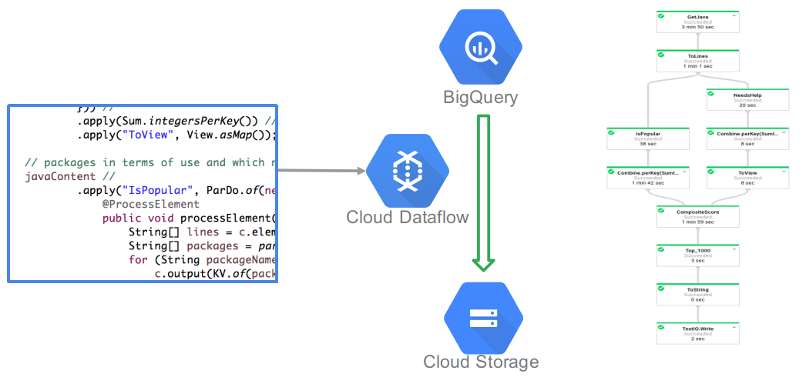

---

## Open-source API, Google infrastructure

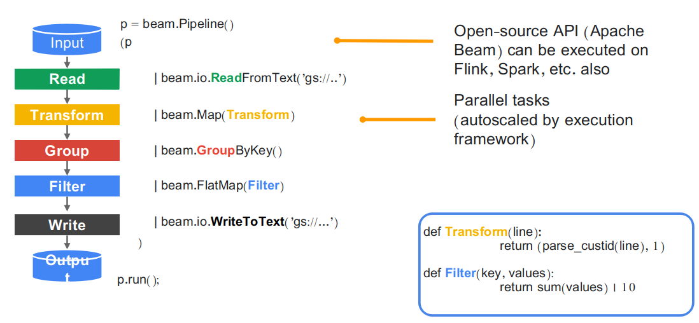

---

## Same code does real-time and batch

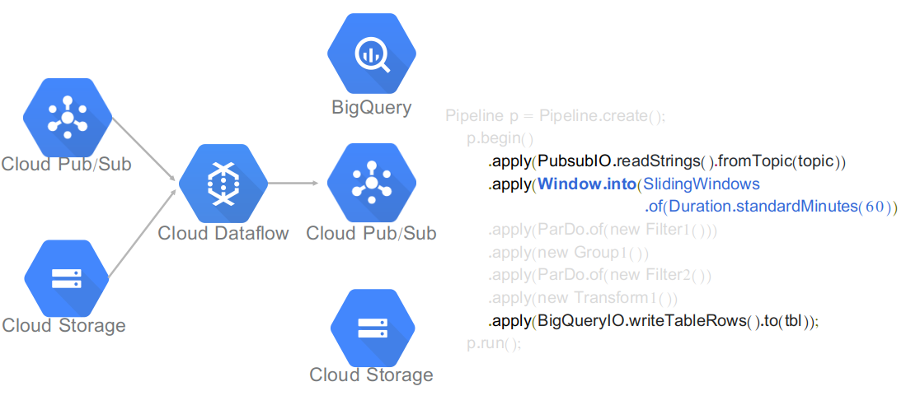

---

## Dataflow does ingest, transform, and load

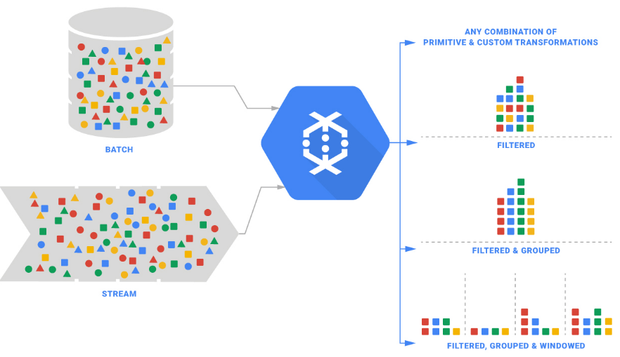

---

## A Pipeline is a directed graph of steps

* Read in data, transform it, write out
    * Can branch, merge, use if-then statements, etc.
    
```java
import org.apache.beam.sdk.Pipeline;  // etc.
public static void main(String[]args){
    // Create a pipeline parameterized by commandline flags.
    Pipeline p=Pipeline.create(PipelineOptionsFactory.fromArgs(args));

    p.apply(TextIO.read().from("gs://..."))   // Read input.
    .apply(new CountWords())               // Do some processing.
    .apply(TextIO.write().to("gs://..."));   // Write output.
    // Run the pipeline.
    p.run();

}
```    

---

## Python API conceptually similar

* Read in data, transform it, write out
    * Pythonic syntax 
    
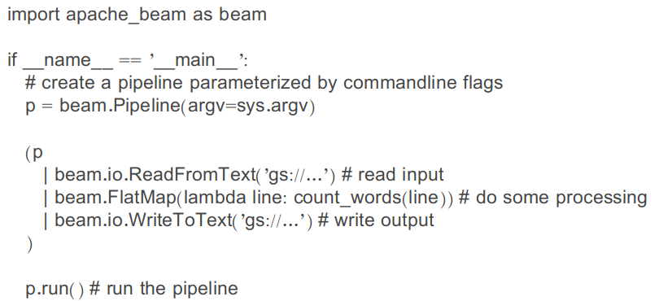

---
 
## Apply Transform to PCollection
    
* Data in a pipeline are represented by PCollection
    * Supports parallel processing
    * Not an in-memory collection; can be unbounded

```java
PCollection<String>  lines = p.apply(...)   // 
```

* Apply Transform to PCollection; returns PCollection

```java
PCollection<Integer> sizes =	
  lines.apply("Length", ParDo.of(new DoFn<String, Integer>() {
  @ProcessElement
  public void processElement(ProcessContext c) throws Exception {
  String line = c.element();
  c.output(line.length());
}}))


```
## Apply Transform to PCollection (Python)

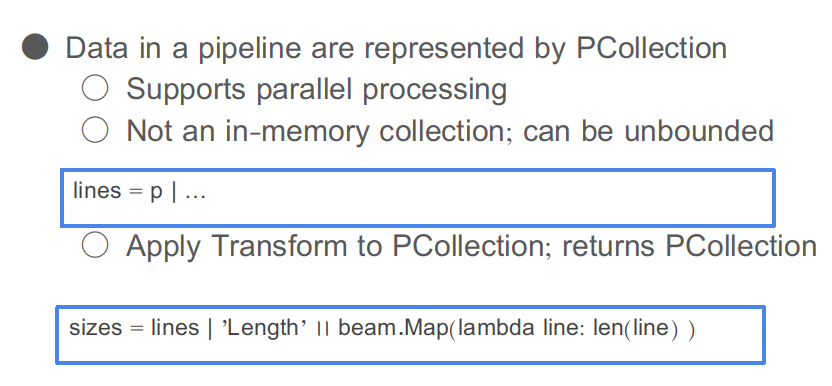

---

## Ingesting data into a pipeline

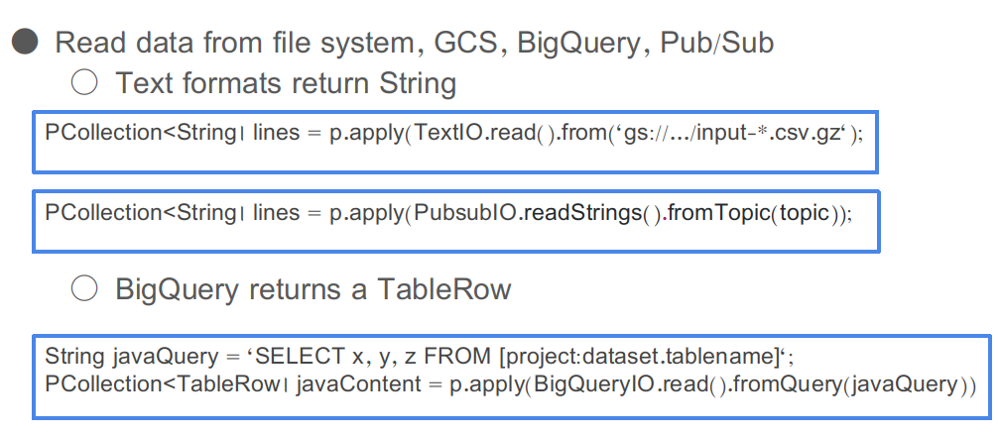

---

## Can write data out to same formats

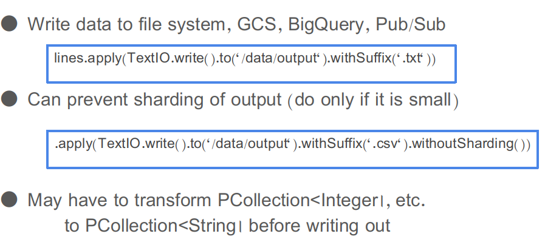

---

## Executing pipeline (Java)

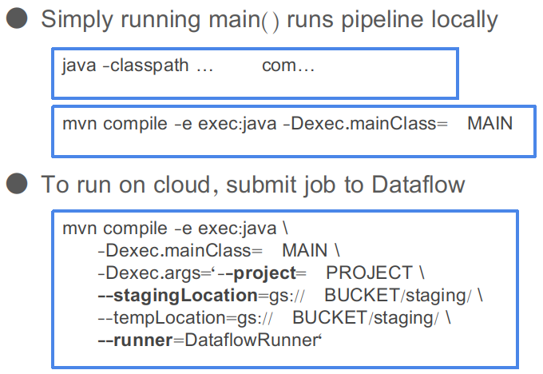

---
## Executing pipeline (Python)

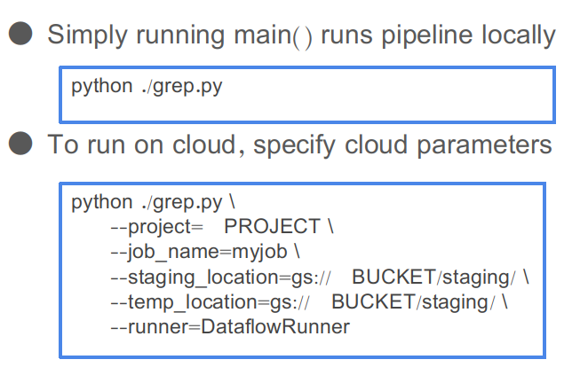

---

## Example templates for basic tasks are provided

* WordCount
* Cloud Pub/Sub to BigQuery
* Cloud Storage Text to Cloud Pub/Sub
* Cloud Pub/Sub to Cloud Storage Text
* Cloud Datastore to Cloud Storage Text
* Cloud Storage Text to BigQuery
* Cloud Storage Text to Cloud Datastore
* Bulk Decompress Cloud Storage Files

---

## Dataprep

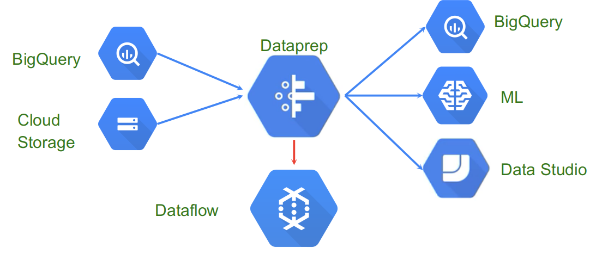

Notes:

Dataprep is an interactive graphical system for preparing structured or unstructured data for use in analytics (BigQuery), Visualization (Data Studio), and to train Machine Learning models. Input integration with Cloud Storage, BigQuery, and Files.

---

## Create pipelines in Dataprep Flows

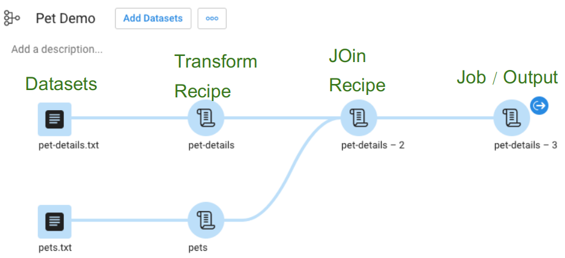

Notes:

Dataprep provides a graphical interface for interactively designing a pipeline. The elements are divided into datasets, recipes, and output. A dataset roughly translates into a Dataflow pipeline read. A recipe usually translates into multiple pipeline transformations. And an output translates into a pipeline action.

---

## Tools for data cleanup, structuring, and transformation

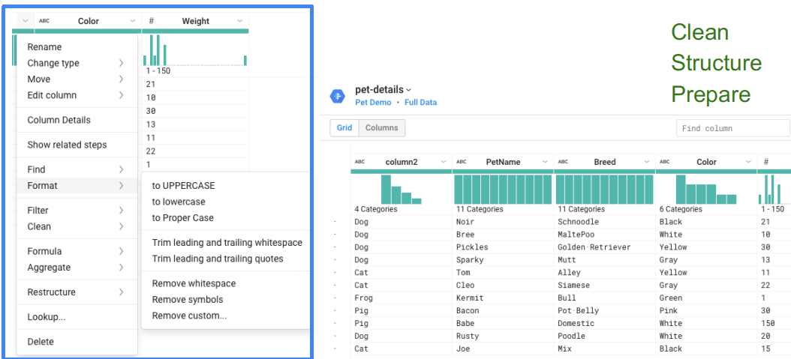

Notes:

Dataprep provides a rich set of tools for working with data. In this example, the format of a string field can have transformations applied to change to uppercase, to proper case (initial uppercase letters), to trim leading and trailing whitespace, and to remove whitespace altogether. These are the kinds of transformations commonly needed to improving the quality of data produced by a native system in preparation for big data processing.

---

## Use Dataprep to generate Dataflow Pipelines without programming

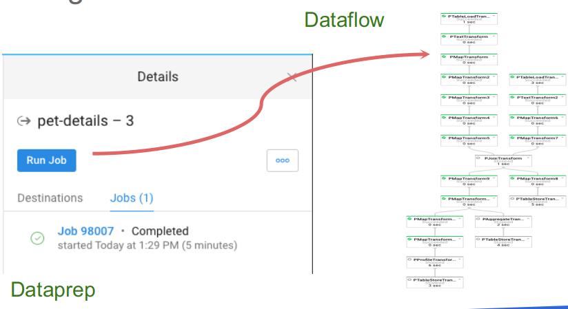

Notes:

Dataprep provides a high-leverage method to quickly create dataflow pipelines without coding. This is especially useful for data quality tasks and for master data tasks (combining data from multiple sources), where programming may not be required.

---

## Open-source API, Google infrastructure

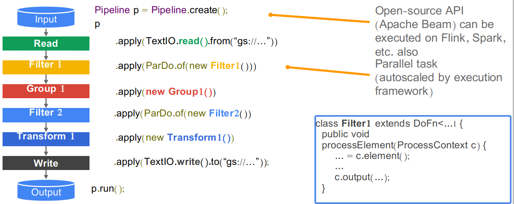

Notes:

* Distinguish between the API (Apache Beam) and the implementation/execution framework (Dataflow)

* Each step of the pipeline does a filter, group, transform, compare, join, and so on. Transforms can be done in parallel.
c.element() gets the input. c.output() sends the output to the next step of the pipeline.

---

# Data lifecycle

---

## GCP Data lifecycle

* Ingest: 
  * pull in the raw data

* Store: 
  * data needs to be stored in a format that is durable and can be easily accessed.

* Process and analyze: 
  * the data is transformed from raw form into actionable information.

* Explore and visualize: 
  * The final stage is to convert the results of the analysis into a format that is easy to draw insights from and to share with colleagues and peers.

Notes:

Ingest: The first stage is to pull in the raw data, such as streaming data from devices, on-premises batch data, app logs, or mobile-app user events and analytics.

Store: After the data has been retrieved, it needs to be stored in a format that is durable and can be easily accessed.

Process and analyze: In this stage, the data is transformed from raw form into actionable information.

Explore and visualize: The final stage is to convert the results of the analysis into a format that is easy to draw insights from and to share with colleagues and peers.

---

## Lifecycle tools

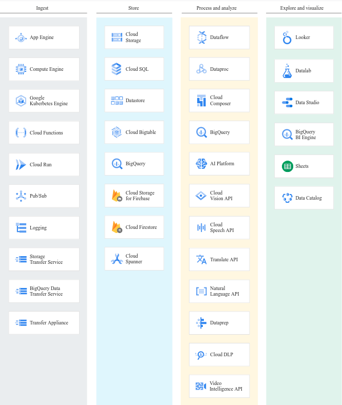

---

## Ingest

* App: 
  * Data from app events, such as log files or user events

* Streaming: 
  * The data consists of a continuous stream of small, asynchronous messages.

* Batch: Large amounts of data are stored in a set of files
  * that are transferred to storage in bulk.

Notes:

Ingest
There are a number of approaches you can take to collect raw data, based on the data’s size, source, and latency.

App: Data from app events, such as log files or user events, is typically collected in a push model, where the app calls an API to send the data to storage.

Streaming: The data consists of a continuous stream of small, asynchronous messages.

Batch: Large amounts of data are stored in a set of files that are transferred to storage in bulk.

---

## Ingest

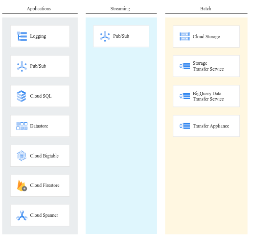

---

## Ingesting streaming data

* Telemetry data: 
  * Internet of Things (IoT) devices

* User events and analytics: 
  * A mobile app might log events
  
Notes:

Telemetry data: Internet of Things (IoT) devices are network-connected devices that gather data from the surrounding environment through sensors. Although each device might send only a single data point every minute, when you multiply that data by a large number of devices, you quickly need to apply big data strategies and patterns.

User events and analytics: A mobile app might log events when the user opens the app and whenever an error or crash occurs. The aggregate of this data, across all mobile devices where the app is installed, can provide valuable information about usage, metrics, and code quality.

---

## Ingesting bulk data

* Scientific workloads: 
  * Genetics data stored in Variant Call Format (VCF) 

* Migrating to the cloud: 
  * Moving data stored in an on-premises Oracle database

* Backing up data: 
  * Replicating data stored in an AWS bucket 

* Importing legacy data: 
  * Copying ten years worth of website log data  

Notes:

Scientific workloads: Genetics data stored in Variant Call Format (VCF) text files are uploaded to Cloud Storage for later import into Genomics.

Migrating to the cloud: Moving data stored in an on-premises Oracle database to a fully managed Cloud SQL database using Informatica.

Backing up data: Replicating data stored in an AWS bucket to Cloud Storage using Cloud Storage Transfer Service.

Importing legacy data: Copying ten years worth of website log data into BigQuery for long-term trend analysis.

---

## Store

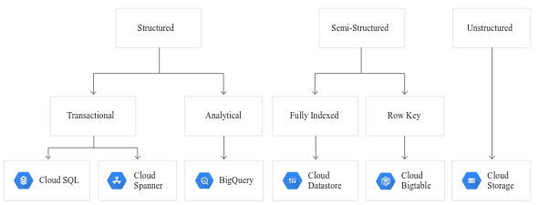

---

## Process and analyze

* Processing: 
  * Data from source systems is cleansed, normalized

* Analysis: 
  * Processed data is stored in systems that allow for ad-hoc querying

* Understanding: train and test

Notes:

Processing: Data from source systems is cleansed, normalized, and processed across multiple machines, and stored in analytical systems.

Analysis: Processed data is stored in systems that allow for ad-hoc querying and exploration.

Understanding: Based on analytical results, data is used to train and test automated machine-learning models.

---


## Congrats on completion


---

## TODO

* Will you discuss running BEAM on AWS and Azure? E.g., using AWS Kinesis with BEAM and/or Flink?
* Could you say anything about Airflow as compared to BEAM, and when to use which (general task execution vs. dataflows)? E.g., is it worth mentioning Amazon Managed Workflows for Apache Airflow (MWAA), or GCP CloudComposer (built on Airflow)?
* I like the discussion of BEAM and GCP, but not all workflows are dataflows.

---
