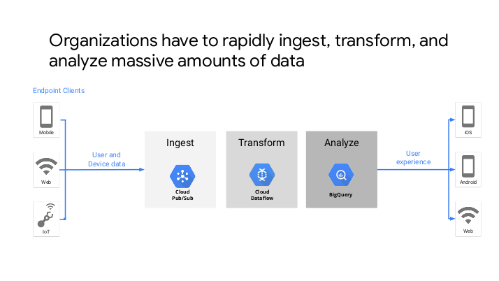
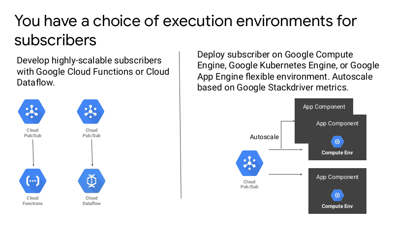

# Messaging and microservices

---

# Learn from Kafka

## TODO: Insert Kafka intro slides here

* And remove extra slides
* Keep only what illustrates data river idea

---

## Design principle: use lambda

* Design principles:
    * serverless
    * event-driven
    * decoupling
* Implementation
    * AWS Lambda
    * Azure functions
    * GCP cloud functions
* Good resources to figure out when Lambda makes sense
    * [Treck10](https://www.trek10.com/blog/lambda-cost)
    * [Binaris](https://blog.binaris.com/lambda-pricing-pitfalls/)
---

## Decoupling with messages

* Use Kinesis on AWS
* Event Hub on Azure
* Using Google Cloud Pub/Sub to Integrate Components of Your Application

---

# Amazon Kinesis

---

## AWS Kinesis

* collect, process, and analyze 
* real-time, streaming data 
* react quickly to new information

Notes:

Amazon Kinesis makes it easy to collect, process, and analyze real-time, streaming data so you can get timely insights and react quickly to new information. Amazon Kinesis offers key capabilities to cost-effectively process streaming data at any scale, along with the flexibility to choose the tools that best suit the requirements of your application. With Amazon Kinesis, you can ingest real-time data such as video, audio, application logs, website clickstreams, and IoT telemetry data for machine learning, analytics, and other applications. Amazon Kinesis enables you to process and analyze data as it arrives and respond instantly instead of having to wait until all your data is collected before the processing can begin.

---

## Kinesis benefits

* Real-time
  * ingest, buffer, and process streaming data 
* Fully managed
  * fully managed and runs your streaming applications
* Scalable
  * can handle any amount of streaming data and process data 

Notes:

* Real-time
* Amazon Kinesis enables you to ingest, buffer, and process streaming data in real-time, so you can derive insights in seconds or minutes instead of hours or days.
* Fully managed
* Amazon Kinesis is fully managed and runs your streaming applications without requiring you to manage any infrastructure.
* Scalable
* Amazon Kinesis can handle any amount of streaming data and process data from hundreds of thousands of sources with very low latencies.

---

## Kinesis capabilities

* Kinesis Video Streams
  * Capture, process, and store video streams
* Kinesis Data Streams
  * Capture, process, and store data streams  
* Kinesis Data Firehose
  * Load data streams into AWS data stores
* Kinesis Data Analytics
  * Analyze data streams with SQL or Apache Flink
  
Notes:

* Kinesis Video Streams
* Capture, process, and store video streams
* Amazon Kinesis Video Streams makes it easy to securely stream video from connected devices to AWS for analytics, machine learning (ML), and other processing.

* Kinesis Data Streams
*  Capture, process, and store data streams

* Amazon Kinesis Data Streams is a scalable and durable real-time data streaming service that can continuously capture gigabytes of data per second from hundreds of thousands of sources.

* Kinesis Data Firehose
*  Load data streams into AWS data stores

* Amazon Kinesis Data Firehose is the easiest way to capture, transform, and load data streams into AWS data stores for near real-time analytics with existing business intelligence tools.

* Kinesis Data Analytics
*  Analyze data streams with SQL or Apache Flink

* Amazon Kinesis Data Analytics is the easiest way to process data streams in real time with SQL or Apache Flink without having to learn new programming languages or processing frameworks.

---
## Kineses video streams

---

## Kinesis data streams

---

## Kinesis data firehose

---

## Kinesis data analytics

---

# Azure Event Hubs

---

## Azure Event Hubs

* Simple, secure, and scalable real-time data ingestion
* Event Hubs
  * fully managed
  * real-time data ingestion service
  * Keep processing data during emergencies using the geo-disaster recovery 

Notes:

* Event Hubs is a fully managed, real-time data ingestion service that’s simple, trusted, and scalable. Stream millions of events per second from any source to build dynamic data pipelines and immediately respond to business challenges. Keep processing data during emergencies using the geo-disaster recovery and geo-replication features.

* Integrate seamlessly with other Azure services to unlock valuable insights. Allow existing Apache Kafka clients and applications to talk to Event Hubs without any code changes—you get a managed Kafka experience without having to manage your own clusters. Experience real-time data ingestion and microbatching on the same stream.

---

## Event Hubs platform

---

## Event Hubs Features

* Ingest millions of events per second

* Enable real-time and micro-batch processing concurrently
* Get a managed service with elastic scale

* Easily connect with the Apache Kafka ecosystem

* Build a serverless streaming solution

* Ingest events on Azure Stack Hub and realize hybrid cloud solutions

Notes:

* Ingest millions of events per second
* Continuously ingress data from hundreds of thousands of sources with low latency and configurable time retention.

* Enable real-time and micro-batch processing concurrently
* Seamlessly send data to Blob storage or Data Lake Storage for long-term retention or micro-batch processing with Event Hubs Capture.

* Get a managed service with elastic scale
* Easily scale from streaming megabytes of data to terabytes while keeping control over when and how much to scale.

* Easily connect with the Apache Kafka ecosystem
* Seamlessly connect Event Hubs with your Kafka applications and clients with Azure Event Hubs for Apache Kafka®.

* Build a serverless streaming solution
* Natively connect with Stream Analytics to build an end-to-end serverless streaming solution.

* Ingest events on Azure Stack Hub and realize hybrid cloud solutions
* Locally ingest and process data at a large scale on your Azure Stack Hub and implement hybrid cloud architectures by leveraging Azure services to further process, visualize, or store your data.

---

# Google Pub/Sub

---

## Decoupling with Pub/Sub

* Use Kinesis on AWS
* Event Hub on Azure
* **Using Google Cloud Pub/Sub to Integrate Components of Your Application**

Notes:

* Cloud Pub/Sub is a fully managed messaging architecture that enables you to build
  loosely coupled microservices that can communicate asynchronously. You can use
* Cloud Pub/Sub to integrate components of your application. Cloud Pub/Sub also
  enables you to build your application on open multi-cloud or hybrid architectures. You
  can send and receive Cloud Pub/Sub messages using client libraries for popular
  programming languages, open REST/HTTP and gRPC service APIs, and an open
  source Apache Kafka connector.
* Cloud Pub/Sub is ideal for use cases such as realtime gaming applications,
  clickstream data ingestion and processing, device or sensor data processing for
  healthcare and manufacturing, and integrating various data sources in financial
  applications.
* Cloud Pub/Sub is a key component of Google Cloud Platform’s streaming data
  pipeline. Cloud Pub/Sub can rapidly ingest large amounts of data and deliver the data
  reliably to Cloud Dataflow and BigQuery for data processing and analytics.
* Cloud Pub/Sub scales automatically depending on the volume of messages and
  enables you to securely integrate distributed systems.
* In the module, Using Google Cloud Pub/Sub to Integrate Components of Your
  Application, you will learn and apply concepts about Cloud Pub/Sub topics,
  publishers, subscribers, and push and pull subscriptions. You will learn the ideal use
  cases for Cloud Pub/Sub. For example, use Cloud Pub/Sub to build loosely coupled
  applications, fan-out messages to multiple subscribers, or to rapidly ingest large
  volumes of data.

---

## Goal

* Organizations have to rapidly ingest, transform, and
  analyze massive amounts of data

Notes:

Across industry verticals, a common scenario is that organizations have to rapidly
ingest, transform, and analyze massive amounts of data. For example, a gaming
application might receive and process user engagement and clickstream data. In the
shipping industry, IoT applications might receive large amounts of sensor data from
hundreds of sensors. Data processing applications transform the ingested data and
save it in an analytics database. You can then analyze the data to provide business
insights and create innovative user experiences.

---

## Orchestrate

Notes:

* Organizations often have complex business processes that require many applications
  to interact with each other. For example, when a user plays a song, a music
  streaming service must perform many operations in the background. There might be
  operations to pay the record company, perform live updates to the catalog, update
  song recommendations, handle ad interaction events, and perform analytics on user
  actions. Such complex application interactions are difficult to manage with brittle
  point-to-point application connections.
* Cloud Pub/Sub enables you to scalably and reliably ingest large volumes of data. It
  also enables you to design loosely coupled microservices that can streamline
  application interactions.

---

## Pub/Sub

Notes:

* Let's take a look at some Cloud Pub/Sub concepts.
* Cloud Pub/Sub is a fully managed real-time messaging architecture.
* An application that publishes messages is called a publisher. A publisher creates and
  publishes messages to a topic. To receive messages, a subscriber application creates
  a subscription to a topic. A subscription can use either the push or pull method for
  message delivery. The subscriber only receives messages that are published after the
  subscription was created. After receiving and processing each pending message, the
  subscriber sends an acknowledgement back to the Cloud Pub/Sub service. Cloud
* Pub/Sub removes acknowledged messages from the subscription's queue of
  messages. If the subscriber doesn't acknowledge a message before the
  acknowledgement deadline, Cloud Pub/Sub will resend the message to the
  subscriber. Cloud Pub/Sub delivers each message to every subscription at least once.
* Cloud Pub/Sub enables loosely coupled integration between application components,
  acts as a buffer to handle spikes in data volume, and also supports other use cases.
  Cloud Pub/Sub supports pull and push subscriptions.

---

## Pull and push

Notes:

* In a pull subscription, the subscriber explicitly calls the pull method to request
  messages for delivery. Cloud Pub/Sub returns a message and an acknowledgement
  I.D. To acknowledge receipt, the subscriber invokes the acknowledged method by
  using the acknowledgement I.D. This is the default subscription model.
* In a pull subscription model, the subscriber can be Cloud Dataflow or any application
  that uses Google Cloud client libraries to retrieve messages. The subscriber controls
  the rate of delivery. A subscriber can modify the acknowledgement deadline to allow
  more time to process messages. To process messages rapidly, multiple subscribers
  can pull from the same subscription. The pull subscription model enables batch
  delivery and acknowledgements as well as massively parallel consumption.
* Use the pull subscription model when you need to process a very large volume of
  messages with high throughput.

---

## Push

Notes:

* A push subscriber doesn't need to implement Google Cloud client library methods to
  retrieve and process messages.
* In a push subscription model, Cloud Pub/Sub sends each message as an HTTP
  request to the subscriber at a pre-configured HTTP endpoint. The push endpoint can
  be a load balancer or App Engine standard application. The endpoint acknowledges
  the message by returning an HTTP success status code. A failure response indicates
  that the message should be sent again. Cloud Pub/Sub dynamically adjusts the rate
  of push requests based on the rate at which it receives success responses. You can
  configure a default acknowledgement deadline for push subscriptions. If your code
  doesn't acknowledge the message before the deadline, Cloud Pub/Sub will resend
  the message.
* Use the push subscription model in environments where Google Cloud dependencies,
  such as credentials and the client library, can't be configured, or multiple topics must
  be processed by the same webhook. A push subscription is also ideal when an HTTP
  endpoint will be invoked by Cloud Pub/Sub and other applications. In this scenario,
  the push subscriber should be able to process message payloads from Cloud
  Pub/Sub and other callers. You have a choice of execution environments for
  subscribers.

---

## Subscribers

Notes:

* You can deploy your subscriber code as Cloud Functions. Your Cloud Functions will
  be triggered whenever a new message is received. This method enables you to
  implement a serverless approach and build highly scalable systems.
* Alternatively, you can deploy your subscriber application on a compute environment
  such as Compute Engine, Google Kubernetes Engine (GKE), or App Engine flexible
  environment. Multiple instances of your application can spin up and split the
  workload, by processing the messages and the topic. These instances can be
  automatically shut down when there are very few messages to process. You can
  enable elastic scaling using Cloud Pub/Sub metrics that are published to Stackdriver.
* With either approach, you don't have to worry about developing code to manage
  concurrency or scaling. Your application scales automatically depending on the
  workload.

---

## Loose coupling

Notes:

* Let's dive into the use cases for Cloud Pub/Sub.
* Cloud Pub/Sub enables your application to perform operations asynchronously.
* Traditionally, one service or component of your application has to directly invoke
  another component to perform an operation. The call is synchronous, so the caller
  has to wait for the entire operation to finish. The application components are tightly
  coupled, because both must be running at the same time.
* With Cloud Pub/Sub, you can design your services to make asynchronous calls and
  be loosely coupled. For example, in the diagram, the Order service acts as the
  publisher. It publishes messages that contain order information to the orders topic and
  returns immediately. The Inventory service acts as the subscriber. It might even be
  down when the publisher sends messages. The subscriber can start running a little
  later and process the messages it has subscribed to.

---

## Buffer

Notes:

* Cloud Pub/Sub enables you to use a topic as a buffer to hold data that is coming in
  rapidly. For example, you might have multiple instances of a service generating large
  volumes of data. A downstream service that needs to process this data might become
  overwhelmed with the high velocity and volume of data.
* To address this issue, instances of your data generating service can act as publishers
  and publish the data to a Cloud Pub/Sub topic. Cloud Pub/Sub can reliably receive
  and store large volumes of rapidly incoming data. The downstream service can then
  act as a subscriber and consume the data at a reasonable pace. Your application can
  even automatically scale up the number of instances of the subscriber to handle
  increased volumes of data.
* The diagram shows many messages with order information coming in from various
  sources. The inventory service can subscribe to these messages and process them at
  a reasonable pace as appropriate.

---

## Fan out

Notes:

* With Cloud Pub/Sub, your application can fan out messages from one publisher to
  multiple subscribers. Instead of being aware of all services that might be interested in
  a particular piece of data and making brittle point-to-point connections with all the
  services, the publisher can push messages to a centralized Cloud Pub/Sub topic.
  Services that are interested in the information can simply subscribe to the topic.
* For example, in the diagram, information about orders is fanned out to the inventory
  and payment services.

---

## Duplicate messages

Notes:

* Cloud Pub/Sub delivers each message at least once. This means that a subscriber
  can sometimes see duplicate messages. Implement your publisher and subscriber in
  such a way that the application can perform idempotent operations.
* The publisher can publish messages with a unique I.D. Your subscriber can use Cloud
  Datastore, Cloud Firestore, or Cloud BigTable to store information about messages
  that have already been processed. Use the unique I.D. as key. Whenever a message is
  received, the subscriber can check previously saved messages to see whether the
  incoming message is new and needs to be processed. If the message has already
  been processed, the subscriber can just discard the duplicate message.
* For use cases that involve big data, you can use Cloud Dataflow Pub/Sub I/O to
  achieve exactly once processing of Cloud Pub/Sub message streams. Pub/Sub I/O
  removes duplicate messages based on custom message identifiers or identifiers
  assigned by Cloud Pub/Sub.

---

## Scalability

Notes:

* Cloud Pub/Sub provides a highly scalable messaging architecture. The scalability
  comes with a trade-off: message ordering is not guaranteed. Where possible, design
  your application to reduce or even eliminate dependencies on message ordering.
* For example, message ordering is not relevant in use cases where your application is
  collecting statistics about events. You don't need to process the statistics for related
  events in order. Similarly, if, say, five of your contacts come online around the same
  moment in time, you don't need to be notified about their presence in the exact same
  order that they came online.
* Then there are scenarios in which the final order of messages is important, but the
  order in which the individual messages are processed is not important. For example,
  log events with timestamps may stream into the logging service from various
  sources. The order of processing each log event is not important. However, eventually,
  your system should enable you to view log events ordered by timestamp.
* Cloud Pub/Sub works well naturally for use cases where order of message processing
  is not important.
* Finally, there are scenarios where messages must absolutely be processed in the
  order in which they were published. For example, financial transactions must be
  processed in order. Similarly, in a multiplayer online game, if a player jumps over a
  wall, lands on a monster, and recovers the lost jewel, other players must see the
  events in exactly the same order.

---

## Transactions

Notes:

* You can implement ordered processing of messages in one of the following ways.
* In the first scenario, the subscriber knows the order in which messages must be
  processed. The publisher can publish messages with a unique I.D. Your subscriber
  can use Cloud Datastore to store information about messages that have been
  processed so far. When a new message is received, the subscriber can check whether
  this message should be processed immediately or the unique I.D. indicates that there
  are pending messages that should be processed first. For example, the inventory
  service knows that orders should be processed in sequence using the order I.D. as
  key. When messages with order I.D.s 103 and 104 are received, it checks the
  previously processed orders and determines that 102 is pending. It temporarily stores
  orders 103 and 104 and processes them all in order when order 102 is received.
* In the second scenario, the subscriber checks oldest unacknowledged message in
  Cloud monitoring metrics. The subscriber can store all messages in a persistent
  datastore. It can check [indistinct] subscription/oldest_unacked_message metric that
  Cloud Pub/Sub publishes to Stackdriver. The subscriber can compare the timestamp
  of the oldest unacknowledged message against the published timestamps of the
  messages in Cloud Datastore. All messages published before the oldest
  unacknowledged message are guaranteed to have been received, so those messages
  can be removed from the persistent datastore and processed in order.

## Example: blue green deployment

---

## Example: blue green deployment

---

# Microservices

---

## TODO

* Insert microservices slides here

---

## Congrats on completion

---