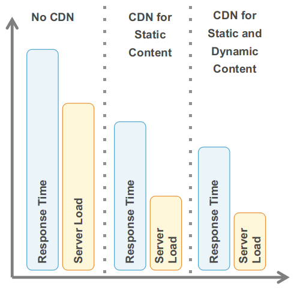

# Cost Management
---

## Fundamentals of Cost Optimization

* Turn off the light.
    * When you stop the instances, you stop paying for them.

* Be elastic.
    * Support workloads with the right amount of horsepower to get the job done.

* Continually optimize.
    * Drive recurring and improving savings through cost-aware architectures.

---

## Controlling Under Utilized Resources

* Do you use everything you pay for?
    * Cloud is designed to be leveraged for on-demand capacity.
    * De-provision unused resources.

* Consider a batch processing system.
    * Is your batch processing work completed and done? Stop and terminate the unused batch servers.

* **How do you monitor and remove unused AWS resources?**

Notes:

* Check your development or testing environments. You might have instances that are not used and are forgotten, or you might have instances that are short-lived and disposable; for example, instances that were used for proof of concept. Stop and terminate those unused instances. You pay for what you use, and you should not pay for instances that are not being used. 

* The advantage you get in the cloud is that you don’t have to lay out capital expenses for hardware and infrastructure before you know the demand. You basically convert your capital expenses into variable expenses by migrating to the cloud. So, don’t hold onto the resources that you don’t need. 

* You can use AWS Trusted Advisor and AWS EC2 Usage Reports to monitor your usage. Another key service we discussed in this course is Auto Scaling. 

---

## Cloud Design Pattern: Job Observer Pattern

 <!-- {"left" : 1.27, "top" : 2.22, "height" : 7.95, "width" : 14.95} -->

Notes:

* There is a technique for load distribution in batch processing where you can control job requests using queues, where the job requests that are queued are processed in parallel by multiple batch servers. However, if cloud technology is not used, the number of available batch servers must be up to handling the peak requirements, so there will be excessive batch server resources in off-peak times, which is harmful in terms of cost-effectiveness. On top of this, responsiveness may suffer if there is an unanticipated large load on the batch system. 

* Implementation
* Use Amazon SQS to manage job requests and use Auto Scaling and CloudWatch to structure a system that can increase or decrease the number of batch servers automatically depending on the number of messages (job requests) within a queue.  
As a job request message arrives, it gets placed in a queue. The batch server get the messages from the queue to process.
CloudWatch monitors the queue depth and sends an alarm if the queue reaches a pre-defined threshold.
Auto Scaling receives an alarm from CloudWatch and increases the number of batch servers if needed. Alternatively, Auto Scaling may terminate unused batch servers based on the alarm.

* The job observer pattern lets you coordinate the number of Amazon EC2 instances based on the number of jobs that need to be processed. Because this pattern automatically scales up or down based on the computational demand, you won’t have to over-pay or hit a bottleneck, and this improves cost-effectiveness. By scaling up as necessary, the overall time for executing jobs can be reduced by processing the jobs in parallel.

* Another benefit of this pattern is that even if a batch server fails, the Amazon SQS messages would remain, enabling processing to be continued immediately upon recovery of the Amazon EC2 instance and producing a system that is robust to failure. 

* This pattern follows the Cloud Architecture Best Practices that we discussed in earlier modules:
    * Think parallel
    * Loose coupling
    * Do not fear the constraints
    
---

## Best practice for every cloud

* The job observer pattern lets you coordinate the number of Amazon EC2 instances based on the number of jobs that need to be processed. Because this pattern automatically scales up or down based on the computational demand, you won’t have to over-pay or hit a bottleneck, and this improves cost-effectiveness. By scaling up as necessary, the overall time for executing jobs can be reduced by processing the jobs in parallel.

* Another benefit of this pattern is that even if a batch server fails, the Amazon SQS messages would remain, enabling processing to be continued immediately upon recovery of the Amazon EC2 instance and producing a system that is robust to failure. 

* This pattern follows the Cloud Architecture Best Practices that we discussed in earlier modules:
    * Think parallel
    * Loose coupling
    * Do not fear the constraints
    
---

## Trusted Advisor

* Cost Optimization with Trusted Advisor

* AWS Trusted Advisor is a web-based application that inspects your AWS environment and makes recommendations based on best practices.

    * Opportunity to save money.
    * Improve system performance.
    * Close security gaps.
    * Improve system fault tolerance

 <!-- {"left" : 9.38, "top" : 2.25, "height" : 4.57, "width" : 7.52} -->

Notes:

* You can launch AWS Trusted Advisor through AWS Management Console. 

* AWS Trusted Advisor includes an ever-expanding list of checks in the following four categories:
* Cost Optimization: Recommendations that can potentially save you money by highlighting unused resources and opportunities to reduce your bill.
* Security: Identification of security settings that could make your AWS solution less secure.
* Fault Tolerance: Recommendations that help increase the resiliency of your AWS solution by highlighting redundancy shortfalls, current service limits, and over-used resources.
* Performance: Recommendations that can help improve the speed and responsiveness of your applications.

---

## Fleet Management

* Trade off between fault tolerance and high utilization.
    * Fault tolerance requires less resource use to be able to successfully fail over.

* Trade off between instance size and value for money.
    * Higher utilization gives better compute value for money.
    * Scaling granularity.
    
Notes:

* You are paying hourly fees.  You have to pay the hourly rate regardless of the utilization.  If you are not fully utilizing the instance, you may be able to get away with using a smaller instance type that has a lower hourly rate. 
* Remember that you cannot sub-divide an instance; therefore, you are not gaining from using a large instance type if you don’t need the compute capacity. 
* As a summary, chose the instance type that is big enough to run your application, and then auto-scale as the workload increases or decreases. (Remember the discussion of scaling up and down versus scaling in and out.)

---

## Amazon EC2 Pricing Options

|          | On-Demand Instances                                                                                                      | Reserved Instances (RIs)                                                                                                                                                                                         | Spot Instances                                                                                                                                                                    |
|----------|--------------------------------------------------------------------------------------------------------------------------|------------------------------------------------------------------------------------------------------------------------------------------------------------------------------------------------------------------|-----------------------------------------------------------------------------------------------------------------------------------------------------------------------------------|
| Term     | None; Pay as you go                                                                                                      | 1 year or 3 years                                                                                                                                                                                                | Bid on unused capacity                                                                                                                                                            |
| Benefit  | Low cost and flexibility                                                                                                 | Predictability ensures compute capacity is available when needed                                                                                                                                                 | Large scale, dynamic workload                                                                                                                                                     |
| Cost     | Pay for only what you use; no up-front commitment or long-term contracts                                                 | Pay low or no up-front fee; receive significant hourly discount                                                                                                                                                  | Spot price based on supply and demand – determined automatically                                                                                                                  |
| Use case | Applications with short term, spiky, or unpredictable workloads  Application development or testing  Billed hour forward | Applications with steady state or predictable usage  Applications that require reserved capacity, including disaster recovery  Users able to make up-front payments to reduce total computing costs even further | Applications with flexible start and end times  Applications only feasible at very low compute prices  Users with urgent computing needs for large amounts of additional capacity |

<!-- {"left" : 0.22, "top" : 1.4, "height" : 1, "width" : 16.95, "columnwidth" : [1.36, 4.45, 6.16, 4.98]} -->

---

## Amazon EC2 Reserved Instance Types

* No Upfront
    * Access a Reserved Instance without an upfront payment.
    * Discounted effective hourly rate for every hour within the term, regardless of usage. 
    * 1-year reservation available.
* Partial Upfront
    * Part of the Reserved Instance must be paid at the start of the term.
    * Discounted effective hourly rate for the remainder of the term, regardless of usage.
    * 1-year or 3-year reservations available.
* All Upfront
    * Full payment made at the start of the term.
    * No other costs incurred for the remainder of the term, regardless of usage.
    * 1-year or 3-year reservations available.

---

## Reserved Instance Marketplace

* Flexibility
    * Sell your unused Amazon EC2 Reserved Instances 
    * Buy Amazon EC2 Reserved Instances from other AWS customers
    * As your needs change, change your Reserved Instances
* Diverse term and pricing options
    * Shorter terms
    * Opportunity to save on upfront pricing
* Identical capacity reservations

Notes:

* Along with the implementation of our new Reserved Instance pricing model, we have released the Reserved Instance Marketplace, currently in beta.

* Flexibility: You can sell your unused Amazon EC2 Reserved Instances to other businesses and organizations.  You can also buy Amazon EC2 Reserved Instances from other AWS customers (listed as third-party sellers).  Third-party sellers on the marketplace provide a wide selection of term lengths and pricing options to choose from. Throughout the course of your term, your needs may change.  You may need more or fewer instances than anticipated, or you may just need to move an instance to a new AWS region, or change other options for your instance, such as instance type.

* Diverse term and pricing options: Buying Reserved Instances from the marketplace provides a wider selection of prices and terms than buying Reserved Instances directly from AWS.  When purchasing a Reserved Instance from the marketplace, you will be taking over the third-party seller’s original one- or three-year term.  As such, you will only be required to fulfill the remainder of the term from the point at which you purchased the Reserved Instance from a third-party seller.  In addition, the up-front cost is determined by the third-party seller, providing you with the opportunity to spend less on your upfront costs compared with the price of a Reserved Instance purchased directly from AWS.  However, usage or recurring fees, such as monthly fees, will remain the same as the fees set when the Reserved Instances were originally purchased from AWS.

* Identical capacity reservations: Reserved Instances from the marketplace offer the same capacity reservations as those purchased directly from AWS.

---

## Amazon EC2 Spot Instances

* "Preemptible" on Google, "Spot" on Azure
* Bid for unused AWS capacity.
* Prices controlled by AWS based on supply and demand
* Termination Notice provided 2 minutes prior to termination, stored in metadata
* Best approach to temporary requests for large numbers of servers.

 <!-- {"left" : 4.3, "top" : 7.19, "height" : 4.44, "width" : 8.89} -->

Notes:

* With Amazon EC2 Spot Instances, you get to name your own prices for the same range of Amazon EC2 instance types that are available in On-Demand Pricing. At the end of the billing hour, you pay the market rate. If the market rate changes and goes above your maximum bid, you lose your compute resource (your instance is terminated). 

* If your instance is marked for termination, the Termination Notice will be stored in the instance’s metadata 2 minutes before its termination time.  The notice is accessible at http://169.254.169.254/latest/meta-data/spot/termination-time, and will include the time when the shutdown signal will be sent to the instance’s operating system.

* Best Practice: Relevant applications on Spot Instances should poll for the termination notice at 5 second intervals, giving it almost the entire two minutes to complete any needed processing before the instance is terminated and taken back by AWS. More about the Spot Instance Termination Notice here: 
* http://aws.amazon.com/blogs/aws/new-ec2-spot-instance-termination-notices/ 

* So, be sure to architect your infrastructure for interruption:
    * Decouple components. 
    * Separate interactive processes and back-end processes.
    * Use frameworks such as Elastic Map Reduce.
    * Design for interruption.
    * Use Amazon SQS or Amazon SWF.
    * Place data in durable stores such as Amazon S3 or DynamoDB.
    * Save progress regularly.

---

## Spot Use Cases

| Use Case           | Types of Applications                                            |
|--------------------|------------------------------------------------------------------|
| Batch processing   | Generic background processing (scale out computing)              |
| Web/data crawling  | Analyze data                                                     |
| Financial          | Hedge fund analytics, energy trading, etc.                       |
| Elastic Map Reduce | Hadoop (large data processing)                                   |
| Grid computing     | Scientific trials/simulations in chemistry, physics, and biology |
| Transcoding        | Transform videos into specific formats                           |
| Gaming             | Back-end servers for Facebook games                              |
| Testing            | Scale to large server pool to test software, websites, etc.      |

<!-- {"left" : 0.99, "top" : 2.37, "height" : 1, "width" : 15.57} -->

---

## Vimeo’s Spot Market Considerations (1 of 2)

* Never bid more than threshold (80% of on-demand price).

* No more than 10 open spot requests at any time.

* Bid 10% more than the average price over last hour.

* Use spots for low-priority and less time-critical jobs.

* Have more retries for jobs running on spots.

---

## Vimeo’s Spot Market Considerations (2 of 2)

* Watch out for open spot requests (add expiry to your requests).

* Billed hour forward unless terminated by AWS.

* For long-running jobs, either bid higher on spot or use on-demand instances.

* Fail over to on-demand when spot market is saturated.

* **Note** Not every rule applies in every situation. For example, the "fail over to on-demand" may not agree with your organization's budget.
    * What is your opinion and your situation?

---

## Leveraging EC2 Pricing Models Together

 <!-- {"left" : 2.81, "top" : 3.11, "height" : 7.51, "width" : 11.87} -->

---

## Blended Approach

* Choose instance type that matches requirements.
    * Start with memory requirements and architecture type (32-bit or 64-bit).
    * Then choose the closest number of virtual cores required.

* Scale across Availability Zones.
    * Smaller sizes give more granularity for deploying to multiple AZs.

* Start with on-demand and then assess utilization for RIs.

---

## Costs for databases

* Multiple instance types to choose from
    * Use small-sized database for data ingestion.

* Amazon RDS
    * If you have I/O intensive workloads, you may save money with Provisioned IOPS.
    * Launch larger database from snapshot for reporting.
        * Enables information sharing without affecting the performance of production database.

Notes:

* Needless to say, small-sized databases incur lower costs. Choose the instance type based on what it is used for. 

* Remember from the Choosing Datastore module that Amazon RDS gives you the ability to either specify or provision the I/O capacity. With PIOPS, you will be charged for the throughput and storage you provision. However, you will not be charged for the I/Os you consume.

* DB snapshots are user-initiated and enable you to back up your DB instance in a known state as frequently as you want and then restore to that specific state at any time.

---

## Offload Your Architecture

* The more you can offload, the less infrastructure you need to maintain, scale, and pay for. 
    * Offload popular traffic to Amazon CloudFront and Amazon S3.
    * Introduce caching.
  
 <!-- {"left" : 10.99, "top" : 2.25, "height" : 5.82, "width" : 6.02} -->

---

## Data Storage and Transfer Costs – Amazon S3

* Amazon S3 costs vary by region.

* Priced by storage, request, and transfer.
    * Storage cost is per GB-month.

    * Per-request cost varies, based on type of request.

        * For instance, price per 1,000 PUT requests.

* Transfer out has cost per GB-month (except in same region or to Amazon CloudFront), transfer in is free.

* [Pricing](https://aws.amazon.com/s3/pricing/)

---

## Data Storage and Transfer Costs – Amazon

* Reducing outbound costs
    * Retrieve only required output.
    * Enable Amazon EMR output compression.

* Reduced Redundancy Storage (RRS) for Amazon S3 
    * Reduces replication of Amazon S3 objects.
    * Reduces storage costs but drops durability of Amazon S3 objects.
    * RRS can be enabled during or after upload.

Notes:

Reduced Redundancy Storage (RRS) is a storage option within Amazon S3 that enables customers to reduce their costs by storing non-critical, reproducible data at lower levels of redundancy than Amazon S3’s standard storage. It provides a cost-effective, highly available solution for distributing or sharing content that is durably stored elsewhere, or for storing thumbnails, transcoded media, or other processed data that can be easily reproduced. Amazon S3’s standard and reduced redundancy options both store data in multiple facilities and on multiple devices, but with RRS, data is replicated fewer times, so the cost is lower. Amazon S3 standard storage is designed to provide 99.999999999% durability and to sustain the concurrent loss of data in two facilities, while RRS is designed to provide 99.99% durability and to sustain the loss of data in a single facility. Both the standard and RRS storage options are designed to be highly available, and both are backed by Amazon S3’s Service Level Agreement.
    
---

## You may use Consolidated Billing

* Receive a single bill for all charges incurred across all linked accounts. 
    * Share reserved instances.
    * Combine tiering benefits.

* View and manage linked accounts.

* Add additional accounts.
    * Consolidated billing only supports one level depth.

* However, this may not fit every need
    * Many schools, for example, are using reseller to bill individual accounts
    * As of re-invent 2020, this is changing and may not be a universal fit-all practices
        

 <!-- {"left" : 11.72, "top" : 3, "height" : 4, "width" : 5.37} -->
 

---

    
## AWS pricing calculator

 <!-- {"left" : 1.88, "top" : 2.54, "height" : 7.31, "width" : 13.74} -->
    

---

## AWS pricing calculator

 <!-- {"left" : 1.18, "top" : 3.07, "height" : 6.24, "width" : 15.14} -->
 

---

## Comparing Total Cost of Ownership Is Not Easy

* Start by understanding your use cases and the applications that support them.

* Take all the fixed costs into consideration.

* Use updated pricing (compute, storage, and net).

* Leverage RI pricing vs. On-Demand pricing vs. spot instances.

* Intangible cost savings: take a closer look at what you get as part of AWS.

* If you are a **higher ed institution** you may get a data egress waiver the cloud provider. It is useful as the size of dataset increases.

---

## TCO Estimates for On-Premises Deployments

 <!-- {"left" : 1.43, "top" : 2.71, "height" : 6.97, "width" : 14.63} -->
 

---

## AWS Online TCO Calculator

[https://calculator.aws/#/](https://calculator.aws/#/)

 <!-- {"left" : 2.16, "top" : 3.31, "height" : 6.78, "width" : 13.19} -->
   

---

## Cost planning on GCP

 <!-- {"left" : 1.85, "top" : 2.67, "height" : 7.05, "width" : 13.79} -->

---

## Organization node

* Organization node is root node for Google Cloud resources
* 2 organization roles:
    * Organization Admin: Control over all cloud resources
    * Project Creator: Controls project creation
    

 <!-- {"left" : 10.7, "top" : 2.11, "height" : 5.89, "width" : 6.14} -->

---
    
## Projects

* Track resource and quota usage
    * Enable billing
    * Manage permissions and credentials
    * Enable services and APIs
* Projects use three identifying attributes:
    * Project Name
    * Project Number
    * Project ID, also known as Application ID
* Google Cloud Platform Console or the Cloud Resource Manager API

---

## Resource hierarchy

 <!-- {"left" : 1.77, "top" : 2.9, "height" : 6.58, "width" : 13.95} -->
  

---
    
## Project quotas

* All resources are subject to project quotas or limits.
    * Typically fall into one of three categories:
        * How many resources you can create per project
        * How quickly you can make API requests in a project—rate limits
        * Some quotas are per region
    * Quota examples:
        * 5 networks per project
        * 24 CPUs region/project
    * Most quotas can be increased through self-service form or a support ticket
        * IAM & admin -> Quotas
        
        
Notes:

* Compute Engine enforces quotas on resource usage for a variety of reasons. For example, quotas protect the community of Google Cloud Platform users by preventing unforeseen spikes in usage. Special quotas limit access for projects that are just exploring Google Cloud Platform on a free trial basis.

* Not all projects have the same quotas. As your use of Google Cloud Platform expands over time, your quotas may increase accordingly. If you expect a notable upcoming increase in usage, you can proactively request quota adjustments from the Quotas page in the Google Cloud Platform Console.

* How quotas are applied
* Resource quotas are the maximum amount of resources you can create for that resource type, if those resources are available. Quotas do not guarantee that resources will be available at all times. If a resource is not available, you won’t be able to create new resources of that type, even if you still have remaining quota in your region or project. This is particularly relevant for regional quotas; if a particular region is out of a resource, you won’t be able to create a resource of that type, even if you still have quota. For example, if a region is out of local SSDs, you cannot create local SSDs in that region, even if you still had quota for local SSDs. In such cases, you should deploy regional resources in another region.

* Check your quota
* To check the available quota for resources in your project, go to the Quotas page in the Google Cloud Platform Console. If you are using gcloud, run the following command to check your quotas. Replace myproject with your own project ID:
gcloud compute project-info describe --project myproject
To check your used quota in a region, run:
gcloud compute regions describe example-region
        
---
        
## Why use project quotas?

* Prevent runaway consumption in case of an error or malicious attack
* Prevent billing spikes or surprises
* Forces sizing consideration and periodic review

---

## Labels

* A utility for organizing Cloud Platform resources
    * Attached to resources: VM, disk, snapshot, image
    * Console, gcloud or API
* Example uses of labels:   
    * Search and list all resources (inventory)
    * Filter resources (ex: separate production from test)Labels used in scripts 
        * Help analyze costs
        * Run bulk operations
        
* [ https://cloud.google.com/resource-manager/docs/using-labels]( https://cloud.google.com/resource-manager/docs/using-labels)

        
---

## Label specification

* A label is a key-value pair. 
* Label keys and non-empty label values can contain lowercase letters, digits, and hyphens, must start with a letter, and must end with a letter or digit. The regular expression is: [a-z]([-a-z0-9]*[a-z0-9])
* The maximum length of label keys and values is 63 characters.
* There can be a maximum of 64 labels per resource.

        
 <!-- {"left" : 11.59, "top" : 2.71, "height" : 4.95, "width" : 5.3} -->

---
    
## Label practices

* Team or Cost Center 
    * Distinguish projects owned by different teams. 
    * Useful in cost accounting or budgeting. 
    * Examples:  `team:marketing`, `team:research`
* Components
    * Examples: `component:redis`, `component:frontend`
* Environment or stage 
    * Examples: `environment:prod`, `environment:test`
    
* Owner or contact 
    * Person responsible for resource or primary contact for the resource
        * Examples: `owner:gaurav`, `contact:opm`
    * State
        * Examples: `state:inuse`, `state:readyfordeletion`
        
---

## Comparing labels and tags

* **Labels** are a way to organize resources across GCP
    * disks, image, snapshots...
* User-defined strings in `key-value` format
* Propagated through billing
* **Tags** are applied to instances only
* User-defined strings
* Tags are primarily used for networking (applying firewall rules)

---

## Budgets and alerts

 <!-- {"left" : 3.9, "top" : 2.43, "height" : 8.88, "width" : 9.75} -->
 

Notes:

* To set a budget you must be a Billing Administrator. 
    * Budget lets you track how spend is approaching specified amount
    * Monthly budget (period is fixed)
    * Can only be created by Billing Administrators
    * Budget applies to either an entire billing account or to a single project
    * Budget amount is specified or can be automatically set to last month's spend on the account or project
    * Alerts are set as a % of budget (0.005% to 100%) rounds up to the cent
    * Notification is triggered when spend is greater than alert amount (frequency ~hourly)
    * Notification is sent by email to the Billing Administrator that created it (it does not appear in the console notifications)
    * You can choose whether to include consumption of credits in the calculation (credits are promotions or grants)

* For more information, see: https://cloud.google.com/billing/docs/how-to/billing-access

--- 

## Example notification email

 <!-- {"left" : 1.7, "top" : 3.03, "height" : 6.32, "width" : 14.11} -->

---
        
## Billing export

 <!-- {"left" : 2.53, "top" : 2.32, "height" : 7.74, "width" : 12.43} -->

Notes:

* Export to either a file or a BigQuery dataset
* Create a Cloud Storage bucket or BigQuery dataset first, to specify when enabling 
* Access is set via IAM on bucket or dataset
* File export is either in CSV or JSON format (not both)
* File export prefix name is appended with date-time-stamp
* Report is generated daily; there is no on-demand generation
* Project name and project labels are your primary post-export parsing tools

---
                
## Quiz

* No resources in GCP can be used without being associated with...

    * A. A user
    * B. A virtual machine
    * C. A bucket
    * D. A project
    
Notes:

* D.
* All resources in GCP are tracked and their consumption is logged against a project. A project relates resources to a billing method.

---

## Quiz

* A budget is set at $500 and an alert is set at 100%. What happens when the full amount is used?

    * A. Everything in the associated project is suspended because there is not more budget to spend.
    * B. A notification email is sent to the Billing Administrator.
    * C. You have a 4-hour courtesy period before Google shuts down all resources.
    * D. Nothing. There is no point to sending a notification when there is no budget remaining.
    
Notes:

* B.
* Budgets in GCP are not a way to prevent spending or stop resources. They are a tool for raising awareness about the consumption of resources so that a business can implement its own consumption management processes.

---

## Quiz

* How do quotas protect GCP customers?

    * A. By preventing resource use in too many zones in a region.
    * B. By preventing resource use by unknown users.
    * C. By preventing resource use of too many different GCP services.
    * D. By preventing uncontrolled consumption of resources.        
    
Notes:

* D.
* Quotas are established at reasonable defaults for common cloud usage and proof of concept activities. If you are planning to scale up a production cloud solution, you may need to request that the quotas be raised. This is a reasonable checkpoint to verify that actions that might result in a large consumption of resources are reviewed.

---

                
## Cost Question #1

 <!-- {"left" : 1.61, "top" : 2.86, "height" : 6.67, "width" : 14.28} -->

---

## Cost Question #2

 <!-- {"left" : 0.85, "top" : 3.33, "height" : 5.73, "width" : 15.8} -->

---

## Cost Question #3

 <!-- {"left" : 0.85, "top" : 2.88, "height" : 6.64, "width" : 15.8} -->

---

## Cost Question #4

 <!-- {"left" : 0.85, "top" : 2.72, "height" : 6.64, "width" : 15.8} -->

---

## Cost Question #5

 <!-- {"left" : 0.85, "top" : 2.58, "height" : 7.23, "width" : 15.8} -->

---

## Cost Question #6

 <!-- {"left" : 0.85, "top" : 2.75, "height" : 6.88, "width" : 15.8} -->

---

## Cost Question #7

 <!-- {"left" : 0.85, "top" : 2.64, "height" : 7.11, "width" : 15.8} -->

---

## Cost Question #8

 <!-- {"left" : 0.85, "top" : 2.9, "height" : 6.58, "width" : 15.8} -->

---

## Cost Question #9

 <!-- {"left" : 2.84, "top" : 1.65, "height" : 5.29, "width" : 11.82} -->

* **Note**: CDN is not for everybody. You can achieve significant improvements with S3 alone,
see this [Sumologic resource](https://www.sumologic.com/insight/s3-cost-optimization/) for a good summary 
---

## Cost Question #10 

* How do you manage and consider the adoption of new services?
    * Meet regularly with you solutions architect, consultants,
    account team
    * Consider which new services or features you could adopt to save money
    
---

## Congrats on completion

 <!-- {"left" : 1.05, "top" : 4.57, "height" : 3.25, "width" : 15.41} -->

    
    