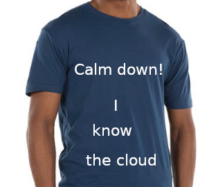

# About this Class

 <!-- {"left" : 3.28, "top" : 3.84, "height" : 7.19, "width" : 10.94} -->

---

## About This Class

 <!-- {"left" : 9.23, "top" : 0.7, "height" : 4.3, "width" : 7.83} -->

* **Practical, hands-on, cross-cloud**

* Goals
    - Take a holistic cloud approach
    - Go deep enough when needed
    - Go wide enough when justified
    - Test it out and discuss

Notes:

---

## Prerequisites & Expectations

 <!-- {"left" : 11.44, "top" : 0.7, "height" : 3.63, "width" : 5.52} -->

 <!-- {"left" : 13.23, "top" : 4.83, "height" : 2.48, "width" : 3.77} -->

* Development background

* Basic cloud computing knowledge is recommended

* Basic knowledge of Linux, scripting

Notes:

---

## Our Teaching Philosophy

<!-- {"left" : 10.88, "top" : 0.52, "height" : 4.88, "width" : 6.05} -->

* Enable you to be a **'Cloud Guru'** by giving you
    - The essential knowledge of the three major clouds
    - Leaving you with enough knowledge to go deeper
    - Giving you quizzes and labs
    - Expose you to useful tools

* Emphasis on concepts & fundamentals, not API

* Highly interactive (questions, discussions, etc.  are welcome)

* Hands-on - lots of labs! (learn by doing)

Notes:

---

## About Quizzes

 <!-- {"left" : 10.11, "top" : 0.7, "height" : 4.55, "width" : 6.82} -->

* We have many quizzes interspersed in the slides. They are fun way to review information

* The quizzes are for knowledge check, yes, but also for pointing out additional information.

* Feel free to 'search around' for answers and discuss

---

## After The Class...

 <!-- {"left" : 4.08, "top" : 2.93, "height" : 7.66, "width" : 9.33} -->

Notes:

* By the end of the class...

---

## Class Logistics

  <!-- {"left" : 10.07, "top" : 0.53, "height" : 6.28, "width" : 6.68} -->

* Instructor's contact

* Slides

* Labs

* Labs playground

