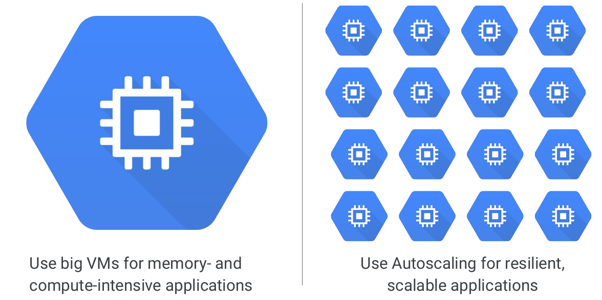
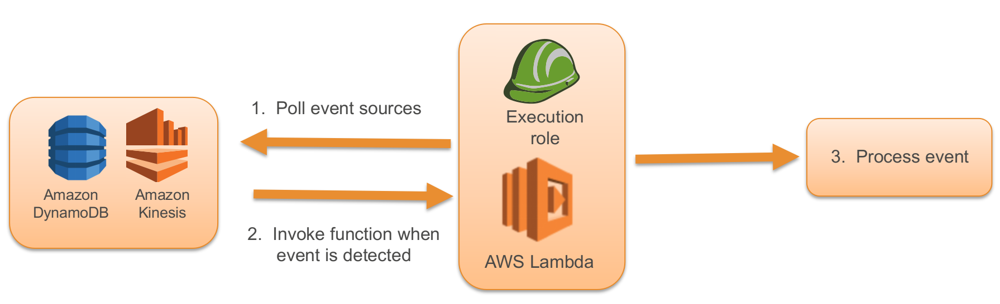

# Computing instances

# Virtual machines

## Amazon EC2

* Resizable compute capacity
* Complete control of your computing resources
* Reduces the time required to obtain and boot new server instances to minutes


---

## Amazon EC2 Facts

* Scale capacity as your computing requirements change
* Pay only for capacity that you actually use
* Choose Linux or Windows
* Deploy across AWS Regions and Availability Zones for reliability

---

## Launching an Amazon EC2 Instance via the Web Console

1. Determine the AWS Region in which you want to launch the Amazon EC2 instance.
2. Launch an Amazon EC2 instance from a pre-configured Amazon Machine Image (AMI).
3. Choose an instance type based on CPU, memory, storage, and network requirements.
4. Configure network, IP address, security groups, storage volume, tags, and key pair.

---

## AMI Details

* An AMI includes the following:
  * A template for the root volume for the instance (for example, an operating system, an application server, and applications).
  * Launch permissions that control which AWS accounts can use the AMI to launch instances.
  * A block device mapping that specifies the volumes to attach to the instance when it's launched.

---

## Instances and AMIs

* Region
* Operating system
* Architecture (32-bit or 64-bit)
* Launch permissions
* Storage for the root device


---

## Amazon EC2 Instances


---

## Amazon EBS vs. Amazon EC2 Instance Store

* Amazon EBS
  * Data stored on an Amazon EBS volume can persist independently of the life of the instance.
    Storage is persistent.

* Amazon EC2 Instance Store

  * Data stored on a local instance store persists only as long as the instance is alive.
    Storage is ephemeral.

* Today, stateless systems are advocated as best practice, so let's discuss this

---

## AMI Types - Storage for the Root Device

| Characteristic   | Amazon EBS-Backed                                                                                                                   | Amazon Instance Store-Backed                                                      |
|------------------|-------------------------------------------------------------------------------------------------------------------------------------|-----------------------------------------------------------------------------------|
| Boot time        | Usually < 1 minute                                                                                                                  | Usually < 5 minutes                                                               |
| Size limit       | 16 TiB                                                                                                                              | 10 GiB                                                                            |
| Data persistence | The root volume is deleted when the instance terminates. Data on any other Amazon EBS volumes persists after instance termination.  | Data on any instance store volumes persists only during the life of the instance. |
| Charges          | Instance usage, Amazon EBS volume usage, and storing your AMI as an Amazon EBS snapshot.                                            | Instance usage and storing your AMI in Amazon S3.                                 |
| Stopped state    | Can be stopped.                                                                                                                     | Cannot be stopped.                                                                |

---

## Instance Lifecycle


---

## Choosing the Right Amazon EC2 Instance


* EC2 instance types are optimized for different use cases and come in multiple sizes. This allows you to optimally scale resources to your workload requirements.
* AWS **uses Intel® Xeon® processors** for EC2 instances, providing customers with high performance and value.
  * **Note** AWS quotes instances with virtual cores (hyperthreading), which are not real cores if the instance is intended to do serious compute work. Need to divide the vCores by 2 to get real cores for compute-intensive tasks
* Consider the following when choosing your instances: **Core count, memory size, storage size and type, network performance, and CPU technologies.**
* **Hurry Up and Go Idle** - A larger compute instance can save you time and money, therefore paying more per hour for a shorter amount of time can be less expensive.
* In other cases, horizontal scalability in **clusters** is the way to go


---        

## General purpose


---

## Compute optimized


---

## Memory optimized


---

## Accelerated computing


---

## Storage computing


---

## Current Generation Instances

| Instance Family              | Some Use Cases                                                                    |
|------------------------------|-----------------------------------------------------------------------------------|
| General purpose (t2, m4, m3) | Low-traffic websites and web applications  Small databases and mid-size databases |
| Compute optimized (c4, c3)   | High performance front-end fleets  Video-encoding                                 |
| Memory optimized (r3)        | High performance databases  Distributed memory caches                             |
| Storage optimized (i2, d2)   | Data warehousing  Log or data-processing applications                             |
| GPU instances (g2)           | 3D application streaming  Machine learning                                        |

---

## Instance Metadata & User Data

* Instance Metadata:
  * Is data about your instance.
  * Can be used to configure or manage a running instance.
* Instance User Data:
  * Can be passed to the instance at launch.
  * Can be used to perform common automated configuration tasks.
  * Runs scripts after the instance starts.

---

## Retrieving Instance Metadata

* To view all categories of instance metadata from within a running instance, use the following URI: http://169.254.169.254/latest/meta-data/
* On a Linux instance, you can use:
* Please note that this means that the metadata is open to all users on that machine
  * Is this the behavior you would expect?

```shell script
$ curl http://169.254.169.254/latest/meta-data/
$ GET http://169.254.169.254/latest/meta-data/

```

* All metadata is returned as text (content type text/plain).


    
---

## Adding user data

* You can specify user data when launching an instance.
* User data can be:
  * Linux script – executed by cloud-init
  * Windows batch or PowerShell scripts – executed by EC2Config service
* User data scripts run once per instance-id by default.

---

## Adding user data


    
---

## Retrieving User Data


    
---

## Amazon EC2 Purchasing Options


* Pricing is by the hour or by the second depending on instance type (Linux is per-second)
* [https://aws.amazon.com/ec2/pricing/](https://aws.amazon.com/ec2/pricing/)
---

## Quiz

* When creating a new security group, all inbound traffic is allowed by default.

  * A. True
  * B. False

Notes:

* B

---

## Quiz

* To help you manage your Amazon EC2 instances, you can assign your own metadata in the form of

  * A. Wildcards
  * B. Certificates
  * C. Tags
  * D. Notes

Notes:

* C

---

## Quiz

* Can I move a reserved instance from one region to another?

  * A. Yes
  * B. No
  * C. It depends on the region
  * D. Only in the U.S.

Notes:

* B.

---

## Quiz

* You need to know both the private IP address and public IP address of your EC2 instance. You should

  * A. Run `ipconfig` in Windows or `ifconfig' in Linux
  * B. Retrieve the instance metadata from http://169.254.169.254/latest/meta-data
  * C. Retrieve the User Data from http://169.254.169.254/latest/meta-data
  * D. Run the following command: `aws ec2 display-ip`

Notes:

* B.
* Instance Metadata and User Data can be retrieved from within the instance via a special URL. Similar information can be extracted by using the API via the CLI or an SDK.

---
## Quiz

* Individual instances are provisioned
  * A. In regions
  * B. In availability zones
  * C. Globally

Notes:

* B.
---

## Virtual machines on Azure

* Start with the network
  * Segregate
  * Secure
* Name the VM
* Decide the location for the VM
* Determine the size of the VM
* Understanding the pricing model
* Storage for the VM
* Select an operating system

---

## Naming the VM

| Element            | Example                    | Notes                                                                      |
|--------------------|----------------------------|----------------------------------------------------------------------------|
| Environment        | dev, prod, QA              | Identifies the environment for the resource                                |
| Location           | uw (US West), ue (US East) | Identifies the region into which the resource is deployed                  |
| Instance           | 01, 02                     | For resources that have more than one named instance (web servers, etc.)   |
| Product or Service | service                    | Identifies the product, application, or service that the resource supports |
| Role               | sql, web, messaging        | Identifies the role of the associated resource                             |

---

## Naming the VM example

* Example:
  * `devusc-webvm01`
  * to represent the first development web server hosted in the US South Central location.

---

## Azure VM size

| Option                    | Description                                                                                                                                                                          |
|---------------------------|--------------------------------------------------------------------------------------------------------------------------------------------------------------------------------------|
| General purpose           | General-purpose VMs are designed to have a balanced CPU-to-memory ratio. Ideal for testing and development, small to medium databases, and low to medium traffic web servers.        |
| Compute optimized         | Compute optimized VMs are designed to have a high CPU-to-memory ratio. Suitable for medium traffic web servers, network appliances, batch processes, and application servers.        |
| Memory optimized          | Memory optimized VMs are designed to have a high memory-to-CPU ratio. Great for relational database servers, medium to large caches, and in-memory analytics.                        |
| Storage optimized         | Storage optimized VMs are designed to have high disk throughput and IO. Ideal for VMs running databases.                                                                             |
| GPU                       | GPU VMs are specialized virtual machines targeted for heavy graphics rendering and video editing. These VMs are ideal options for model training and inferencing with deep learning. |
| High performance computes | High performance compute is the fastest and most powerful CPU virtual machines with optional high-throughput network interfaces.                                                     |

---

## Azure VM prices

| Option                             | Description                                                                                                                                                                                                                                                                                                                                                                                                                                                                                             |
|------------------------------------|---------------------------------------------------------------------------------------------------------------------------------------------------------------------------------------------------------------------------------------------------------------------------------------------------------------------------------------------------------------------------------------------------------------------------------------------------------------------------------------------------------|
| Pay as you go                      | With the pay-as-you-go option, you pay for compute capacity by the second, with no long-term commitment or upfront payments. You're able to increase or decrease compute capacity on demand as well as start or stop at any time. Prefer this option if you run applications with short-term or unpredictable workloads that cannot be interrupted. For example, if you are doing a quick test, or developing an app in a VM, this would be the appropriate option.                                     |
| Reserved Virtual Machine Instances | The Reserved Virtual Machine Instances (RI) option is an advance purchase of a virtual machine for one or three years in a specified region. The commitment is made up front, and in return, you get up to 72% price savings compared to pay-as-you-go pricing. RIs are flexible and can easily be exchanged or returned for an early termination fee. Prefer this option if the VM has to run continuously, or you need budget predictability, and you can commit to using the VM for at least a year. |

* VM payment is by the second
---

## Options to create VM

* Azure Resource Manager
* Azure PowerShell
* Azure CLI
* Azure REST API
* Azure Client SDK
* Azure VM Extensions
* Azure Automation Services

---

## Quiz

*  Suppose you want to run a network appliance on a virtual machine. Which workload option should you choose?

  * A. General purpose

  * B. Compute optimized

  * C. Memory optimized

  * D. Storage optimized

Notes:

* B
* Compute optimized virtual machines are designed to have a high CPU-to-memory ratio. Suitable for medium traffic web servers, network appliances, batch processes, and application servers.

---

## Quiz

* True or false: Resource Manager templates are JSON files?

  * A. True
  * B. False

Notes:

* A
* Resource Manager templates are JSON files that define the resources you need to deploy for your solution. The template can then be used to easily re-create multiple versions of your infrastructure, such as staging and production.

---

## VM on GCP

* GCE - Google Compute Engine

  * High CPU, high memory, standard and shared-core machine types
  * Persistent disks
  * Standard, SSD, local SSD
  * Snapshots
  * Resize disks with no downtime
  * Instance metadata and startup scripts


Notes:

* Virtual machines have the power and generality of a full-fledged operating
  system in each. You configure a virtual machine much like you build out a
  physical server: by specifying its amounts of CPU power and memory, its
  amounts and types of storage, and its operating system. Compute Engine lets
  you create and run virtual machines on Google infrastructure. There are no
  upfront investments, and you can run thousands of virtual CPUs on a system
  that is designed to be fast and to offer consistent performance.
* You can flexibly reconfigure Compute Engine virtual machines. And a VM
  running on Google’s cloud has unmatched worldwide network connectivity.
* You can create a virtual machine instance by using the Google Cloud Platform
  Console or the gcloud command-line tool. A Compute Engine instance can run
  Linux and Windows Server images provided by Google or any customized
  versions of these images. You can also build and run images of other
  operating systems.

---
## GCE pricing

* Compute Engine offers customer friendly pricing
  * Per-second billing, sustained use discounts, committed use, discounts
  * Preemptible instances
  * High throughput to storage at no extra cost
  * Custom machine types: Only pay for the hardware you need


Notes:

* Compute Engine bills by the second for use of virtual machines, with a one-minute
  minimum. And discounts apply automatically to virtual machines that run for
  substantial fractions of a month. For each VM that you run for more than 25% of a
  month, Compute Engine automatically gives you a discount for every incremental
  minute. You can get up to a 30% net discount for VMs that run the entire month.
* Compute Engine offers the ability to purchase committed use contracts in return for
  deeply discounted prices for VM usage. These discounts are known as committed use
  discounts. If your workload is stable and predictable, you can purchase a specific
  amount of vCPUs and memory for up to a 57% discount off of normal prices in return
  for committing to a usage term of 1 year or 3 years.
* Suppose you have a workload that no human being is sitting around waiting to finish.
  Say, a batch job analyzing a large dataset. You can save money by choosing
  Preemptible VMs to run the job. A Preemptible VM is different from an ordinary
  Compute Engine VM in only one respect: you’ve given Compute Engine permission to
  terminate it if its resources are needed elsewhere. You can save a lot of money with
  preemptible VMs, although be sure to make your job able to be stopped and
  restarted.
* You don’t have to select a particular option or machine type to get high throughputbetween your processing and your persistent disks. That’s the default.
* You can choose the machine properties of your instances, such as the number of
  virtual CPUs and the amount of memory, by using a set of predefined machine types
  or by creating your own custom machine types.

---         

## Scaling with Compute Engine

* Scale up or scale out with Compute Engine



Notes:

* You can make very large VMs in Compute Engine. At the time this deck was
  produced, the maximum number of virtual CPUs in a VM was zone-dependent and at
  96, and the maximum memory size was at 624 GB (6.5 GB per CPU).
* You can also use a mega-memory machine type that scales to 1.4 TB memory.
* Check the GCP website to see where these maximums are today.
* These huge VMs are great for workloads like in-memory databases and
  CPU-intensive analytics. But most GCP customers start off with scaling out, not up.
  Compute Engine has a feature called Autoscaling that lets you add and take away
  VMs from your application based on load metrics. The other part of making that work
  is balancing the incoming traffic among the VMs. And Google VPC supports several
  different kinds of load balancing! We’ll consider those in the next section.

---

## Compute engine disks

| Feature                       | Amazon EBS                                                                            | Compute Engine                                                                                                              |
|-------------------------------|---------------------------------------------------------------------------------------|-----------------------------------------------------------------------------------------------------------------------------|
| Volume types                  | EBS Provisioned IOPS SSD, EBS General Purpose SSD, Throughput Optimized HDD, Cold HDD | Zonal standard persistent disks (HDD), regional persistent disks, zonal SSD persistent disks, regional SSD persistent disks |
| Volume locality rules         | Must be in same zone as instance to which it is attached                              | Must be in same zone as instance to which it is attached                                                                    |
| Volume attachment             | Can be attached to only one instance at a time                                        | Read-write volumes: Can be attached to only one instance at a time Read-only volumes: Can be attached to multiple instances |
| Attached volumes per instance | Up to 40                                                                              | Up to 128                                                                                                                   |
| Maximum volume size           | 16TiB                                                                                 | 64TB                                                                                                                        |
| Redundancy                    | Zonal                                                                                 | Zonal or multi-zonal depending on volume type                                                                               |
| Snapshotting                  | Yes                                                                                   | Yes                                                                                                                         |
| Snapshot locality             | Regional                                                                              | Global                                                                                                                      |

Notes:

* Source
* https://cloud.google.com/docs/compare/aws/storage

---

## Google local SSD

| Feature                       | Amazon EC2                                     | Compute Engine                                  |
|-------------------------------|------------------------------------------------|-------------------------------------------------|
| Service name                  | Instance store (also known as ephemeral store) | Local SSD                                       |
| Volume attachment             | Tied to instance type                          | Can be attached to any non-shared-core instance |
| Device type                   | Varies by instance type                        | SSD                                             |
| Attached volumes per instance | Varies by instance type                        | Up to 8                                         |
| Storage capacity              | Varies by instance type                        | 375 GB per volume                               |
| Live migration                | No                                             | Yes                                             |
| Redundancy                    | None                                           | None                                            |

---


## Quiz

* Data on local SSDs persists through live migration events
  * A. True
  * B. False

Notes:

* A.
* Data on your local SSDs persists through live migration events. If Compute Engine migrates an instance with a local SSD, Compute Engine copies data from your local SSD to the new instance with only a short period of decreased performance.

--- 

## Quiz

* What size should your boot disks be to ensure the best performance when using persistent disks

  * A. Larger than 50GB
  * B. Larger than 100GB
  * C. Smaller than 50GB
  * D. Larger than 200GB

Notes:

* D.
* Performance on persistent disks is predictable, scales linearly, and is directly related to boot disk size. A boot disk smaller than 200GB will result in a poor experience.

---

## Quiz

* The data that you store on a local SSD persists only until you stop or delete the instance

  * A. True
  * B. False

Notes:

* A.
* Local SSDs are physically attached to the server that hosts your virtual machine instance. Local SSDs have higher throughput and lower latency than standard persistent disks or SSD persistent disks. The data that you store on a local SSD persists only until you stop or delete the instance. Each local SSD is 375 GB in size, but you can attach up to eight local SSD devices for 3 TB of total local SSD storage space per instance.

--- 

## Quiz

* What size are local SSD devices?

  * A. 375GB
  * B. 250GB
  * C. 500GB
  * D. 1TB

Notes:

* A.
* Local SSDs are physically attached to the server that hosts your virtual machine instance. Local SSDs have higher throughput and lower latency than standard persistent disks or SSD persistent disks. The data that you store on a local SSD persists only until you stop or delete the instance. Each local SSD is 375 GB in size, but you can attach up to eight local SSD devices for 3 TB of total local SSD storage space per instance.

---

# Lambda

---

## What is AWS Lambda?

* Compute service that runs your functions in response to event.
* Automatically manages the compute resources for you.
* Requires zero administration.


---

## Why AWS Lambda?

* Simple problem:
  * GoGreen Healthcare creates pharmaceutical labels when new products are released in compliance with the Food & Drug Administration’s (FDA) Structured Product Labeling (SPL).
  * Transform label data into a format to be used in trend analysis by other teams.


---  

## Why AWS Lambda?


Notes:

In a “traditional” environment, the complicated solution would include provisioning a fleet of proxy servers to capture all uploads of the new pharmaceutical labels.  For each upload, you would enqueue a job to process it.  You would then provision a second fleet of machines to read and process the jobs.  Then you would get to pick a deployment solution to transform the pharmaceutical labels for use by other teams within the organization.  You would have to account for infrastructure planning, including planning capacity, accounting for fault tolerance, ensuring good long-term utilization, and burst capacity.  Your solution would need to monitor 24/7 for capacity, health, security, etc.  Over time, you would need to migrate to new instance types, keeping the OS and language runtimes patched and up to date.

---  

## Why AWS Lambda?

* AWS Lambda is easy to:
  * Author, deploy, manage, maintain
  * Scale and monitor
* Design pattern applicable to every cloud
* Why NOT Lambda?
  * Max time is in the minutes, default is in the seconds
  * Payload limited to 6 GB, memory to 3 GB
  * Rules of scaling, cold start


---    

## Why AWS Lambda?


---

## AWS Lambda: Overview


---

## AWS Lambda – How it Works

* Function is invoked by:
  * The event source (Push model)
  * AWS Lambda (Pull model)
  * Direct invocation (RequestResponse model)
* Authored in:
  * Java, Go, PowerShell, Node.js, C#, Python, and Ruby
  * Runtime API for additional languages


Notes:

* The core components of AWS Lambda are the Lambda function and an event source.  Event sources publish events, and a Lambda function is the custom code that you write to process the events.  AWS Lambda executes your Lambda function on your behalf.

* A Lambda function consists of your code, associated dependencies, and configuration.  Configuration includes information such as the handler that will receive the event, the AWS Identity and Access Management (IAM) role AWS Lambda can assume to execute the Lambda function on your behalf, the compute resource you want allocated, and the execution timeout.

* How a Lambda function is invoked depends on the event source that you use with it.

* Event based invocation:
* Some event sources can publish events to AWS Lambda and directly invoke your Lambda function. This is called the push model where the event sources invoke your Lambda function. Some event sources publish events, but AWS Lambda must poll the event source and invoke your Lambda function when events occur. This is called the pull model.

* Request-response invocation: This invocation type causes AWS Lambda to execute the function synchronously and returns the response immediately to the calling application. This invocation type is available for custom applications.

* Lambda functions are authored in Node.js, Java, and Python 2.7. Your code can include existing libraries, even native ones.

---

## Push Event Model

* Event-based invocation where the event source invokes the Lambda function
* Asynchronous execution (no response required)


Notes:

* The Event invocation type uses the push event model:
* An event source directly invokes a Lambda function when it publishes an event.
* The push model applies to Amazon S3, Amazon SNS, Amazon Cognito,  Amazon Echo, and user applications, where each individual event triggers the Lambda function.
* You need to grant the event source necessary permissions to invoke the Lambda function via the access policy associated with the function (Permissions discussed on next slide).

* AWS Lambda does not explicitly manage event sources in this model.  You do not use the AWS Lambda APIs to map your Lambda function to its event source.  Instead, you use APIs from the event source to configure this mapping.  For example, if Amazon S3 is your event source, you would specify event source mapping as part of bucket notification configuration.

* Note For your convenience, the AWS Lambda console shows all event sources (pull and push) for a given function.

* Amazon S3, Amazon SNS, Amazon Cognito, and Amazon Echo invoke the Lambda function using the Event invocation type in the invoke API call.

* User applications can invoke the Lambda functions by using the Event invocation type, the "RequestResponse" invocation type, or the “DryRun” invocation type.

* For more information, see:
* http://docs.aws.amazon.com/lambda/latest/dg/API_Invoke.html

---

## AWS Lambda Push Event Model Example


 
---

## Pull Event Model

* Event-based invocation where AWS Lambda polls the event source
* AWS Lambda invokes your Lambda function when it detects an event



Notes:

* In the pull event model, AWS Lambda polls the event source and invokes your Lambda function when it detects an event. This model applies when AWS Lambda is used with streaming event sources such as Amazon Kinesis and DynamoDB Streams. For example, AWS Lambda polls your Amazon Kinesis stream, or Amazon DynamoDB Stream, and invokes your Lambda function when it detects new records on the stream.  In this model, AWS Lambda manages the event source mapping. That is, it provides an API for you to create event source mappings that associate your Lambda function with a specific event source. For more information, see http://docs.aws.amazon.com/lambda/latest/dg/API_CreateEventSourceMapping.html.

* You will need to grant AWS Lambda necessary permissions to access the event source via an IAM role.

---

## Quiz

* You have created a simple serverless website using S3, Lambda, API Gateway and DynamoDB. Your website will process the contact details of your customers, predict an expected delivery date of their order and store their order in DynamoDB. You test the website before deploying it into production and you notice that although the page executes, and the lambda function is triggered, it is unable to write to DynamoDB. What could be the cause of this issue?

  * A. The availability zone where the DynamoDB is hosted is down
  * B. The availability zone where the Lambda is hosted is down
  * C. Your lambda function does not have sufficient Identity Access Management (IAM) permissions to write to DynamoDB
  * D. You have written your function in Python which is not supported in the runtime of Lambda

Notes:

* C.
* Like any services in AWS, Lambda needs to have a role associated with it that provide credentials with rights to other services. This is exactly the same as needing a role on an EC2 instance to access S3 or DDB.

---

## Quiz

* In which direction(s) does Lambda scale automatically?

  * A. Up
  * B. Up and out
  * C. Out
  * D. None - Lambda does not scale automatically

Notes:

* C.
* Lambda scales out automatically - each time your function is triggered, a new, separate instance of that function is started. There are limits, but these can be adjusted on request.

---    

## Quiz

* What AWS service can be used to help resolve an issue with a lambda function?

  * A. API Gateway
  * B. CloudTrail
  * C. AWS X-Ray
  * D. DynamoDB

Notes:

* C.
* AWS X-Ray helps developers analyze and debug production, distributed applications, such as those built using a microservices & serverless architectures.

---

## Quiz

* You have created a serverless application to add metadata to images that are uploaded to a specific S3 bucket. To do this, your lambda function is configured to trigger whenever a new image is created in the bucket. What will happen when multiple users upload multiple different images at the same time?

  * A. Multiple instances of lambda function will be triggered, one for each image
  * B. A single lambda functions will be triggered, which will process all images at the same time
  * C. Multiple lambda functions will trigger, one after the others, until all images are processed
  * D. A single lambda function will be triggered, that will process all images that have finished uploading one at a time

Notes:

* A.
* Each time a Lambda function is triggered, an isolated instance of that function is invoked. Multiple triggers result in multiple concurrent invocations, one for each time it is triggered.

---

## Quiz

* As a DevOps engineer you are told to prepare complete solution to run a piece of code that required multi-threaded processing. The code has been running on an old custom-built server based around a 4 core Intel Xeon processor. Which of these best describe the AWS compute services that could be used?

  * A. EC2, ECS, and Lambda
  * B. ECS and EC2
  * C. None of the above
  * D. Only and EC2 'bare metal' server

Notes:

* A.
* The exact ratio of cores to memory has varied over time for Lambda instances, however Lambda like EC2 and ECS supports hyper-threading on one or more virtual CPUs (if your code supports hyper-threading).

---

## Azure Functions

* Abstraction of servers:
  * Serverless computing abstracts the servers you run on.
* Event-driven scale:
  * Serverless computing fits for workloads that respond to incoming events.
    * Timers, for example, if a function needs to run every day at 10:00 AM UTC.
    * HTTP, for example, API and webhook scenarios.
    * Queues, for example, with order processing.
    * And more
* Micro-billing
  * Pay only for the time their code runs
* Functions:
  * you write code to complete each step.
* Logic Apps
  * you use a GUI to define the actions and how they relate to one another.

---

## Functions vs Logic Apps

|                   | Functions                                                              | Logic Apps                                                                                              |
|-------------------|------------------------------------------------------------------------|---------------------------------------------------------------------------------------------------------|
| State             | Normally stateless, but Durable Functions provide state.               | Stateful.                                                                                               |
| Development       | Code-first (imperative).                                               | Designer-first (declarative).                                                                           |
| Connectivity      | About a dozen built-in binding types. Write code for custom bindings.  | Large collection of connectors. Enterprise Integration Pack for B2B scenarios. Build custom connectors. |
| Actions           | Each activity is an Azure function. Write code for activity functions. | Large collection of ready-made actions.                                                                 |
| Monitoring        | Azure Application Insights.                                            | Azure portal, Log Analytics.                                                                            |
| Management        | REST API, Visual Studio.                                               | Azure portal, REST API, PowerShell, Visual Studio.                                                      |
| Execution context | Can run locally or in the cloud.                                       | Runs only in the cloud.                                                                                 |

---

## GCP cloud functions


Notes:

* Google Cloud Platform services emit events, such as when files are uploaded to a
  Google Cloud Storage bucket or messages are published to a Google Cloud Pub/Sub
  topic. External services can invoke functions in response to events in those systems,
  such as when a commit is made to a Github repository. Cloud Functions are triggered
  in response to these events. Cloud Functions can invoke other APIs or write data
  back to the cloud.

---

## Cloud functions use cases


Notes:

---

## Congrats on completion


---