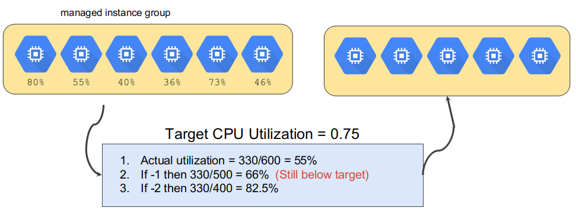

# Elasticity, and scaling

---

## Elasticity, and scaling

* In this section, we are going to discuss various ways of scaling
* Although *serverless* is promoted by clouds as **the** way
* However, all scaling is based on the virtual machines
* These VMs are coming from a pool
* So first, let us review the virtual machine pools in the cloud

---

# Auto scaling groups

---

## Auto scaling group = ASG

* Auto scaling group = ASG
* We will explain ASG first using AWS as example

 <!-- {"left" : 1.58, "top" : 4.33, "height" : 5.61, "width" : 14.35} -->

---

## Trio of Services

 <!-- {"left" : 2.16, "top" : 2.89, "height" : 7.95, "width" : 13.18} -->

Notes:

* Auto Scaling works as a triad of services working in sync. Elastic Load Balancing and EC2 instances feed metrics to Amazon CloudWatch. Auto Scaling defines a group with launch configurations and Auto Scaling policies. Amazon CloudWatch alarms execute Auto Scaling policies to affect the size of your fleet. All of these services work well individually, but together they become more powerful and increase the control and flexibility our customers demand.
  
---

## Auto Scaling Benefits

 <!-- {"left" : 1.11, "top" : 3.34, "height" : 5.7, "width" : 15.27} -->


Notes:

* Adding Auto Scaling to your application architecture is one way to maximize the benefits of the AWS cloud. When you use Auto Scaling, your applications gain the following benefits:
* Better fault tolerance: Auto Scaling can detect when an instance is unhealthy, terminate it, and launch an instance to replace it. You can also configure Auto Scaling to use multiple Availability Zones. If one Availability Zone becomes unavailable, Auto Scaling can launch instances in another one to compensate.
* Better availability: Auto Scaling can help you ensure that your application always has the right amount of capacity to handle the current traffic demands. 
* Better cost management: Auto Scaling can dynamically increase and decrease capacity as needed. Because you pay for the EC2 instances you use, you save money by launching instances when they are actually needed and terminating them when they aren't needed.

---

## Launch Configurations

* A launch configuration is a template that an Auto Scaling group uses to launch EC2 instances.
* When you create a launch configuration, you can specify:
    * AMI ID
    * Instance type
    * Key pair
    * Security groups
    * Block device mapping
    * User data


 <!-- {"left" : 9.63, "top" : 3.12, "height" : 3.09, "width" : 7.43} -->


Notes:

* When you create an Auto Scaling group, you must specify a launch configuration. You can specify your launch configuration with multiple Auto Scaling groups. However, you can only specify one launch configuration for an Auto Scaling group at a time, and you can't modify a launch configuration after you've created it. If you want to change the launch configuration for your Auto Scaling group, you must create a new launch configuration and then update your Auto Scaling group with the new launch configuration. When you change the launch configuration for your Auto Scaling group, any new instances are launched using the new configuration parameters, but existing instances are not affected.
* For more information, see: 
* http://docs.aws.amazon.com/AutoScaling/latest/DeveloperGuide/LaunchConfiguration.html

---

## Launch configuration example

 <!-- {"left" : 4.87, "top" : 2.38, "height" : 8.96, "width" : 7.75} -->


---

## Auto Scaling Groups

* Contain a collection of EC2 instances that share similar characteristics.
* Instances in an Auto Scaling group are treated as a logical grouping for the purpose of instance scaling and management.

 <!-- {"left" : 3.84, "top" : 5.2, "height" : 6.06, "width" : 9.82} -->


Notes:

* You can create collections of EC2 instances, called Auto Scaling groups. You can specify the minimum number of instances in each Auto Scaling group, and Auto Scaling ensures that your group never goes below this size. You can specify the maximum number of instances in each Auto Scaling group, and Auto Scaling ensures that your group never goes above this size. If you specify the desired capacity, either when you create the group or at any time thereafter, Auto Scaling ensures that your group has this many instances. If you specify scaling policies, then Auto Scaling can launch or terminate instances as demand on your application increases or decreases.

---

## Dynamic Scaling

* You can create a scaling policy that uses CloudWatch alarms to determine:
    * When your Auto Scaling group should scale out.
    * When your Auto Scaling group should scale in.
* You can use alarms to monitor:
    * Any of the metrics that AWS services send to Amazon CloudWatch.
    * Your own custom metrics.

---

## Auto Scaling Basic Lifecycle


 <!-- {"left" : 2.72, "top" : 2.38, "height" : 7.62, "width" : 12.06} -->


Notes:

1. The slide shows the basic lifecycle of instances within an Auto Scaling Group. 
The Scaling Group has a desired capacity of three instances. 
2. A CloudWatch alarm triggers scaling events and policies scale the group at specific dates and times.
3. The scaling policy launches an instance and attaches it to the Auto Scaling Group.
4. A health check fails and triggers an alarm similar to scaling out.
5. The instance is terminated.
6. The instance is detached from the Auto Scaling Group.

---

## Quiz

* Your architecture for an application currently consists of EC2 Instances sitting behind a classic ELB. The EC2 Instances are used to serve an application and are accessible through the internet. What can be done to improve this architecture in the event that the number of users accessing the application increases?

    * A. Add another ELB to the architecture.

    * B. Use Auto Scaling Groups.

    * C. Use an Application Load Balancer instead.

    * D. Use the Elastic Container Service.
    
Notes:

* B. Use Auto Scaling Groups.
* AWS Documentation mentions the following:
* AWS Auto Scaling monitors your applications and automatically adjusts capacity to maintain steady, predictable performance at the lowest possible cost. Using AWS Auto Scaling, it is easy to setup application scaling for multiple resources across multiple services in minutes.
* For more information on AWS Auto Scaling, please visit the following URL:
  https://aws.amazon.com/autoscaling/
  
---

## Quiz

* You are told that a huge download is occurring on your instance. You have already set the Auto Scaling policy to increase the instance count when the network I/O increases beyond a certain limit. How can you ensure that this temporary event does not result in scaling?

    * A. The policy cannot be set on the network I/O

    * B. There is no way you can stop scaling as it is already configured

    * C. The network I/O are not affected during data download

    * D. You can suspend scaling temporarily
    
Notes: 

* D.

---

## Quiz

* A user creates an Auto Scaling group from the Amazon AWS Console and assigned a tag with a key of "environment" and a value of "Prod". Can the user assign tags to instances launched in the Auto Scaling group, to organize and manage them?

    * A. Yes, this is possible only if the tags are configured at the launch configuration with a maximum length of 300 characters.

    * B. Yes

    * C. Yes, this is possible only if the tags are in the same AZ and the tag names are uppercase.

    * D. No
    
Notes: 

* B.

---

## Azure Batch

* Azure Batch enables large-scale parallel and high-performance computing (HPC) batch jobs with the ability to scale to tens, hundreds, or thousands of VMs.

* When you're ready to run a job, Batch does the following:

    * Starts a pool of compute VMs for you.
    * Installs applications and staging data.
    * Runs jobs with as many tasks as you have.
    * Identifies failures.
    * Requeues work.
    * Scales down the pool as work completes.

* There might be situations in which you need raw computing power or supercomputer-level compute power. Azure provides these capabilities.

---

## Azure Autoscale

* Dynamically scale apps to meet changing demand
* Key scenarios:

    * Maximize app responsiveness
    * Scale by any metric
    * Anticipate load with different schedules
    * Save money by not wasting servers
    * Dev-test at day, shut down at night

---

## Scale by metric

* Autoscale is a built-in feature of 
    * Cloud Services
    * Mobile Services
    * Virtual Machines
    * Websites 

* Example
    * Web app that handles millions of requests during the day and none at night.
         
* Enable diagnostics in the portal
* Collect logging data with the diagnostics library
* Enable diagnostics in the Azure portal

---

## Examine the current pricing

 <!-- {"left" : 2.96, "top" : 2.31, "height" : 8.16, "width" : 11.58} -->

---

## Scaling in action

 <!-- {"left" : 1.51, "top" : 2.91, "height" : 6.58, "width" : 14.47} -->

---

## Quiz

* Which Azure compute resource can be deployed to manage a set of identical virtual machines?

    * A. Virtual machine availability sets

    * B. Virtual machine availability zones

    * C. Virtual machine scale sets
    
Notes:
    
* C. is correct. 
* Virtual machine scale sets let you deploy and manage a set of identical virtual machines.

---

## Autoscaling in GCP
                  
* Available as part of the Compute Engine API
* Used to automatically scale number of instances in a managed instance group based on workload
    * Helps reduce costs by terminating instances when not required
* Create one autoscaler per managed instance group
* Autoscalers can be used with zone-based managed instance groups or regional managed instance groups 
* Autoscaler is fast, typically ~ 1 min moving window

---

## How Autoscaling Works

* Autoscaler controls managed instance group
* Adds, removes instances using policies
* Policy includes number of replicas
    * Max number
    * Min number

 <!-- {"left" : 11.29, "top" : 1.4, "height" : 6.29, "width" : 5.77} -->


---

## Policies determine behavior

* Policy options
    * Average CPU utilization
        * If average usage of total vCPU cores in instance group exceeds target, autoscaler adds more instances
    * HTTP load balancing serving capacity (defined in the backend service)
        * Maximum CPU utilization
        * Maximum requests per second/instance
    * Stackdriver standard and custom metrics
    * [Autoscaling](https://cloud.google.com/compute/docs/autoscaler/)
    
Notes:

* To create an autoscaler, you must specify the autoscaling policy and a target utilization level that the autoscaler uses to determine when to scale the group. You can choose to scale using the following policies:
    * Average CPU utilization
    * Stackdriver Monitoring metrics
    * HTTP load balancing serving capacity, which can be based on either utilization or requests per second.

* The autoscaler will collect information based on the policy, compare it to your desired target utilization, and determine if it needs to perform scaling.The target utilization level is the level at which you want to maintain your virtual machine instances. For example, if you scale based on CPU utilization, you can set your target utilization level at 75% and the autoscaler will maintain the CPU utilization of the specified group of instances at or close to 75%. The utilization level for each metric is interpreted differently based on the autoscaling policy.

* For more information on the autoscaler, see: https://cloud.google.com/compute/docs/autoscaler/.

---

## Multiple Policies

* Autoscaler allows multiple policies (up to 5)
* Autoscaler handles multiple policies by calculating recommended number of virtual machines for each policy and picking policy that leaves the largest number of virtual machines in the group
    * Ensures enough virtual machines to handle application workloads and allows you to scale applications that have multiple possible bottlenecks

---

## Policy Example: CPU Utilization

* Enable autoscaling for a managed instance group using CPU utilization

```shell script
gcloud compute instance-groups managed \
      set-autoscaling example-managed-instance-group \
    --max-num-replicas 20 \ 
    --target-cpu-utilization 0.75 \ 
    --cool-down-period 90 
```
<!-- {"left" : 0.89, "top" : 3.7, "height" : 1.74, "width" : 9.78} -->

Notes:

* In this example, the command creates an autoscaler that has a target CPU utilization of 75%. Setting a 0.75 target utilization tells the autoscaler to maintain an average usage of 75% among all cores in the instance group. The cool down period is the number of seconds the autoscaler should wait after a virtual machine has started before the autoscaler starts collecting information from it. This accounts for the amount of time it can take for a virtual machine to initialize. During this time, the instance group may exceed the scaling threshold but it won't launch new instances until the starting instance is available for measurement, at which point it will re-evaluate load.

* To see a list of parameters for the set-autoscaling subcommand, go to: https://cloud.google.com/sdk/gcloud/reference/compute/instance-groups/managed/set-autoscaling. 

---

## Scale-Out Policy Decision


 <!-- {"left" : 1.07, "top" : 3.15, "height" : 6.09, "width" : 15.35} -->

---

## Scale-In Policy Decision

 <!-- {"left" : 1.58, "top" : 3.48, "height" : 5.42, "width" : 14.35} -->

---

## Quiz

* How does the autoscaler resolve conflicts between multiple scaling policies?

    * A. First come, first served.
    * B. It selects the one that recommends the most VMs, to ensure the application is supported. 
    * C. It selects the one with the fewest VMs to provide the lowest cost.
    * D. It is based on priority, a value set in each policy that determines the precedence.
    
Notes:

* B.
* Autoscaler handles multiple policies by calculating recommended number of virtual machines for each policy and picking policy that leaves the largest number of virtual machines in the group ensures enough virtual machines to handle application workloads and allows you to scale applications that have multiple possible bottlenecks.

---

## Quiz

* When autoscaling using Total CPU utilization, what is the difference on Total CPU utilization between adding the 4th VM to a group versus adding the 10th VM?

    * A. The 4th VM adds 25% additional capacity, the 10th VM adds only 10% additional capacity.
    * B. There is no difference, the VMs are identical and afford the same CPU capacity.
    * C. The 4th VM uses a smaller CPU, so the 10th VM will provide 2.5 times more CPU capacity.
    * D. The 4th VM adds 4% CPU capacity and the 10th VM adds 10% CPU capacity.
    
Notes:

* A.
* The percentage utilization that an additional VM contributes depends on the size of the group.

---

## Quiz

* Which statement is true of autoscaling custom metrics?

    * A. Autoscaling does not support custom metrics.
    * B. Custom metrics are much slower than native autoscaling metrics, so avoid using them.
    * C. Stackdriver metrics can be used as custom metrics for autoscaling policies. 
    * D. Every custom metric includes a multiplier variable that you can use to adjust the input value range.
    
Notes:

* C.

---

# API

---

## Early "API"

* This is how you exposed your resources back then

 <!-- {"left" : 3.66, "top" : 3.84, "height" : 6.56, "width" : 10.17} -->

Notes:

* Before we discuss the role of APIs and API Management in today's enterprise landscape, it is important for you to understand where we are, and how we got here.

* Not too long ago, having a digital presence just meant you had a website. At the time, success was expressed in simple terms, such as the number of visits to the site or the number of users registered over months or years.

* The relatively slow pace of change of the web channel allowed an IT organization to plan and execute changes to backend systems. The pace allowed them to keep up with demand.    

---

## The gap

* How do you bridge the gap?
* Modern best practice is to decouple, or "bridge"

 <!-- {"left" : 3.99, "top" : 4.57, "height" : 6.2, "width" : 9.53} -->

Notes:

* What about today?

* The number of customer-facing applications has dramatically increased and diversified, opening the door to a new era of connected digital experiences.

* Today, most companies embrace multiple methods of interaction as part of their digital strategy.

* In addition to traditional web and mobile applications, companies are finding new channels for users to interact with data and services, powered by smart connected devices.

---

## New architecture

* This is a complete layer
* You may not need all of it, but it is a good list

 <!-- {"left" : 3.91, "top" : 4.07, "height" : 6.74, "width" : 9.68} -->


Notes:

* With all of these new apps and channels come new challenges, including:
    * securing communication and access for new channels and devices;
    * increasing scale to handle higher traffic and usage;
    * managing new channels, customers, partners, and apps;
    * improving visibility of business and technical metrics to allow data-driven business decisions;
    * and, leveraging ecosystems and platforms to increase reach.

* All of these challenges add to the complexity and diversity of requirements that backend systems need to handle, ...

---

## Pace

* The speed of development is increasing

 <!-- {"left" : 2.46, "top" : 3.98, "height" : 6.91, "width" : 12.58} -->


---

## Apigee, the "all-out" solution

 <!-- {"left" : 1.77, "top" : 2.74, "height" : 7.68, "width" : 13.96} -->

Notes:

No free tier any longer

---

## Apigee is on GCP


 <!-- {"left" : 1.1, "top" : 2.66, "height" : 7.07, "width" : 15.31} -->


Notes:

* The developer ecosystem is an important factor in the success of your APIs.

* APIs built and deployed on Apigee are bundled into API products, which can be deployed to a developer portal.

* The developer portal facilitates the discovery and consumption of APIs and offers developers access to API documentation.

---

## OpenAPI is the common language

* You **may or may not** need to use API right now
* But it is an upcoming architectural design pattern
* So, it is good to know

 <!-- {"left" : 9.64, "top" : 1.75, "height" : 6.07, "width" : 7.12} -->


---

## Quiz

* Which versioning scheme follows Apigee's API design best practices?
    * A. GET /customers/{customend}/v1
    * B. GET /customers/v1/{customerid}
    * C. GET /v1/customers/{customerid}
    * D. GET /customers?customend={customerid}&version=v1
    
Notes:

* B.

---

## Amazon API Gateway

* API Types
* RESTful APIs
    * Build RESTful APIs optimized for serverless workloads and HTTP backends using HTTP APIs.
* WEBSOCKET APIs
    * Build real-time two-way communication applications, such as chat apps and streaming dashboards

---

## How AWS API Gateway Works

 <!-- {"left" : 1.29, "top" : 3.05, "height" : 6.29, "width" : 14.92} -->

---

## AWS API features

* Private integrations with AWS ELB & AWS Cloud Map
    * Route requests to private resources in your VPC, behind private ALBs, private NLBs

* Resiliency
    * Throttling based on number of requests per second
* API creation
    * AWS Lambda code in your account
    * Start AWS Step Functions state machines
    * Make calls to AWS Elastic Beanstalk, etc.
* Monitoring
* SDK
* Lifecycle management

---

## Azure API gateway

* Azure **API management service** is between your APIs and the Internet
* An **Azure API gateway** is an instance of the Azure API management service
* Azure portal controls how particular APIs are exposed to consumers

## Azure API Management features

* API documentation with Open API
* Rate limiting access
* Health monitoring
* Modern formats like JSON
* Analytics visualization
* Security
    * OAuth 2.0 user authorization
    * Integration with Azure Active Directory.

---

## Building API on Azure

 <!-- {"left" : 3.64, "top" : 2.13, "height" : 8.12, "width" : 10.22} -->

---

# Hybrid clouds

---

## Hybrid Clouds

* This, and more...

 <!-- {"left" : 3.45, "top" : 4, "height" : 4.38, "width" : 10.6} -->


---

## Hybrid environment wishlist

* This may or may not be your goal though
            
 <!-- {"left" : 2.83, "top" : 3.84, "height" : 5.72, "width" : 11.85} -->


---

## Anthos

 <!-- {"left" : 1.38, "top" : 2.74, "height" : 6.9, "width" : 14.74} -->

---

## Anthos more details

 <!-- {"left" : 1.24, "top" : 3.39, "height" : 6.94, "width" : 15.02} -->

---

## Enabler

* Service mesh (ISTIO)

 <!-- {"left" : 1.24, "top" : 3.38, "height" : 5.64, "width" : 15.03} -->


---
       
## Azure Stack


 <!-- {"left" : 1.7, "top" : 3.28, "height" : 5.84, "width" : 14.11} -->

---

## Azure Stack offerings

 <!-- {"left" : 1.27, "top" : 3.32, "height" : 5.75, "width" : 14.96} -->


---

## AWS Outposts

* Fully managed service
    * Offers the same AWS infrastructure, AWS services, APIs, and tools to virtually any datacenter    
    * AWS compute, storage, database, etc. run locally on Outposts
    * You can access the full range of AWS services available in the Region

---

## Anthos on AWS

 <!-- {"left" : 4.59, "top" : 2.78, "height" : 8.17, "width" : 8.31} -->


---

## Azure Arc

* Extends Azure management and services anywhere
* Organize resources such as Windows and Linux Servers, Kubernetes clusters, and Azure data services.
* Manage and govern resources at scale with powerful scripting tools, the Azure portal and APIs, and Azure Lighthouse.
* Enforce organization standards and assess compliance at scale for all your resources, anywhere, with Azure Policy.
* Modernize on-premises and multicloud operations through a plethora of Azure management and governance services.
  
---

## Congrats on completion

 <!-- {"left" : 1.05, "top" : 4.57, "height" : 3.25, "width" : 15.41} -->
