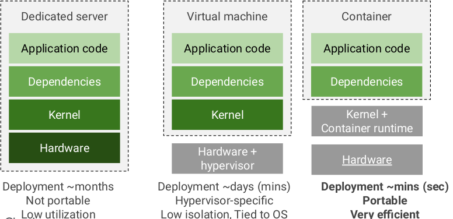
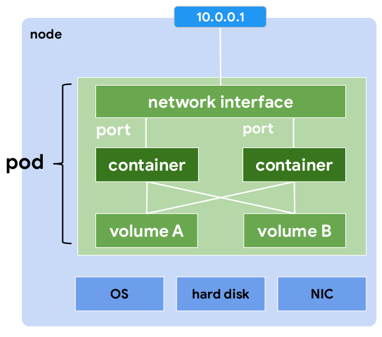
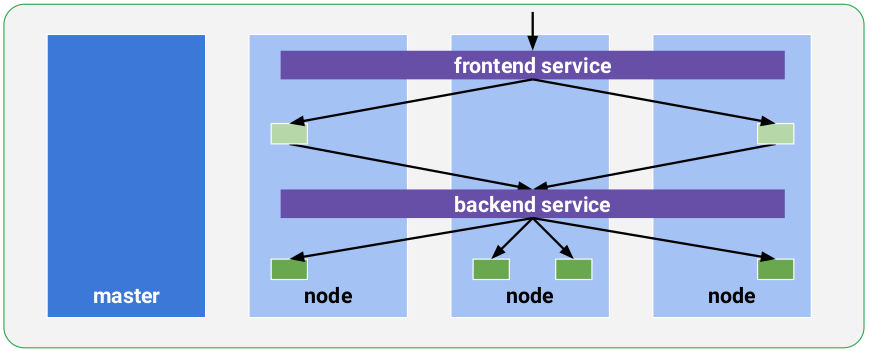
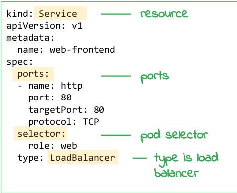
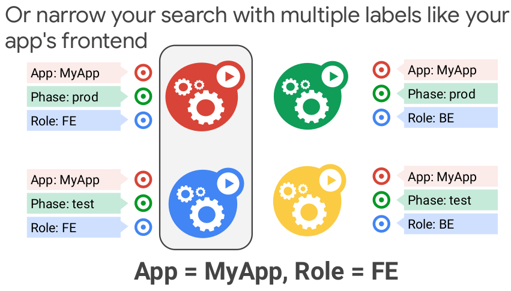

# Containers and Kubernetes 

---

## Docker knowledge
* Supplementary materials on Katacoda
  

---

# Containers

---

## Pre-requisites

* In this section, we assume that you know enough about Docker and Kubernetes
* And, we will cover running these in the cloud
* However,
  * To be on the same page,
  * let's dedicate a few slides to a quick overview

---

## Building from scratch


Notes:

* In the past, do you remember when you got a new server? You would install an OS on
  it, and then one by one install the various applications that you needed, such as a
  web server, maybe a database, Java runtime, maybe some web package software,
  etc. In many ways, it was similar to what you did on your personal computer (whether
  Windows or Mac or whatever). If you wanted to get fancy and add another web server
  or database later on for scaling, you bought another server. Each server had a
  purpose.
* The problem is that this wasted a lot of resources, took a lot of time to
  deploy, maintain, and scale, and was not very portable. In addition, many times
  applications were built assuming a specific OS and even hardware.

---

## VM step

* Then VMware popularized running multiple servers
  and operating systems on the same hardware


  
---

## Still hard

* it was difficult to run and maintain multiple
  applications on a single VM, even with policies


  
---

## Still wasteful

* The VM-centric way to solve this is to run each app
  on its own server with its own dependencies, but
  that's wasteful


  
---

## Virtualize the OS!



---

## What's good about containers

* Code works the same everywhere:
  * Across dev, test, & production
  * Across bare-metal, VMs, cloud
* Packaged apps speed development:
  * Agile creation and deployment
  * Continuous integration/delivery
  * Single file copy
* They provide a path to microservices:
  * Introspectable
  * isolated
  * elastic

---
## Virtualize the OS!


---

## Container history

* Google has been developing and using containers to
  manage its applications for 12 years


Notes:

* One of the reasons Google started with containers back in 2004 is that they helped
  Google get started in providing isolation. But at the time, isolation was limited, so they
  came up with an important container concept called cgroups. Google became
  successful in part because of how quickly they could serve search results pages. In
  order to provide search results, Google first builds an index which takes a lot of
  processing power. In fact, the search index has long-running jobs that use all of the
  processing power available if they can.

* But Google also has jobs that need to run queries. If you put jobs that build the index
  and run queries on the same server, jobs that build the index will use all of the
  processing power, and jobs that run queries will not have the processing power they
  need. So Google had to separate the servers that built the index from those that
  served results.

* Having different servers for different jobs becomes hard to manage. So Google
  developed a feature that strongly restricts the amount of resources that are available
  to jobs on a server. That was originally called a process container and then renamed
  a control group (or cgroup)—one of the bases for modern-day containers. The
  purpose of a cgroup is to limit the proportion of CPU and RAM capabilities a process
  can use.

* In addition to cgroups, Google also needed a way to allocate portions of disk and
  network resources which you'll learn about later.With cgroups, Google could guarantee batch work wouldn't steal all resources from
  interactive services, so they could combine these two jobs into a single server or sets
  of servers—called a cluster—and they built a cluster management system designed
  to get the most utilization out of the machines at all times.
  The system that Google built to manage all of this was called Borg. With Borg, you
  declare what you want (for example, 10,000 CPUs running the Gmail front end), and it
  will find space on the thousands of machines in that cluster to run your job—and more
  importantly, make sure it keeps running.

* Over time, there were other implementations of these ideas. In 2013, a company
  named Docker open-sourced and popularized the container as a compact
  image-packaging format for developers. Soon after that, a team of Googlers
  developed, and released as open source, a container orchestration system for Docker
  containers. This system was inspired by Borg, and it is called Kubernetes. In 2014,
  they announced and released Kubernetes to the open source community.


---

## Containers' layered file system

* Containers use a layered file system with only the top layer writable


---

## Smaller shared images

* Containers promote smaller shared images


---

# Docker

---

## 


* Source: DataDog

---

## Dockerizing example - code

* This application listens on port `8080` and reply

* `python web-server.py`

```python
import tornado.ioloop
import tornado.web
import socket
dependencies
class MainHandler(tornado.web.RequestHandler):
def get(self):
self.write("Hostname: " +
socket.gethostname())
def make_app():
return tornado.web.Application([
(r"/", MainHandler),
])
if __name__ == "__main__":
app = make_app()
listening on a port
app.listen(8080)
tornado.ioloop.IOLoop.current().start()
```


---

## Containerize it with Docker


Notes:

* Now containerize it. Here is the Dockerfile. It says that you want to use python version
  3.6 and run "python web-server.py"
* You use the "docker build" command to build the container.
* You use the "docker run" command to run the container.
* There are also other docker commands that you can use to manage your docker
  containers.

---

## Use Google docker registry


Notes:

* In the real world, you likely wouldn't just create a docker image locally and run it, etc.
  You'd want to push and pull your image to and from a container registry. Probably it is
  DockerHub.com

*There are many public container registries that you can use, or you can create a private
container registry to store container images for your organization. Google Container
Registry is one container registry.

---

## Containers on GCP

* App Engine supports Docker containers
  as a custom runtime
* Google Container Registry: private
  container image hosting on GCS with
  various CI/CD integrations
* Compute Engine supports containers,
  including managed instance groups
  with Docker containers
* The most powerful choice is a container
  orchestrator


---

## Quiz

* Docker Desktop is an app for building and sharing containerized apps and microservices available on which of the following operating systems?

  * A. macOS only

  * B. Linux only

  * C. Windows, macOS, and Windows Subsystem for Linux (WSL)

Notes:
* C.    
* While Docker Desktop is only available for Windows and macOS, it does support using a Linux command line via Windows Subsystem for Linux (WSL). For more information and set up, see the WSL + Docker documentation.
    
---

## Quiz

* Which is correct Docker command to rebuild a container image?

  * A. `docker rebuild`

  * B. `docker compile`

  * C. `docker build`


Notes:

* C.
* You use the docker build command to rebuild a container image. Once you've built an image, the image can't be changed. The only way to change an image is to create a new image.

---

## Quiz

* Which of the following sentences describe a container image the best?

  * A. A container image is a read-only portable package that contains software and may include an operating system.

  * B. A container image is a set of commands that builds a container.

  * C. A container image is a read-only portable package that contains software.

Notes:

* A.
* A container image is an immutable package that contains all the application code, system packages, binaries, libraries, configuration files, and the operating system running in the container. Docker containers running on Linux share the host OS kernel and don't require a container OS as long as the binary can access the OS kernel directly.

---

# Kubernetes

---

## What is Kubernetes (K8)

* Kubernetes manages jobs
* Jobs run containers on nodes


Notes:

* At the heart of the matter, Kubernetes manages jobs.
* Jobs run containers on nodes
* In Google Cloud, nodes are virtual machines running in Google Compute Engine.

---

## The real world

* In a real ecosystem, a cluster may have 1000s of nodes and multiple masters.
* Regional clusters have masters and nodes spread across 3 zones


Notes:

* In a real ecosystem, a cluster has may have 1000s of nodes and multiple masters.
* You can have up to 5,000 nodes in a cluster.
* Regional clusters have masters and nodes spread across 3 zones for high availability
  and resilience from single zone failure and downtime during master upgrades.
* By default, 3 masters are created per zone (for a total of 9 masters), but you can
  control the number with the --num-nodes flag..
* See the link for more details:
  https://cloud.google.com/blog/products/gcp/with-google-kubernetes-engine-regional-cl
  usters-master-nodes-are-now-highly-available

---

## Participant presentation

* Kubernetes use cases presented by the participants
* Karl Kornel
* Stanford team

---

## Masters schedule jobs

* Masters schedule jobs on nodes based on load


---

## And they can move

* And they can move them as needed to match resources


---

## Pod

* A job is called a Pod.
* It's analogous to a VM
* It can run multiple containers
* It shares networking and storage separate from the node


---

## Under the pod

* Underneath the pod you have
    * the node's hardware,
    * OS, and
    * NIC
    * And a node IP


 
---

## Inside the pod

* Inside you have the
  pod with its
  containers

* It gets its own
  network namespace  
  with unique IP and
  set of ports

* Data is stored in
  **volumes** in memory
  or persistent disks


Notes:

* Inside you have the pod. And then inside the pod, you have the containers and the
  network interfaces for the containers. It gets its own network namespace with a
  unique cluster IP and set of ports. Containers in the same Pod can communicate with
  each other using localhost.
* Data is stored in volumes that reside in memory or persistent disks.
* This is analogous to a VM and is highly-portable because you can move pods to other
  nodes without re-configuring or rebuilding anything.
* You typically only run 1 container per pod unless they have a hard dependency like a
  side-car application for logging or file updating.
* This also allows for very fine-grained scaling.

---

## GKE networking

* Networking
  between pods in
  different nodes can
  be managed in a
  master routing
  table or other
  means.

* GKE uses iptables
  in nodes and port
  forwarding for
  fewer points of
  failure (not shown).


Notes:

* Networking between nodes can be handled by a central routing table in masters or
  other means.
* GKE uses iptables and port forwarding in nodes so nodes can communicate with
  each other directly and load balancers do not introduce a single point of failure.
* For more information, see our other courses on GKE or "Understanding Kubernetes
  Networking: Pods"
  https://medium.com/google-cloud/understanding-kubernetes-networking-pods-7117dd28727

---

## Pod in YAML

* You define a pod with a YAML file

```text
apiVersion: v1
kind: Pod
metadata:
name: my-app
spec:
containers:
- name: my-app
image: my-app
- name: nginx-ssl
image: nginx
ports:
- containerPort: 80
- containerPort: 443
```


Notes:

* So how do you define a pod?
* Most things in Kubernetes are defined via the API, and you define a YAML document
  like this that you upload to the API server, where it runs your containers.

---

## YAML upload

* You upload the YAML file to the master


Notes:

After you create the pod file, you can upload it to the master.

---

## Master creates a pod

* And the master creates a pod on your set of nodes


Notes:

Then etcd on the master creates a pod on your set of nodes.

---

## Pod composition

* A pod file is composed of several parts; for example...


Notes:

* Going back to the definition, you have:
* The API version
* The resource kind (in this case a pod)
* Some metadata including the pod name
* A list of containers.
* In this case, you have two containers: my-app and nginx. NGINX serves as the app
  front end on two ports: 80 and 443.
* The containers can talk to each other using the pod's localhost network and my-app is
  the backend that doesn't need to be exposed on the network.
* Again, you upload it the file to the master and the master decides which node to run it
  on.

---

## Multiple pods

* A deployment ensures that N pods are running in a
  cluster at any given time


Notes:

* One other powerful concept in Kubernetes is the deployment, and this is how you
  ensure that N number of pods are running at a given time.
* If you upload the pod file as shown in the previous example, you will have one pod
  running in the cluster, which is fine, but if the pod or the node that the pod is running
  on stops or restarts, the pod will not be restored in the cluster.
* In order to restore it, you have to define and run a deployment with a ReplicaSet that
  defines how many pods you want running.
* In the previous example, it would be 1.

---

## YAML deployment

* You define a
  deployment with a
  YAML file


Notes:

* Here is a deployment YAML file which is similar to a pod file.
* In it, you have:
* The resource kind (in this case deployment)
* Metadata with the deployment name
* A ReplicaSet with the number of pods to run
* A selector label for choosing which pods to include in the deployment
* And pods with their labels and containers in a template.
* You identify and group pods with labels and select them in the deployment with a
  selector.
* In this example, you are going to run 4 pod replicas with role set to web.

---

## Running the pods

* You upload the YAML file to the master, and the
  scheduler decides where to run the pods


Notes:

* Then you upload the file to the master.
* When you do this, the master scheduler decides where to run the pods.
* In this case, you want 4 replicas, but only have 3 nodes so the scheduler doubles up
  pods on one of the nodes, perhaps the node with the least CPU utilization.

---

# Services, labels, selectors

---

## How pods talk to each other


---

Notes:

* Now that you have a deployment of replica pods running across your cluster, how do
  you get other pods or deployments to talk to them? They're not going to run in
  isolation. They probably need to communicate with other pieces of the cluster and
  other applications running in the cluster.

---

## Service

* A service assigns a fixed IP to your pod replicas and
  allows other pods or services to communicate with
  them


Notes:

* Pods aren’t meant to be persistent. They can be stopped or started for many reasons
  (like failed liveness or readiness checks). When they get restarted, they might have a
  different IP address, and this leads to a problem.
* That’s where Services come in.
* A service is a network abstraction in Kubernetes that provides a stable endpoint (or
  fixed IP) for a group of pods. This allows other pods or deployments to reference them
  as a unit and communicate with them over time.
  Services (like deployments) use selectors to determine what pods they operate on. If
  pods have the correct labels, they are automatically picked up and exposed by a
  service.
* The level of access a service provides to a set of pods depends on the service type.
* Currently, there are three types:
1. `ClusterIP (internal)`: The default type means that this Service is only visible
   inside the cluster.
2. `NodePort` gives each node in the cluster an externally accessible IP.
3. `LoadBalancer` adds a load balancer from the cloud provider that forwards traffic
   from the service to Nodes within it.

* Here is an example where you have a back-end service. You want other pods, say in
  the front-end, to talk to these pods. So you create a service that groups your pods in
  the back-end service and you tell your front-end pods to communicate through that
  service.
* The service creates a DNS entry with a fixed IP address that other pods and services
  can use to reach the service.

---

## Environments


Notes:

Source: https://dev.to/manuelmolina97/handling-multiple-environments-in-raw-php-3788

---

## Environments

| Environment/Tier Name                                              | Description                                                                                                                                                                                                                                                       |
|--------------------------------------------------------------------|-------------------------------------------------------------------------------------------------------------------------------------------------------------------------------------------------------------------------------------------------------------------|
| Environment/Tier Name                                              | Description                                                                                                                                                                                                                                                       |
| Local                                                              | Developer's desktop/workstation                                                                                                                                                                                                                                   |
| Development/Trunk                                                  | Development server acting as a sandbox where unit testing may be performed by the developer                                                                                                                                                                       |
| Integration                                                        | CI build target, or for developer testing of side effects                                                                                                                                                                                                         |
| Testing/Test/QC/Internal Acceptance                                | The environment where interface testing is performed. A quality control team ensures that the new code will not have any impact on the existing functionality and tests major functionalities of the system after deploying the new code in the test environment. |
| Staging/Stage/Model/Pre-production/External-Client Acceptance/Demo | Mirror of production environment                                                                                                                                                                                                                                  |
| Production/Live                                                    | Serves end-users/clients                                                                                                                                                                                                                                          |


---


## Multiple services

* You can have multiple services with different
  configurations and features



* To participants:
    * Can you give application examples that would be relevant to your area of research?

Notes:

* In this example, you want the front end publicly exposed, so you create another
  service.
* This time you want to receive traffic from outside your cluster. When you set the
  service type to load balancer, you get a Google Cloud Load Balancer and you can
  set details using Cloud Console or the GCP API.

---

## YAML, again

* You define a service with a YAML file



Notes:

* So once again, you create a service with a YAML file.
* It contains:
    * The kind of resource (it's a service)
    * A service name
    * The source and target ports
    * A pod selector
    * And the type (in this case, load balancer).

* In this case, the service is the front end. You set its port number (80) and its type
  (load balancer). The default type is Cluster IP which means that only services inside
  your cluster can access that service. Load balancer means it's external and can be
  reached from anywhere that knows the DNS name or IP address. The service also
  has selector set to role=web. So only pods with labels set to role=web will be included
  in the service.

---

## Labels are metadata

* Labels are metadata you can assign to any API
  object and represent identity

* They are
    * The only grouping mechanism for pods
    * Search by selectors


Notes:

* Labels are arbitrary metadata you can attach to any object in the Kubernetes API.
* Labels tell you how to group these things to get an identity. This is the only way you
  can group things in Kubernetes.
* So let's see an example.

---

## Example

* This example has four pods and three labels


Notes:

* Here we have 4 pods running. They each have 3 labels.
* One is the name of the app; another is the phase (whether is running in test mode or
  production); and the third is the role (whether it's part of the front end or back end).

---

## Query for labels

* You can query for labels that map to a value like the
  entire app


Notes:

* If you want to group these things and we wanted to get all the pods that map to
  MyApp—if for example we wanted to see how many pods are running as part of my
  entire application—we could filter requests with the App = MyApp label.

---

## Search with multiple labels



Notes:

* You could also narrow it even further by adding two labels to my query and say "I only
  want to see pods that are App, MyApp and Role front end.”

---

## Search back-end

* You can search your app's backend


  
---

## Search test phase

* You can search your app's test phase


Notes:

Operations folks may only want to look at your test pods.

---

## Search production release

* You can search your app's production release


Notes:

* Or your production pods.
* So you can see how labels and selectors can group pods or other items into sets with
  different semantic meanings for different users in Kubernetes.
* An example you've already seen is where services map pods into groups so you can
  route traffic to the right pods in your cluster.

---

## Kubelet

* Kubelet checks whether the pod is alive and healthy;
  if it gets a negative response or no reply...


* When to use
    * In a decomposed compute model
    * In a workflow chain where one piece fails for some reason

Notes:

* So we've talked about labeling. Let's talk about monitoring and health checks so
  nodes know they're running healthy pods.
* Each pod that you run can be monitored with a health check. The health check is run
  by the node and checks whether that pod is alive and healthy.
* After you define a health check, the Kubernetes component on the node, called the
  kubelet, issues a health check to the pod that asks "are you alive and healthy?"
  And if not, ...

---

## Pod restart

* Kubelet restarts the pod


Notes:

* ... the kubelet restarts that pod on the same node.

---

## Kubelet continues

* And continues until it gets a healthy reply


Notes:

* And the process continues until the kubelet gets a healthy reply.
* To define the health check, you specify an API request, an HTTP request, or a TCP
  port to check on the pod running on the node. And the kubelet continuously checks
  that request or port to make sure it's successful.
* So, you can get some resiliency out of your app by adding health checks to ensure
  that your application is healthy and ready to receive traffic.

---

# Volumes

## Kubernetes volumes

* Now let's look at how to get data into your pod and store data persistently using
  Kubernetes volumes.
* Even though a pod isn't meant to be persistent, its data may be.
* Docker also has a concept of volumes though it is somewhat looser and less
  managed than a Kubernetes volume.

---

## Docker volumes

* Docker provides data storage for containers, but volumes do
  not provide sharing between containers or lifecycle
  management


Notes:

* Docker allows containers to store data to on-disk files in their local storage area
  (/var/lib/docker/...), but they are ephemeral. When a container is deleted, any data
  written to this area is deleted.
* There is also a single shared data volume located at /data on the Docker host. This is
  mounted directly into host containers. When a container is deleted, any data stored in
  data volumes persists on the Docker host as long as the host continues to run.
* But lifetimes of Docker volumes are not managed, and until very recently there were
  only local disk-backed volumes.
* Docker now provides volume drivers (not shown) so volumes can reside off the host
  and remain persistent, but the functionality is limited for now.
* Also, when running multiple containers, it may be necessary to share files between
  containers, but this is not available with Docker drivers yet.

---

## Discussion

* Do you remember different storage tiers might be considered here?
* Price/performance tradeoff
* Would you know where to look for the slide?

---

## Quiz

* Which App Engine environment runs your application in Docker containers on Google Compute Engine virtual machines?

    * A. App Engine Standard Environment
    * B. App Engine Flexible Environment

Notes:

* B.
* In the standard environment, your application runs on a lightweight instance inside of a sandbox. This sandbox restricts what your application can do. For example, your application can not write to disk or use non-whitelisted binary libraries. The standard environment also limits the amount of CPU and memory options available to your application. Because of these restrictions, most App Engine standard applications tend to be stateless web applications that respond to HTTP requests quickly.In contrast, the flexible environment runs your application in Docker containers on Google Compute Engine virtual machines (VMs), which have fewer restrictions. For example, you can use any programming language of your choice, write to disk, use any library you'd like, and even run multiple processes. The flexible environment also allows you to choose any Compute Engine machine type for your instances so that your application has access to more memory and CPU.

---

## Quiz

* Kubernetes Engine's cluster autoscaler automatically add or remove nodes from the cluster as required

    * A. False
    * B. True

Notes:

* B. True
* Kubernetes Engine's cluster autoscaler automatically resizes clusters based on the demands of the workloads you want to run. With autoscaling enabled, Kubernetes Engine automatically adds a new node to your cluster if you've created new Pods that don't have enough capacity to run; conversely, if a node in your cluster is underutilized and its Pods can be run on other nodes, Kubernetes Engine can delete the node.

## Quiz

* Care should be taken when creating node pools in multizone clusters because node pools are automatically replicated to those zones

    * A. False
    * B. True

Notes:

* B. True
* If you created a multi-zone cluster, all of the node pools are replicated to those zones automatically. Any new node pool is automatically created in those zones. Similarly, any deletions delete those node pools from the additional zones as well.Note that because of this multiplicative effect, this may consume more of your project's quota for a specific region when creating node pools.

---    

## Kubernetes volumes

* Kubernetes volumes allow containers in pods to
  share data and be stateful


Notes:

Kubernetes volumes solve both of these problems.
Volumes are a way for containers within a pod to share data, and they allow for Pods
to be stateful. These are two very important concerns for production applications.
There are many different types of volumes in Kubernetes. Some of the volume types
include long-lived persistent volumes, temporary, short-lived emptyDir volumes, and
networked nfs volumes.

---

## A volume is a directory

* A volume is just a directory, and how it gets created
  depends on its type

```shell script
$> kubectl create <volume>
```


Notes:

At its core, a volume is just a directory that is accessible to the containers in a pod.
How that directory is created, the medium that backs it, and its contents are
determined by the particular volume type used.
The slide images follow the lifecycle of a typical volume. In this case, it's an NFS
volume.
You begin by creating the volume in your cluster.

---

## Pod consumes that data

* Then you create a pod that consumes that data

```shell script
$> kubectl create -f pod.yaml
```


Notes:

* After you have a volume, you create a pod that consumes that data. In this example,
  that is done with the kubectl create command.

---

## Volume attached to the pod


Notes:

* After the pod is created, the volume is attached to the pod. This volume is made
  available to any container in the pod before the containers are brought online.

---

## Data access

* Once the volume is attached, data can be mounted
  into a container's file system


---

## Discussion

* Do you think it possible to have multiple volumes?
    * For example, with different performance characteristics) mounted in a single container?
    * Fast data and slow data?

---    

## Container reads data

* Then the container is run and can get the mounted
  data


Notes:

* After the data in volumes is mounted, the containers in the pod are brought online and
  the rest of pod initialization happens as before.
* In this example, you have an NGINX pod running an NFS volume. So you attach the
  volume at the mount volume directory when the pod gets run, and then the NGINX
  container can see that /mnt/vol directory and it can get the data from it.
* Volumes, like those backed by block stores, may outlive the pod. They will be
  unmounted when a pod goes away and get remounted on new machines if needed.
* Some volumes, like ConfigMaps, cease to exist when the pod ceases to exist.

---

## Volume lifecycle

* Some volumes share the lifecycle of their pod


Notes:

* Some volumes, like ConfigMaps and Secrets, are coupled to the life of the pod and
  cease to exist when the pod ceases to exist. One class of volume is a persistent
  volume that has a life cycle of its own, independent of the pod.
* Secrets are a way to store sensitive, encrypted data, such as passwords or keys. These are used to keep developers from having to bake sensitive information into
  their pods and containers. Secrets are stored in a temporary filesystem so that they’re
  never written into non-volatile storage.
* ConfigMaps are subtly different. They are used for non-sensitive string data. Storing
  configuration, setting command line variables, and storing environment variables are
  natural use cases for ConfigMaps.
* Currently, Secrets and ConfigMaps are stored in etcd.

---

# Kubernetes on GCP - GKE

## GCP compute and processing options

|                  | Compute Engine    | Container Engine ***| App Engine  Standard and Flexible                     | Cloud Functions           |
|------------------|-------------------|---------------------|-------------------------------------------------------|---------------------------|
| Support language | Any               | Any                 | Java, Python, Go, NodeJS                              | Triggers                  |
| Usage model      | IaaS              | IaaS, PaaS          | PaaS                                                  | Microservices             |
|                  | Server            | Cluster             | Autoscaling managed servers                           | Serverless                |
| Primary use case | General workloads | Container workloads | Scalable web applications Mobile backend applications | Lightweight Event Actions |

---

## Google Container Engine (GKE)

* Fully-managed service
    * Kubernetes software maintained
    * SLA
* Docker format containers
* Autoscaling (CPU or memory)
* Stackdriver logging and monitoring
* Cloud VPN integration
    * Hybrid cloud and on premise solutions
* Cloud IAM integration


---

## Container Cluster

* Each node runs:
    * Docker runtime
    * Kubelet agent
        * Manages scheduled Docker containers
* Network proxy


--- 

## Kubernetes master endpoint


--- 

## Cluster view


Notes:

* Here's a complete overview of a cluster with its key components.
* You have a set of master servers and worker nodes. The masters provide the control
  plane for the cluster. Worker nodes run pods with containers in them.
* Cluster administrators configure the cluster by sending requests to apiservers on
  masters using a command-line tool called kubectl. Kubectl can be installed and run
  anywhere.
* From there, the apiserver communicates with the cluster in two primary ways:
    * To the kubelet process that runs on each node
    * To any node, pod, or service through the apiserver's proxy functionality (not
      shown).
* Then pods are started on various nodes. In this example, there are two types of pods
  running (shown in yellow and green).
* There is also a process on each node called kube-proxy (not shown) that sets up
  networking rules and connection forwarding for services and pods on the host.
* Although networking and data storage services are shown outside nodes, most
  functionality resides on nodes.
* You can also access the apiserver using a web interface called the dashboard viakubectl proxy (not shown).

---

# Kubernetes on AWS

## Amazon Elastic Container Registry


---


## Running Kubernetes on AWS


---

## Amazon EKS

* Amazon Elastic Kubernetes Service (Amazon EKS)
    * Start, run, and scale Kubernetes applications in the AWS cloud or on-premises.
    * Amazon EKS helps you provide highly-available and secure clusters
    * Automates key tasks such as patching, node provisioning, and updates

* EKS runs upstream Kubernetes
    * Certified Kubernetes conformant
    * You can easily migrate any standard Kubernetes application to EKS without needing to refactor your code.

* Amazon EKS Distro
    * Host and operate your Kubernetes clusters on-premises and at the edge
    * AWS Outposts
    * AWS Wavelength
    * Amazon EKS Anywhere is coming in 2021.


---

## EKS workshop

* multiple ways to configure VPC, ALB, and EC2 Kubernetes workers
* and Amazon Elastic Kubernetes Service


---    

## Create user


---    

## Login to AWS Workshop Portal

* The workshop creates an AWS account and a Cloud9 environment


---    

## Launch Cloud9


---    

## In Cloud9


---

## On command-line

* Install kubectl

```shell script
sudo curl --silent --location -o /usr/local/bin/kubectl \
   https://amazon-eks.s3.us-west-2.amazonaws.com/1.17.11/2020-09-18/bin/linux/amd64/kubectl

sudo chmod +x /usr/local/bin/kubectl
```

* Update awscli
* Install jq, envsubst (from GNU gettext utilities) and bash-completion
* Install yq for yaml processing
* set the AWS Load Balancer Controller version

* Create the role `eksworkshop-admin `

---
## Create an EKS cluster

```shell script
eksctl create cluster -f eksworkshop.yaml
```
* Test the cluster

```shell script
kubectl get nodes
```

* Export the Worker Role Name for use throughout the workshop

* **Congratulations!**
* You now have a fully working Amazon EKS Cluster that is ready to use!

---

## Deploy applications with Amazon EKS in the cloud


---

## Deploy applications with Amazon EKS Anywhere


---

# Kubernetes on Azure

## Azure container registry


---

## Example of Kubernetes use on Azure


---

## Azure Kubernetes Service (AKS)

* Elastic provisioning of capacity without the need to manage the infrastructure, and with the ability to add event-driven autoscaling and triggers through KEDA


---

## Discussion

* Does anyone know of an example of autoscaling support from Research applications?
* Outside of very big science?
* (Sounds fairly fancy for a typical research project, but perhaps useful in sensor network applications, or where instruments can burst out data and events can be used to scale up data processing?)

---

## Azure Kubernetes Service (AKS)

* "Faster end-to-end development experience" (MSFT) through Visual Studio Code Kubernetes tools, Azure DevOps, and Azure Monitor


---

## Azure Kubernetes Service (AKS)

* Advanced identity and access management using Azure Active Directory, and dynamic rules enforcement across multiple clusters with Azure Policy

    * Single sign-on to any cloud app
    * Enforce Multi-Factor Authentication with SaaS
    * Works with multiple platforms and devices
    * Integrate with on-premises Active Directory
    * "Enterprise" (large production) Scale and SLA
    * To discuss - can you think of relevant use cases?


---

## Anthos - multicloud from Google


---
## What is Anthos?


* (Image from ZDnet)

---

## Anthos at a glance


* Anthos works on [AWS](https://cloud.google.com/anthos/gke/docs/aws) and is in preview on Azure
* Anthos will be covered in more detail in the next section
---


## Congrats on completion


---