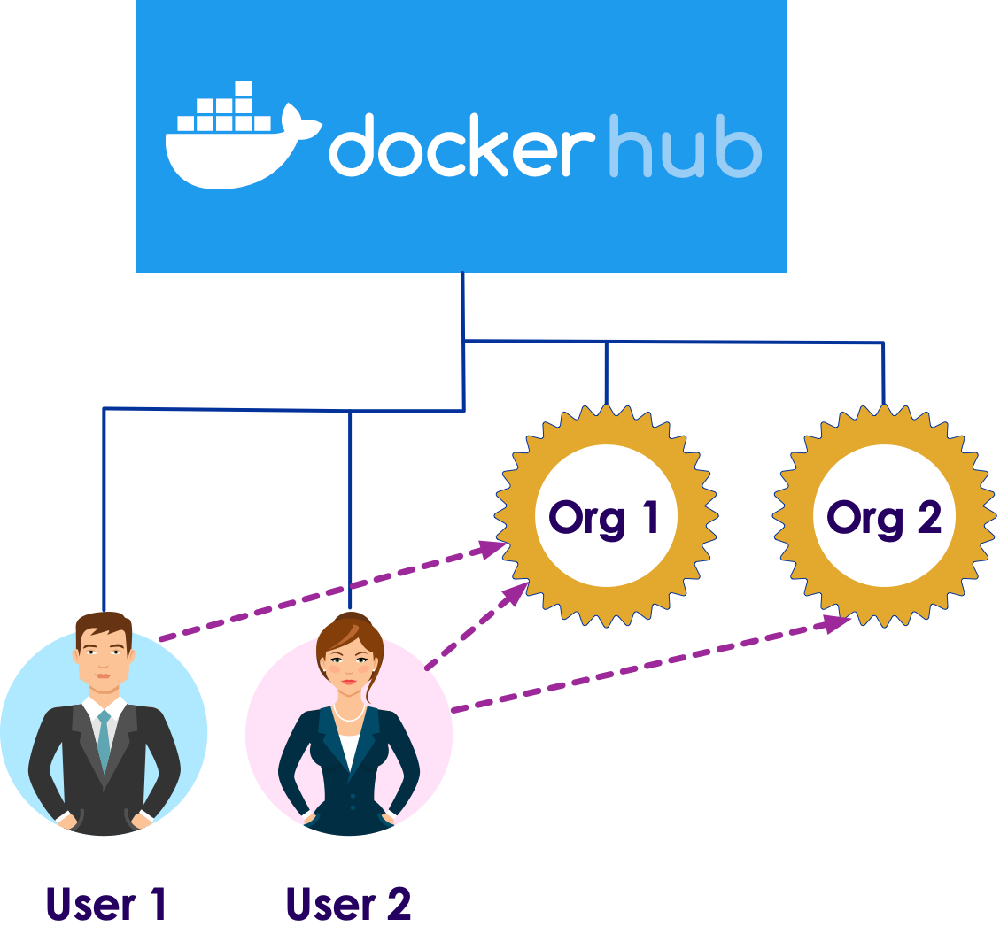
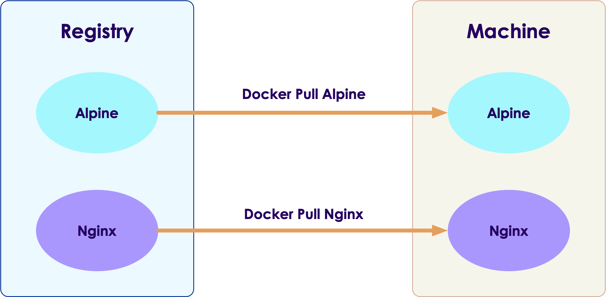

# Developing With Docker

---

# Dockerfile

---

## Dockerfile

* We like to automate the image creation process

* Dockerfile provides instructions for creating images

* Here is an example

<br/>

```Dockerfile
FROM ubuntu:latest

RUN apt update && apt upgrade -y

RUN apt install -y openjdk-jdk11-headless

RUN mkdir -p /data

COPY README.md   /data/README.md

CMD ["/bin/bash"]
```
<!-- {"left" : 0.85, "top" : 4.32, "height" : 3.7, "width" : 8.08} -->

* Each instruction (RUN, COPY ..etc) will create a new layer

---

## Dockerfile Explained

* **`FROM`** specifies our starting image
    - Here, we use Ubuntu:latest

* Once we have the base image, we can add to it by creating layers

* **`RUN`** commands allow us to run arbitary commands to build the image
    - Here we are using `apt` to install some packages

* **`COPY`:** copies files from host to image, during the build process 

```Dockerfile
# The base image
FROM ubuntu:latest
RUN apt install -y openjdk-jdk11-headless
RUN mkdir -p /data
COPY README.md   /data/README.md
```
<!-- {"left" : 0.85, "top" : 6.86, "height" : 1.74, "width" : 7.61} -->


Notes:

Instructor Notes :

Participant Notes :

---

## Dockerfile Explained

* **`ENV`** is used to set environment variables for the container

* When the container starts we will have both **`JAVA_HOME`** and **`PATH`** variables setup

```Dockerfile
ENV JAVA_HOME=/usr/java/latest
ENV PATH=/bin/:/usr/bin:${JAVA_HOME}/bin

FROM ubuntu:latest
RUN apt install -y openjdk-jdk11-headless
RUN mkdir -p /data
COPY README.md   /data/README.m
```
<!-- {"left" : 0.85, "top" : 4.34, "height" : 2.32, "width" : 7.61} -->


---

## Dockerfile Explained

* Dockerfile build runs as root user (within container)

* We can specify a **`USER`** to specify a user

* The final line is usually **`CMD`**  or **`ENTRYPOINT`**
    - **`CMD`** sets default command and/or parameters, which can be overwritten from command line when docker container runs.
    - **`ENTRYPOINT`** command and parameters will not be overwritten from command line. Instead, all command line arguments will be added after ENTRYPOINT parameters.

```Dockerfile
...
USER ubuntu  # start the container as ubuntu user
CMD ["/bin/bash"]
# or 
ENTRYPOINT ['/startup.sh', '$1']
```
<!-- {"left" : 0.85, "top" : 7.2, "height" : 1.74, "width" : 8.96} -->


---

## Building  an Image

* We use the **`docker build`** command to build.

* Watch the output -- it will be long!
    - Notice each command (RUN / COPY) runs as a STEP
    - We see layers are being built
    - Build process uses caches of previous layers if available

```bash
# It will automatically look for a file called 'Dockerfile'
# we are tagging our image as 'ubuntu-java'
$   docker build .  -t ubuntu-java
```
<!-- {"left" : 0.85, "top" : 5.49, "height" : 1.15, "width" : 10.61} -->


```console
Step 1/5 : FROM ubuntu:latest
 ---> fb52e22af1b0
Step 2/5 : RUN apt update && apt upgrade -y
 ---> Using cache
 ---> 8a1fc577ba15
Step 3/5 : RUN apt install -y openjdk-11-jdk-headless
 ---> Using cache
 ---> 5d4024d59168
Step 4/5 : COPY README.md   README.md
 ---> 24ba851d41e2
Step 5/5 : CMD ["/bin/bash"]
 ---> Running in 298078da4389
Removing intermediate container 298078da4389
 ---> d57c33f4ad15
Successfully built d57c33f4ad15
Successfully tagged ubuntu-java:latest

```
<!-- {"left" : 0.85, "top" : 6.79, "height" : 4.94, "width" : 9.61} -->

Notes:

---

## Lab: Dockerfile

 <!-- {"left" : 12.99, "top" : 0.23, "height" : 5.3, "width" : 3.98} -->

* **Overview:**
  - Build images using Dockerfile

* **Approximate run time:**
  - 20-30 mins

* **Instructions:**
  - Dockerfile-1 lab

Notes:

---

## Dockerfile Best Practices

* Start **`FROM`** a well defined image

```Dockerfile
# risky!
FROM python:latest
```
<!-- {"left" : 0.85, "top" : 2.67, "height" : 0.86, "width" : 3.78} -->

* Here we are building from `python:latest`

* If our app is only tested with python 3.6, we can be specific about the version

* This is called **version pinning** - because latest may not be always the best option

```Dockerfile
# start from a verified version
FROM python:3.6
```
<!-- {"left" : 0.85, "top" : 7, "height" : 0.86, "width" : 5.94} -->

---
## Dockerfile Best Practices

* Common pattern for **`apt`** installs

* Start with `apt update`  and `apt upgrade`

* Do an `apt update` before each `apt install`.  This helps to refresh the cache, in case your image is old and new software is available

* And cleanup APT files after the installs are done

* References
    - [Dockerfile best pratices](https://docs.docker.com/develop/develop-images/dockerfile_best-practices/)

```Dockerfile
# initialize and upgrade apt repo
RUN apt-get update --fix-missing -yq && \
        apt-get -yq upgrade

# Do all apt installs
RUN apt-get update && apt-get install vim wget

# cleanup apt repo files
RUN rm -f /etc/apt/apt.conf.d/01proxy  && \
        apt-get clean && \
        rm -rf /var/lib/apt/lists/*
```
<!-- {"left" : 0.85, "top" : 7.5, "height" : 3.49, "width" : 8.44} -->


---

## Dockerfile Best Practices

```Dockerfile
RUN apt-get update && apt-get install package1
RUN apt-get update && apt-get install package2
RUN apt-get update && apt-get install package3
```
<!-- {"left" : 0.85, "top" : 2.16, "height" : 1.15, "width" : 8.44} -->


* Bad practice:
    - We do `apt-get update` many times, this fetches data over the network and slow
    - And we are adding many layers
* Combine installs into as few statements as possible

```Dockerfile
RUN apt-get update && \
    apt-get install package1 \
                    package2 \
                    package3
```
<!-- {"left" : 0.85, "top" : 6.51, "height" : 1.44, "width" : 5.78} -->


* Keep package names one per line, and sort package names to avoid duplicates and ease of maintanance!

```Dockerfile
# don't do this
RUN apt-get update && apt-get install -y   a c b

# do this
RUN apt-get update && apt-get install -y   \
            a \
            b \
            c
```
<!-- {"left" : 0.85, "top" : 9.5, "height" : 2.17, "width" : 7.31} -->


---

## Dockerfile Best Practices

* Don't bust the cache

```Dockerfile
# Don't do this!
COPY RELEASE.md   /RELEASE.md

RUN apt-get update && apt-get install packages
```
<!-- {"left" : 0.85, "top" : 2.62, "height" : 1.44, "width" : 8.44} -->


* Here every time we update the `RELEASE.md`
    - Docker has to start building from the `COPY` statement
    - And build all following layers; It will re-install the packages again
    - Cache is busted

* Do this instead

```Dockerfile

RUN apt-get update && apt-get install packages

# copy resources as close to the end as possible
COPY RELEASE.md  /RELEASE.md
```
<!-- {"left" : 0.85, "top" : 7.2, "height" : 1.44, "width" : 8.78} -->

* So when we update `RELEASE.md` previous layers can be reused and only the `COPY` statement and below has to be executed

---

## Dockerfile Best Practices

* Avoid running the container as **`root`** (admin)

* By default, Dockerfiles are built in root context

* So when the container is started, it starts as `root` user

* But generally it is not a good practice to run applications as `root` user

* Create a dedicated user

```Dockerfile
# create user 'ubuntu' and group 'ubuntu' with id=1000
# create '/home/ubuntu' home directory and make it owned by user ubuntu
RUN groupadd -g 1000 ubuntu && \
    useradd -rm -d /home/ubuntu -s /bin/bash -g ubuntu -u 1000 ubuntu && \
    mkdir -p /home/ubuntu  && \
    chown -R ubuntu:ubuntu /home/ubuntu

# And just before CMD, switch user to ubuntu
# And set the working directory to '/home/ubuntu'
USER  ubuntu
WORKDIR  /home/ubuntu
```
<!-- {"left" : 0.85, "top" : 6.55, "height" : 3.49, "width" : 13.11} -->


---

## Lab: Inspect Various Dockerfiles

 <!-- {"left" : 12.99, "top" : 0.23, "height" : 5.3, "width" : 3.98} -->

* **Overview:**
  - We will inspect and learn from various Dockerfiles from open source projects

* **Approximate run time:**
  - 15 mins

* **Instructions:**
  - Instructor, demo these Dockerfiles.
  - Students, please share your findings with the class
  - [Python docker](https://github.com/docker-library/python) - 3.6 --> alpine
  - [Nginx](https://github.com/nginxinc/docker-nginx) - stable --> debian
  - [Jupyter](https://github.com/jupyter/docker-stacks) as extensive Dockerfiles.  Examine 'scipy' and 'tensorflow' Dockerfiles

Notes:

---

## Lab: Improve a Dockerfile

 <!-- {"left" : 12.99, "top" : 0.23, "height" : 5.3, "width" : 3.98} -->

* **Overview:**
  - Inspect the dockerfile and fix the issues

* **Approximate run time:**
  - 15 mins

* **Instructions:**
    - Dockerfile-2 lab

Notes:

---

## Lab: Package a Python Application

 <!-- {"left" : 12.99, "top" : 0.23, "height" : 5.3, "width" : 3.98} -->

* **Overview:**
  - Bundle a flask web application

* **Approximate run time:**
  - 20 mins

* **Instructions:**
    - Dockerfile-3 lab

Notes:

---

# Using Registries

---

## Registries

* Registries are like github/appstore for Docker images;  It is how we share images
    - Users can be part of multiple organizations
    - Repositories can be owned by users or organizations

* We can publish images to registry (**push** operation)

* We can download images from registry (**pull** operation)

* Registries can be:
    - private registries
    - cloud providers' registries ([Google Container Registry (GCR)](https://cloud.google.com/container-registry),  [AWS Elastic Container Registry](https://aws.amazon.com/ecr/), [Azure Container Registry (ACR)](https://aws.amazon.com/ecr/))
    - [Dockerhub](https://hub.docker.com)

---

## Dockerhub

 <!-- {"left" : 10.75, "top" : 0.46, "height" : 5.94, "width" : 6.36} -->

* Dockerhub is the most popular registry (like Github)
    - Encourages sharing docker images, just like Github promoted 'social coding'

* It provides individual accounts and organizational accounts

* Any one can 'pull' (download) public docker images ; User account is needed to
    - push (upload) images
    - access private images

* [Dockerhub](https://hub.docker.com)

---

## Pulling a docker image 

 <!-- {"left" : 3.44, "top" : 2.12, "height" : 5.22, "width" : 10.63} -->

```bash
$  docker images

# download latest nginx
$  docker pull nginx  
# this will take some time

$  docker images 
# should see nginx now
```
<!-- {"left" : 0.85, "top" : 8.2, "height" : 2.61, "width" : 5.11} -->

---

## Pushing an Image to Dockerhub

* To push the image to Dockerhub:
    - Must have a user account with Dockerhub
    - And the image must be appropriately tagged

* Images must be tagged in a format : **`user_id/image_name`**

* Images will be pushed layer by layer
    - And if dockerhub already has a layer (say base image ubuntu) it will reuse that
    - This speeds up push/pull and promotes layer reuse

```bash

$   docker login
# enter username and password

# Let's say we have an image 'my-ubuntu'
# And my username is 'sujee'
$   docker tag  my-ubuntu  sujee/my-ubuntu

$   docker push  sujee/my-ubuntu
# you will see individual layers being pushed
```
<!-- {"left" : 0.85, "top" : 7.11, "height" : 2.9, "width" : 8.28} -->


---

## Lab: Use a Local Registry

 <!-- {"left" : 12.99, "top" : 0.23, "height" : 5.3, "width" : 3.98} -->

* **Overview:**
  - Run a local registry

* **Approximate run time:**
  - 15 mins

* **Instructions:**
    - Registry-1

Notes:

---

## Lab: Push an Image to Dockerhub

 <!-- {"left" : 12.99, "top" : 0.23, "height" : 5.3, "width" : 3.98} -->

* **Overview:**
  - Build a custom image and push it to Dockerhub

* **Approximate run time:**
  - 20 mins

* **Instructions:**
    - Registry-2

Notes:

---

## Review and Q&A

<!-- {"left" : 13.24, "top" : 0.81, "height" : 2.61, "width" : 3.51} -->
* Let's go over what we have covered so far

* Any questions?

<!-- {"left" : 4.55, "top" : 5.4, "height" : 5.59, "width" : 8.4} -->
