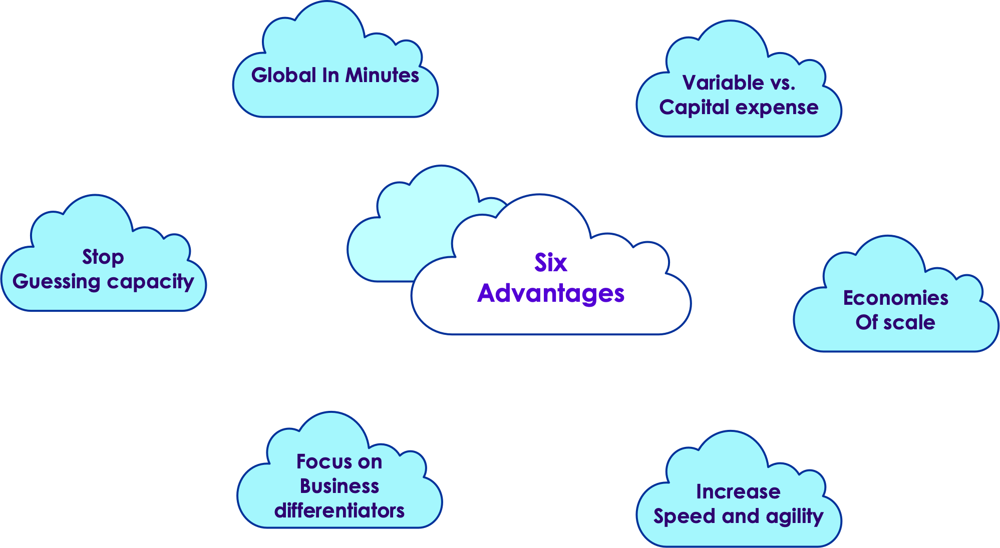

# Introducing the Cloud

 <!-- {"left" : 2.92, "top" : 7.35, "height" : 1.44, "width" : 2.19} -->

---

## Agenda

* Introducing the cloud and the cloud providers
* Common cloud concepts
* AWS, Azure, GCP observations
* Cloud comparisons

---

# Cloud Computing

---

## What is Cloud Computing

* Shared resources

* On-demand

* Easily scalable

* Accessed via internet

 <!-- {"left" : 2.92, "top" : 7.35, "height" : 1.44, "width" : 2.19} -->

---

## Advantages of Cloud

 <!-- {"left" : 2.92, "top" : 7.35, "height" : 1.44, "width" : 2.19} -->

---

## Cloud Market Share

 <!-- {"left" : 2.92, "top" : 7.35, "height" : 1.44, "width" : 2.19} -->

---

## Market Players Positioning

 <!-- {"left" : 2.92, "top" : 7.35, "height" : 1.44, "width" : 2.19} -->

* [Source](https://www.researchgate.net/figure/Global-cloud-providers-competitive-positioning-IaaS-PaaS-hosted-private-cloud-third_fig2_350979547)

---

## AWS vs Azure vs GCP

* The major providers have all the core functionalities covered well

* AWS:
  * 80 Availability Zones within 25 geographic regions around the world, with announced plans for 15 more Availability Zones and 5 more AWS Regions in Australia, India, Indonesia, Spain, and Switzerland.

* Azure:
   * 54 regions worldwide, available in 140 countries

* GCP:
   * 25 regions, 76 zones, 200 + countries
  
* Resources
    - [Cloud feature comparison 1](https://cloud.google.com/free/docs/aws-azure-gcp-service-comparison)
    - [Cloud provider comparison 2](https://recro.io/blog/top-5-cloud-service-providers/)

---

## Regions and Availability Zones

* Each region consists of multiple availability zones.

* Each availability zone is physically separated and isolated from the others.

* All availability zones within a region are connected to one another via highly redundant, low-latency, high-speed networks.
    - For GCP, regions are also connected with cable network
    - For Azure, regions may be couple into primary and secondary  

---

## Regions and AZ Best Practices

* Nearest to your physical location and/or your users’ location to minimize network latency

* Not all regions are equal

* Service offerings (newly deployed services are first offered in selected regions only)

* Pricing is not equal across multiple regions, use cost calculators

* Service Level Agreement (SLA) will vary by region

* Compliance such as GDPR is specific to a country therefore it varies region-to-region
    - Example: IRB-approved data with an audience that spans continents

---

## Fault Tolerance with Multiple Availability Zones

* If you distribute your instances across multiple Availability Zones and one instance fails, you can design your application so that an instance in another Availability Zone can handle requests

* Availability Zones give you the flexibility to launch production apps and resources that are highly available, resilient/fault-tolerant, and scalable as compared to using a single data center

* Large files (videos ..etc) may be better delivered through CDN. Cloud vendors usually offer Content Delivery Network (CDN)

---

## Cloud Service Models for Pizza

---

## Cloud Service Models

* Left: we manage

* Right: Cloud provider manages

---

## Cloud Migration Strategies

* 6 Strategies for Migrating Applications to the Cloud, or **6 R**'s

1. Rehosting — Otherwise known as “lift-and-shift.”

2. Replatforming — sometimes called this “lift-tinker-and-shift.”

3. Repurchasing — Moving to a different product.

4. Refactoring / Re-architecting

5. Retire — Get rid of.

6. Retain — Usually this means “revisit” or do nothing (for now).

* Resources
    - [6-strategies-for-migrating-applications-to-the-cloud](https://aws.amazon.com/blogs/enterprise-strategy/6-strategies-for-migrating-applications-to-the-cloud)

---

# A Quick Tour of Cloud Offerings

---

## Cloud Market Share

 <!-- {"left" : 2.92, "top" : 7.35, "height" : 1.44, "width" : 2.19} -->

---

## AWS (Amazon Web Services)

 <!-- {"left" : 2.92, "top" : 7.35, "height" : 1.44, "width" : 2.19} -->

 <!-- {"left" : 2.92, "top" : 7.35, "height" : 1.44, "width" : 2.19} -->

* AWS is the **very first public cloud service** to be launched

* AWS is current market leader in Cloud space (34% marketshare)

* AWS offers more than 1,000 services, and it keeps adding services at regular intervals.

* [aws.amazon.com](https://aws.amazon.com/)

---

## Microsoft Azure

 <!-- {"left" : 2.92, "top" : 7.35, "height" : 1.44, "width" : 2.19} -->

* Azure is Microsoft's portfolio of integrated cloud services, built for developers and IT professionals

* Launched in 2010, growing very rapidly (2nd to AWS)

* Microsoft pivoted to **Cloud First** strategy.  Everything that Microsoft builds and develops is first made for Azure and Microsoft's other cloud offerings.

* In addition to the standard cloud components (Compute, Storage ..etc), Azure also offers proprietary Microsoft technologies, like Windows Desktops, Active Directory ..etc

* [portal.azure.com](https://portal.azure.com/)

---

## Google Compute Platform (GCP)

 <!-- {"left" : 2.92, "top" : 7.35, "height" : 1.44, "width" : 2.19} -->

* Google had had a long history of building cloud-enabling technology (with a heavy focus on big data) before its cloud services were launched

* They are late comer to 'public cloud' and 3rd in market cap

* Trying to differentiate themselves in **Machine Learning / AI** space

 <!-- {"left" : 2.92, "top" : 7.35, "height" : 1.44, "width" : 2.19} -->

---

## A Cloud Stack

* Here is a typical stack in the cloud.

* Most vendors would offer these in some form.

| Stack            | Description                                              |
|------------------|----------------------------------------------------------|
| Compute          | On demand virtual machines                               |
| Servless Compute | Computation without explicitly provisionion VMs          |
| Storage          | On demand, scalable storage                              |
| Databases        | Managed datastores (SQL and noSQL)                       |
| Containers       | Container hosting and serving (Docker, Kubernetes ..etc) |
| Queue            | Managed queue services for streaming data                |
| Analytics        | Analytics stack often supporting Big Data                |
| Machine Learning | Hosted ML/DL infrastructure                              |
| Monitoring       | Monitor infrastructure, gather and analyze logs          |

---

## Compute Services

| Services             | AWS                                            | Azure                          | GCP                          |
|----------------------|------------------------------------------------|--------------------------------|------------------------------|
| IaaS                 | Amazon Elastic Compute Cloud                   | Virtual Machines               | Google Compute Engine        |
| PaaS                 | AWS Elastic Beanstalk                          | App Service and Cloud Services | Google App Engine            |
| Containers           | Amazon Elastic Compute Cloud Container Service | Azure Kubernetes Service (AKS) | Google Kubernetes Engine     |
| Serverless Functions | AWS Lambda                                     | Azure Functions                | Google Cloud Functions       |

 <!-- {"left" : 2.92, "top" : 7.35, "height" : 1.44, "width" : 2.19} -->

---

## Storage

| Services       | AWS                           | Azure                      | GCP                                    |
|----------------|-------------------------------|----------------------------|----------------------------------------|
| Object Storage | Amazon Simple Storage Service | Azure Blob Storage         | Google Cloud Storage                   |
| Block Storage  | Amazon Elastic Block Store    | Azure Block Storage        | Google Compute Engine Persistent Disks |
| Cold Storage   | Amazon Glacier                | Azure Archive Blob Storage | Google Cloud Storage Nearline          |
| File Storage   | Amazon Elastic File System    | Azure File Storage         | Google Filestore                       |

 <!-- {"left" : 2.92, "top" : 7.35, "height" : 1.44, "width" : 2.19} -->

---

## Networking

| Services        | AWS                                | Azure                    | GCP                         |
|-----------------|------------------------------------|--------------------------|-----------------------------|
| Virtual Network | Amazon Virtual Private Cloud (VPC) | Virtual Networks (VNets) | Virtual Private Cloud       |
| Load Balancer   | Elastic Load Balancer              | Load Balancer            | Google Cloud Load Balancing |
| Peering         | Direct Connect                     | ExpressRoute             | Google Cloud Interconnect   |
| DNS             | Amazon Route 53                    | Azure DNS                | Google Cloud DNS            |

 <!-- {"left" : 2.92, "top" : 7.35, "height" : 1.44, "width" : 2.19} -->

---

## Datastores

| Services         | AWS                                | Azure           | GCP                                          |
|------------------|------------------------------------|-----------------|----------------------------------------------|
| RDBMS            | Amazon Relational Database Service | SQL Database    | Google Cloud SQL                             |
| NoSQL: Key–Value | Amazon DynamoDB                    | Table Storage   | Google Cloud Firestore/Google Cloud Bigtable |
| NoSQL: Indexed   | Amazon SimpleDB                    | Azure Cosmos DB | Google Cloud Datastore                       |

 <!-- {"left" : 2.92, "top" : 7.35, "height" : 1.44, "width" : 2.19} -->

---

## Comparing Cloud Vendors

* Please keep in mind, this is a very fluid market and things change very rapidly

 

| AWS                             | Azure                          | GCP                                           |
|---------------------------------|--------------------------------|-----------------------------------------------|
| Maturity                        | Great for developers           | Aggressive growth                             |
| Service portfolio               | Integration with open source   | Attractive pricing models                     |
| Presence (market and geography) | Private datacenter integration | Best for AI and machine learning applications |

 

* More references
    - [This differentiates core service offerings](https://www.veritis.com/blog/aws-vs-azure-vs-gcp-the-cloud-platform-of-your-choice/)
    - [This is community sourced and has a feature matrix](https://spaces.at.internet2.edu/display/CA/Cloud+Provider+Feature+Matrix)

---

# Cloud Case Studies

TODO

---

# Knowledge Checks

---

## Quick Knowledge Check

* Which is the order of cloud leaders, by market size?

    * A) Azure, GCP, AWS
    * B) GCP, Azure, AWS
    * C) AWS, GCP, Azure
    * D) AWS, Azure, GCP

Notes:

The correct answer is D

---

## Quick Knowledge Check

* Which represents the correct order, from the most to the least amount of work done by you?

    * A) On Prem, IaaS, PaaS, SaaS
    * B) SaaS, PaaS, IaaS, On Prem
    * C) IaaS, PaaS, SaaS, On Prem
    * D) SaaS, IaaS, PaaS, On Prem

Notes:

The correct answer is B

---

## Quick Knowledge Check

* A company wants to move to the cloud as their existing data center lease is expiring.
What migration strategy should a company adopt for quickly migrating their existing applications
to cloud?

    * A) Replatform
    * B) Retain
    * C) Repurchase
    * D) Rehost

Notes:

The correct answer is D, Rehost.

Rehost or Lift and Shift allows an organization to quickly scale the migration by provisioning
compute instances and running the same application stack on the cloud.

---

## Quick Knowledge Check

* Which of these strategies takes more time to execute?

    * A) Retain
    * B) Replatform
    * C) Rehost
    * D) Rearchitect

Notes:

The correct answer is D, Rearchitect.

Rearchitect or Refactor strategy involves changing the architecture of the application
by employing cloud-native features. This strategy takes more time to execute but can be an effective way to meet business needs that are difficult to achieve in a traditional setup.

---

## End of Module  👏

 <!-- {"left" : 2.92, "top" : 7.35, "height" : 1.44, "width" : 2.19} -->

---

# Backup Slides

