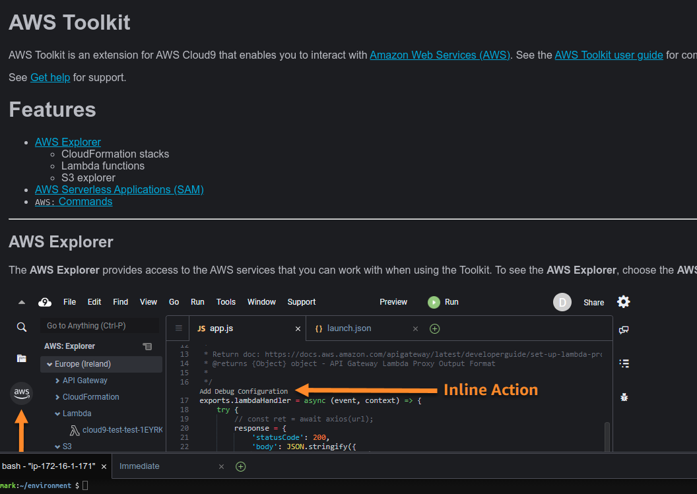

# Introducing the cloud (recorded)

## Introducing the cloud

* Introducing the cloud and the cloud providers

---

## Our plan
* Common cloud concepts
* AWS, Azure, GCP observations
* Cloud comparisons

# Cloud computing

--- 

## What is cloud computing
* Shared resources
* On-demand
* Easily scalable
* Accessed via internet

---

## Cloud computing global market

---

## Market players positioning

---

## AWS vs Azure vs GCP

* Geographical Coverage
   
* AWS:
  * 80 Availability Zones within 25 geographic regions around the world, with announced plans for 15 more Availability Zones and 5 more AWS Regions in Australia, India, Indonesia, Spain, and Switzerland.
   
* Azure: 
   * 54 regions worldwide, available in 140 countries
    
* GCP: 
   * 25 regions, 76 zones, 200 + countries
  
* Numerous edge points

---

## Regions and Availability Zones

Notes:

This is from AWS in 12/2020, but the concept is general

---

## Regions and availability zones

* Each region consists of multiple availability zones.

* Each availability zone is physically separated and isolated from the others.

* All availability zones within a region are connected to one another via highly redundant, low-latency, high-speed networks.

    * For GCP, regions are also connected with cable network
    * For Azure, regions may be couple into primary and secondary  
---    

## Regions and AZ best practices
* Nearest to your physical location and/or your users’ location to minimize network latency
* Not all regions are equal
    * Service offerings (newly deployed services are first offered in selected regions only)
    * Pricing is not equal across multiple regions, use cost calculators
    * Service Level Agreement (SLA) will vary by region
    * Compliance such as GDPR is specific to a country therefore it varies region-to-region
        * Example: IRB-approved data with an audience that spans continents
    
--- 

## Fault tolerance with multiple Availability Zones

* If you distribute your instances across multiple Availability Zones and one instance fails, you can design your application so that an instance in another Availability Zone can handle requests
* Availability Zones give you the flexibility to launch production apps and resources that are highly available, resilient/fault-tolerant, and scalable as compared to using a single data center
* Clouds usually offer Content Delivery Network (CDN)
    * Large images may be better delivered through CDN
        * "Better" means faster delivery to the requester
        * But this gets expensive as the demand scales
        * In the research world, there are few use cases that justify this expense

## Cloud service models for pizza 

---

## Cloud service models 

---

## Cloud migration strategies
* 6 Strategies for Migrating Applications to the Cloud, or 6 R's

1. Rehosting — Otherwise known as “lift-and-shift.”
2. Replatforming — sometimes called this “lift-tinker-and-shift.”
3. Repurchasing — Moving to a different product.
4. Refactoring / Re-architecting
5. Retire — Get rid of.
6. Retain — Usually this means “revisit” or do nothing (for now).
   
---

## Cloud migration strategies

* [https://aws.amazon.com/blogs/enterprise-strategy/6-strategies-for-migrating-applications-to-the-cloud](https://aws.amazon.com/blogs/enterprise-strategy/6-strategies-for-migrating-applications-to-the-cloud)

Notes:

Source: Amazon Blog, https://aws.amazon.com/blogs/enterprise-strategy/6-strategies-for-migrating-applications-to-the-cloud/

--- 

## Quick knowledge check
* Which is the order of cloud leaders, by market size?

    * A) Azure, GCP, AWS
    * B) GCP, Azure, AWS
    * C) AWS, GCP, Azure
    * D) AWS, Azure, GCP

Notes:

The correct answer is D

---

## Quick knowledge check
* Which represents the correct order, from the most to the least amount of work done by you?

    * A) On Prem, IaaS, PaaS, SaaS
    * B) SaaS, PaaS, IaaS, On Prem
    * C) IaaS, PaaS, SaaS, On Prem
    * D) SaaS, IaaS, PaaS, On Prem

Notes:

The correct answer is B

---

## Quick knowledge check
* A company wants to move to the cloud as their existing data center lease is expiring. 
What migration strategy should a company adopt for quickly migrating their existing applications
to cloud?

    * A) Replatform
    * B) Retain
    * C) Repurchase
    * D) Rehost

Notes:

The correct answer is D, Rehost.

Rehost or Lift and Shift allows an organization to quickly scale the migration by provisioning
compute instances and running the same application stack on the cloud.

---

## Quick knowledge check
* Which of these strategies takes more time to execute?

    * A) Retain
    * B) Replatform
    * C) Rehost
    * D) Rearchitect

Notes:

The correct answer is D, Rearchitect.

Rearchitect or Refactor strategy involves changing the architecture of the application
by employing cloud-native features. This strategy takes more time to execute but can be an 
effective way to meet business needs that are difficult to achieve in a traditional setup.

---

# AWS

---
## AWS services

* AWS offers more than 1,000 services, and it keeps adding services at regular intervals. 
* Its stated goal is to offer every imaginable use case  
* AWS has been expanding in areas where it is the leader, and it has also expanded into newer territories.

## AWS services (some)

---
## AWS Cloud9
   
* Cloud-based IDE that helps users to write, debug, and run their code
* Users do not need to install any local IDE, as you get a code editor, a debugger, and a terminal with AWS Cloud9 in your web browser
* More than 40 programming languages, including popular ones such as Python, PHP, and JavaScript are supported by AWS Cloud9
* AWS Cloud9 connects to AWS EC2 instances to run code

---
## AWS Cloud9

---

## Cloud shell

* Every cloud offers cloud shell
* Example of AWS Shell
    * Login to AWS
    * Start the shell
    * Install terraform (https://intelligentsysadmin.wordpress.com/2021/01/08/aws-cloudshell-and-terraform/)
    * **Let's do a demo!**
  
---

# Microsoft Azure

## Microsoft Azure

* Azure is Microsoft's portfolio of integrated cloud services, built for developers and IT professionals. 

* Azure depends on high-bandwidth and low latency global networks, connecting Microsoft data centers around the globe. 

* Every service that Microsoft offers to its customers is delivered out of these Azure data centers and built from Azure services.

## Microsoft Azure

## Microsoft’s Cloud-First Strategy

* Everything that Microsoft builds and develops is first made for Azure and Microsoft's other cloud offerings
* Nearly every feature or product that Microsoft develops originates in Azure or M365
* Microsoft 365 includes various SaaS offerings: Office 365, Windows, and Enterprise Mobility and Security.

## Regions, Data Centers and Network

* Microsoft currently has 54 regions available 

* Goal: reaching every Microsoft cloud customer globally within a 22-millisecond
 network round-trip
 
* Microsoft Azure US Department of Defense (DoD) 
 
* Microsoft Azure US Government (Gov) 
 
* Microsoft Azure China 
 
* Microsoft Cloud Germany 

Notes:

* TODO

* See this page: https://docs.microsoft.com/en-us/azure/azure-government/documentation-government-welcome
* Some example data classifications listed there are: FedRAMP, NIST 800.171 (DIB), ITAR, IRS 1075, DoD L4, and CJIS
---
## Azure network

---

# GCP

## Google Technology Timeline

* Google had had a long history of building cloud-enabling technology (with a heavy focus on big data) before its cloud services were launched

---

## Geography and Regions

* Well present in North America
* Growing presence in Europe
* Less available in Asia and South America

---
## GCP Regions

---

# Cloud comparison

## Compute Services

| Services             | AWS                                            | Azure                          | GCP                          |
|----------------------|------------------------------------------------|--------------------------------|------------------------------|
| IaaS                 | Amazon Elastic Compute Cloud                   | Virtual Machines               | Google Compute Engine        |
| PaaS                 | AWS Elastic Beanstalk                          | App Service and Cloud Services | Google App Engine            |
| Containers           | Amazon Elastic Compute Cloud Container Service | Azure Kubernetes Service (AKS) | Google Kubernetes Engine     |
| Serverless Functions | AWS Lambda                                     | Azure Functions                | Google Cloud Functions       |
---

## Storage

| Services       | AWS                           | Azure                      | GCP                                    |
|----------------|-------------------------------|----------------------------|----------------------------------------|
| Object Storage | Amazon Simple Storage Service | Azure Blob Storage         | Google Cloud Storage                   |
| Block Storage  | Amazon Elastic Block Store    | Azure Block Storage        | Google Compute Engine Persistent Disks |
| Cold Storage   | Amazon Glacier                | Azure Archive Blob Storage | Google Cloud Storage Nearline          |
| File Storage   | Amazon Elastic File System    | Azure File Storage         | Google Filestore                       |

---

## Networking

| Services        | AWS                                | Azure                    | GCP                         |
|-----------------|------------------------------------|--------------------------|-----------------------------|
| Virtual Network | Amazon Virtual Private Cloud (VPC) | Virtual Networks (VNets) | Virtual Private Cloud       |
| Load Balancer   | Elastic Load Balancer              | Load Balancer            | Google Cloud Load Balancing |
| Peering         | Direct Connect                     | ExpressRoute             | Google Cloud Interconnect   |
| DNS             | Amazon Route 53                    | Azure DNS                | Google Cloud DNS            |
---

## Datastores

| Services         | AWS                                | Azure           | GCP                                          |
|------------------|------------------------------------|-----------------|----------------------------------------------|
| RDBMS            | Amazon Relational Database Service | SQL Database    | Google Cloud SQL                             |
| NoSQL: Key–Value | Amazon DynamoDB                    | Table Storage   | Google Cloud Firestore/Google Cloud Bigtable |
| NoSQL: Indexed   | Amazon SimpleDB                    | Azure Cosmos DB | Google Cloud Datastore                       |

---

## Key Advantages

| AWS                             | Azure                          | GCP                                           |
|---------------------------------|--------------------------------|-----------------------------------------------|
| Maturity                        | Great for developers           | Aggressive growth                             |
| Service portfolio               | Integration with open source   | Attractive pricing models                     |
| Presence (market and geography) | Private datacenter integration | Best for AI and machine learning applications |

---

## Opinions

* All opinions on cloud comparison are my personal

---

## Architecture comparison

* https://docs.microsoft.com/en-us/azure/architecture/aws-professional/services

---

## References

* CloudBank: Managed Services to Simplify Cloud Access for Computer Science Research and Education

[NFS initiative](https://www.nsf.gov/awardsearch/showAward?AWD_ID=1925001)

[Cloudbank](https://www.cloudbank.org/)

---

## More references

* This differentiates core service offerings: 
  * https://www.veritis.com/blog/aws-vs-azure-vs-gcp-the-cloud-platform-of-your-choice/
* This is community sourced and has a feature matrix 
  * https://spaces.at.internet2.edu/display/CA/Cloud+Provider+Feature+Matrix

---

## Assigned reading

* AWS: https://aws.amazon.com/getting-started/fundamentals-core-concepts/ (read the entire document)
* AWS: https://docs.aws.amazon.com/wellarchitected/latest/framework/the-five-pillars-of-the-framework.html (reference only)
* Azure Well-Architected Framework: https://docs.microsoft.com/en-us/learn/paths/azure-well-architected-framework/ (complete all 8 units in the module)
* Google Cloud Architecture Framework: https://cloud.google.com/architecture/framework (only the overview page)
* Google Cloud https://cloud.google.com/architecture/framework/design-considerations (only the systems design considerations page)

---

## Congrats on completion

---

