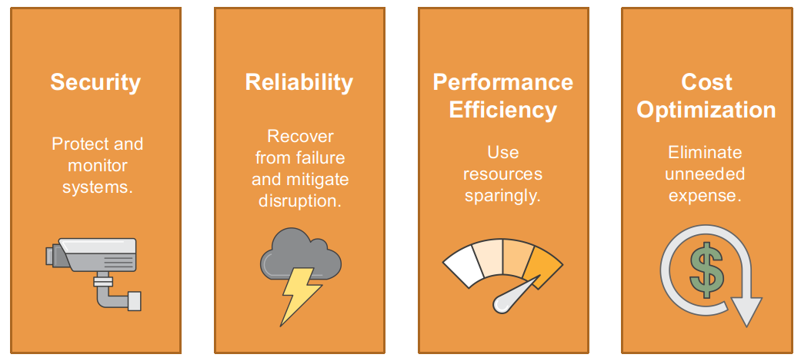
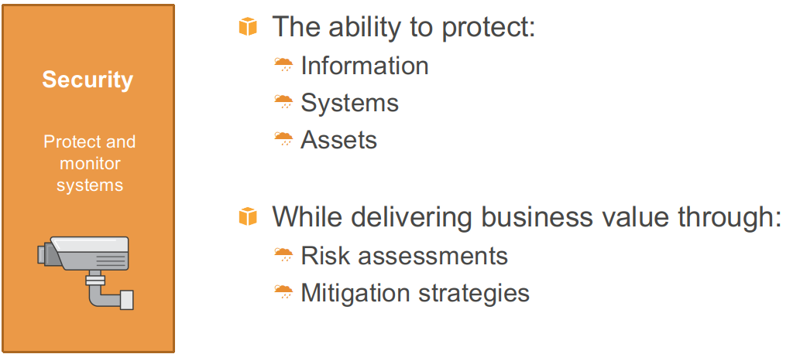
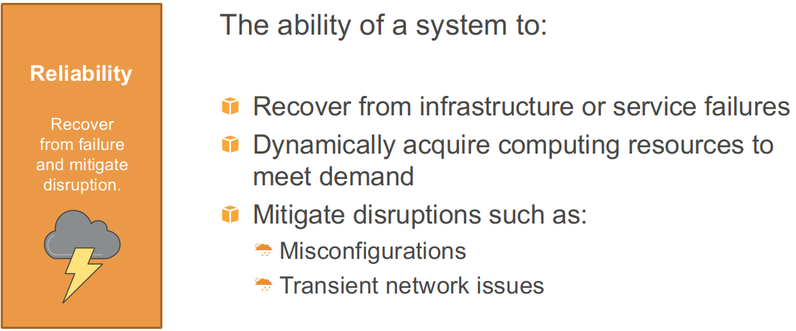
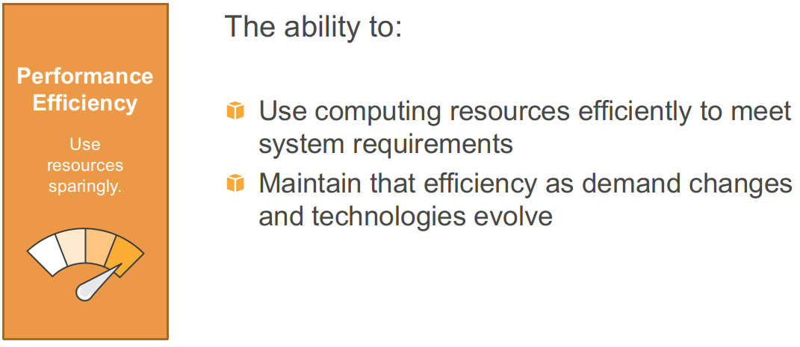
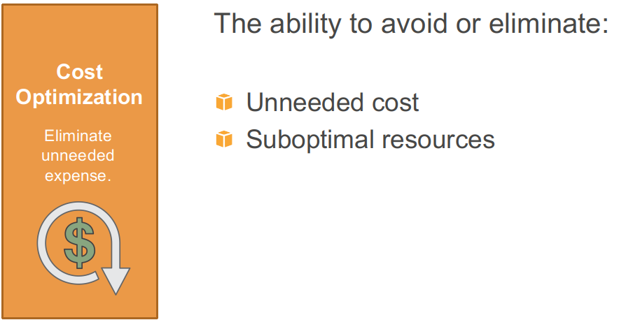
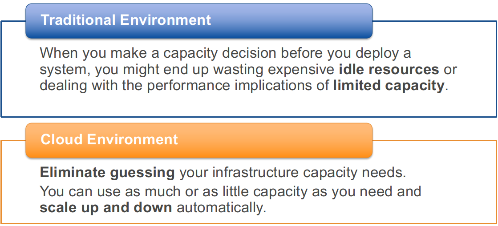
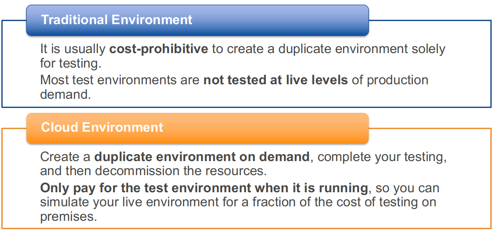
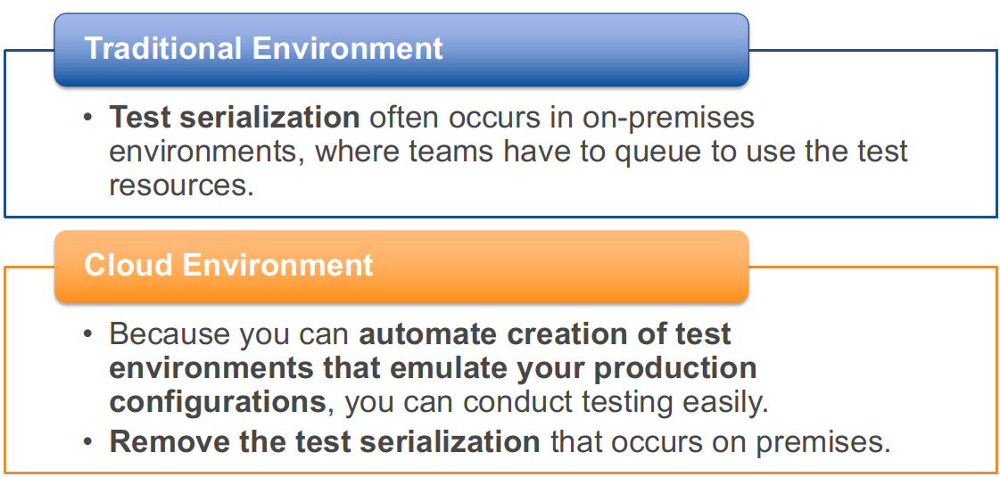
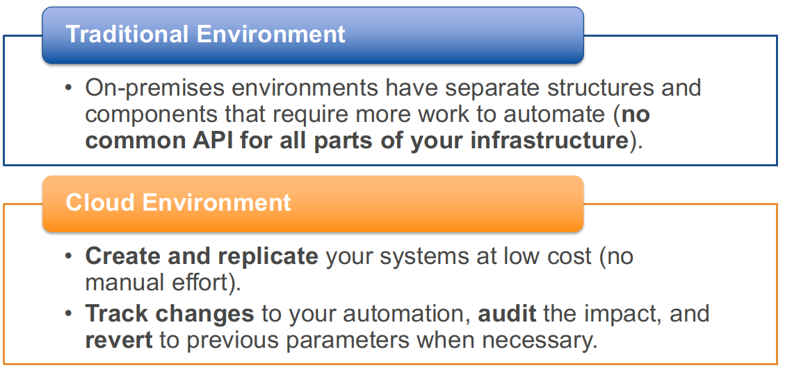
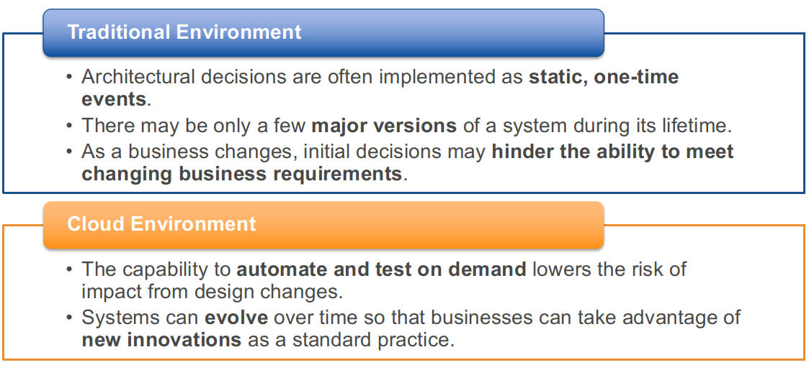

# Well-architected frameworks (recorded)

## Well-Architected Framework

* Review of the well architected framework concepts and application modernization.

* The goal of this framework is to enable customers to: 
    * Assess and improve their architectures
    * Better understand the business impact of their design decisions

* It provides a set of questions developed by AWS experts to helps customers think critically about their architecture.
* And, is applicable to any cloud

* It asks, "Does your infrastructure follow best practices?"

---
## The Well-Architected Framework

* The Well-Architected Framework does not provide:
    * Implementation details
    * Architectural patterns
    * Relevant case studies
* However, it does provide:
    * Questions centered on critically understanding architectural decisions
    * Services and solutions relevant to each question
    * References to relevant resources
    
---

## Pillars Of The Well-Architected Framework

---

## Security

---

## Reliability

---    

## Performance Efficiency

---    

## Cost Optimization

---    

## Well-Architected Design Principles

* The Well-Architected Framework also identifies a set of general design principles to facilitate good design in the cloud:
    * Stop guessing your capacity needs.
    * Test systems at production scale.
    * Lower the risk of architectural change. 
    * Automate to make experimentation easier. 
    * Allow for evolutionary architectures.

---

## Design Principle: Stop Guessing Your Capacity Needs

---    

## Design Principle: Test Systems At Production Scale

---    

## Design Principle: Lower the Risk Of Architectural Change

---    

## Design Principle: Automate To Make Experimentation Easier

---  

## Design Principle: Allow For Evolutionary Architectures

---  

## Congrats on completion

---