# Kubernetes Essentials

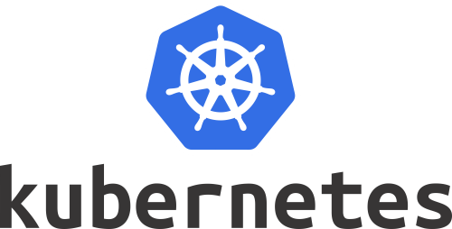 <!-- {"left" : 4.41, "top" : 3.99, "height" : 4.41, "width" : 8.68} -->

---

## Module Objectives

* Understand the Kubernetes concepts and architecture

* Work with pods configurations, deployments, and replica sets and replication controller

Notes:

Instructor Notes :

Please let students know that in addition to the objectives they identified for themselves in taking this module, these are the ones we expect to achieve based on the material provided.

Participant Notes :

In addition to the objectives you identified in taking this module, these are the ones we expect to achieve based on the material provided.

---

# Let's Design Kubernetes from Scratch

 <!-- {"left" : 4.83, "top" : 3.9, "height" : 7.07, "width" : 12.22} -->


---

## Challenge:  Design K8s from Scratch

* We want to a design an orchestration system to help us manage our infrastructure

* Let's say we want to manage our massively scalable web application

* What do we need to achieve this?

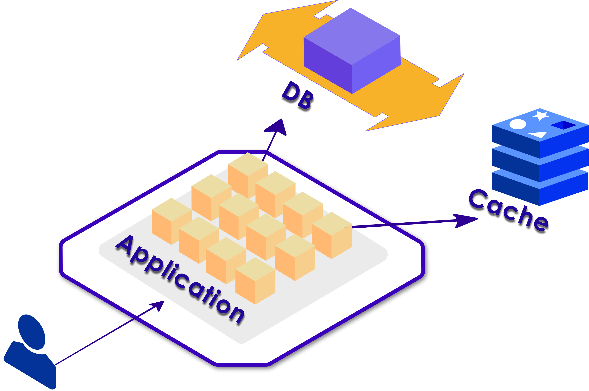 <!-- {"left" : 9.77, "top" : 2.47, "height" : 4.75, "width" : 7.16} -->


---

## Step-1: We Need a Distributed System

 <!-- {"left" : 11.63, "top" : 0.75, "height" : 3.27, "width" : 5.29} -->

* We need **multiple nodes (machines, hosts)**

* Let's assume they are all **Linux machines** (could be bare metal or virtualized)

* We will adopt a popular distributed design pattern:  **mater-workers**

---

## Step-2: Controllers for Master and Workers

 <!-- {"left" : 11.16, "top" : 1.59, "height" : 4.51, "width" : 5.66} -->

* Each worker will have a 'supervisor/controller' that manages that node.  We will call it **kubelet**

* All kubelets will coordinate with **master controller**

---

## Step-3: Running Applications

 <!-- {"left" : 11.83, "top" : 0.58, "height" : 5.55, "width" : 4.97} -->

* We need a portable, secure way of running applications

* We will use **containers**!

* Here you see docker runtime installed on all nodes, and we have containers running on all nodes

---

## Step-4: Grouping Containers Together

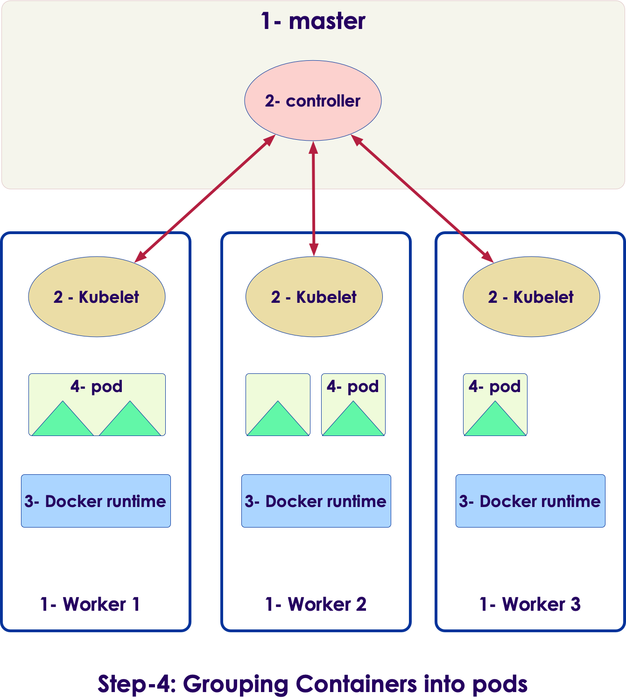 <!-- {"left" : 13.04, "top" : 0.52, "height" : 4.21, "width" : 3.77} -->

* For some applications, we want the related **containers grouped together**
    - For example, a web application and a logging agent
    - The logging agent monitors web application logs
    - So it makes sense for them to be 'run as a single unit'

* This is done via **pods**
    - Pods can run one or more containers as a unit

* Also pods are **schedulable work units**

---

## It is Getting a Bit Crowded :-) 

 <!-- {"left" : 4.78, "top" : 2.43, "height" : 8.88, "width" : 7.95} -->

---

## Step-5: Networking

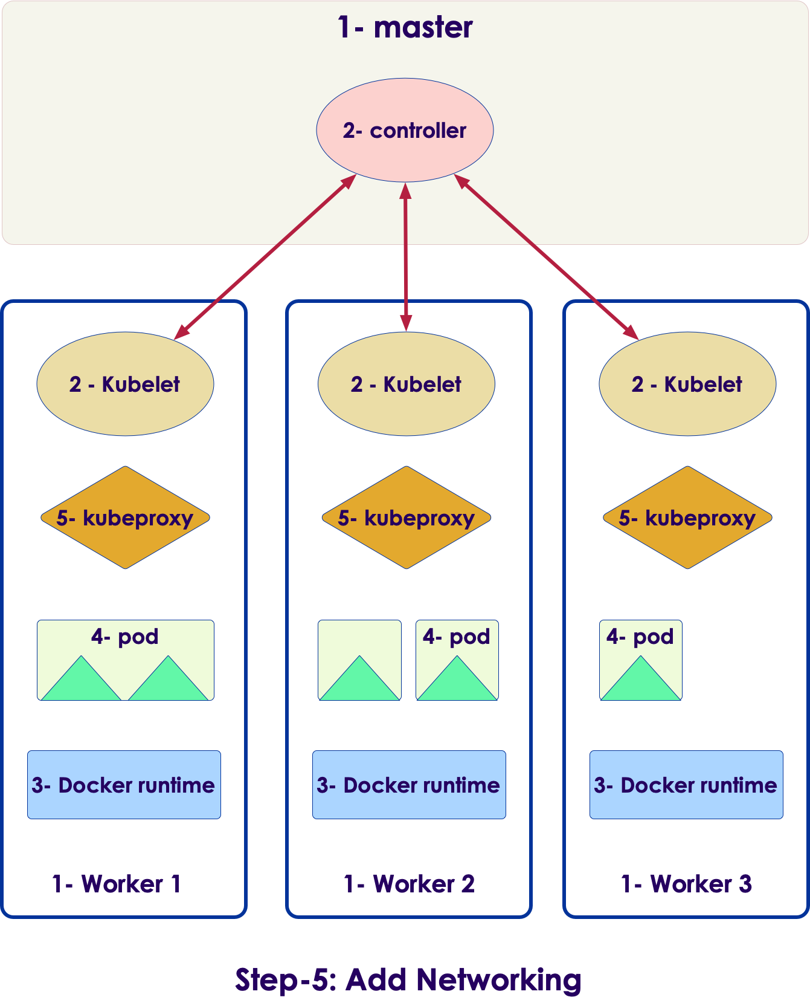 <!-- {"left" : 12.11, "top" : 0.52, "height" : 5.88, "width" : 4.77} -->

* We need a solid, flexible networking setup in the system

* Network traffic is handled by **kubeproxy**

* KubeProxy will tightly work with Linux network layer to manage networks and traffic

---

## Step-6: Few More Controllers

 <!-- {"left" : 12.51, "top" : 0.46, "height" : 5.39, "width" : 4.37} -->

* On the master node, we are adding 2 more controllers

* **Scheduler** will place pods on worker nodes

* **etcd** (a distributed datastore) will keep track of cluster status

---

## Here is Our Final Architecture

* Whew, we came up with a pretty complicated system!

<!-- {"left" : 10.95, "top" : 1.46, "height" : 7.27, "width" : 5.9} -->

---

# Kubernetes Architecture

---

## Kubernetes Cluster

  * A cluster is a set of computing instance that Kubernetes manages

 <!-- {"left" : 2.62, "top" : 4.47, "height" : 4.78, "width" : 12.26} -->


Notes:

---

## Can One Serve Two Masters?

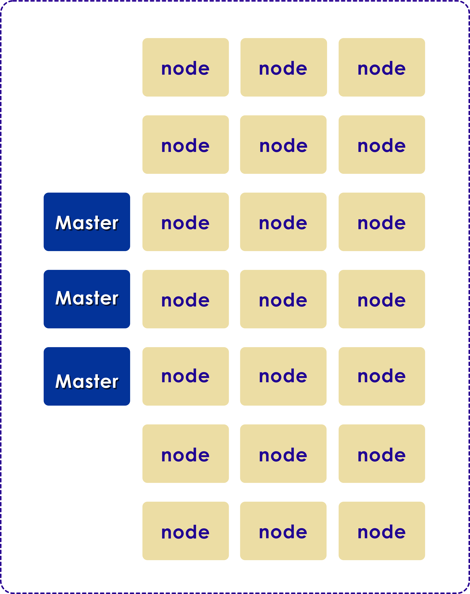 <!-- {"left" : 11.43, "top" : 0.53, "height" : 6.91, "width" : 5.47} -->

* Yes!

* A cluster can have multiple masters and lots of nodes


Notes:

---
## A Big Picture Overview of Kubernetes

 <!-- {"left" : 1.9, "top" : 3.65, "height" : 6.43, "width" : 13.69} -->

Notes:

---

## Kubernetes Architecture

* Kubernetes engine is a cluster. It has at least one master and potentially multiple worker machines. Worker machines are called nodes. The master and the node machines together perform cluster orchestration.

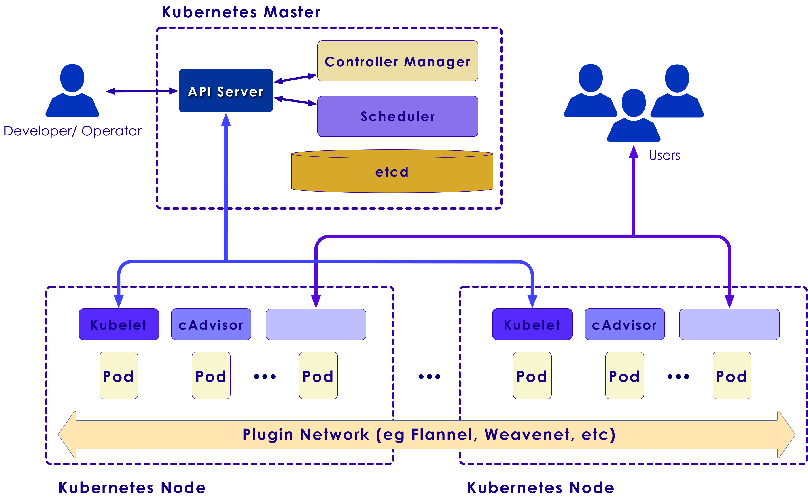 <!-- {"left" : 4.35, "top" : 5.62, "height" : 5.43, "width" : 8.81} -->


Notes:

Instructor Notes :

Participant Notes :

Kubernetes master
The master's lifecycle is managed by Kubernetes Engine when you create or delete  a cluster. 

Kubernetes node 
A typical cluster has one or more nodes, that are called worker machines, which run the containerized application and other workloads. A Master manages all the nodes and hence receives updates on the status of each node.

---

## Kubernetes Master Architecture

* We will look at all these components in detail in the next few slides

 <!-- {"left" : 2.77, "top" : 4.01, "height" : 6.27, "width" : 11.96} -->


Notes:

Instructor Notes :

Participant Notes :

---

## Kubernetes Master

 <!-- {"left" : 11.39, "top" : 0.25, "height" : 3.02, "width" : 5.76} -->

* **Etcd**

* Configuration information is stored in Etcd and this information can be used by each of the nodes in the cluster.  

* Etcd is an highly-available key value store and can be distributed among various nodes in the cluster. Being a distributed key value store, it is accessible to all.

* Etcd contains sensitive information and hence is accessible only by the Kubernetes API server.  

* References:
    - [Etcd vs Zookeeper](https://dzone.com/articles/apache-zookeeper-vs-etcd3)
    - [Etcd vs other datastores](https://etcd.io/docs/v3.3/learning/why/)

---

## Kubernetes Master

 <!-- {"left" : 11.39, "top" : 0.25, "height" : 3.02, "width" : 5.76} -->

* **API Server**

    - API Server handles majority of user/admin interactions in the cluster

    - API server is very crucial

* **Scheduler**

    - Scheduler  is responsible for workload distribution.

    - It is also responsible for monitoring, tracking of utilization and redistribution of the workload on the nodes based on their resource availability.

    - Scheduler is also responsible for allocation of the pod to a new node.

---

## Kubernetes Master

 <!-- {"left" : 12.75, "top" : 0.25, "height" : 2.3, "width" : 4.4} -->

* **kube-controller-manager** is a binary that runs controllers.  Logically, each controller is a separate process, but to reduce the number of moving pieces in the system, they are all compiled into a single binary and run in a single process.

* These controllers include:
    - Node Controller: Responsible for noticing & responding when nodes go down.
    - Replication Controller: Responsible for maintaining the correct number of pods running
    - Endpoints Controller: Manages endpoints
    - Service Account & Token Controllers: Create default accounts and API access tokens for new namespaces.

---

## Kubernetes Node Architecture

* K8 Node (worker machine) has quite a bit of components running as well

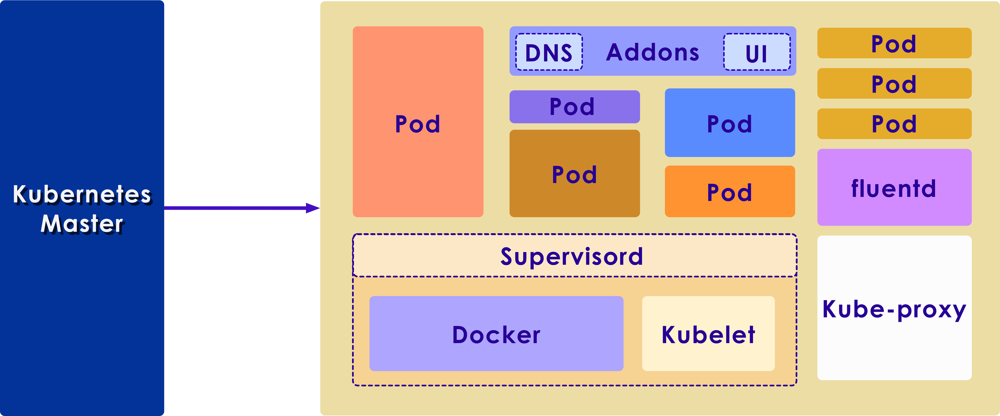 <!-- {"left" : 2.69, "top" : 4.34, "height" : 5.04, "width" : 12.11} -->

Notes:

Instructor Notes :

Participant Notes :

---

## Kubernetes Node Architecture

 <!-- {"left" : 10.28, "top" : 0.51, "height" : 2.79, "width" : 6.71} -->

* **Docker**
    - Docker is a basic requirement for each node. Dockers help in running the encapsulated app containers in an isolated, self-contained, lightweight environment.

* **Kubelet**
   - Kubelet, the primary "node agent", runs on each node 

   - Kubelet communicates with the master component for receiving the commands and for working. It is responsible for maintaining the status quo of the work process and node server.

---

## Kubernetes Node Architecture

 <!-- {"left" : 11.38, "top" : 0.27, "height" : 2.36, "width" : 5.66} -->

* **Kube-Proxy**
    - KubeProxy is a network proxy that runs on each node in your cluster

    - kube-proxy maintains network rules on nodes. These network rules allow network communication to your Pods from network sessions inside or outside of your cluster

    - kube-proxy uses the operating system packet filtering layer if there is one and it's available. Otherwise, kube-proxy forwards the traffic itself

* **supervisord** is a lightweight process babysitting system for keeping kubelet and docker running.  This is a Linux utility

---

# Namespaces

---

## Namespaces

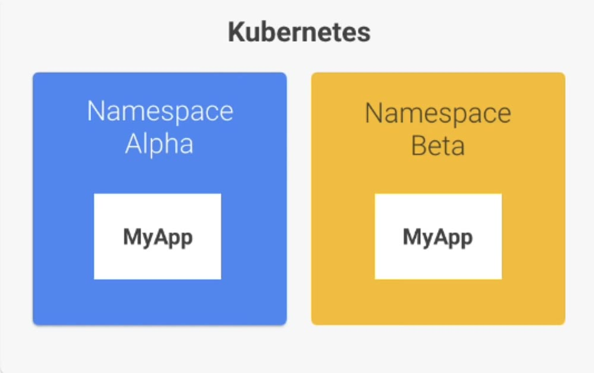 <!-- {"left" : 13.76, "top" : 0.18, "height" : 2.11, "width" : 3.36} -->

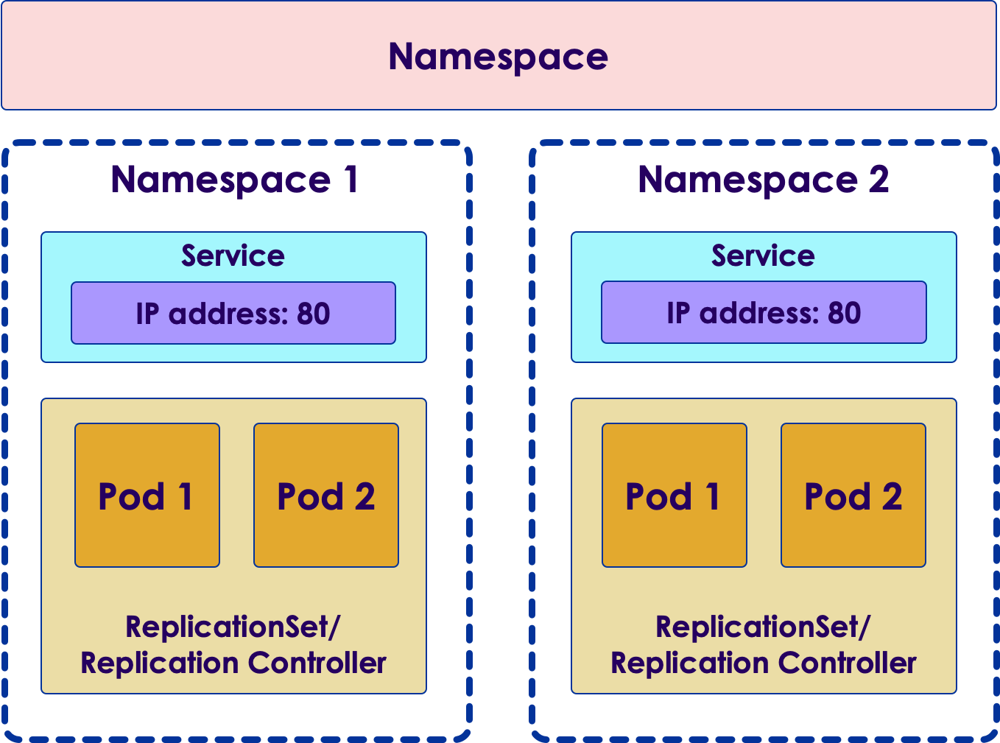 <!-- {"left" : 13.77, "top" : 2.45, "height" : 2.48, "width" : 3.34} -->

* Intended for use in **multi-user/multi-team** environments.  Allows a physical cluster to be segmented into multiple **virtual clusters**

* Allows division of cluster resources amongst multiple users, thus provides logical separation between teams and their environments.
    - e.g.  Department-1,  Department-2

* Allows for role-based access control.

* Manage different environments within the same cluster.
    - e.g.  Dev,  Prod

* Namespaces help isolate resources into their own space.

* Reference: [1](https://kubernetes.io/docs/concepts/overview/working-with-objects/namespaces/)

---

## Namespace

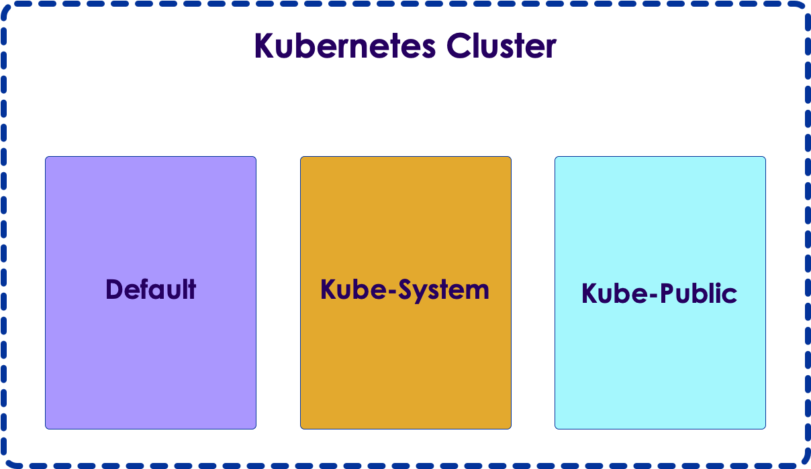 <!-- {"left" : 12.13, "top" : 0.41, "height" : 2.84, "width" : 4.9} -->

* Kubernetes objects/resources are located within the namespace

* Kubernetes by default initializes 3 namespaces
    - kube-system: all system level functionality
    - kube-public: accessible to all
    - default: default user namespace

* Creating a namespace

```bash
$   kubectl create namespace myns
```
<!-- {"left" : 0.85, "top" : 7.78, "height" : 0.57, "width" : 6.28} -->

* Listing namespaces

```bash
$   kubectl get ns
```
<!-- {"left" : 0.85, "top" : 9.19, "height" : 0.57, "width" : 3.78} -->

```console
NAME                   STATUS   AGE
default                Active   5d8h
kube-public            Active   5d8h
kube-system            Active   5d8h
myns                   Active   77m
```
<!-- {"left" : 0.85, "top" : 9.88, "height" : 1.74, "width" : 6.78} -->


Notes:

Instructor Notes :

Participant Notes :
Namespaces are 'logical or virtual entities'.
Multiple Namespaces can be hosted on a single physical cluster.

Namespaces help isolate resources into their own space.
Resources within a single Namespace, must have unique names.

---

# Pods

---

## Pod

 <!-- {"left" : 13.59, "top" : 0.23, "height" : 4.21, "width" : 3.41} -->

* The Pod is the core **unit of management** in K8s
    - Pods can be scaled up and down
    - Pods can be moved from Node to Node

* A Pod can run **one more containers**

* The Pod emulates a **logical host**
    - Containers in the same pod share the same hostname

* Each pod is isolated by:
    - Process ID (PID) namespace
    - Network namespace
    - Inter Process Communication (IPC) namespace
    - Unix Time Sharing (UTS) namespace

Notes:

Instructor Notes :

Participant Notes :

The pod serves as Kubernetes' core unit of management. 
A pod is a group of one or more co-located and co-scheduled containers with shared storage/network and run in a shared context.
It hosts all the specifications that are required run the containers.

A pod models an application-specific "logical host" containing one or more application containers which are relatively tightly coupled.

---

## Pods and Containers

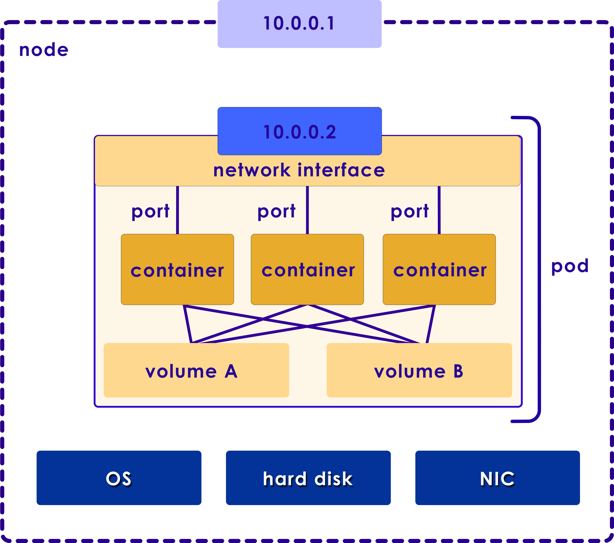<!-- {"left" : 11.28, "top" : 0.27, "height" : 5.06, "width" : 5.72} -->


* Here we see a Pod encapsulating 3 containers

* Pods provide 2 types of shared resources for containers constituent in them:
    - Networking
    - Storage

* Each Pod is assigned a unique IP address and containers within them communicate with each another using localhost.

* So a Pod acts as a 'virtual host'

Notes:

Instructor Notes :

Participant Notes :

Pods are designed to support cohesive multiple cooperating processes or containers. These containers, by default, are co-located and co-scheduled in the same machine in the cluster. The machine can be physical or virtual.
Each of these containers share resources and dependencies, and can communicate and coordinate with one another.

Networking
Each Pod is assigned a unique IP address, and every container in the pod shared the same namespace, IP address, and network ports. They communicate with one another using localhost.

Storage
Set of shared storage volumes can be specified in a Pod, which can be accessed by all containers to share the same set of data. 
Volumes allow persistent data in a Pod in case of container restart within the pod.

---

## Pod vs. Container

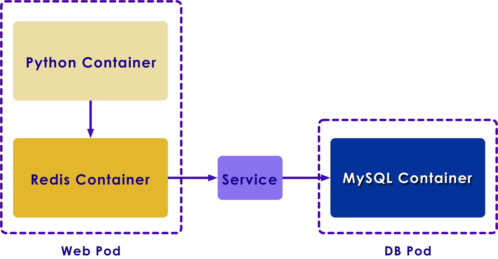 <!-- {"left" : 11.65, "top" : 0.3, "height" : 2.76, "width" : 5.31} -->

* Typically, Containers are often used for solving narrowly defined problems. However, most of the time we end up designing for multiple containers to solve a single problem.

* Thus the main purpose of a multi-container Pod is to **support those helper process** that are co-located, co-managed for a primary application. 

 <!-- {"left" : 12.19, "top" : 3.6, "height" : 2.7, "width" : 4.79} -->

* Here we have redis container acting as a local cache for python application.  So they are co-located in a Pod

* This design pattern is called **sidecar** pattern

Notes:

Instructor Notes :


Participant Notes :


Few if those are listed below: 

**Proxies, bridges, and adapters** creates a connect  between the main container and external world. These can also re-route the traffic to the external work. Thus proxies and bridges make it possible for the main container to access the localhost without any service discovery.

---

## Sidecar Pattern

 <!-- {"left" : 12.68, "top" : 0.25, "height" : 2.42, "width" : 4.3} -->


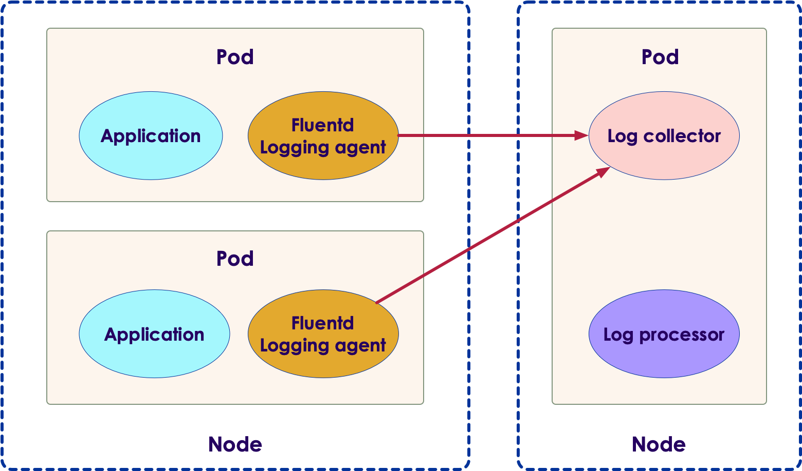 <!-- {"left" : 12.68, "top" : 2.84, "height" : 2.53, "width" : 4.3} -->

* **Sidecar** containers are **"helpers"** the main container 

* Examples of helper applications are:
    - log collectors
    - monitoring adopters
    - code loaders

* Here we see **log collecting** feature implemented as a sidecar pattern.  Basically log gathering is a helper function attached to the primary application

---

## Sidecar Pattern

* Another typical application of sidecar pattern is code watchers

* Here we have a helper that monitors github repository and fetches new code to refresh application

* 'Github monitor' is a separate functionality from the main application, so it makes sense to separate it as another container.  But since they are tied together, they are colocated in the same Pod

* Example app: updating a 'blacklisted IP list'

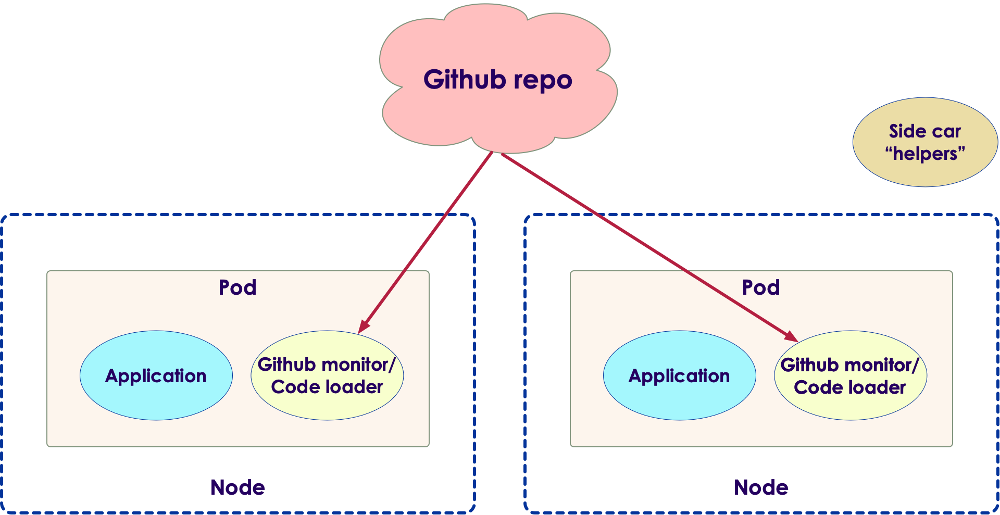 <!-- {"left" : 10.52, "top" : 2.26, "height" : 3.34, "width" : 6.49} -->


---

## Pod Spec / Configuration

* **Quick intro to spec/config/manifest files**

* Kubernetes objects are defined in **YAML or JSON** files
    - YAML is preferred over JSON as it is more user friendly and can be used inter-changeably.

* Configuration files should be stored in version control before being pushed to the cluster.
    - So we can track changes easily
    - and quickly roll back a configuration change if necessary.

---

## Pod Definition (Spec / Manifest)

* Define a pod with a YAML file

<br/>
```yaml
apiVersion: v1
kind: Pod
metadata:
  name: nginx
spec:
  containers:
    - name: web
      image: nginx
```
<!-- {"left" : 0.85, "top" : 2.78, "height" : 3.07, "width" : 4.45} -->

* **`kind: Pod`** specifies that we are defining a Pod object

* Under **`spec`** we include more details

* The docker **`image: nginx`** is used

* We **do not** specify where to place the pod.  K8s will figure it out based on cluster availability
    - We can give guidance on where the Pod should go -- more on this later

Notes:

---

## Uploading the Configuration

* Upload the YAML file to the master

```bash
$   kubectl apply -f pod.yaml
```
<!-- {"left" : 0.85, "top" : 2.92, "height" : 0.57, "width" : 5.61} -->


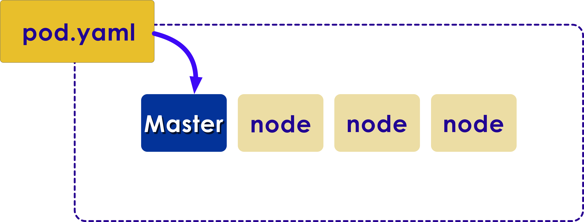<!-- {"left" : 2.31, "top" : 5.19, "height" : 4.92, "width" : 12.88} -->


Notes:

---

## Master Creates the Pod  

* The master creates a pod on your set of nodes

 <!-- {"left" : 2.94, "top" : 4.6, "height" : 4.53, "width" : 11.61} -->

Notes:

---

## Deploying a Pod

 <!-- {"left" : 2.55, "top" : 4.11, "height" : 5.52, "width" : 12.4} -->

Notes:

Instructor Notes :

Participant Notes :

Here we see 2 Pod definitions. 
A Python one for web application
A Redis one for datastore

Master – All communication paths from the cluster to the master terminate at the API server.
Web Pod – Deployed the web application into the kubernetes nodes.
DB pod   - Deployed the Database application. 
We can deploy many pods like those listed above. 

---

# Hands on With Kubernetes

---

## Lab: Setting up Kubernetes - Single Node

 <!-- {"left" : 12.99, "top" : 0.23, "height" : 5.3, "width" : 3.98} -->


* **Overview:**
    - We will use minikube to setup a single node Kubernetes cluster

* **Approximate run time:**
    - 20-30 mins

* **Instructions:**
    - **Instructor please demo this lab**
    - Please complete **INSTALL-1**

Notes:

---

## Lab: Setting up Kubernetes - Multi Node

 <!-- {"left" : 12.99, "top" : 0.23, "height" : 5.3, "width" : 3.98} -->


* **Overview:**
    - Setup a 3 node kubernetes cluster

* **Approximate run time:**
    - 40-60 mins

* **Instructions:**
    - **Instructor please demo this lab**
    - Please complete **INSTALL-2**

Notes:

---

## Lab: Explore the Cluster

 <!-- {"left" : 12.99, "top" : 0.23, "height" : 5.3, "width" : 3.98} -->

* **Overview:**
    - Explore the K8s cluster we just setup

* **Approximate run time:**
    - 10 mins

* **Instructions:**
    - **Instructor please demo this lab**
    - Please complete **EXPLORE-1**

Notes:

---

## Lab: Setup a Dashboard

 <!-- {"left" : 12.99, "top" : 0.23, "height" : 5.3, "width" : 3.98} -->

* **Overview:**
    - Setup and access a Kubernetes dashboard

* **Approximate run time:**
    - 20 mins

* **Instructions:**
    - **Instructor please demo this lab**
    - Please complete **EXPLORE-2**

Notes:

---

## Lab: Running a Pod Manually

 <!-- {"left" : 12.99, "top" : 0.23, "height" : 5.3, "width" : 3.98} -->

* **Overview:**
    - Run a single pod

* **Approximate run time:**
    - 10 mins

* **Instructions:**
    - **Instructor please demo this lab**
    - Please complete **POD-1**

Notes:

---

## Lab: Running a Pod from Manifest

 <!-- {"left" : 12.99, "top" : 0.23, "height" : 5.3, "width" : 3.98} -->

* **Overview:**
    - Deploy a pod manifest

* **Approximate run time:**
    - 10 mins

* **Instructions:**
    - **Instructor please demo this lab**
    - Please complete **POD-2**

Notes:

---

# Replication

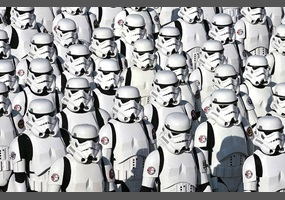<!-- {"left" : 7.46, "top" : 2.86, "height" : 6.66, "width" : 9.49} -->

---

## Replication

* **Replication** allows us to run multiple instances of an application

* **Reliability:** Even if an instance crashed, other instances can handle the load

* **Load balancing:** Moreover, maintaining multiple versions of a container allows you to re-route the traffic to other instances with similar versions. This will prevent overloading of any particular node.

* **Scaling:** If the load increases, K8s can spin up additional instances to handle the load

 <!-- {"left" : 10.85, "top" : 2.25, "height" : 4.1, "width" : 6.18} -->


Notes:

Instructor Notes :

Participant Notes :
Before we go into how you would do replication, let's talk about why.  

Typically one may prefer container replication for a variety of reasons.

Replication logic has to be simple by design but should offer powerful and flexible deployment topologies

---

## Replication

* Replication keeps a certain number of pods running at anytime

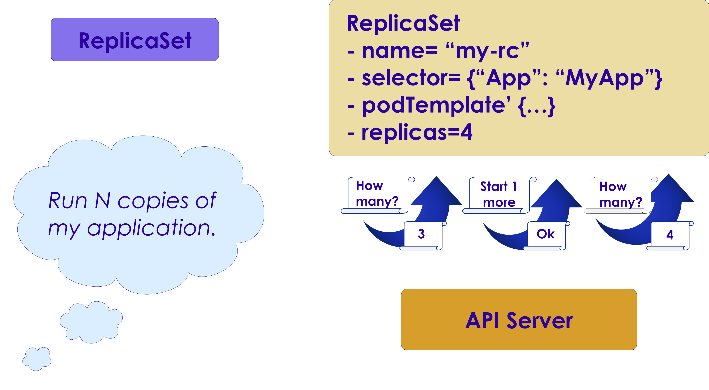 <!-- {"left" : 2.67, "top" : 4.09, "height" : 6.7, "width" : 12.16} -->


Notes:

Instructor Notes :

Participant Notes :

We are running 4 copies of the application using ReplicaSet. Please note that name, selector, podTemplate and replica syntaxes used.

---

## Replication

* Left: Here we wanted 4 pods (**desired state**) and we have 4 pods running (**current**)

* Right: Say one node crashes

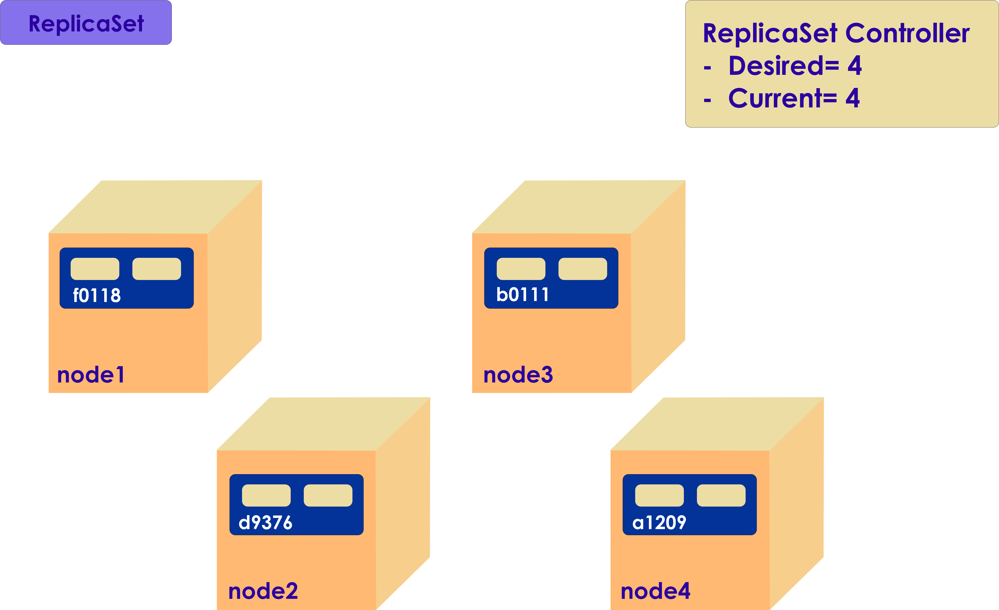 <!-- {"left" : 1.2, "top" : 5.9, "height" : 4.43, "width" : 7.26} -->
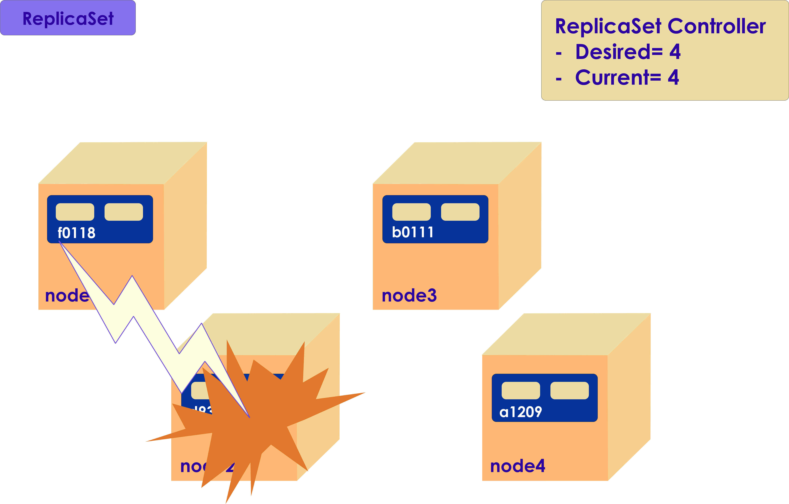 <!-- {"left" : 9.38, "top" : 5.9, "height" : 4.43, "width" : 6.92} -->


Notes:

Instructor Notes :

Participant Notes :

The replication Controller is 4 
Desired = 4 ( The Defined replication is up and running )
Current = 4 ( 4 pods are running )
Node    = 4

---

## Replication

* ReplicationController will notice this, and launch another Pod on one of the remaining nodes!

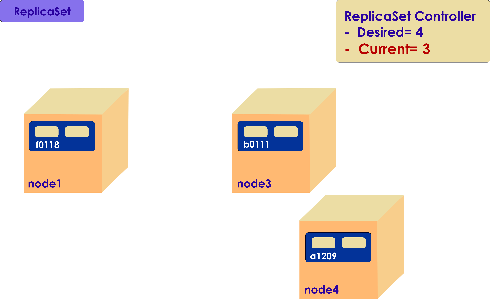 <!-- {"left" : 1.46, "top" : 5.26, "height" : 4.37, "width" : 7.16} -->

&nbsp; &nbsp;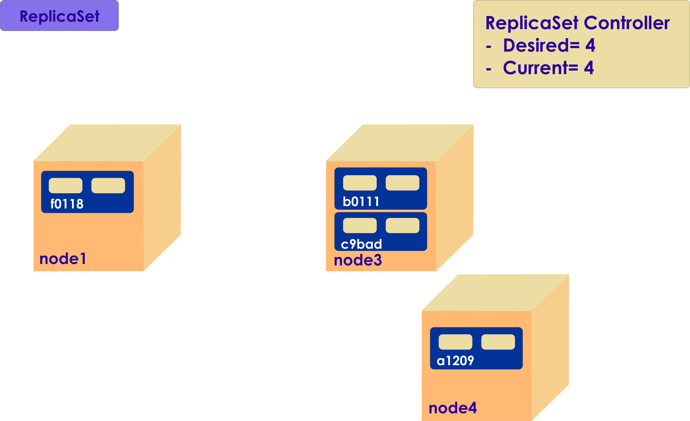 <!-- {"left" : 8.88, "top" : 5.26, "height" : 4.37, "width" : 7.16} -->

---

## Replication Controller (RC)

* **Replication Controller** manages Pod life cycle

* RC ensures that a homogeneous set of Pods (even a single pod) is always running.

* RC spins-up extra pods to meet requirements or terminates extra pods


```yaml
apiVersion: v1
kind: ReplicationController
metadata:
  name: nginx
spec:
  replicas: 3
  selector:
    app: nginx
  template:
    metadata:
      name: nginx
      labels:
        app: nginx
    spec:
      containers:
      - name: nginx
        image: nginx
        ports:
        - containerPort: 80
```
<!-- {"left" : 0.85, "top" : 5.48, "height" : 5.82, "width" : 5.28} -->

Notes:

Instructor Notes :

Participant Notes :

Despite being replaced by ReplicaSets, Replication Controller, the original form of replication is still widely in use.

A Replication Controller allows us to easily create multiple pods ensures that the pods are live and available. Replication Controller provides elasticity in managing the pods including the ability to autoscale or update the pods by a single command.

---

## Replication

* Here we are specifying `replicas: 3`, and 3 instances of the same Pod template are deployed


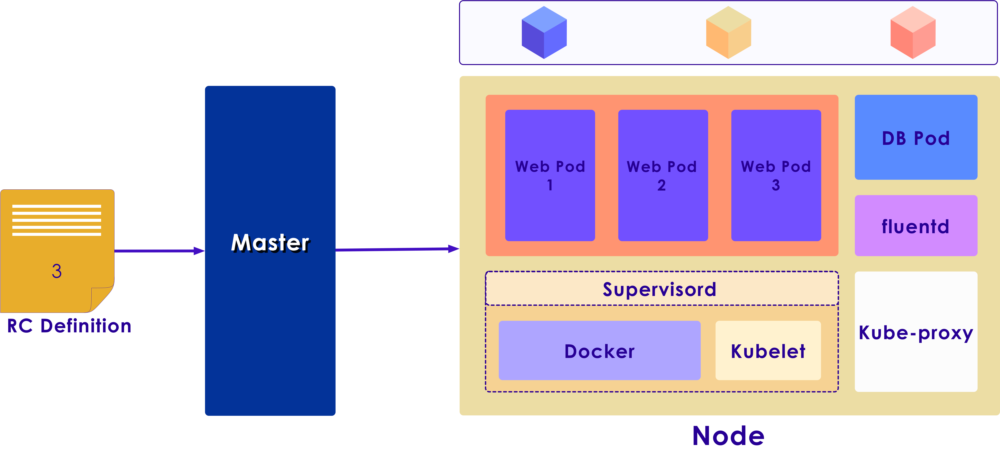<!-- {"left" : 2.31, "top" : 4.52, "height" : 5.83, "width" : 12.88} -->


---

## Replica Sets

* **ReplicaSet** is the next-generation ReplicationController.  They are declared pretty much the same way

* It supports [set based label selector](https://kubernetes.io/docs/concepts/overview/working-with-objects/labels/#set-based-requirement)

* It's mainly used by **Deployment** as a mechanism to orchestrate pod creation, deletion and updates

```yaml
apiVersion: apps/v1
kind: ReplicaSet
metadata:
  name: nginx-replicaset
spec:
  selector:
    matchLabels:
      app: nginx
  replicas: 4
  template:
    metadata:
      labels:
        app: nginx
    spec:
      containers:
        - name: nginx
          image: nginx
          ports:
            - containerPort: 80
```
<!-- {"left" : 0.85, "top" : 5.45, "height" : 5.82, "width" : 5.94} -->

Notes:

Instructor Notes :

Participant Notes :

Replica Sets are fast replacing RCs. 

Replica Sets though, are declared in the same way as Replication Controllers, but they possess more options for the selector. 
Replica Set makes sure that required number of pod replicas are running at all times.

---

## Lab: Running a ReplicaSet

 <!-- {"left" : 12.99, "top" : 0.23, "height" : 5.3, "width" : 3.98} -->

* **Overview:**
    - Deploy ReplicaSet

* **Approximate run time:**
    - 20 mins

* **Instructions:**
    - Please complete **REPLICA-1**

Notes:

---

## Lab: Running a DaemonSet

 <!-- {"left" : 12.99, "top" : 0.23, "height" : 5.3, "width" : 3.98} -->

* **Overview:**
    - Deploy a Daemonset

* **Approximate run time:**
    - 20 mins

* **Instructions:**
    - Please complete **DAEMONSET-1**

Notes:

---


## Review and Q&A
<!-- {"left" : 13.24, "top" : 0.81, "height" : 2.61, "width" : 3.51} -->
* Let's go over what we have covered so far

* Any questions?

<!-- {"left" : 4.55, "top" : 5.4, "height" : 5.59, "width" : 8.4} -->

