# Kubernetes Deployments

---

# Deployments

---

## Deployments

* **Deployments** offer more functionality than Replication Controllers

* Deployments provide roll-out and roll-back options

* Deployments depend on ReplicaSets to manage and run pods

<!-- {"left" : 6.76, "top" : 0.88, "height" : 4.37, "width" : 3.28} -->

Notes:

Instructor Notes :

Participant Notes :
Deployments, intended to replace Replication Controllers, provide the same replication functions (through Replica Sets) but additionally provide the ability to roll out and roll back the changes if required.

When the desired state is specified in the Deployment object, and the Deployment controller ensures the movement to the desired state from the actual state at a controlled rate. 

Pause the Deployment to apply multiple fixes to its PodTemplateSpec and then resume it to start a new rollout.

---

## Deployment

* Deployments monitor cluster and update changes when required

* Here we increased replicas from 3 (left) to 4 (right)

* So a new Pod is created

<!-- {"left" : 6.76, "top" : 0.88, "height" : 4.37, "width" : 3.28} -->
<!-- {"left" : 6.76, "top" : 0.88, "height" : 4.37, "width" : 3.28} -->

Notes:

---

## Deployment

* Deployments monitor pods and make correction when they stop working

* Here a Pod crashed, and a replacement Pod is spun up

<!-- {"left" : 6.76, "top" : 0.88, "height" : 4.37, "width" : 3.28} -->
<!-- {"left" : 6.76, "top" : 0.88, "height" : 4.37, "width" : 3.28} -->

Notes:

---

## Deployment

* Deployments constantly monitor cluster to observe changes

* Here we have gone from 4 replicas (left) to 3 (right).  So the excess Pod is deleted

<!-- {"left" : 6.76, "top" : 0.88, "height" : 4.37, "width" : 3.28} -->
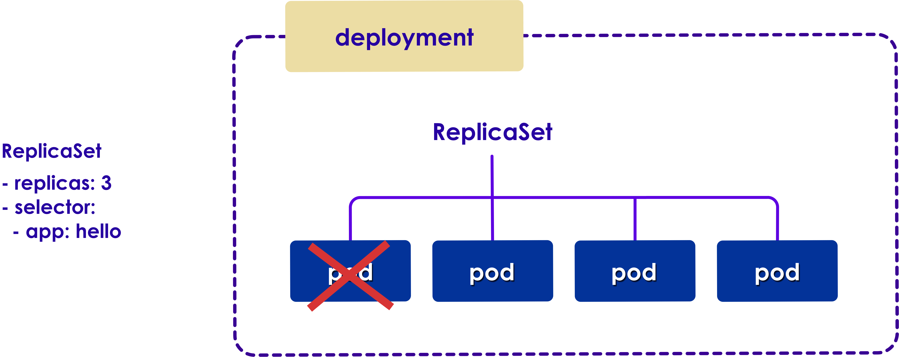<!-- {"left" : 6.76, "top" : 0.88, "height" : 4.37, "width" : 3.28} -->


Notes:

---

## Deployment Definition

* Our deployment consists of
    - Pods with `nginx` containers
    - 4 replicas

```yaml
apiVersion: apps/v1
kind: Deployment
metadata:
  name: nginx-deployment
spec:
  selector:
    matchLabels:
      app: nginx
  replicas: 4 
  template:
    metadata:
      labels:
        app: nginx
    spec:
      containers:
        - name: nginx
          image: nginx
          ports:
            - containerPort: 80
```

---

## Lab: Deployments

<!-- {"left" : 6.76, "top" : 0.88, "height" : 4.37, "width" : 3.28} -->

* **Overview:**
    - Run a deployment

* **Approximate run time:**
    - 20 mins

* **Instructions:**
    - Please complete **DEPLOY-1**

Notes:

---

# Services

---

## Service

* **Service** is an abstraction in Kubernetes, that allows us to define a 'high level' service

* For example, when we access Google search, we are accessing a service

* There may be 1000s of machines running the service behind the scene

* And at any moment a few of them may be down

* But the service overall is working and available


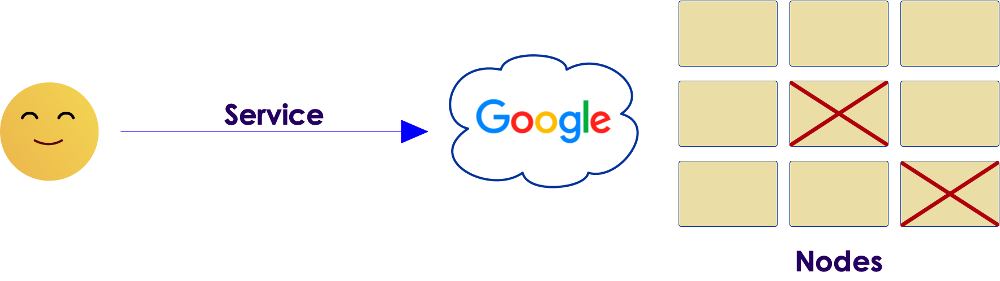<!-- {"left" : 6.76, "top" : 0.88, "height" : 4.37, "width" : 3.28} -->

---

## Services

* **Service vs. Deployment**
    - A deployment is responsible for keeping a set of pods running.
    - A service is responsible for enabling network access to a set of pods

* A Service can be backed by many Pods

* Service will route traffic to any of the Pods

* Service works with **kubeproxy** to direct traffic to Pods

<!-- {"left" : 6.76, "top" : 0.88, "height" : 4.37, "width" : 3.28} -->


Notes:

Instructor Notes :

Participant Notes :

An example of Service might be a web service.
This Web Service can be powered by say 3 Pods.
Client accessing the service doesn't care if the 3 Pods are up and running or not, as long as the service is accessible.

---

## Service Communication with Pods

* A service will get its own **fixed virtual IP address**

* So all traffic can be **predictably** routed to this IP address

* From there, the service can bounce traffic to active Pods

<!-- {"left" : 6.76, "top" : 0.88, "height" : 4.37, "width" : 3.28} -->


Notes:

---

## Multiple Services

* You can have multiple services with varying configurations and features at any given time


<!-- {"left" : 6.76, "top" : 0.88, "height" : 4.37, "width" : 3.28} -->


Notes:

---

## Exposing Service to Outside World

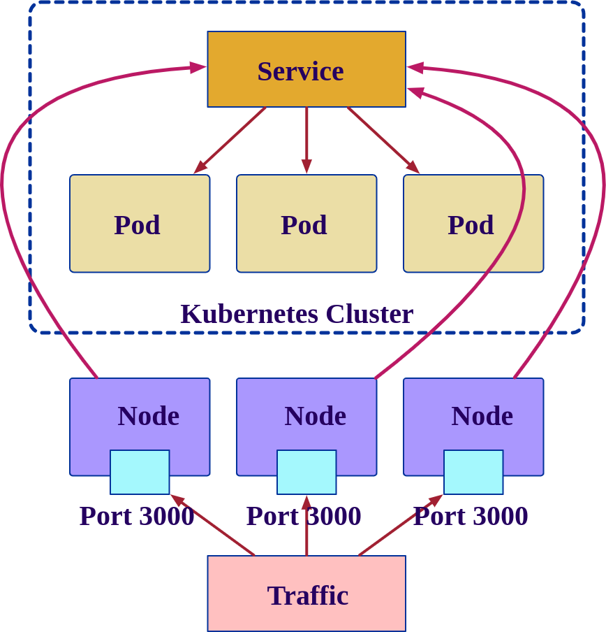<!-- {"left" : 6.76, "top" : 0.88, "height" : 4.37, "width" : 3.28} -->

* One of the simplest ways of making our service to outside world is called **NodePort**

* Here a client can access the service by connecting to **any node on port 30000**

* Traffic flow:
    1. Client hits a **node:30000**
    2. Node forwards the traffic to a **service IP address** (this is virtual btw)
    3. The service then bounces traffic to **any of the pods servicing**

* (We will see other options later)

---

## Service Definition

<!-- {"left" : 6.76, "top" : 0.88, "height" : 4.37, "width" : 3.28} -->

```yaml
apiVersion: v1
kind: Service
metadata:
  name: nginx-service
spec:
  type: NodePort
  ports:
    # Three types of ports for a service
    # nodePort - a static port assigned on each the node
    # port - port exposed internally in the cluster
    # targetPort - the container port to send requests to
    - nodePort: 30000
      port: 8080
      targetPort: 80
      protocol: TCP
  selector:
    app: nginx
```

* Deploying a service

```bash
$   kubectl apply -f svc.yaml

$   kubectl get svc
```

Notes:

Instructor Notes :

Participant Notes :

This specification will create a Service which targets TCP port 80 on any Pod with the run: my-nginx,

---

## Lab: Services

<!-- {"left" : 6.76, "top" : 0.88, "height" : 4.37, "width" : 3.28} -->

* **Overview:**
    - Deploy a service

* **Approximate run time:**
    - 20 mins

* **Instructions:**
    - Please complete **SERVICE-1**

Notes:

---

# Deployment Strategies

---

## Deployment Strategies

* Basic
* Rolling
* Blue-Green
* Canary
* A/B Testing

* References
    - [Intro To Deployment Strategies: Blue-Green, Canary, And More](https://harness.io/blog/blue-green-canary-deployment-strategies/)
    - [Blue Green deployments explained](https://martinfowler.com/bliki/BlueGreenDeployment.html)

---

## Basic Deployment

* Nodes are updated with newer version of software

* Can be done with config management systems like Ansible / Chef ..etc

* Not foolproof, as it may be not be easy to rollback if things go wrong  (for example some libraries may have been updated and not compatible)

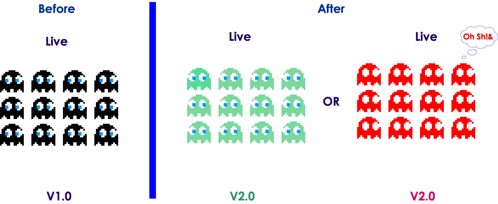<!-- {"left" : 6.76, "top" : 0.88, "height" : 4.37, "width" : 3.28} -->

---

## Rolling Deployment

* New Pods are deployed in increments

* Easy to roll back if things go wrong

* Ths rollover will take some time, in the mean time, both versions are alive

<!-- {"left" : 6.76, "top" : 0.88, "height" : 4.37, "width" : 3.28} -->

---

## Blue/Green Deployment

* Both Blue and Green versions are deployed in exactly the same environment

* Green is currently live, Green is ready to go live

* Then Blue is made live very quickly

* Rollback is instant (flicking a switch)

<!-- {"left" : 6.76, "top" : 0.88, "height" : 4.37, "width" : 3.28} -->

---

## Canary Deployment

* Release new version incrementally

* To test out the features with a smaller group of users first and then increasing deployment base

<!-- {"left" : 6.76, "top" : 0.88, "height" : 4.37, "width" : 3.28} -->

---

## A/B Testing

* Used to experiment with features

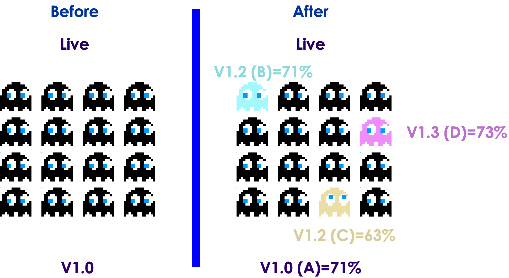<!-- {"left" : 6.76, "top" : 0.88, "height" : 4.37, "width" : 3.28} -->

---

# Rolling Upgrades

---

## Rolling Updates

* Rolling updates permit you to update from one image version to another

* Say we want to update from `hello1` to `hello2`

<!-- {"left" : 6.76, "top" : 0.88, "height" : 4.37, "width" : 3.28} -->


Notes:

---

## Rolling Updates - 1

  * This deployment allows you to create a second ReplicaSet

<!-- {"left" : 6.76, "top" : 0.88, "height" : 4.37, "width" : 3.28} -->

Notes:

---

## Rolling Updates - 2

* It gradually increases the number of replicas in the second ReplicaSet

<!-- {"left" : 6.76, "top" : 0.88, "height" : 4.37, "width" : 3.28} -->

<!-- {"left" : 6.76, "top" : 0.88, "height" : 4.37, "width" : 3.28} -->

Notes:

---

## Rolling Updates - 3

* This decreases replicas in the first ReplicaSet
* Hence at any given point of time there are at most 4 pods

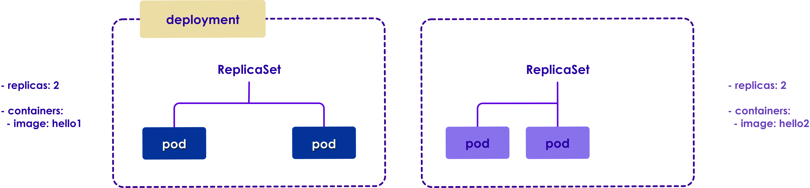<!-- {"left" : 6.76, "top" : 0.88, "height" : 4.37, "width" : 3.28} -->
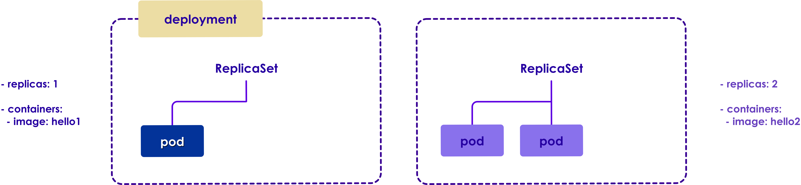<!-- {"left" : 6.76, "top" : 0.88, "height" : 4.37, "width" : 3.28} -->

Notes:

---

## Rolling Updates - 4

* Rolllout is complete when the new RS has the same Pods to replace the old RS

<!-- {"left" : 6.76, "top" : 0.88, "height" : 4.37, "width" : 3.28} -->
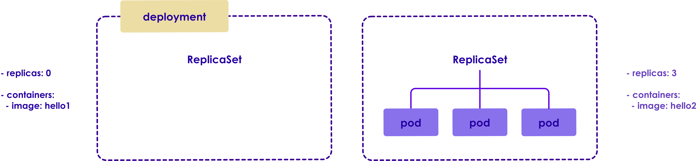<!-- {"left" : 6.76, "top" : 0.88, "height" : 4.37, "width" : 3.28} -->

Notes:

---

## Lab: Rollout Deployments

<!-- {"left" : 6.76, "top" : 0.88, "height" : 4.37, "width" : 3.28} -->

* **Overview:**
    - Rollout an upgrade

* **Approximate run time:**
    - 20 mins

* **Instructions:**
    - Please complete **DEPLOY-2**

Notes:

---

## Blue Green Deployment-1

* A blue-Green deployment make use the service label selector to change all traffic from one deployment to another, **at-once - like flipping a switching**

* Here we have **`version v1 of app hello`** deployed

* The service selector is pointing to **`app:hello ,  version: v1`** - so all traffic is going to v1 deployment


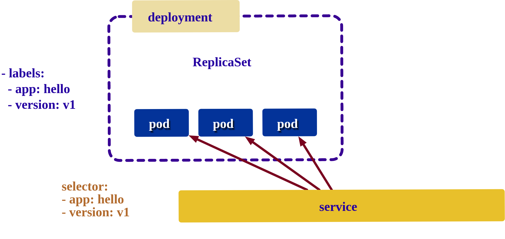<!-- {"left" : 6.76, "top" : 0.88, "height" : 4.37, "width" : 3.28} -->

Notes:

---

## Blue Green Deployment-2

* We bring up and test new deployment without live traffic
    - **`app:hello,   version:v2`**

* But the service is still sending traffic to **v1**


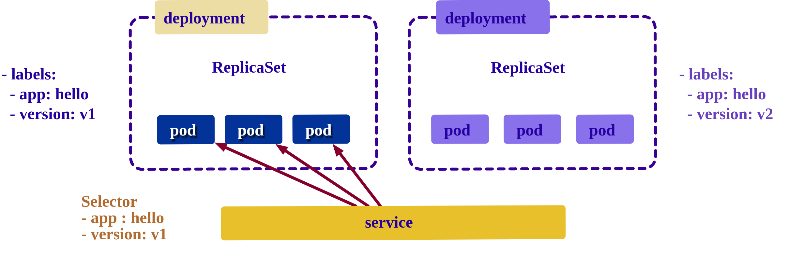<!-- {"left" : 6.76, "top" : 0.88, "height" : 4.37, "width" : 3.28} -->

Notes:

---

## Blue Green Deployment-3

* To make the new version go live, change the service label selector which switches all traffic to  v2
    - **`selector =  app:hello,   version: v2`**

* Now 100% of traffic is flowing to v2 - like we flipped a switch!

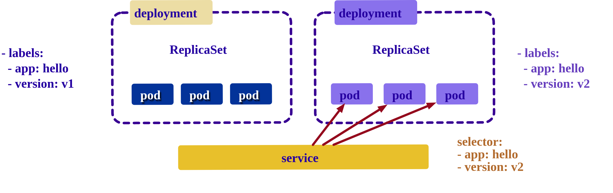<!-- {"left" : 6.76, "top" : 0.88, "height" : 4.37, "width" : 3.28} -->


Notes:

---

## Lab: Blue/Green Deployment

<!-- {"left" : 6.76, "top" : 0.88, "height" : 4.37, "width" : 3.28} -->

* **Overview:**
    - Deploy a blue/green scenario

* **Approximate run time:**
    - 20 mins

* **Instructions:**
    - Please complete **DEPLOY-3**

Notes:

---

## Canary Deployment-1

* Here we have **hello app** deployment (with label **`app: hello`**)

* Service is routing all traffic this app using selector  **`app: hello`**

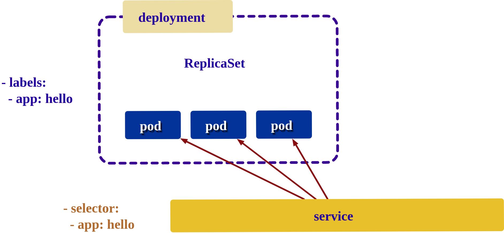<!-- {"left" : 6.76, "top" : 0.88, "height" : 4.37, "width" : 3.28} -->

---

## Canary Deployment-2

* Now we bring up  another deployment, labelled with **`app:hello, track:canary`**

* The service is sending traffic to both deployments 

* This is achieved by selector  **`app=hello`** - it will select all the pods including canary (**`track=canary`**)

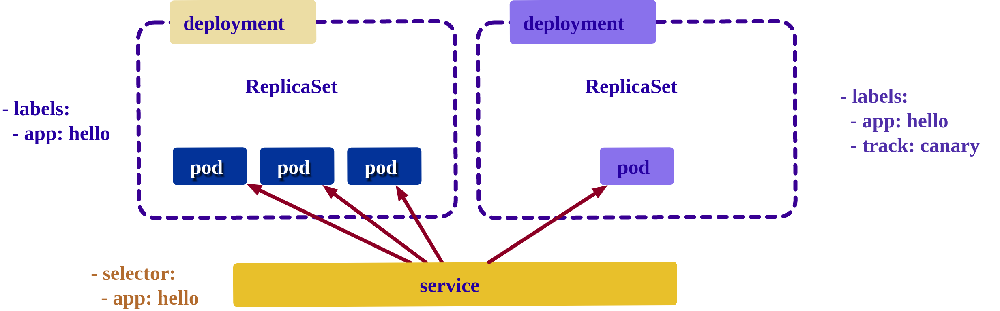<!-- {"left" : 6.76, "top" : 0.88, "height" : 4.37, "width" : 3.28} -->


---

## Lab: Canary Deployment

<!-- {"left" : 6.76, "top" : 0.88, "height" : 4.37, "width" : 3.28} -->

* **Overview:**
    - Do a canaray deployment

* **Approximate run time:**
    - 30 mins

* **Instructions:**
    - Please complete **DEPLOY-4**

Notes:

---


# Service Discovery and Load Balancing

---

## Service Discovery

* Kubernetes is a dynamic system, it is designed to run a wide variety of applications

* How ever **finding these services** can be challenging - as most of the traditional network infrastructure wasn't built for the level of dynamism that Kubernetes presents

* DNS (Domain Naming Service) is traditionally used for service discovery.  For example when we type 'search.google.com', DNS servers translate this into IP address

* How ever DNS is designed for stable, large scale systems (like the Internet).  It doesn't work well on a dynamic system like Kubernetes
    - For example, most applications resolve DNS only once and cache the result
    - So if we update 'lookup.company.com' from 1.1.1.1 to 1.1.1.2  due to a failover, some programs may still be trying to access the old IP (1.1.1.1)

---

## Service DNS

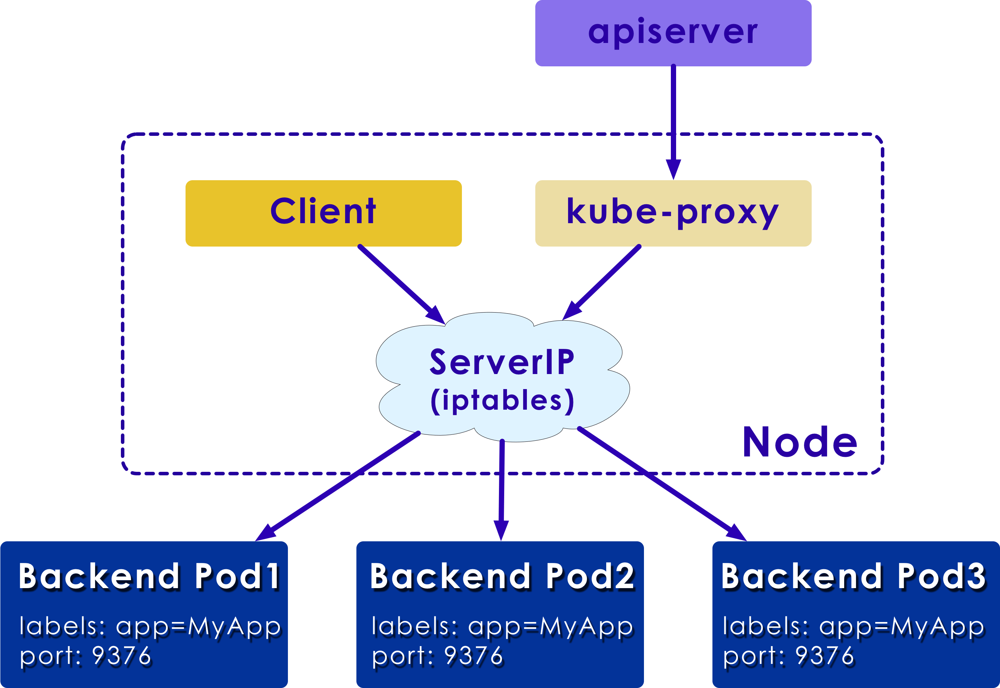 <!-- {"left" : 1.73, "top" : 1.47, "height" : 4.71, "width" : 6.85} -->

* Kubernetes runs its own DNS service called **kube DNS**.  This is installed as part of kube-system namespace

* Service object is assigned its **own virtual IP** called **cluster IP**
    - KubeDNS will assign a DNS name for this cluster IP
    - Since the ClusterIP is is stable it overcomes the caching and update issues with traditional DNS

* Also traffic to service-IP will be load-balanced across many Pods that backup the service


---

## Service Discovery

* Kubernetes provides two options for internal service discovery:

* **Environment Variable**
    - When a new Pod is created, environment variables of the older services can be imported, allowing the services to talk to each other thereby enforcing a order in service creation.
    - **`export  ZIP_CODE_LOOKUP=http://192.168.1.10`**

* **DNS**
    - Kubernetes provides the kube-dns service for registering services to the DNS service. Using this, new services can find each other and talk to other services.
    - A DNS based lookup could be : **`zip_lookup.company.com`** points to IP address  **`192.168.1.10`**

Notes:

---

## Exposing Services to Outside World

* Kubernetes provides several ways to expose services to the outside.

* **NodePorts**
    - Kubernetes exposes the service through special ports (30000-32767) of the node IP address.

* **Load balancer**
    - Kubernetes interacts with the cloud provider to create a load balancer that redirects the traffic to the Pods. 

* **Ingress Controller**
    - Kubernetes ingress includes support for TLS and L7 http-based traffic routing. This feature is available from Kubernetes v1.2.0.

* References
    - [Kubernetes NodePort vs LoadBalancer vs Ingress? When should I use what?](https://medium.com/google-cloud/kubernetes-nodeport-vs-loadbalancer-vs-ingress-when-should-i-use-what-922f010849e0)

Notes:

Instructor Notes :

Participant Notes :

A NodePort service is the most basic way to get external to the service. 
Specific ports on all the Nodes are open and serve requests.
You can only have one service per port, and you can only use ports 30000–32767.

A Load Balacer is a recommended approach to route traffic to multiple Pods.
It will take into consideration the load on Pods before sending traffic over.

---

## Exposing a Service-1: Node Ports

<!-- {"left" : 6.76, "top" : 0.88, "height" : 4.37, "width" : 3.28} -->

* One of the simplest ways of making our service to outside world is called **NodePort**

* Here a client can access the service by connecting to **any node on port 30000**

* Traffic flow:
    1. Client hits a **node:30000**
    2. Node forwards the traffic to a **service IP address** (this is virtual btw)
    3. The service then bounces traffic to **any of the pods servicing**

---

## NodePort Service Definition

<!-- {"left" : 6.76, "top" : 0.88, "height" : 4.37, "width" : 3.28} -->

```yaml
apiVersion: v1
kind: Service
metadata:
  name: nginx-service
spec:
  type: NodePort
  ports:
    # Three types of ports for a service
    # nodePort - a static port assigned on each the node
    # port - port exposed internally in the cluster
    # targetPort - the container port to send requests to
    - nodePort: 30000
      port: 8080
      targetPort: 80
      protocol: TCP
  selector:
    app: nginx
```

* Can access the service using any **`node_ip:30000`**

```bash
$   curl  node1_ip:30000/
```

* NodePorts are only available on ports **30000-32767**

---

## Exposing a Service-2: Load Balancer

  <!-- {"left" : 1.27, "top" : 1.66, "height" : 4.69, "width" : 7.79} -->

* This the recommend approach for exposing a service

* Kubernetes can work with external load balancers provided by cloud vendors

* You may incur additional charges for external load balancer services

---

## Load Balancer

* Here we see a Load Balancer (LB)  in action.
* Client **always**  contacts the LB at **10.0.0.1:9376**
* And the traffic can be sent to any one of 3 Pods

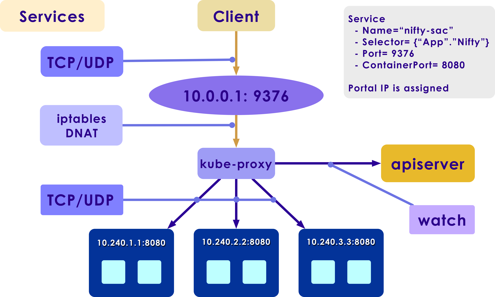  <!-- {"left" : 1.27, "top" : 1.66, "height" : 4.69, "width" : 7.79} -->

Notes:

---

## Load Balancer Definition

```yaml
apiVersion: v1
kind: Service

metadata:
  name: webapp-service
spec:
  selector:
    app: webapp
  type: LoadBalancer
  ports:
    - port: 80
      targetPort: 80
      protocol: TCP
```

---

## Exposing a Service: Ingress

* Ingress is actually **NOT** a service, it uses multiple kubernetes services and acts as a **smart router**

* Ingress offers very flexible routing.  Here we see routing based on 'hostname' and 'path'

* There are many ingress controllers available for Kubernetes
    - [AWS](https://github.com/kubernetes-sigs/aws-load-balancer-controller#readme),  [GCE](https://git.k8s.io/ingress-gce/README.md#readme) and [nginx](https://git.k8s.io/ingress-nginx/README.md#readme), [Contour](https://github.com/heptio/contour) are a few of the popular ones

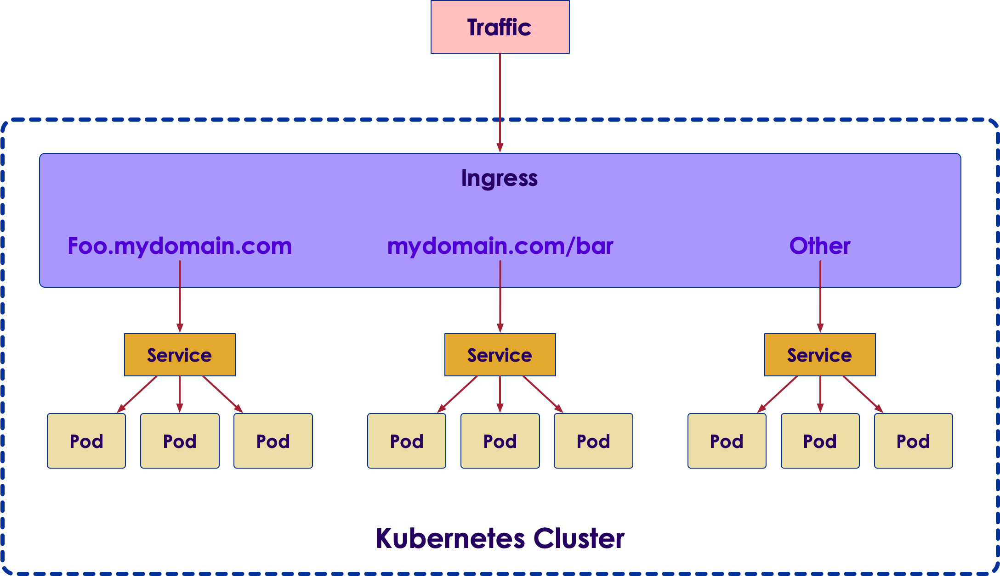 <!-- {"left" : 1.73, "top" : 1.47, "height" : 4.71, "width" : 6.85} -->

---

## Kubernetes Ingress

* Ingress consists of two components, an Ingress Resource and an Ingress Controller

- **Ingress Resource** is a collection of rules for the inbound traffic to reach Services. These are Layer 7 (L7) rules that allow hostnames (and optionally paths) to be directed to specific Services in Kubernetes.

- **Ingress Controller** acts upon the rules set by the Ingress Resource, typically via an HTTP or L7 load balancer. It is vital that both pieces are properly configured so that traffic can be routed from an outside client to a Kubernetes Service

- **NGINX** is a high performance web server and is a popular choice for an Ingress Controller because of its robustness and the many features it has

---

## Ingress Defintion

 <!-- {"left" : 1.73, "top" : 1.47, "height" : 4.71, "width" : 6.85} -->

```yaml
apiVersion: extensions/v1beta1
kind: Ingress
metadata:
  name: my-ingress
spec:
  backend:
    serviceName: other
    servicePort: 8080
  rules:
  - host: foo.mydomain.com
    http:
      paths:
      - backend:
          serviceName: foo
          servicePort: 8080
  - host: mydomain.com
    http:
      paths:
      - path: /bar/*
        backend:
          serviceName: bar
          servicePort: 8080
```

---

## Ingress-based HTTP Load Balancer

 <!-- {"left" : 2.01, "top" : 1.01, "height" : 5.48, "width" : 6.24} -->

* Here we see we are routing traffic based on rules.
* We are serving both **HTTP and HTTPS** requests.
* **`Acme.com/app1`**  is going to 2 worker nodes on left.
* **`Acme.com/app2`**  is going to 2 worker nodes on right.

Notes:

Instructor Notes :

Participant Notes :

---

## Lab: Ingress

<!-- {"left" : 6.76, "top" : 0.88, "height" : 4.37, "width" : 3.28} -->

* **Overview:**
    - Setup an Ingress

* **Approximate run time:**
    - 30 mins

* **Instructions:**
    - Please complete **DEPLOY-1**
    - Try this bonus lab : https://www.qwiklabs.com/focuses/872?parent=catalog

Notes:

---

# Autoscaling

---

## Autoscaling

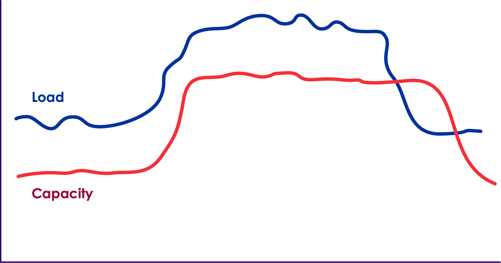<!-- {"left" : 6.76, "top" : 0.88, "height" : 4.37, "width" : 3.28} -->

* So far we looked at various deployment strategies;  We specified the number of `replicas` explicitly

* When running advanced applications, we want the application to scale up and down along with the load
    - For example, a stock trading application may be scaled up during trading hours, and scaled down during off hours
    - We can program this automatically, set repicas based on time
    - But it won't be flexible to handle unexpected spikes in traffic (e.g. sudden surges in volume)

* Wouldn't it be nice, if we can scale up/down automatically along with the load?

* **Horizontal Pod Autoscaler** is how we do it

---

## Horizontal Pod Autoscaler

<!-- {"left" : 6.76, "top" : 0.88, "height" : 4.37, "width" : 3.28} -->

* Autoscaling, one of the key features, allows the kubernetes cluster to automatically increase or decrease the number of nodes  based on the demand for service response.

* **Horizontal Pod Autoscaler** scales the number of pods automatically  in a replication controller, deployment or replica set.

* The controller manager queries the resource utilization against the metrics specified in each HorizontalPodAutoscaler definition (e.g. CPU, Memory, Disk)

* The controller periodically adjusts the number of replicas in a replication controller or deployment.

Notes:

Implemented as a control loop, Horizontal Pod Autoscaler with a period controlled by the controller manager's `horizontal-pod-autoscaler-sync-period` flag (with a default value of 30 seconds)

---

## Using Horizontal Pod Autoscaler

* Here we are deploying [php-apache](https://console.cloud.google.com/gcr/images/google-containers/GLOBAL/hpa-example) image

```yaml
apiVersion: apps/v1
kind: Deployment
metadata:
  name: php-apache-deployment
spec:
  selector:
    matchLabels:
      app: php-apache
  template:
    metadata:
      labels:
        app: php-apache
    spec:
      containers:
        - image: gcr.io/google_containers/hpa-example
          name: php-apache
          ports:
            - containerPort: 80
              protocol: TCP
          resources:
            requests:
              cpu: 500m # 0.5 of a core
              memory: 100M
```

---

## Using Horizontal Pod Autoscaler

* Then we define auto scaler
    - **`name: php-apache-deployment`** - points to the deployment
    - **`minReplicas: 1`** - minimum Pods to keep running
    - **`maxReplicas: 10`** - scale up to this many Pods max
    - **`targetCPUUtilizationPercentage: 50`** - If average CPU utilization across Pods exceed this number, trigger scaling up

```yaml
apiVersion: autoscaling/v1
kind: HorizontalPodAutoscaler
metadata:
  name: php-apache-scaler
spec:
  scaleTargetRef:
    apiVersion: apps/v1
    kind: Deployment
    name: php-apache-deployment
  minReplicas: 1
  maxReplicas: 10
  targetCPUUtilizationPercentage: 50
```

---

## Lab: Autoscaling

<!-- {"left" : 6.76, "top" : 0.88, "height" : 4.37, "width" : 3.28} -->

* **Overview:**
    - Autoscale a deployment

* **Approximate run time:**
    - 30 mins

* **Instructions:**
    - Please complete **AUTOSCALE-1**

Notes:

---

## Review and Q&A

<!-- {"left" : 8.56, "top" : 1.21, "height" : 1.15, "width" : 1.55} -->
<!-- {"left" : 6.53, "top" : 2.66, "height" : 2.52, "width" : 3.79} -->

* Let's go over what we have covered so far

* Any questions?
