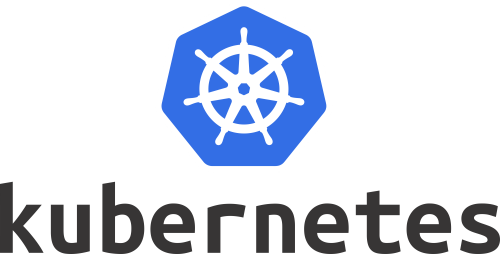
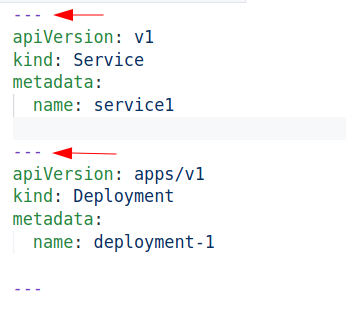

# Kubernetes Best Practices

<!-- {"left" : 1.18, "top" : 5.7, "height" : 3.19, "width" : 6.28} -->
 <!-- {"left" : 8.74, "top" : 5.78, "height" : 3.02, "width" : 7.17} -->

---

## Handy Aliases

* These will save you some typing!

<br/>
```bash
$   alias k='kubectl'

$   alias ks='kubectl get namespaces'

$   alias kga='k get all -A'

$   alias kdp='kubectl describe pod'

$   alias kdn='kubectl describe node'

$   alias kdd='kubectl describe deployment'

$   alias kds='kubectl describe service'

```
<!-- {"left" : 0.85, "top" : 2.7, "height" : 4.59, "width" : 8.95} -->

* Put these in your **`~/.bashrc`** file, so they are setup every time you login

---

# Configuration

---

## Managing Configuration Files

* Use **`yaml`** instead of **`json`**.  YAML tends to be more human readable

* Keep configuration files in version control system
    - So we can track changes
    - And revert back easily

* Keep config files **minimal**
    - Don't specify default values

---

## Write Clean Concise YAML Files

* Most modern code editors will support YAML file editing.  Recommended editors are : [VSCode](https://code.visualstudio.com/),  [vim](https://www.vim.org/), [Notepad++](https://notepad-plus-plus.org/downloads/)

* Consistent indentation.  Can be 2 spaces or 4 spaces, just use the same level

* Use validators to check the syntax.  For example **`yamllint`**. Modern editors can do this for you automatically

```bash
$   yamllint  a.yaml
```
<!-- {"left" : 0.85, "top" : 5.89, "height" : 0.57, "width" : 4.11} -->

* Here is a minimal yaml

```yaml
apiVersion: v1
kind: Pod
metadata:
  name: nginx
spec:
  containers:
    - name: web
      image: nginx
```
<!-- {"left" : 0.85, "top" : 7.37, "height" : 2.61, "width" : 3.78} -->

---

## Use Comments in YAML Config files

* YAML supports comments

* Use comments to document the config files

```yaml
# This is our nginx delployment
apiVersion: v1
kind: Pod
metadata:
  name: nginx
spec:
  containers:
    - name: web
      image: nginx:1.9  # this is the version that is tested with our app!
```
<!-- {"left" : 0.85, "top" : 3.58, "height" : 2.9, "width" : 13.11} -->

---

## Group Related Objects Into a Single File

* Say we have a bunch of objects defined across multiple config files

```text
deployment-1/
├── deployment.yaml
├── pods.yaml
└── service.yaml
```
<!-- {"left" : 0.85, "top" : 3.53, "height" : 1.44, "width" : 3.94} -->

<!-- {"left" : 11.27, "top" : 3.02, "height" : 4.9, "width" : 5.45} -->

* Put related object definitions into a single file

* Use three-dashes to separate the object definitions

* Examples:
    - [guestbook-all-in-one.yaml](https://github.com/kubernetes/examples/tree/master/guestbook/all-in-one/guestbook-all-in-one.yaml)

---

# Performance

---

## Use Smaller Images

* Most developers try to use 'familiar images' (like ubuntu) as base image
    - These have lot of extra libraries that are not needed
    - And they add to the size

* Go for **alpine** images and add needed libraries as needed
    - These images are 10x smaller than standard images

| Image   | Size    | Description                                     |
|---------|---------|-------------------------------------------------|
| Busybox | 1.25 MB | A tiny Linux distribution with lot of utilities |
| Alpine  | 5.6 MB  | A minimal Docker image based on Alpine Linux    |
| Ubuntu  | 70 MB   | Base ubuntu image                               |

<!-- {"left" : 1.31, "top" : 6.52, "height" : 3.54, "width" : 14.88} -->


---

## Efficient `kubectl apply`

* When applying multiple files, we can apply them individually

```bash
$   kubectl  apply -f file1.yaml
$   kubectl  apply -f file2.yaml
```
<!-- {"left" : 0.85, "top" : 2.64, "height" : 0.86, "width" : 6.11} -->

* We can apply all files in a directory

```bash
$   kubectl  apply -f  <dir>
```
<!-- {"left" : 0.85, "top" : 4.46, "height" : 0.57, "width" : 5.44} -->


---

## Monitor Resource Usage

* First install metrics

<br/>
```bash
$   kubectl apply -f \
https://github.com/kubernetes-sigs/metrics-server/releases/latest/download/components.yaml

# enable metrics for minikube
$   minikube addons enable metrics-server

# see metrics server is running
$  kubectl get pods --all-namespaces | grep metrics-server
```
<!-- {"left" : 0.85, "top" : 2.8, "height" : 2.61, "width" : 15.78} -->

* Use **`kubectl top`** command

<br/>
```bash
# to mnonitor node utilzation
$   kubectl  top   node
```
<!-- {"left" : 0.85, "top" : 7.03, "height" : 0.99, "width" : 6.45} -->

```text
NAME       CPU(cores)   CPU%   MEMORY(bytes)   MEMORY%   
minikube   782m         4%     1009Mi          3%        
```
<!-- {"left" : 0.85, "top" : 8.2, "height" : 0.92, "width" : 10.98} -->


```bash
# to see pod usage
$   kubectl  top   pod
```
<!-- {"left" : 0.85, "top" : 9.32, "height" : 0.86, "width" : 4.44} -->


* Watch the top output periodically, use **`watch`** command

```bash
$   watch  kubectl top node -n 5
```
<!-- {"left" : 0.85, "top" : 11.6, "height" : 0.57, "width" : 6.11} -->

---

# Best Practices

---

## Use Namespaces

* **Namespaces** facilitate many **virtual clusters** on a physical cluster

* Namespaces allow segmenting resources, access and permissions

<br/>
```bash
# create namespace
$   kubectl create namespace test

# create objects within an namespace
$   kubectl apply -f pod.yaml --namespace=test

# get pods
$   kubectl get pods --namespace=test
```
<!-- {"left" : 0.85, "top" : 3.62, "height" : 2.79, "width" : 9.01} -->


* Use [kubens](https://github.com/ahmetb/kubectx) utilities to manage and switch namespaces

* References
    - [Kubernetes best practices: Organizing with Namespaces](https://cloud.google.com/blog/products/containers-kubernetes/kubernetes-best-practices-organizing-with-namespaces)

---

## Prefer Deployments Instead of Naked Pods

* Say you want to run 10 instances of nginx

* If we start them manually, the **naked pods** will not be rescheduled in the event of a node failure.

* Prefer a **deployment**

* Deployment will create a **ReplicaSet** and will keep running desired number of replicas automatically

---

## Prefer Trackable Changes

* Say we have are incrementing replicas of a deployment.  We could do this like this; but this change is not trackable!

```bash
$   kubectl scale deployment deployment1 --replicas=10
```
<!-- {"left" : 0.85, "top" : 3.3, "height" : 0.57, "width" : 9.78} -->

* Recommended it to do it via config file, so we can track changes via version control

```bash
$   kubectl apply -f deploy2.yaml
```
<!-- {"left" : 0.85, "top" : 5.58, "height" : 0.57, "width" : 6.28} -->

```yaml
apiVersion: apps/v1
kind: Deployment
metadata:
  name: nginx-deployment
spec:
  selector:
    matchLabels:
      app: nginx
  replicas: 10
  template:
    metadata:
      labels:
        app: nginx
    spec:
      containers:
        - name: nginx
          image: nginx
```
<!-- {"left" : 0.85, "top" : 6.47, "height" : 5.24, "width" : 4.78} -->


---

## Adopt a Git Based Workflow

* Don't make adhoc changes to deployment

* Using **git as source of truth** will enable
    - traceability
    - reliable deployment process
    - automation using CI/CD workflows

Notes:

---

## Use Labels

* Labels allow us to query and select objects

* See the [guestbook](https://github.com/kubernetes/examples/tree/master/guestbook/) app for examples of this approach.

```yaml
apiVersion: v1
kind: Pod
metadata:
  name: label-demo
  labels:
    environment: production
    app: nginx
spec:
  containers:
  - name: nginx
    image: nginx:1.14.2
    ports:
    - containerPort: 80
```
<!-- {"left" : 0.85, "top" : 3.55, "height" : 4.07, "width" : 5.28} -->


---

## Use Health Checks

<!-- {"left" : 13.28, "top" : 0.45, "height" : 3.17, "width" : 3.72} -->

 <!-- {"left" : 13.31, "top" : 3.83, "height" : 3.11, "width" : 3.64} -->

* Kubernetes has built-in health checks

* **Readiness probe** will determine if an instance is ready to accept traffic

* **Liveness probe** will determine if the an instance is alive and can serve traffic

* References:
    - [Kubernetes best practices: Setting up health checks with readiness and liveness probes](https://cloud.google.com/blog/products/containers-kubernetes/kubernetes-best-practices-setting-up-health-checks-with-readiness-and-liveness-probes)

Notes:

Image source: https://cloud.google.com/blog/products/containers-kubernetes/kubernetes-best-practices-setting-up-health-checks-with-readiness-and-liveness-probes

---

## Use Resource Limits

* Without limits, Pods can use up Node resources

* Here we are requesting 2G memory and capping the memory to 4G

* References:
    - [Kubernetes best practices: Resource requests and limits](https://cloud.google.com/blog/products/containers-kubernetes/kubernetes-best-practices-resource-requests-and-limits)

```yaml
apiVersion: v1
kind: Pod
metadata:
  name: frontend
spec:
  containers:
  - name: app
    image: my-image:v1
    resources:
      requests:
        memory: "2Gi"
        cpu: "250m"
      limits:
        memory: "4Gi"
        cpu: "500m"
```
<!-- {"left" : 0.85, "top" : 5.11, "height" : 4.65, "width" : 4.44} -->

---

## Wrap up and Q&A

<!-- {"left" : 13.24, "top" : 0.81, "height" : 2.61, "width" : 3.51} -->

* What are some of the best practices you can share with the class

* Any questions?

<!-- {"left" : 4.55, "top" : 5.4, "height" : 5.59, "width" : 8.4} -->
