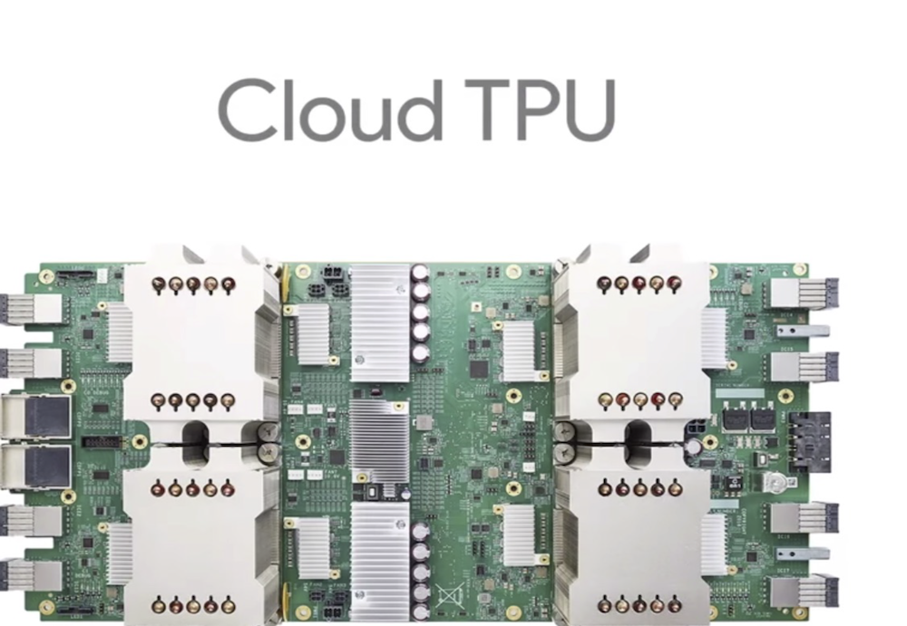
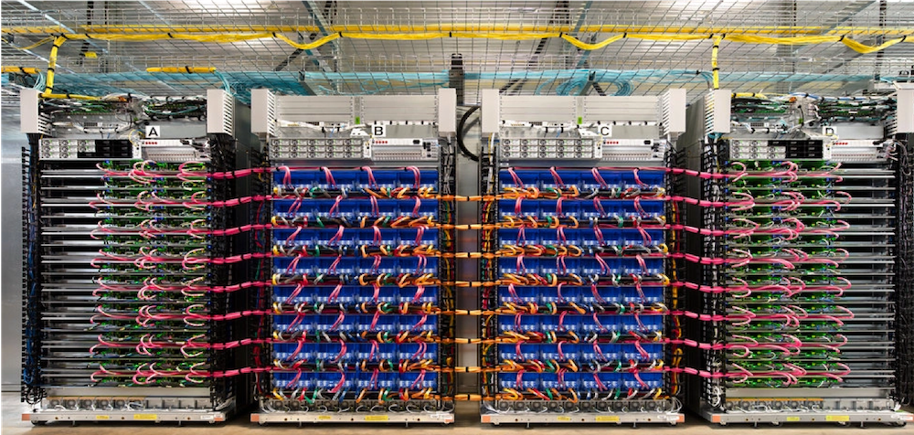
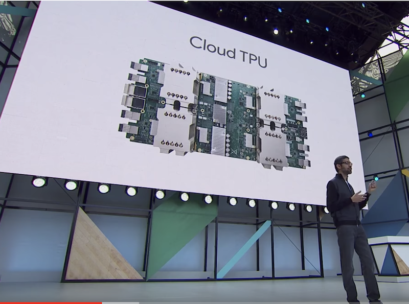
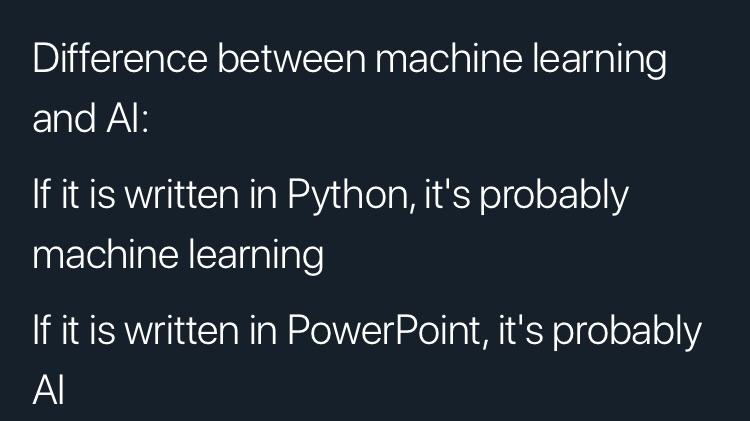
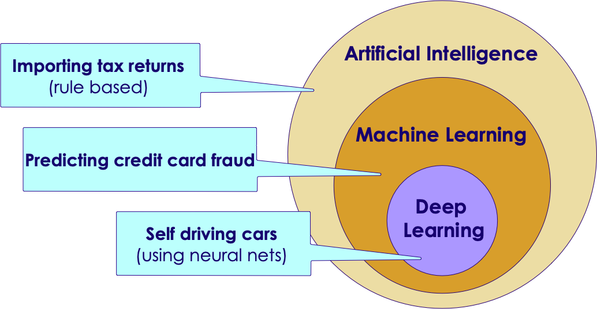
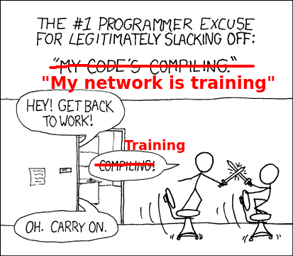
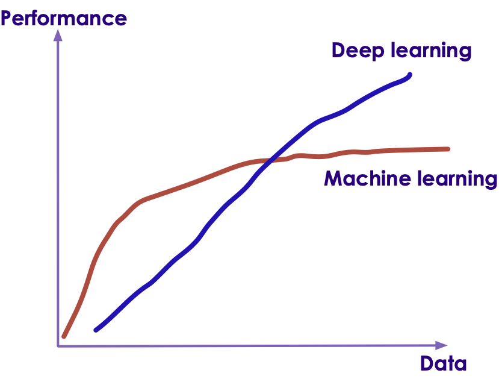
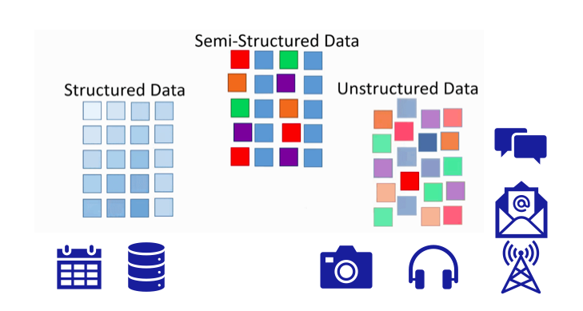
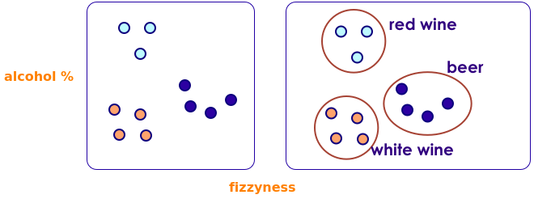
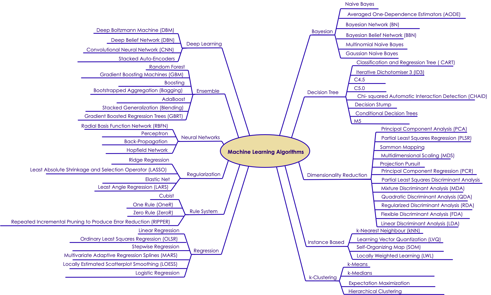

# Machine Learning Primer

---


## Lesson Objectives

<!-- {"left" : 9.35, "top" : 1.62, "height" : 5.79, "width" : 7.71} -->

 * Learn Machine Learning use cases

 * Understand ML vocabulary

 * Overview of major machine learning algorithms

Notes:


---

# Machine Learning Evolution

---

## Name Some AI Powered Products / Services

* Think of something you did today / this week that is AI powered?

Notes:

---

## AI is Everywhere

 <!-- {"left" : 13.45, "top" : 1.95, "height" : 5.88, "width" : 3.31} -->

 <!-- {"left" : 0.96, "top" : 3.88, "height" : 1.35, "width" : 3.24} -->
 <!-- {"left" : 0.89, "top" : 1.8, "height" : 1.56, "width" : 3.37} -->
 <!-- {"left" : 4.99, "top" : 1.8, "height" : 1.56, "width" : 3.71} -->
 <!-- {"left" : 4.73, "top" : 3.88, "height" : 1.11, "width" : 3.71} -->
 <!-- {"left" : 9.43, "top" : 1.94, "height" : 1.28, "width" : 3.91} -->

 <!-- {"left" : 5.11, "top" : 8.48, "height" : 3.4, "width" : 7.27} -->

<!-- {"left" : 5.85, "top" : 5.24, "height" : 3.25, "width" : 5.81} -->

---

## Why Machine Learning Matters?

<!-- {"left" : 2.87, "top" : 2.19, "height" : 6.12, "width" : 11.76} -->


[Link](https://www.youtube.com/watch?v=HcqpanDadyQ)

Notes:

https://www.youtube.com/watch?v=HcqpanDadyQ

---

## What is Machine Learning

<!-- {"left" : 13.23, "top" : 1.25, "height" : 5.1, "width" : 3.62} -->

* **"The field of study that gives computers the ability to learn without being explicitly programmed."**  
 -- Arthur Samuel


Notes:


---

## Traditional Programming vs. Machine Learning

<!-- {"left" : 10.33, "top" : 1.88, "height" : 5.83, "width" : 6.71} -->

* Here is an example of spam detection rule engine

* The rules are coded by developers

* There could be 100s of 1000s of rules!


```java

if (email.from_ip.one_of("ip1", "ip2", "ip3")) {
  result = "no-spam"
}
else if ( email.text.contains ("free loans", "cheap degrees"))
{
  result = "spam"
}

```
<!-- {"left" : 0.8, "top" : 6.91, "height" : 2.32, "width" : 11.11} -->

Notes:

---

## Traditional Programming vs. Machine Learning

<!-- {"left" : 10.52, "top" : 1.89, "height" : 3.97, "width" : 6.59} -->

* Here is how we detect spam using ML
* We don't explicitly write rules
* Instead, we show the algorithm with spam and non-spam emails
* Algorithm 'learns' which attributes are indicative of spam
* Then algorithm predicts spam/no-spam on new email

<!-- {"left" : 10.44, "top" : 7.16, "height" : 3.36, "width" : 6.74} -->


Notes:

---

## Traditional Programming vs. Machine Learning

<!-- {"left" : 11.61, "top" : 2.54, "height" : 7.05, "width" : 5.54} -->

* As data size grows so much, ability to humans to write rules to analyze all data can't keep up

* How ever, we can have machines analyze large amount of data and create comprehensive rules!

* These rules can be applied to provide answers to new questions

---

## Learning From Data

- Let's start with simple housing sales data

| Bedrooms (input 1) | Bathrooms (input 2) | Size (input 3) | Sale Price (in thousands) (we are trying to predict) |
|--------------------|---------------------|----------------|------------------------------------------------------|
| 3                  | 1                   | 1500           | 230                                                  |
| 3                  | 2                   | 1800           | 320                                                  |
| 5                  | 3                   | 2400           | 600                                                  |
| 4                  | 2                   | 2000           | 500                                                  |
| 4                  | 3.5                 | 2200           | 550                                                  |

<!-- {"left" : 0.81, "top" : 2.87, "height" : 1, "width" : 15.88, "columnwidth" : [3.02, 4.17, 3.08, 5.61]} -->


* So our formula for predicting `SalePrice` is something like this:

* **`Saleprice = f (Bedrooms, Bathrooms, Size)`**

* We need to figure out what `f` is

---

## Let's Play a Guessing Game!

<!-- {"left" : 10.5, "top" : 1.19, "height" : 4.14, "width" : 6.22} -->

* Look at the data below.  Come up with a formula linking X and Y


| X | Y |
|---|---|
| 1 | 2 |
| 2 | 5 |

<!-- {"left" : 0.83, "top" : 4.37, "height" : 1.5, "width" : 6.63} -->

* So what is the formula?

* `Y = ???`

* Answer next slide

---

## Guessing Game

 <!-- {"left" : 10.5, "top" : 1.19, "height" : 4.14, "width" : 6.22} -->

| X | Y |
|---|---|
| 1 | 2 |
| 2 | 5 |

<!-- {"left" : 0.83, "top" : 2.62, "height" : 1.5, "width" : 6.63} -->

* I have 2 possible formulas (there may be more)

* **`Y = 3X - 1`**

* **`Y = X^2 + 1`**

---

## Guessing Game

 <!-- {"left" : 10.5, "top" : 1.19, "height" : 4.14, "width" : 6.22} -->

* Let me provide more data

| X | Y  |
|---|----|
| 1 | 2  |
| 2 | 5  |
| 3 | 10 |
| 4 | 17 |

<!-- {"left" : 0.83, "top" : 3.65, "height" : 2.5, "width" : 6.23} -->

* Now, what would be the formula?

* Answer next slide

---

## Guessing Game

 <!-- {"left" : 10.5, "top" : 1.19, "height" : 4.14, "width" : 6.22} -->


| X | Y  |
|---|----|
| 1 | 2  |
| 2 | 5  |
| 3 | 10 |
| 4 | 17 |

<!-- {"left" : 0.83, "top" : 1.97, "height" : 2.5, "width" : 6.23} -->

* With more data, we can finalize on a formula

* **`Y = X^2 + 1`**

* Lesson:  More (quality) data we have, we can come up with a more precise formula

* **This is the essense of machine learning!**

---

## Learning From Data


- An machine learning algorithm learns from the above data, and then tries to predict house prices on new data


| Bedrooms (input 1) | Bathrooms (input 2) | Size (input 3) | Predicted Sale Price (in thousands) |
|--------------------|---------------------|----------------|-------------------------------------|
| 3                  | 2                   | 1900           | ???                                 |
| 4                  | 3                   | 2300           | ???                                 |

<!-- {"left" : 0.97, "top" : 4, "height" : 1, "width" : 15.59} -->


---


## Machine Learning Use Cases

|       Finance       |         Healthcare        |        Retail       |        Manufacturing       |    Network & Security    |
|:-------------------:|:-------------------------:|:-------------------:|:--------------------------:|:------------------------:|
| Fraud Detection     | Diagnosis                 | Recommendations     | Identify defects           | Identify security breach |
| Algorithmic trading | Patient care              | Customer retentions | Fully automated assemblies | Facial recognition       |
| Credit Approvals    | Treatment recommendations |                     |                            |                          &nbsp;|

<!-- {"left" : 0.14, "top" : 3.01, "height" : 1, "width" : 16.93, "columnwidth" : [3.17, 3.61, 3.19, 3.33, 3.64]} -->

---

# A Brief (Modern) History of AI

---

## 2010+ : The Great AI Revival

 * AI is going through a resurgence now because of the following

 *  **'Big Data** ' - now we have so much data to train our models

 *  **'Big Data ecosystem** ' - excellent big data platforms (Hadoop, Spark, NoSQL) are available as open source

 *  **'Cloud Compute** '  platforms significantly lowered the barrier to massive compute power
     - $1 rents you 16 core + 128 G + 10 Gigabit machine for 1 hr on AWS!
     - So running a 100 node cluster for 5 hrs --> $500

 *  **Advances in hardware** - CPU / GPUs / TPUs

 * **Advances in Algorithms**

 * **Availability of pre-trained models**

 * Reference: [The great AI awakening](https://www.nytimes.com/2016/12/14/magazine/the-great-ai-awakening.html)


Notes:


---

## Hardware Advances: CPU & GPU

 * Recently GPUs - Graphics Processing Units - have become popular (especially in Deep Learning)

 * GPU cores are good at compute intensive calculations (math, matrix operations)

 * Each GPU core is capable of executing small set instructions, but there are 1000s of core per GPU
Running in parallel

<!-- {"left" : 4.79, "top" : 6.25, "height" : 5.43, "width" : 7.92} -->


Notes:

---

## Video: Audi Autonomous Driving

* Instructor: Show as time permits

* Audi's self driving car program explained.  

* Good comparison of brain vs. CPU vs. GPU around 50 second mark.

* [Link](https://www.youtube.com/watch?v=DjAJnQoNdMA)

<!-- {"left" : 1.69, "top" : 6, "height" : 5.16, "width" : 14.12} -->


Notes:

---

## Hardware Advances - CPU

 * Modern Intel Xeon CPUs (E5 or later) have vectorized linear algebra
    - Properly optimized, approaches speed of GPUs
    - And offers faster I/O performance for Big Data.

 * [Intel Math Kernel Library](https://software.intel.com/en-us/mkl) : highly optimized, threaded, and vectorized math functions that maximize performance on each processor family


<!-- {"left" : 2.69, "top" : 6.15, "height" : 4.92, "width" : 12.12} -->

Notes:
- https://software.intel.com/en-us/mkl


---

## Hardware Advances - TPU

<!-- {"left" : 12.73, "top" : 1.66, "height" : 2.99, "width" : 4.38} -->
<!-- {"left" : 10.15, "top" : 6.59, "height" : 3.31, "width" : 6.96} -->

 * TPU is Google's custom chip built for AI workloads
    - 3rd generation as of March 2018

 * More capable the CPUs / GPUs in certain tasks

 * TPU Use cases:
    - Processing Google Streetview photos (extract street numbers / text)
    - Image processing Google Photos (A single TPU can process 100 millions photos / day)
    - AlphaGo game

 * Designed for [Tensorflow](https://github.com/tensorflow/tensorflow)

 * Available in Google Cloud platform

Notes:

* https://en.wikipedia.org/wiki/Tensor_processing_unit
* https://github.com/tensorflow/tensorflow

---

## Video - TPU

 * Instructor: Show as time permits

 * Google CEO Sundar Pichai announces TPU @ Google I/O 2017
    - Training vs Inference performance @ 1:30
    - AutoML @ 4:25

 * [Link](https://www.youtube.com/watch?v=UsDhVx6cOrw)

<!-- {"left" : 4.9, "top" : 5.42, "height" : 5.73, "width" : 7.69} -->

---

## Recent Advances in AI Research

 * In recent years, lot of money is being invested in AI
 * Companies like Google / Facebook / Amazon are in an 'arms race' to hire the best talent in AI
 * Lot of research going on in public / private sectors
 * Organizations like OpenAI are fostering research in public domain
 * References
    - [Venture Capital Funding For Artificial Intelligence Startups Hit Record High In 2018  Forbes](https://www.forbes.com/sites/jeanbaptiste/2019/02/12/venture-capital-funding-for-artificial-intelligence-startups-hit-record-high-in-2018/)

<!-- {"left" : 3.36, "top" : 7.49, "height" : 4.07, "width" : 10.77} -->

---

## Tools and Libraries Have Improved Tremendously

 * Historically, machine learning models had to be coded from scratch
    - Converting math into code, testing and debugging
    - This could take weeks or months

 * **Now tooling and libraries have gotten so much better**
    - And lot of high quality libraries are open source

---

## Availability of Pre-Trained Models

* **"If I have seen further it is by standing on the shoulders of giants" -- Isaac Newton**

<!-- {"left" : 13.78, "top" : 2.19, "height" : 5.28, "width" : 3.32} -->

 * Creating complex models takes lot of data and lot of training
    - this can take huge amount of compute power (days or weeks of training)

 * Now, we don't have to start from scratch

 * There are lot of high quality models that are open source.  We can start with them and tweak them to fit our needs

 * _This is probably the biggest reason for AI research advancing rapidly_

---

## AI History Recap

* Reference only

* [Video](https://www.youtube.com/watch?v=056v4OxKwlI)

<!-- {"left" : 1.93, "top" : 3.78, "height" : 6.84, "width" : 13.65} -->


Notes:


---

# AI Vocabulary

---

## Generic / Narrow AI

<!-- {"left" : 12.07, "top" : 1.89, "height" : 3.37, "width" : 5.06} -->

 * **Artificial Narrow Intelligence (ANI)**
   - Focused on a specific tasks
   - Self driving, smart speaker, image recognition
   - Tremendous progress in the last few years

&nbsp;
&nbsp;

 <!-- {"left" : 13.03, "top" : 5.69, "height" : 5.7, "width" : 4.12} -->

 * **Artificial General Intelligence (AGI)**
    - AI can do anything a human can do
    - We are decades or hundreds of years away from this
    - So we need to wait a while for the robot butler :-) 


Notes:


---

## AI vs. Machine Learning :-)

 <!-- {"left" : 3.54, "top" : 2.12, "height" : 5.85, "width" : 10.42} -->

[Source](https://www.reddit.com/r/ProgrammerHumor/comments/a07d0u/ai_in_nutshell/)

---

## AI / Machine Learning / Deep Learning

<!-- {"left" : 11.05, "top" : 2.34, "height" : 5.8, "width" : 5.8} -->

 * **Artificial Intelligence (AI):** Broader concept of "making machines smart"

 * **Machine Learning:** Current application of AI that machines learn from data using mathematical, statistical models

 * **Deep Learning: (Hot!)** Using Neural Networks to solve some hard problems


Notes:

* http://www.teglor.com/b/deep-learning-libraries-language-cm569/

---

## AI / Machine Learning / Deep Learning


<!-- {"left" : 1.93, "top" : 3.31, "height" : 7.08, "width" : 13.65} -->


Notes:


---

## Neural Networks

 * Layers of parallel processing elements, working together to solve very complex tasks
 * Inspired by neurons from human brain
 * Used in Deep Learning
 * **Animation** below: [link-S3](https://elephantscale-public.s3.amazonaws.com/media/machine-learning/neural-networks-animation-1.mp4), [link-youtube](https://youtu.be/sLsCN9ZL9RI)

 <!-- {"left" : 2.78, "top" : 5.52, "height" : 5.03, "width" : 11.94} -->


Notes:

---

## Training vs. Inference

*  **Training**
    - Feeding data to an algorithm to create a model
    - Computationally expensive (can take hours, days, weeks)
        - Google translate model trains on 2 billion+ words on 99+ GPUs for week+
*  **Prediction / Inference**
    - Created model answering questions (very fast)
    - "is this transaction fraud / not-fraud"
    - "What are the recommended movies for this user"

<!-- {"left" : 3, "top" : 7.56, "height" : 3.82, "width" : 11.5} -->

---

## Training Can Take a While

 <!-- {"left" : 7.1, "top" : 2.12, "height" : 7.89, "width" : 9.05} -->

* [Original xkcd comic](https://xkcd.com/303/)

---

## Data Size Vs. Model Size

- An algorithm can train on small / large / huge amount of data (depending on problem complexity)
    - Since it can be computationally very intensive;  So we may use cluster of computers for training
    - Clusters can contain 99s (or 999s) of CPUs/GPUs/TPUs

- The resulting model is orders of magnitude smaller in size
    - it could fit in your phone!

<!-- {"left" : 3.14, "top" : 6.69, "height" : 4.58, "width" : 11.21} -->

---

## Algorithm vs. Model

* **Algorithm**
    - Algorithms are 'generic' mathematical formulas
* **Model**
    - algorithm + data ==> model
* Often Algorithm and Model are used interchangeably

<!-- {"left" : 3.73, "top" : 6.12, "height" : 5.61, "width" : 10.04} -->


---

## Algorithm and Model

  <!-- {"left" : 2.05, "top" : 2.92, "height" : 7.87, "width" : 13.39} -->


---

# Machine Learning vs. Deep Learning

---

## AI / Machine Learning / Deep Learning

<!-- {"left" : 11.08, "top" : 2.23, "height" : 5.67, "width" : 5.67} -->

 * **Artificial Intelligence (AI):** Broader concept of "making machines smart"

 * **Machine Learning:** Current application of AI that machines learn from data using mathematical, statistical models

 * **Deep Learning: (Hot!)** Using Neural Networks to solve some hard problems


Notes:

* http://www.teglor.com/b/deep-learning-libraries-language-cm569/

---

## AI / Machine Learning / Deep Learning


<!-- {"left" : 2.01, "top" : 3.36, "height" : 6.99, "width" : 13.47} -->


Notes:

---

## Deep Learning (DL)


* Deep Learning uses Neural networks techniques

* Neural Networks fell out of favor in the 80s as statistics-based methods yielded better results

* Now making a comeback due to Big Data & Big Compute ((cluster computing , GPU and TPU)

* Examples
   - Facebook Deep Face
   - Google Translate
   - Google DeepMind playing GO game

Notes:

* https://www.quora.com/What-is-the-difference-between-deep-learning-and-usual-machine-learning
* https://www.wired.com/2015/5/deep-learning-isnt-dangerous-magic-genie-just-math/
* https://en.wikipedia.org/wiki/AlphaGo


---

## Neural Network Animation

* **Animation** below: [link-S3](https://elephantscale-public.s3.amazonaws.com/media/machine-learning/neural-networks-animation-1.mp4), [link-youtube](https://youtu.be/sLsCN9ZL9RI)

 <!-- {"left" : 1.7, "top" : 3.88, "height" : 5.95, "width" : 14.11} -->


---

## Deep Neural Network - Face Recognition


<!-- {"left" : 5.5, "top" : 2.56, "height" : 8.59, "width" : 6.49} -->


Notes:

* Image credit : Facebook research
* Source: https://deeplearning3j.org/neuralnet-overview


---

## Machine Learning vs. Deep Learning (1/3)

| Features                             | Machine Learning                                              | Deep Learning                                                    |
|--------------------------------------|---------------------------------------------------------------|------------------------------------------------------------------|
| **==> Data size (see next slide for graph)** | Performs reasonably well on small / medium data               | Need large amount of data for reasonable performance             |
| Data Type (see next slides)          | Works well with structured data                               | Can handle structured data & unstructured data                   |
| Scaling                              | Doesn't scale with large amount of data                       | Scales well with large amount of data                            |
| Compute power                        | Doesn't need a lot of compute (works well on single machines) | Needs a lot of compute power (usually runs on clusters)          |
| CPU/GPU                              | Mostly CPU bound                                              | Can utilize GPU for certain computes (massive matrix operations) |
| Feature Engineering                  | Features needs to specified manually (by experts)             | DL can learn high level features from data automatically         |
| Execution Time                       | Training usually takes seconds, minutes, hours                | Training takes lot longer (days)                                 |
| Interpretability                     | Easy to interpret                                             | Hard to understand the final result                              |

<!-- {"left" : 0.37, "top" : 1.3, "height" : 1, "width" : 16.76, "columnwidth" : [4.34, 5.57, 6.86]} -->


Notes:

* https://www.analyticsvidhya.com/blog/2017/04/comparison-between-deep-learning-machine-learning/


---

## Machine Learning vs. Deep Learning


<!-- {"left" : 3.61, "top" : 2.95, "height" : 7.8, "width" : 10.28} -->


Notes:


---

## 1980's and 1990's

<!-- {"left" : 2.43, "top" : 2.56, "height" : 7.27, "width" : 12.64} -->


Notes:

Source: Jeff Dean


---

## 1990+

<!-- {"left" : 1.81, "top" : 2.86, "height" : 7.99, "width" : 13.89} -->


Notes:

Source: Jeff Dean


---

## Now

<!-- {"left" : 2.34, "top" : 2.5, "height" : 7.39, "width" : 12.83} -->


Notes:

---

## Machine Learning vs. Deep Learning (2/3)

| Features                             | Machine Learning                                              | Deep Learning                                                    |
|--------------------------------------|---------------------------------------------------------------|------------------------------------------------------------------|
| Data size (see next slide for graph) | Performs reasonably well on small / medium data               | Need large amount of data for reasonable performance             |
| **==> Data Type (see next slides)**          | Works well with structured data                               | Can handle structured data & unstructured data                   |
| Scaling                              | Doesn't scale with large amount of data                       | Scales well with large amount of data                            |
| Compute power                        | Doesn't need a lot of compute (works well on single machines) | Needs a lot of compute power (usually runs on clusters)          |
| CPU/GPU                              | Mostly CPU bound                                              | Can utilize GPU for certain computes (massive matrix operations) |
| Feature Engineering                  | Features needs to specified manually (by experts)             | DL can learn high level features from data automatically         |
| Execution Time                       | Training usually takes seconds, minutes, hours                | Training takes lot longer (days)                                 |
| Interpretability                     | Easy to interpret                                             | Hard to understand the final result                              |

<!-- {"left" : 0.78, "top" : 1.3, "height" : 1, "width" : 15.95} -->

Notes:


---

## Structured Data vs. Unstructured Data

| Structured Data                                          | Unstructured Data                             |
|----------------------------------------------------------|-----------------------------------------------|
| Data has well defined structure.                         | Structure is not well defined or non existing |
| Data in a database tables are well defined.  10 columns, first column is integer, second column is timestamp ..etc | videos, images                                             |

<!-- {"left" : 1.75, "top" : 1.6, "height" : 1, "width" : 14, "columnwidth" : [7.36, 7.36]} -->

<!-- {"left" : 3.91, "top" : 6.02, "height" : 5.16, "width" : 9.69} -->


Notes:


---

## Structured Data Examples

- Pretty much any data stored in a schema database

| Bedrooms | Bathrooms | Size | Sale Price (in thousands) |
|--------------------|---------------------|----------------|------------------------------------------------------|
| 3                  | 1                   | 1500           | 230                                                  |
| 3                  | 2                   | 1800           | 320                                                  |
| 5                  | 3                   | 2400           | 600                                                  |
| 4                  | 2                   | 2000           | 500                                                  |
| 4                  | 3.5                 | 2200           | 550                                                  |

<!-- {"left" : 1.85, "top" : 2.96, "height" : 1, "width" : 13.8} -->

 * Text data (CSV, JSON) can have structure too

JSON data

```json
{   "name" : "Joe",
    "email" : "joe@gmail.com" }
```
<!-- {"left" : 0.85, "top" : 8.94, "height" : 0.61, "width" : 4.51} -->


CSV data (Comma Seperated Values)

```
joe,joe@gmail.com
jane,jane@gmail.com
```
<!-- {"left" : 0.85, "top" : 10.46, "height" : 1.06, "width" : 5.15} -->


Notes:


---

## Unstructured Data Examples


 * Text
    - Documents: email, word documents
    - Survey results (customer feedback)
    - customer support ticket notes

 * Binary data
    - Audio (phone call recordings)
    - Images
    - Video (YouTube videos)

&nbsp;<!-- {"left" : 2.08, "top" : 7.49, "height" : 2.55, "width" : 2.03} -->&nbsp;<!-- {"left" : 4.84, "top" : 7.75, "height" : 2.03, "width" : 2.03} -->&nbsp;<!-- {"left" : 7.59, "top" : 7.12, "height" : 3.15, "width" : 2.03} -->&nbsp;<!-- {"left" : 10.28, "top" : 7.68, "height" : 2.17, "width" : 2.03} --><!-- {"left" : 12.98, "top" : 7.75, "height" : 2.03, "width" : 2.44} -->


Notes:

---

## Semi-Structured Data

 * This is 'between' structured and and unstructured

 * Data has some structure, but it may not be well defined

 * Example, tweet data

```json
{   "user_id" : "user123",
    "timestamp" : "2018-09-20 12:00:05 EST",
    "device" : "iPhone X",
    "location" : "34.893, 120.979",
    "tweet" : "Enjoying my first Pumpkin Spice Latte at Starbucks in Seattle downtown  #PSL, @Starbucks",
    "image_url" : "https://imgurl.com/1234"
}
```
<!-- {"left" : 0.85, "top" : 4.6, "height" : 2.05, "width" : 16.14} -->

<br/>

* **Question to the class: What data points you can extract from above tweet? Which is structured / unstructured?**

Notes:


---

## Machine Learning vs. Deep Learning (3/3)

| Features                             | Machine Learning                                              | Deep Learning                                                    |
|--------------------------------------|---------------------------------------------------------------|------------------------------------------------------------------|
| Data size (see next slide for graph) | Performs reasonably well on small / medium data               | Need large amount of data for reasonable performance             |
| Data Type (see next slides)          | Works well with structured data                               | Can handle structured data & unstructured data                   |
| Scaling                              | Doesn't scale with large amount of data                       | Scales well with large amount of data                            |
| Compute power                        | Doesn't need a lot of compute (works well on single machines) | Needs a lot of compute power (usually runs on clusters)          |
| CPU/GPU                              | Mostly CPU bound                                              | Can utilize GPU for certain computes (massive matrix operations) |
| Feature Engineering                  | Features needs to specified manually (by experts)             | DL can learn high level features from data automatically         |
| Execution Time                       | Training usually takes seconds, minutes, hours                | Training takes lot longer (days)                                 |
| Interpretability                     | Easy to interpret                                             | Hard to understand the final result                              |

<!-- {"left" : 0.78, "top" : 1.3, "height" : 1, "width" : 15.95, "columnwidth" : [4.68, 5.19, 6.09]} -->


Notes:


---

## Deciding Between Machine Learning(ML) and Deep Learning(DL)

- This is not an easy decision, but here are some factors to think about

- Have structured data?  Then both ML and DL can be used

- Got unstructured data?  Probably deep learning

- Do keep in mind, deep learning usually needs
    - lot of data
    - and lot of compute time   
    to produce good results


Notes:


---

## Video: How Scale is Helping Deep Learning

<!-- {"left" : 3.54, "top" : 2.2, "height" : 5.59, "width" : 10.41} -->


[Link](https://www.youtube.com/watch?v=LcfLo7YP8O4)

Andrew Ng explains how Deep Learning algorithms can scale better with data size.


Notes:


---

# Machine Learning Algorithms

---

## Algorithm Summary

<!-- {"left" : 1.48, "top" : 2.22, "height" : 8.98, "width" : 14.54} -->
                                                  |

Notes:

http://machinelearningmastery.com/supervised-and-unsupervised-machine-learning-algorithms/


---

## Types of Machine Learning


 *  **Supervised Machine Learning:**
     - Algorithm learns from labeled training data
     - And predicts on new data

 *  **Unsupervised Machine Learning**
     - Algorithm tries to find natural patterns in the data

 *  **Semi-Supervised Learning**
     - Algorithm is trained with a training set which contains unlabeled (usually lot) and labeled (usually little) data

 *  **Reinforcement Learning**
     - Based on 'game play'  (rewards vs penalties)

Notes:


---

## Supervised Machine Learning

<!-- {"left" : 9.54, "top" : 1.89, "height" : 4.98, "width" : 7.49} -->

 * Algorithm learns from (training) data

 * Then predicts on 'unseen' data

<br clear="all" />

| Algorithms     | Description                                                            | Applications                                     |
|----------------|------------------------------------------------------------------------|--------------------------------------------------|
| Classification | Categorize things into groups                                          | -Spam classification <br/>-Fraud / no fraud      |
| Regression     | Dealing with numbers and calculate the probability something happening | -Predict house prices <br/>-Predict stock market |

<!-- {"left" : 1.48, "top" : 7.56, "height" :1, "width" : 14.54} -->

Notes:

Image credit (Creative Commons): Pexels.com

---


## Supervised Learning Example - Regression


 * Predicting stock market

 * Train the model using training data (past data; already known)

 * Test performance using test data (past data; already known)

 * If performance is statisfactory, predict on new data (unseen)

<!-- {"left" : 2.56, "top" : 5.61, "height" : 5.19, "width" : 12.37} -->


Notes:


---


## Supervised Learning - Classification


 * Classification is a model that predicts data into "buckets"
     - Email is  **SPAM**  or  **HAM**  (not-SPAM)
     - A cell is  **cancerous**  or  **healthy**
     - Hand-written numbers -> any digits -1, 0, 1,..., 8

 * Classification algorithm learns from training data (Supervised learning) and predicts on new data

 * In the example below, we input mixed data to the model, and the model classifies them into A or B

<!-- {"left" : 2.81, "top" : 7.19, "height" : 4.37, "width" : 11.87} -->


Notes:


---

## Classification Applications


 * Web

     - Email is spam or not

     - Website is authentic or fraudulent

 * Medicine

     - Is this cell cancerous or not?

 * Finance

     - Credit card transaction fraudulent or not

 * OCR

     - Recognizing characters and symbols

Notes:


---

## Un Supervised Machine Learning

<!-- {"left" : 9.82, "top" : 1.89, "height" : 4.06, "width" : 7.2} -->


 * No training needed

 * Algorithm tries to find patterns in data


 <br clear="all" />

| Algorithms               | Description                             | Applications                                                      |
|--------------------------|-----------------------------------------|-------------------------------------------------------------------|
| Clustering               | Find naturally present patterns in data | -Identify news stories (sports / business) <br/>-Gnome clustering |
| Association              | Find similar patterns                   | -people who buy A also buy B                                      |
| Dimensionality Reduction | Reduces number of features              | -Reducing 999s of variables into manageable size                 |

<!-- {"left" : 0.42, "top" : 6.45, "height" : 1, "width" : 16.72, "columnwidth" : [5.33, 5.09, 6.29]} -->

Notes:


---

## Clustering

* Clustering finds natural groupings in data

* Here we are grouping alcohol beverages according to 2 dimensions (alcohol %, fizziness); And we see similar drinks fall into natural groups

* In real world applications, we could be clustering by many dimensions (10s or 100s)

<!-- {"left" : 3.46, "top" : 6.49, "height" : 4.02, "width" : 10.59} -->


---


## Clustering Use Cases: Fraud / Anomaly Detection

<!-- {"left" : 11.4, "top" : 1.89, "height" : 4.52, "width" : 5.57} -->

 * Anomaly detection is used to:

     - Find fraud

     - Detect network intrusion attack

     - Discover problems on servers

 * Here we see an anomaly (top left) that doesn't fall into the usual pattern (bottom right)


Notes:

* Image credit : Pixabay : Creative Commons Zero :
* https://pixabay.com/en/nuts-black-acorn-oak-animal-food-60813/


---

## Clustering Applications


 * Biology

     - Genomics grouping

 * Medicine

     - Xray/CAT image analysis

 * Marketing

     - Consumer grouping ("new parents", "gardeners"...etc.) and behavior analysis

 * Web

     - Search result grouping
     - News article grouping (Google news)

 * Computer Science: Image analysis

 * Climatology: Weather pattern analysis (high pressure/warm regions)

Notes:

* https://en.wikipedia.org/wiki/Cluster_analysis

---

## Unsupervised Example: Google News

<!-- {"left" : 10.43, "top" : 1.66, "height" : 6.59, "width" : 6.56} -->

 * Google News algorithm automatically groups **related news stories**  into sections


Notes:


---

## Clustering Use Case: Customer Purchases @ Walmart

<!-- {"left" : 10.66, "top" : 2.31, "height" : 3.79, "width" : 6.3} -->

 * Here is how Walmart is segmenting customer purchases ([link](https://www.kaggle.com/c/walmart-recruiting-trip-type-classification))
     * Pharmacy Runs
     * Strictly Grocery
     * Grocery and General Merchandise
     * Toys
     * Electronics
     * Baby
     * Gallon of Milk
     * **Booze and Calories**
     * and more ...

 * **Question for class:** What is the use case for this?


Notes:

---

## Semi-Supervised


 * We are still learning, but not all data points are 'labelled'

 * But by grouping data points together, the algorithm can 'infer' information, even when labels are missing

<!-- {"left" : 4.29, "top" : 4.63, "height" : 6.57, "width" : 8.91} -->


Notes:

---

## Semi-Supervised Learning Video

<!-- {"left" : 3.28, "top" : 1.89, "height" : 6.12, "width" : 10.95} -->


[Link](https://www.youtube.com/watch?v=b-yhKUINb7o)

Notes:

https://www.youtube.com/watch?v=b-yhKUINb7o


---

## Reinforcement Learning


 * Imagine you are playing a new video game.  You have no idea how to play it.How will you learn?

 * Try a few things:
    - Open a door -> get more money / ammo
    - Jump from a cliff -> got hurt.. Loose health points .. Ouch!

 * This is how 'Reinforcement Learning' works.
     - Algorithm tries a few moves.. And learns automatically

Notes:


---

## Reinforcement Learning


 * Here the robot gets rewarded for 'food' and penalized for walking into fire

<!-- {"left" : 3.13, "top" : 4.19, "height" : 6.49, "width" : 11.23} -->


Notes:


---

## Reinforcement Learning Demo: Atari Breakout


<!-- {"left" : 5.55, "top" : 1.89, "height" : 7.3, "width" : 6.4} -->


[Link](https://www.youtube.com/watch?v=V1eYniJ0Rnk)


Notes:

* [Video](https://www.youtube.com/watch?v=V1eYniJ0Rnk)
* https://money.cnn.com/2016/8/28/technology/future/alphago-movie/index.html


---

## Reinforcement Learning Demo: AI Learning to Play 'Hide and Seek'
<!-- {"left" : 4.25, "top" : 1.89, "height" : 5.07, "width" : 9.01} -->


* [Open AI blog](https://openai.com/blog/emergent-tool-use/)
* [Watch video 1](https://openai.com/blog/emergent-tool-use/)
* [Watch video 2](https://www.youtube.com/watch?v=Lu56xVlZ40M)

---

## Reinforcement Learning Demo: Open AI Bots Playing Dota


<!-- {"left" : 3.54, "top" : 1.89, "height" : 5.87, "width" : 10.42} -->

[Link](https://www.youtube.com/watch?v=eHipy_j29Xw)


Notes:

* https://www.youtube.com/watch?v=eHipy_j29Xw


---

## Reinforcement Learning: Further Reading


 * [OpenAI trounces Dota-3 players](https://www.theinquirer.net/inquirer/news/3037135/openais-dota-3-playing-bots-trounce-semi-pro-players)

 * [Deep Mind's AI beats GO champion](https://www.theverge.com/2016/9/17/16495547/deepmind-ai-go-alphago-zero-self-taught)

    The company's latest AlphaGo AI learned superhuman skills by playing itself over and over

 * [Google's Alpha-GO defeats GO master](https://qz.com/639951/googles-ai-won-the-game-go-by-defying-millennia-of-basic-human-instinct/)

 * [OpenAI](https://openai.com/research/) is founded by Elon Musk.

     - To promote AI research for public bood

Notes:

* https://www.theinquirer.net/inquirer/news/3037135/openais-dota-3-playing-bots-trounce-semi-pro-players
* https://openai.com/research/
* https://www.theverge.com/2016/9/17/16495547/deepmind-ai-go-alphago-zero-self-taught
* https://qz.com/639951/googles-ai-won-the-game-go-by-defying-millennia-of-basic-human-instinct/


---

## Algorithm Summary

<!-- {"left" : 1.48, "top" : 2.22, "height" : 8.98, "width" : 14.54} -->
                                                  |

Notes:

http://machinelearningmastery.com/supervised-and-unsupervised-machine-learning-algorithms/


---

## ML Algorithm Cheat Sheet


<!-- {"left" : 1.24, "top" : 2.34, "height" : 9.03, "width" : 15.01} -->


Notes:


---

# AI Software Eco System

---

## AI Software Eco System

|             | Machine Learning                        | Deep Learning                            |
|-------------|-----------------------------------------|------------------------------------------|
| Java        | - Weka <br/>- Mahout                    | - DeepLearning4J                         |
| Python      | - SciKit <br/>- (Numpy, Pandas)         | - Tensorflow <br/>- Theano <br/>- Caffe  |
| R           | - Many libraries                        | - Deepnet <br/>- Darch                   |
| Distributed | - H20 <br/>- Spark                      | - H20 <br/>- Spark                       |
| Cloud       | - AWS <br/>- Azure  <br/>- Google Cloud | - AWS  <br/>- Azure  <br/>- Google Cloud |

<!-- {"left" : 0.39, "top" : 2.54, "height" : 1, "width" : 16.72, "columnwidth" : [5.57, 5.57, 5.57]} -->


Notes:


---


## Machine Learning and Big Data

 * Until recently most of the machine learning is done on "single computer" (with lots of memory-100s of GBs)

 * Most R/Python/Java libraries are "single node based"

 * Now Big Data tools make it possible to run machine learning algorithms at massive scale-distributed across a cluster


<!-- {"left" : 2.67, "top" : 5.81, "height" : 5.16, "width" : 12.15} -->

Notes:


---

## Machine Learning vs. Big Data

| Traditional ML                                 | ML on Big Data                               |
|------------------------------------------------|----------------------------------------------|
| All (or most) data fits into single machine    | Data is distributed across multiple machines |
| Data almost / always in memory                 | Memory is scarce                             |
| Optimized for heavy iterative computes         | Optimized for single pass computes           |
| Maintains state between stages                 | stateless                                    |
| CPU bound                                      | IO bound (disk / network).                   |
| GPU (Graphical Processing Unit) seldom engaged | GPUs are utilized increasingly               |            |

<!-- {"left" : 1.69, "top" : 2.85, "height" : 1, "width" : 14.11} -->


Notes:


---

## Tools for Scalable Machine Learning

<!-- {"left" : 14.13, "top" : 0.57, "height" : 1.34, "width" : 2.52} -->

 *  **Spark ML**
     - Runs on top of popular Spark framework
     - Massively scalable
     - Can use memory (caching) effectively for iterative algorithms
     - Language support: Scala, Java, Python, R

 *  **Cloud Vendors**
     - Ready to go algorithms
     - Visualization tools
     - Wizards to guide
     - Virtually 'unlimited' scale
     - [Amazon Machine Learning](https://aws.amazon.com/machine-learning/), Azure Machine Learning,  Google ML


  <!-- {"left" : 13.99, "top" : 2.58, "height" : 1.06, "width" : 2.81} --> &nbsp; <!-- {"left" : 13.65, "top" : 4.48, "height" : 1, "width" : 3.48} --> &nbsp;  &nbsp; <!-- {"left" : 13.69, "top" : 6.31, "height" : 1.11, "width" : 3.4} -->


Notes:

* http://www.kdnuggets.com/2016/04/top-15-frameworks-machine-learning-experts.html
* http://www.infoworld.com/article/2853707/machine-learning/11-open-source-tools-machine-learning.html
* https://aws.amazon.com/machine-learning/


---


## Tools for Scalable Deep Learning

<!-- {"left" : 13.19, "top" : 1.6, "height" : 2.9, "width" : 3.4} -->

 *  **`TensorFlow`**
     - Based on "data flow graphs"
     - "Tensor" = batches of data
     - Language support: Python, C++
     - Run time: CPU, GPU

<br  clear="all"/>

<!-- {"left" : 13.29, "top" : 6.29, "height" : 1.63, "width" : 3.55} -->

 *  **`Intel BigDL`**  

     - Deep learning library
     - Built on Apache Spark
     - Language support: Python, Scala


Notes:

* https://www.tensorflow.org/


---
## Review and Q&A

<!-- {"left" : 12.68, "top" : 1.89, "height" : 2.88, "width" : 3.89} -->


* Let's go over what we have covered so far:

* What is Machine Learning and how is it different from regular programming?

* Name a few of Machine Learning use cases

* How does Big Data help Machine Learning?

* What is supervised learning? Unsupervised learning?

<!-- {"left" : 4.45, "top" : 6.35, "height" : 5.46, "width" : 8.18} -->


Notes:

---

## Further Reading

- See __ML-Resources__ handout
