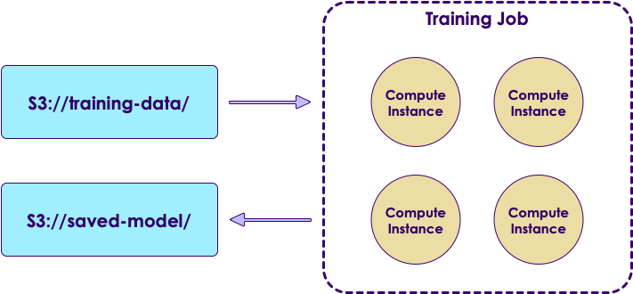
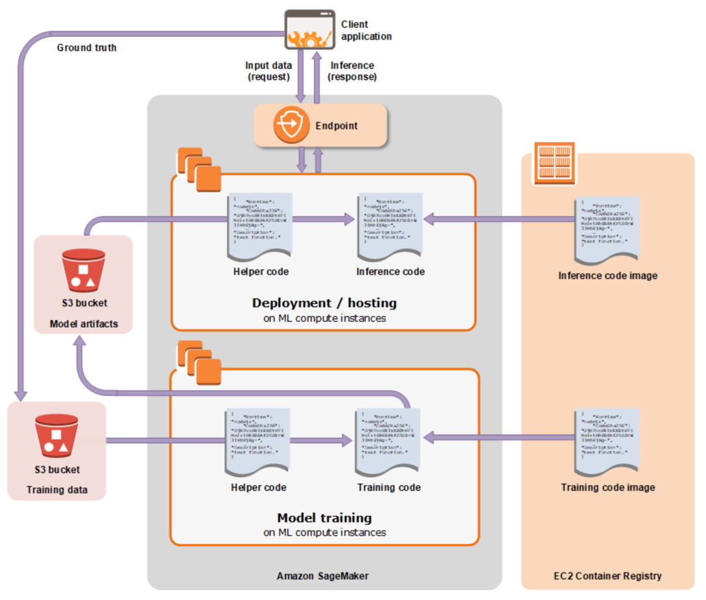
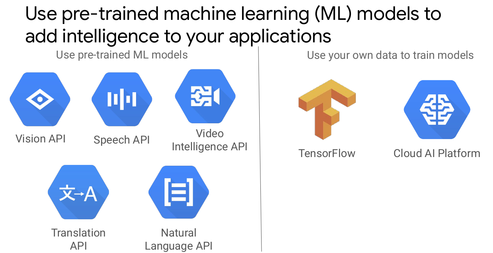
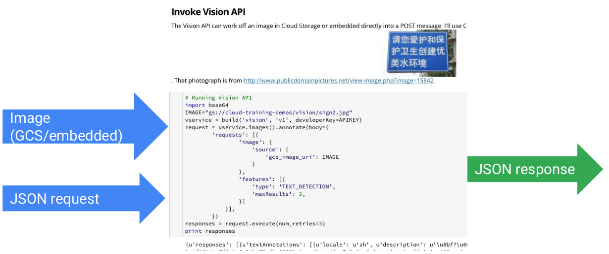
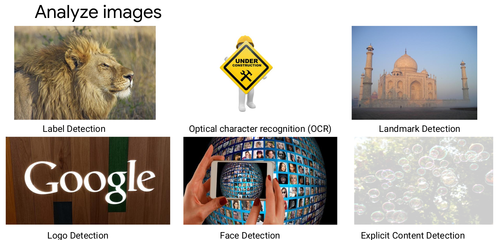
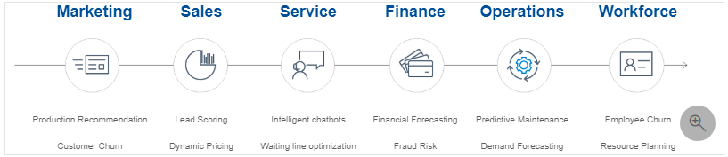
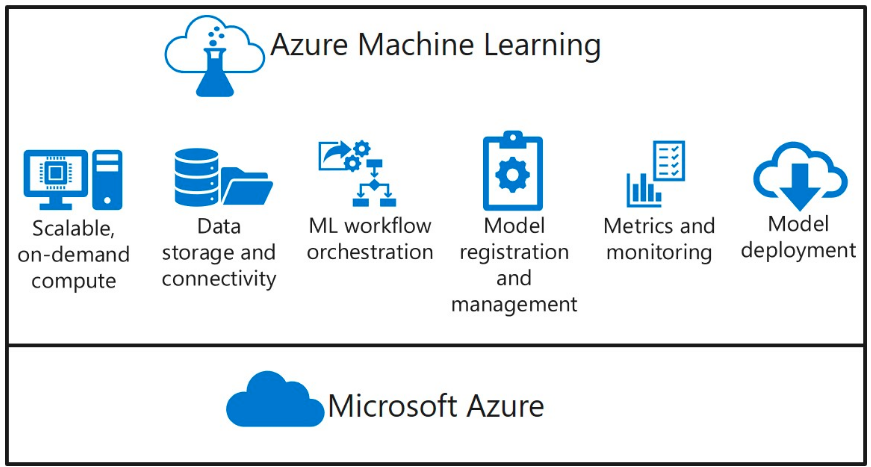
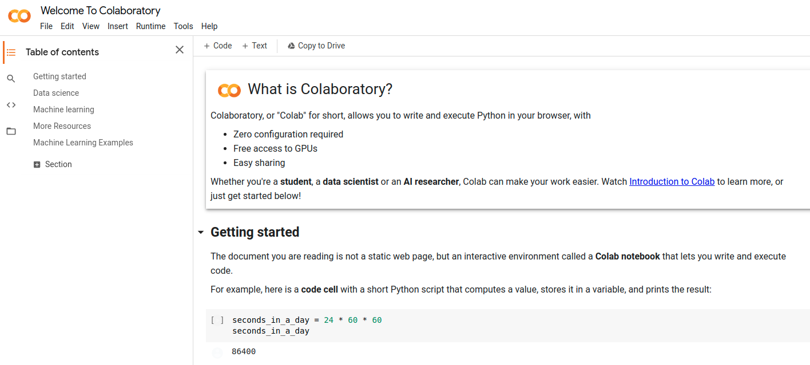

# AI-ML In the Cloud

---

# Typical Machine Learning Workflow

  * Data Scientists typically work on small datasets on their laptops
     - They work on a model
  * Once the model is decided, it is deployed on production
     - Usually on a cluster
     - Trained on large amount of data
  * Going from development to deployment isn't always easy

<!-- {"left" : 3, "top" : 6.79, "height" : 4, "width" : 11.51} -->

---

## Cloud AI/ML Systems

* Amazon - Sagemaker

* Google  - Google ML

* Azure - Azure ML

---

# SageMaker

---

## Amazon SageMaker

<!-- {"left" : 12.31, "top" : 2.11, "height" : 1.82, "width" : 4.77} -->

* Fully managed machine learning service
* Build and training machine learning models
* Deploy models into production hosted environment
* Features:
    * **Development:** Jupyter authoring notebook instance
    * **Deployment:** Easy deployment at production scale
    * Common machine learning algorithms: Optimized for large data sets in distributed mode
    * Optional bring-your-own algorithm
    * Billing: by the seconds

---

## How does SageMaker Work?

<!-- {"left" : 3.43, "top" : 2.87, "height" : 7.98, "width" : 10.63} -->

Notes:
Source: https://docs.aws.amazon.com/sagemaker/latest/dg/how-it-works-mlconcepts.html

---

## Training a Model with SageMaker

<!-- {"left" : 3.65, "top" : 2.55, "height" : 8.62, "width" : 10.19} -->

Notes:
Source: https://docs.aws.amazon.com/sagemaker/latest/dg/how-it-works-training.html

---

## Scalable Training in SageMaker

  * SageMaker can automatically spin up many instances to scale training jobs.

<!-- {"left" : 2.85, "top" : 4.5, "height" : 5.47, "width" : 11.79} -->

---

## Kernels Supported by SageMaker

  * SageMaker native algorithms
  * Spark
     - PySpark, PySpark3, SparkR
  * Anaconda Python
     - python2, python 3
  * Custom Deep Learning Python code
     - TensorFlow (conda_tensorflow)
     - Apache MXNet  (conda_mxnet)
  * Your own algorithms
     - Provided as Docker images

---

## Model Validation in SM

  * Validate
     - Sensitive or specific (a.k.a recall and precision)
     - Offline testing
     - Online testing with % of live data
  * Validate with
     - "Hold out" sets (20-30%)
     - K-fold validation (5-10)

Notes:

---

## Deploy the Model

<!-- {"left" : 9.34, "top" : 2.29, "height" : 6.19, "width" : 7.82} -->

  * Once the evaluation goes well, we can deploy the model to production:

  * Continuous cycle:
     - Monitor performance of Model
     - train it with more data
     - Deploy again

  * SageMaker makes this process easy

---

## Deploying a SageMaker Model

<!-- {"left" : 3.42, "top" : 2.32, "height" : 9.06, "width" : 10.66} -->

Notes:
Source: https://docs.aws.amazon.com/sagemaker/latest/dg/how-it-works-hosting.html

---

## SageMaker Machine Learning Steps

  * Explore the data
     - SageMaker managed instance with Jupyter Notebook

  * Train the model:
     - On small sample set using Jupyter notebook instance
     - On large dataset using cluster

  * Validate
     - Offline testing on small subset of data
     - Online testing with % of live data

  * Deploy

---

## Getting Started With SageMaker

* Start by using the SageMaker console
* Find an example Jupyter notebook and adapt it
* Create new training models
* Use Python or AWS SDK
* Integrate SageMaker into Apache Spark pipeline

---

# Google AI-ML

---

## Using Google ML

 <!-- {"left" : 1.4, "top" : 2.41, "height" : 7.56, "width" : 14.7} -->

Notes:

* Google Cloud Platform offers several pre-trained machine-learning (ML) models that
you can use to add intelligence to your application.    
* Cloud Vision API enables you to perform complex image detection. For more
information, see https://cloud.google.com/vision/.
* Cloud Speech API enables developers to convert audio to text. It handles 110
languages and variants to support your global user base. You can transcribe
the text of users dictating to an application’s microphone, enable
command-and-control through voice, transcribe audio files, and more. For
more information, see https://cloud.google.com/speech/.
* Cloud Video Intelligence API enables you to search every moment of every
video file to extract and understand the video’s entities at the shot, frame, or
video level. The API annotates videos stored in Google Cloud Storage and
helps you identify key noun entities of your video and when they occur within
the video. For more information, see
https://cloud.google.com/video-intelligence
* Cloud Translation API enables you to translate an arbitrary string into any
supported language. Translation API is highly responsive. Websites and
applications can use Translation API for fast, dynamic translation of text from a
source language to a target language (e.g., Japanese to English). For more
information, see https://cloud.google.com/translate/.
* Cloud Natural Language API enables you to extract information about entities
such as people, places, and events that are mentioned in text documents,
news articles, or blog posts. You can use the API to understand sentiment
about your product on social media or parse intent from customer
conversations. For more information, see
https://cloud.google.com/natural-language/.

* You can also use your own data to build and train your own ML models by using
TensorFlow and Cloud AI Platform

---

## Look, ma, no machine learning knowledge!

 <!-- {"left" : 0.97, "top" : 2.94, "height" : 6.52, "width" : 15.57} -->

---

## Examples

 <!-- {"left" : 0.92, "top" : 2.39, "height" : 7.6, "width" : 15.65} -->

---

## Images

 <!-- {"left" : 1.38, "top" : 2.39, "height" : 7.61, "width" : 14.74} -->

---

## Quiz

* You are developing an application that tags all surveillance video
before storing the files. Which API should you use?
    * A. Vision API
    * B. Speech API
    * C. Video Intelligence API
    * D. Translation API

Notes:

* C.

---

# Azure ML

---

## Microsoft AI approach

 <!-- {"left" : 1.87, "top" : 3.71, "height" : 4.97, "width" : 13.76} -->

Notes:

* When thinking of adopting AI into your business, you should consider prebuilt AI services first. 
  Azure Cognitive Services is Microsoft prebuilt AI product. 
  These are pre-trained models that have been developed by Microsoft global researchers and data scientists to solve common problems. 
  To avoid reinventing the wheel, businesses can leverage prebuilt services to achieve quality and accelerate delivery of technology solutions. 
  It's better to use the Azure Cognitive Services that offer prebuilt AI services in vision, speech, language, search, or decision-making to solve common problems. This brings AI within reach of every developer and organization without requiring machine learning expertise. As a result, it enables developers of all skill levels to easily add intelligence to new or existing business applications.
  
---

## Azure Cognitive Service real world examples

 <!-- {"left" : 1.95, "top" : 3.67, "height" : 5.05, "width" : 13.6} -->

Notes:

* Infusing cognitive services into existing and new business applications makes them smarter, intuitive, and customized to provide better user experience. Here are some business scenarios:

* Facial recognition
* Ride-sharing companies can use the Face service to enhance the security of riders with selfies. They can periodically prompt drivers to take a selfie before they accept ride requests. This helps ensure in real-time that the person behind the wheel matches the same person the company screened and approved in their profile account.

* Recommendation
* E-commerce or entertainment industries can improve user engagements by using the Personalizer service to understand their customers' preferences and making better recommendations to them. For gaming apps, the possible user options might be: "play a game," "watch a movie," or "join a clan." Based on that user's history and other contextual information (such as user location, time of day, device type, or day of the week) the Personalizer service helps business suggest the best option to promote or recommend to the user.

* Conversational language
* Finally, businesses can use the Language Understanding service to create conversational bots or digital agents that allow users to interact with the bot applications using natural language understanding. This custom natural language understanding service helps streamline work processes and integrate with existing data to provide better customer service at scale to build brand loyalty and a competitive advantage for businesses.

* Now that we’ve learned how prebuilt AI can help build intelligent apps by easily adding AI capabilities, let’s dive more into machine learning.

---

## Spectrum of AI implementations

 <!-- {"left" : 1.3, "top" : 4.58, "height" : 3.23, "width" : 14.9} -->

---

## ML categories

 <!-- {"left" : 2.16, "top" : 3.04, "height" : 6.3, "width" : 13.18} -->

---

## Prepare - deploy

 <!-- {"left" : 2.82, "top" : 2.23, "height" : 2.15, "width" : 11.86} -->

* Tensorflow, PyTorch, or Chainer. 
* All the logic that's behind deep learning can be accelerated on specialized hardware, like GPUs and FPGAs

Notes:

* Chainer is an open source deep learning framework written purely in Python on top of NumPy and CuPy Python libraries. The development is led by Japanese venture company Preferred Networks in partnership with IBM, Intel, Microsoft, and Nvidia.

* Chainer is notable for its early adoption of "define-by-run" scheme, as well as its performance on large scale systems.[1] The first version was released in June 2015 and has gained large popularity in Japan since then.[1][2] Furthermore, in 2017, it was listed by KDnuggets in top 10 open source machine learning Python projects.

* In December 2019, Preferred Networks announced the transition of its development effort from Chainer to PyTorch and it will only provide maintenance patches after releasing v7.

---

## Azure Machine Learning

 <!-- {"left" : 2.08, "top" : 2.62, "height" : 7.15, "width" : 13.34} -->

---

## Quiz

* Which of the following descriptions accurately describes Azure Machine Learning?

    * A. A Python library that you can use as an alternative to common machine learning frameworks like Scikit-Learn, PyTorch, and Tensorflow.

    * B. A cloud-based platform for operating machine learning solutions at scale.

    * C. An application for Microsoft Windows that enables you to create machine learning models by using a drag and drop interface.

Notes: 

* B
* Azure Machine Learning enables you to manage machine learning model data preparation, training, validation, and deployment. It supports existing frameworks such as Scikit-Learn, PyTorch, and Tensorflow; and provides a cross-platform platform for operationalizing machine learning in the cloud.

---

## Quiz

* You are using the Azure Machine Learning Python SDK to write code for an experiment. You must log metrics from each run of the experiment, and be able to retrieve them easily from each run. What should you do?

    * A. Add print statements to the experiment code to print the metrics.

    * B. Save the experiment data in the outputs folder.

    * C. Use the log* methods of the Run class to record named metrics.

Notes:

* C.
* To record metrics in an experiment run, use the Run.log* methods.

---

## Field-programmable gate arrays (FPGAs) on Azure

* What are FPGAs?
  * FPGAs contain an array of programmable logic blocks, and a hierarchy of reconfigurable interconnects. 
  * The interconnects allow these blocks to be configured in various ways after manufacturing. 
  * Compared to other chips, FPGAs provide a combination of programmability and performance.

* FPGAs make it possible
  * achieve low latency for real-time inference (or model scoring) requests. 
  * Asynchronous requests (batching) aren't needed. 
  * Batching can cause latency, because more data needs to be processed. Implementations of neural processing units don't require batching; 
  * The latency can be many times lower, compared to CPU and GPU processors.
  
---

## Doug Burger Azure Architect on FPGA

 <!-- {"left" : 3.86, "top" : 2.15, "height" : 6, "width" : 9.77} -->

* YouTube
* [https://www.youtube.com/watch?v=iJo_sSzioxM&t=2659s](https://www.youtube.com/watch?v=iJo_sSzioxM&t=2659s)

---

# Jupyter notebook environments

---

## What is Colaboratory?

* Colaboratory, or "Colab" for short, allows you to write and execute Python in your browser, with

  * Zero configuration required
  * Free access to GPUs
  * Easy sharing
  * Whether you're a student, a data scientist or an AI researcher, Colab can make your work easier. Watch Introduction to Colab to learn more, or just get started below!
  
---

## Colab at a glance

 <!-- {"left" : 1.56, "top" : 2.94, "height" : 6.5, "width" : 14.38} -->

---

## Colab contents

* Getting started
* Data science
* Machine learning
* More Resources
* Machine Learning Examples
* Let's do a **demo!**

---

## Kaggle at a glance

* Kaggle offers a no-setup, customizable, Jupyter Notebooks environment. 
* Access free GPUs and a huge repository of community published data & code.
* Inside Kaggle you’ll find all the code & data you need to do your data science work. 
* Use over 50,000 public datasets and 400,000 public notebooks to conquer any analysis in no time.
* [https://www.kaggle.com/c/coleridgeinitiative-show-us-the-data](https://www.kaggle.com/c/coleridgeinitiative-show-us-the-data/)
* Host your book or research paper on Kaggle!

---

## More references

* PyTorch, TF, and other stacks - in every cloud
* Technical considerations to use ML at scale
* [https://d1.awsstatic.com/whitepapers/aws-power-ml-at-scale.pdf](https://d1.awsstatic.com/whitepapers/aws-power-ml-at-scale.pdf)

---

## Congrats on completion

 <!-- {"left" : 1.05, "top" : 4.57, "height" : 3.25, "width" : 15.41} -->

