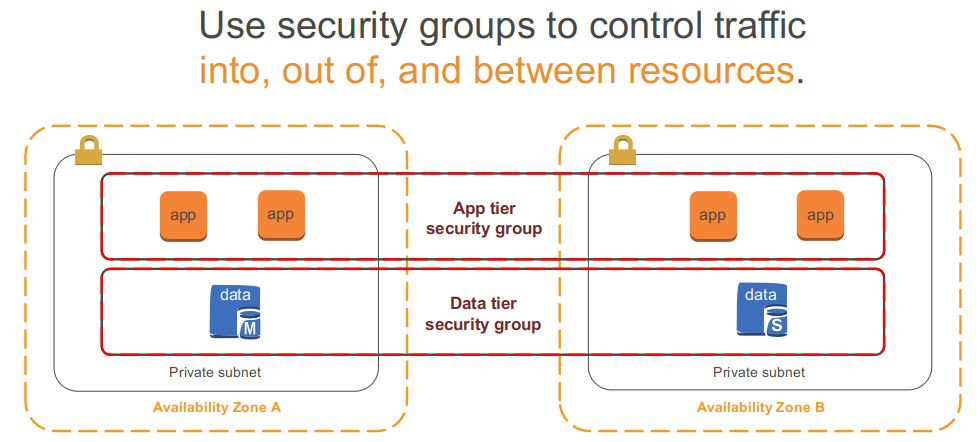
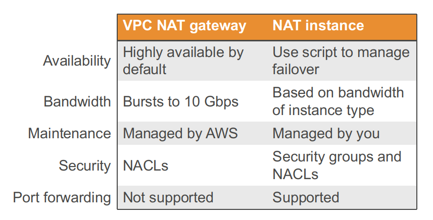
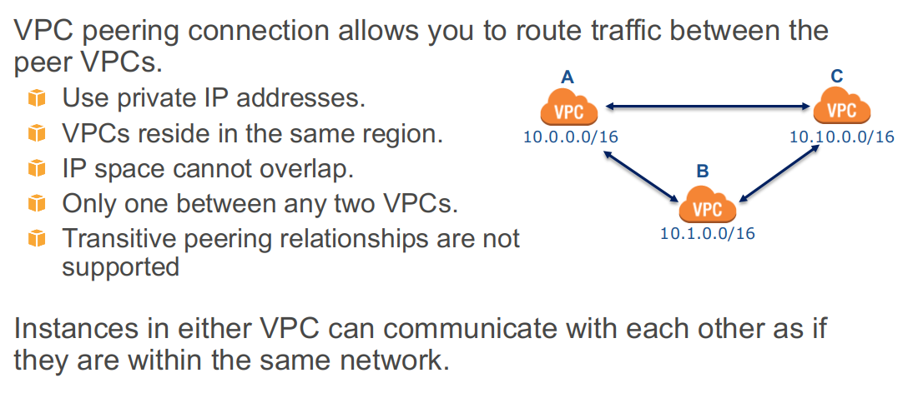

# Networking and data movement

---

# Networking overview

---

## Virtual Private Cloud (VPC)
* Provision a private, isolated virtual network on the cloud.
* Have complete control over your virtual networking environment.
* Please **note** that we will first cover generic VPC and AWS, then Azure and GCP.

---

## VPCs and subnets

* A **subnet** defines a range of IP addresses in your VPC.
* You can launch resources into a subnet that you select.
* A **private subnet** should be used for resources that won’t be accessible over the Internet.
* A **public subnet** should be used for resources that will be accessed over the Internet.
* A **VPC endpoint** enables private connections between your VPC and supported AWS services and VPC endpoint services powered by AWS PrivateLink.

---
---

## VPC and regions
* VPCs are for building your private clouds. Depending on cloud implementation, 
they can span regions, but we will not cover such architectures because they are unlikely

---
## VPC Example

---

## Security in Your VPC

* Security groups
* Network access control lists (ACLs)

---

## VPN Connections

* Other clouds give similar options

---

## Networking in Your VPC
* You can use the following components to configure networking in your VPC:
    * IP Addresses
    * Elastic Network Interfaces
    * Route Tables
    * Internet Gateways
    * Network Address Translation (NAT)
    * Dynamic Host Configuration Protocol (DHCP) Options Sets
    * Domain Name System (DNS)
    * VPC Peering
    * VPC Endpoints
    * VPC Flow Logs
    
---

## Quiz

* What acts as an additional layer of security at the subnet level in a VPC?

    * A. AAA
    * B. CLA
    * C. ACL
    * D. SSL
    
Notes:

* C.

---

# Designing your VPC

---

## Region

* Does your region meet your environment’s data sovereignty and compliance requirements?
* Do you meet data security laws of the country and locality in which your data is stored?
* Can your researchers’ data legally exist outside of the country where you are operating?  
* Will you be able to meet your governance requirements by placing your environment in the region where you plan to place it?
    
---

## Region

* How close is the region to your university, users or data centers?
* Very important for Amazon: Every 100-ms delay on Amazon.com costs 1% in sales on the website.
    * Region travel is limited by speed of light which take 1/8 of a second around the world
    * Add other factors - and region choice becomes important even outside of commerce
* Most organizations choose an initial region closest to data centers or customers, e.g.: 
* New York: US East (N. Virginia)
* Netherlands: EU (Ireland) or EU (Frankfurt)
* Philippines: Asia Pacific (Singapore)
* Two equidistant regions to choose from? Consider which has lower costs.

---

## Region

* Does the region you’re considering offer all of the services and features your environment might require?
    * Not all services and features are available in all regions.
    * New services typically launch in a limited number of regions
* Are you choosing the most cost-effective region?
    * Service costs vary by region.
    * Some services (like Amazon S3) have costs when you transfer data out of their original region.
    * If you want to replicate your environment across more than one region, is that the most cost-effective solution?
    
---

## Discussion

* Research-related regions consideration
* Consider how time sensitive the communications are
    * If local instruments or other such local issues are involved, then distance may be a major factor. 
    * The example that comes to mind is an earthquake shake table where the output of data processing provides near-real time control of the table. 
    * With a shake table near SF CA, doing compute at TACC was problematic because of the speed of light issues all the way to Texas and back.

---

## How Many Availability Zones Should I Use?

* **Recommendation:** Start with two Availability Zones per region.
* **Best practice:** If resources in one Availability Zone are unreachable, your application shouldn't fail.
* Most applications can support two Availability Zones. 
* Using more than two Availability Zones for HA is not usually cost-effective.

---
## Example of Using Two Availability Zones

---

## Other Reasons To Use Two Availability Zones

* How many Availability Zones would be recommended for each scenario?
    * 1. Applications heavily use preemptible (spot) Instances **for cost control**:
        * Two Availability Zones or more for more **price options**
    * 2. Applications have data sources such as MySQL, MS SQL Server, and Oracle:
        * Two Availability Zones to support active/passive
    * 3. Applications have data sources such as Cassandra or MongoDB: 
        * Two Availability Zones or more for extremely high availability

---

## Using One VPC

* There are limited use cases where one VPC could be appropriate:
    * High-performance computing
    * Identity management
    * Small, single applications managed by one person or very small team

* For most use cases, there are two primary patterns for organizing your infrastructure:
    * **Multi-VPC**  and  **Multi-Account**
    
---
            
## AWS Infrastructure Patterns

---

## VPC Patterns

* How do you know which pattern to use?
    * The primary factors for determining this are the **complexity**
     of your organization and your **workload isolation** requirements:

* Single IT team? **Multi-VPC**

* Large organization with many IT teams? **Multi-account**
    * Rare for research

* High workload isolation required? **Multi-account**

---
## Multi-VPC Pattern
* Features:
    * Uses **one account**
    * Uses **two or more VPCs** to organize application environments
* Best suited for:
    * **Single team or single organizations**
* Why?
    * Limited teams make **maintaining standards** and **managing access** far easier.
* Exception:
    * **Governance and compliance** standards may require workload isolation regardless of organizational complexity.

---
    
## Multi-Account Pattern

* Features:
    * Uses **two or more accounts** to organize application environments
    * Uses **one VPC** per AWS account
* Best suited for (though not likely for university researchers):
    * **Large organizations** and **organizations with multiple IT teams**, such as Enterprise-level corporations or government agencies
    * **Medium-sized organizations** that anticipate rapid growth
* Why?
    * **Managing access** and **standards** can be more challenging in more complex organizations.
    
---

## Other Important Considerations for AWS
* The majority of AWS services **do not actually sit within a VPC**.
    * For these services, a VPC **cannot provide any isolation** outside of connectivity.
    * Communication between resources based in a VPC and resources outside of that VPC traverses the **public AWS network** by default.
        * Amazon S3 offers **VPC endpoints** to connect without traversing the public Internet:
            * Endpoints are supported within the same region only.
            * Support for endpoints with other services will be added in the future.
            
---            

## VPCs And IP Addresses
    
* When you create your VPC, you specify its set of IP addresses with CIDR notation.

* Classless Inter-Domain Routing (CIDR) notation is a simplified way to show a specific range of IP addresses.

* Example: 10.0.0.0/16 = all IPs from 10.0.0.0 to 10.0.255.255

* How does that work?  What does the 16 define?

---

## IPs and CIDR

---

## IPs and CIDR

---

## IPs and CIDR

---

## CIDR Example: 10.0.0.0/16

---

## VPCs and IP Addresses

---

## What Are Subnets?

---

## How to Use Subnets

---

## Subnets

---

## Subnets

---

## Subnet Sizes
* Recommendation: Consider larger subnets over smaller ones (/24 and larger). 

* Simplifies workload placement:
    * Choosing where to place a workload among 10 small subnets is more complicated than with one large subnet.
    
* Less likely to waste or run out of IPs:
    * If your subnet runs out of available IPs, you can't add more to that subnet.
    * Ex.: If you have 251 IPs in a subnet that's using only 25 of them, you can't share the unused 226 IPs with another subnet that's running out.
    
---

## Quiz

* Which subnet type (public or private) should you use for these resources ?
    * A. Datastore instances
        * Public or Private?
    * B. Batch processing instances?
        * Public or Private?
    * C. Back-end instances
        * Public or Private?
    * D. Web application instances?
        * Public or private?
        
Notes:

* A. Private
* B. Private
* C. Private
* D. Either Public or Private

---
## How do you control your VPC traffic?

* Route tables
* Security groups
* Network ACLs
* Internet gateways

---
## Route Tables: Directing Traffic Between VPC Resources

* Route tables:
    * Determine where network traffic is routed
    * Main and custom route tables
    * VPC route table
        * Local route
    * Only one route table per subnet

* **Best practice:** For better security, use custom route tables for each subnet.

Notes:

* A route table contains a set of rules, called routes, that are used to determine where network traffic is directed.
* When you create a VPC, it automatically has a main route table. Initially, the main route table (and every route table in a VPC) contains only a single route: a local route that enables communication within the VPC. You can't modify the local route in a route table. Whenever you launch an instance in the VPC, the local route automatically covers that instance; you don't need to add the new instance to a route table. You can create additional custom route tables for your VPC.
* Each subnet in your VPC must be associated with a route table, which controls the routing for the subnet. If you don't explicitly associate a subnet with a particular route table, the subnet is implicitly associated with and uses the main route table. A subnet can be associated with only one route table at a time, but you can associate multiple subnets with the same route table.
* One way to protect your VPC is to leave the main route table in its original default state (with only the local route), and explicitly associate each new subnet you create with one of the custom route tables you've created. This ensures that you must explicitly control how each subnet's outbound traffic is routed.

---

## Securing VPC Traffic With Security Groups

* **Security groups:**
    * Are virtual firewalls that control inbound and outbound traffic for one or more instances.
    * Deny all incoming traffic by default and use allow rules that can filter based on TCP, UDP, and ICMP protocols.
    * Are stateful, which means that if your inbound request is allowed, the outbound response does not have to be inspected/tracked, and vice versa.
    * Can define a source/target as either a CIDR block or another security group to handle situations like autoscaling.
 
Notes:

* Regarding stateful rules: for example, if you initiate an ICMP ping command to your instance from your home computer, and your inbound security group rules allow ICMP traffic, information about the connection (including the port information) is tracked. Response traffic from the instance for the ping command is not tracked as a new request, but instead as an established connection, and is allowed to flow out of the instance, even if your outbound security group rules restrict outbound ICMP traffic.
* Not all flows of traffic are tracked. If a security group rule permits TCP or UDP flows for all traffic (0.0.0.0/0), and there is a corresponding rule in the other direction that permits the response traffic, that flow of traffic is not tracked. The response traffic is therefore allowed to flow based on the inbound or outbound rule that permits the response traffic, and not on tracking information.

---

## Security Groups

Notes: 

* So we've shown how to organize and isolate resources at the network and subnet levels, now we'll talk about how to do that at the resource level for services that sit within VPCs.
* In the example above, the application and data tiers both exist in the private subnets of this VPC.  To provide component isolation, the application servers share one security group and the Amazon RDS instances share another.

---

## How Security Groups Are Configured

* By default, all newly created security groups allow all outbound traffic to all destinations.
    * Modifying the default outbound rule on security groups increases complexity and is not recommended unless required for compliance.
* Most organizations create security groups with inbound rules for each functional tier (web/app/data/etc.) within an application.

---

## Security Group Chaining Diagram

* Security group rules per application tier

---

## Network ACLs

* Are optional virtual firewalls that control traffic in and out of a subnet.
* Allow all incoming/outgoing traffic by default and use stateless rules to allow or deny traffic.
    * "Stateless rules" inspect all inbound and outbound traffic and do not keep track of connections.
* Enforce rules only at the boundary of the subnet, not at the instance-level, like security groups.

Notes:

* Security groups provide far more granular control over traffic than NACLs. In some cases, NACLs are explicitly required for certain compliance standards. In this case, we recommend your NACLs act as redundantly with your security groups as possible.

---

## Quiz

* VPC stands for:

    * A. Very Private Cloud
    * B. Virtual Public Cloud
    * C. Virtual Private Cloud
    * Very Public Cloud
    
Notes: 

* C.

---

## Quiz

* Having just created a new VPC and launching an instance into its public subnet, you realise that you have forgotten to assign a public IP to the instance during creation. What is the simplest way to make your instance reachable from the outside world?

    * A. Create an elastic IP and a new network interface. Associate the elastic IP to the new network interface, and the new network interface to your instance.
    * B. Associate the private IP of your instance to the public IP of the internet gateway
    * C. Create an elastic IP address and associate it with your instance
    * D. Nothing - by default all instance deployed into any public subnet will automatically recieve a public IP
    
Notes:

* C.

---

## Quiz

* True or False: A subnet can span multiple Availability Zones.

    * A. True
    * B. False
    
Notes:

* B. 
* Note: on GCP, it can span AZ???

---

## Quiz

* Are you permitted to conduct your own vulnerability scans on your own VPC without alerting AWS first?

    * A. Yes. You can perform any scan without first alerting AWS
    * B. No. You must always alert AWS before performing any kind of vulnerability scan
    * C. It depends. Until recently customers were not permitted to conduct penetration testing without AWS engagement. However that has changed. There are still conditions though.
    
Notes:

* C.

---

## Directing Traffic To Your VPC

* Internet gateways:
    * Allow communication between instances in your VPC and the Internet.
    * Are a managed service: horizontally scaled, redundant, and highly available by default.
    * Provide a target in your VPC route tables for Internet-routable traffic.
 

 
---

## Directing Traffic To Your VPC

* To enable access to or from the Internet for instances in a VPC subnet, you must:
    * Attach an Internet gateway to your VPC.
    * Ensure that your subnet's route table points to the Internet gateway.
    * Ensure that instances in your subnet have public IP addresses or Elastic IP addresses.
    * Ensure that your NACLs and security groups allow the relevant traffic to flow to and from your instance.
    
---

## What About Outbound Traffic From Private Instances?

* Network Address Translation services:
    * Enable instances in the private subnet to initiate outbound traffic to the Internet or other AWS services.
    * Prevent private instances from receiving inbound traffic from the Internet.
* Two primary options:
    * Amazon EC2 instance set up as a NAT in a public subnet
    

---    
    
## What About Outbound Traffic From Private Instances?

* Network Address Translation services:
    * Enable instances in the private subnet to initiate outbound traffic to the Internet or other AWS services.
    * Prevent private instances from receiving inbound traffic from the Internet.
* Two primary options:
    * Amazon EC2 instance set up as a NAT in a public subnet
    * VPC NAT Gateway

---    

## VPC NAT Gateways vs. NAT Instances On Amazon EC2

Notes:

* You should carefully consider your decision on which Network Address Translation solution to use. While VPC NAT gateways offer all the advantages of being a service managed by AWS (such as being inherently highly available), they may not provide the exact level of control your application needs.  There are also cost differences to consider between the two options. 

---

## Subnets, Gateways, and Routes

---  
## Amazon VPC Flow Logs

* Captures traffic flow details in your VPC.
* Accepted and rejected traffic
* Can be enabled for VPCs, subnets, and ENIs.
* Logs published to CloudWatch Logs.

---

## Connecting VPCs together

* Not the right way

---

## VPC peering

---

## How Does VPC Peering Work?

Notes:

* The example on this slide shows that an entire CIDR block is opened, but you can specify an IP on the route table (10.0.150.38/32). 
* To create a VPC peering connection with another VPC, you need to be aware of the following limitations and rules:
* You cannot create a VPC peering connection between VPCs in different regions.
* There is a limit on the number of active and pending VPC peering connections that you can have per VPC. 
* VPC peering does not support transitive peering relationships; in a VPC peering connection, your VPC will not have access to any other VPCs that the peer VPC may be peered with. This includes VPC peering connections that are established entirely within your own AWS account. 
* You cannot have more than one VPC peering connection between the same two VPCs at the same time.
* The Maximum Transmission Unit (MTU) across a VPC peering connection is 1500 bytes.
* A placement group can span peered VPCs; however, you will not get full-bisection bandwidth between instances in peered VPCs. 
* Unicast reverse path forwarding in VPC peering connections is not supported. 
* You cannot reference a security group from the peer VPC as a source or destination for ingress or egress rules in your security group. Instead, reference CIDR blocks of the peer VPC as the source or destination of your security group's ingress or egress rules.
* Private DNS values cannot be resolved between instances in peered VPCs.

---
## Rules Of VPC Peering

Notes:

* In the diagram, VPCs A and B are peered, which does not mean that C can talk to B. By default, VPC peering does not allow C to connect to B unless they are explicitly established as peers. The same for corporate data center access. VPN connections to one VPC cannot be shared across a peered connection.
* You can configure all the VPCs as peered to each other. You may think that is too much, but it is not, because VPC peering does not involve any hardware or external configuration. Even peering between 50 VPCs is reasonable. 
* Consider a case where your organization wants to share resources across the entire organization. For example, a VPC dedicated for the accounting department and a VPC for the engineering department both need to access shared services such as a management approval service or procurement service. However, the engineering VPC should not be able to access the accounting VPC. In such a case, you create VPC peering between the accounting VPC and the shared services VPC, and also create VPC peering between the engineering VPC and the shared services VPC. 
* In this scenario, only A has a connection to the corporate data center, and can serve as a hub.
* There are various peering scenarios that you can configure. Refer to the online documentation for more scenarios: http://docs.aws.amazon.com/AmazonVPC/latest/PeeringGuide/peering-configurations.html

--- 

## VPC Peering Security

* Two-way handshake to establish a peering connection.

* Routing controls: Routing tables control the local subnets that can route to remote subnets.

* Security groups control what traffic an instance can send or receive.

* Network ACLs control what traffic a subnet can send or receive.

* No edge-to-edge routing or transitive trusts: Reduces inadvertently creating unexpected network connections.

---

## Extending On-Premises Network To AWS: VPN Connections

Notes:

* One solution is to use a VPN connection between your VPC's Virtual Gateway and your data center.  With an AWS hardware VPN, you are provided with two VPN endpoints to provide basic, automatic failover.  To create an AWS hardware VPN, go here: http://docs.aws.amazon.com/AmazonVPC/latest/UserGuide/VPC_VPN.html		
* You can also create a VPN connection to your remote network by using an Amazon EC2 instance in your VPC that's running a software VPN appliance. AWS does not provide or maintain software VPN appliances; however, you can choose from a range of products provided by partners and open source communities on the AWS Marketplace.

Notes:

* Just a mention

---

## Extending On-Premises Network To AWS: Multiple VPN

 
Notes: 

* Amazon VGW also supports and encourages multiple customer gateway connections so that customers can implement redundancy and failover on their side of the VPN connection, as shown on this slide. Both dynamic and static routing options are provided to give customers flexibility in their routing configuration. Dynamic routing leverages BGP peering to exchange routing information between AWS and these remote endpoints. Dynamic routing also allows customers to specify routing priorities, policies, and weights (metrics) in their BGP advertisements and to influence the network path between their networks and AWS. 
* It is important to note that when BGP is used, both the IPSec and the BGP connections must be terminated on the same customer gateway device, so it must be capable of terminating both IPSec and BGP connections. 

Notes:

* Just a mention
 
---

## AWS Direct Connect

* AWS Direct Connect provides you with a private network connection between AWS and your data center. 
* It is a network service alternative to using the Internet to access AWS cloud services.

* Benefits:
    * Reduced network transfer costs
        * Note of caution. Treated as credit against compute costs, this helps if you have data AND an application, but not if you just host a big data set. We heard of cases in which the promised savings did not materialize.
    * Improved application performance with predictable metrics
    * Transferring large data sets
    * Security and compliance

    * Hybrid cloud architectures
    * Private data center expansion
    * Alternative to Internet-based IPSec VPN connections (IPSec VPN connections can be used as a failover)

Notes:

* Just a mention
    
---    

## Default VPCs

* Details about default VPCs:
    * Each region in your account has a default VPC.
    * Default CIDR is 172.31.0.0/16.
    * If you create a VPC-based resource (Amazon EC2, Amazon RDS, Elastic Load Balancing, etc.) but don't specify a custom VPC, it will be placed in your default VPC in that region.
    * Includes a default subnet, IGW, main route table connecting default subnet to the IGW, default security group, and default NACL.
    * Configurable the same as other VPCs; e.g., adding more subnets.
 
---

## Default Subnet

* Default subnets in default VPCs:
    * Created within each Availability Zone for each default VPC.
    * Public subnet with a CIDR block of /20 (4,096 IPs). 
    * You can convert it (and any public subnet) into a private subnet by removing its route to the IGW.
    * When a new Availability Zone is added to a region, your default VPC in that region gets a subnet placed in the new Availability Zone (unless you've made modifications to that VPC).
    
---

## When Should I Use Default VPCs And Subnets?

* **Recommendation**: Use default VPCs and their subnets only for experimenting in your AWS account.
    * Default VPCs are a quick start solution.
    * They provide an easy way to test launching instances of your VPC-based resources, without having to set up a new VPC.
    * For real-world applications, create your own VPCs and subnets.
        * You'll have greater control/knowledge of their configurations.
        * You can delete them and create new ones easily.
        
---
## VPC Best Practices

* Choose CIDR blocks wisely. Plan ahead.
* Use large subnets instead of a higher number of small subnets.
* Keep subnets simple and divide by Internet accessibility (public/private). 
* Use Multi-AZ deployments in VPC for high availability.
* Use security groups to control traffic between resources.
* Use VPC Flow Logs to track and monitor your VPC traffic.
* Check the health of your VPN link via API calls or the AWS Management Console.

---

## Quiz

* True or False: You can accelerate your application by adding a second internet gateway to your VPC.

    * A. True
    * B. False
    
Notes:

* B. You may have only one internet gateway per VPC.

---

## Quiz

* When peering VPCs, you may peer your VPC only with another VPC in your same AWS account.

    * A. True
    * B. False
    
Notes:

* B. You may peer a VPC to another VPC that's in your same account, or to any VPC in any other account.

---

## Quiz

* True or False: An application load balancer must be deployed into at least two subnets.

    * A. True
    * B. False
    
Notes:

* A. 

---
                   
## Quiz

* Which of the following is a chief advantage of using VPC endpoints to connect your VPC to services such as S3?

    * A. Traffic between the VPC and the other service does not have to leave the Amazon network
    * B. VPC endpoints offer a faster path through the public internet
    * C. VPC endpoints require a public IP which gives faster connectivity
    * D. VPC endpoints are hardware devices
    
Notes:

* A. In contrast to a NAT gateway, traffic between your VPC and the other service does not leave the Amazon network when using VPC endpoints.

---

## Quiz

* Which of the following allows you to SSH or RDP into an EC2 instance located in a private subnet?

    * A. Bastion host
    * B. NAT instance
    * C. NAT gateway
    * D. Internet gateway
    
Notes:

* A. A Bastion host allows you to securely administer (via SSH or RDP) an EC2 instance located in a private subnet. Don't confuse Bastions and NATs, which allow outside traffic to reach an instance in a private subnet.

---

## Quiz

* When I create a new security group, all outbound traffic is allowed by default.     
     
    * A. True
    * B. False
    
Notes:

* A. 

---

## Quiz

* To save administration headaches, a consultant advises that you leave all security groups in web-facing subnets open on port 22 to 0.0.0.0/0 CIDR. That way, you can connect wherever you are in the world. Is this a good security design?     
     
    * A. True
    * B. False
    
Notes:

* B. 0.0.0.0/0 would allow ANYONE from ANYWHERE to connect to your instances. This is generally a bad plan. The phrase 'web-facing subnets' does not mean just web servers. It would include any instances in that subnet some of which you may not strangers attacking. You would only allow 0.0.0.0/0 on port 80 or 443 to to connect to your public facing Web Servers, or preferably only to an ELB. Good security starts by limiting public access to only what the customer needs. Please see the AWS Security whitepaper for complete details. 

---

# Networking on Azure

---

## Azure Virtual networks
         
* Virtual networks are for connecting
    * VMs 
    * App Service Environment for Power Apps
    * Azure Kubernetes Service
    * Azure virtual machine scale sets.

* Azure Service endpoints   

    * To connect to other Azure resource types
    * Azure SQL databases 
    * Storage accounts
    * This approach enables you to link multiple Azure resources to virtual networks to improve security and provide optimal routing between resources.    

---

## Communicate with on-premises resources

* Point-to-site virtual private networks

    * This approach is like a virtual private network (VPN) connection that a computer outside your organization makes back into your corporate network, except that it's working in the opposite direction. In this case, the client computer initiates an encrypted VPN connection to Azure to connect that computer to the Azure virtual network.

* Site-to-site virtual private networks

    * A site-to-site VPN links your on-premises VPN device or gateway to the Azure VPN gateway in a virtual network. In effect, the devices in Azure can appear as being on the local network. The connection is encrypted and works over the internet.

* Azure ExpressRoute

    * For environments where you need greater bandwidth and even higher levels of security, Azure ExpressRoute is the best approach. ExpressRoute provides dedicated private connectivity to Azure that doesn't travel over the internet.
    
---
## Route network traffic

* By default, Azure routes traffic between subnets on any connected virtual networks, on-premises networks, and the internet. You also can control routing and override those settings, as follows:

* Route tables

    * A route table allows you to define rules about how traffic should be directed. You can create custom route tables that control how packets are routed between subnets.

* Border Gateway Protocol

    * Border Gateway Protocol (BGP) works with Azure VPN gateways or ExpressRoute to propagate on-premises BGP routes to Azure virtual networks.
    
---

## Filter network traffic

* Network security groups

    * A network security group is an Azure resource that can contain multiple inbound and outbound security rules. You can define these rules to allow or block traffic, based on factors such as source and destination IP address, port, and protocol.

* Network virtual appliances

    * A network virtual appliance is a specialized VM that can be compared to a hardened network appliance. A network virtual appliance carries out a particular network function, such as running a firewall or performing wide area network (WAN) optimization.
    
---

## Connect virtual networks

* You can link virtual networks together by using virtual network peering. 

    * Peering enables resources in each virtual network to communicate with each other. These virtual networks can be in separate regions, which allows you to create a global interconnected network through Azure.
    
* UDR is user-defined Routing. 
    * UDR is a significant update to Azure’s Virtual Networks
    * allows network admins to control the routing tables between subnets within a subnet as well as between VNets thereby allowing for greater control over network traffic flow.
    
---

## Network peering

---

## Create a virtual network

* Configure a number of basic settings

---

## Network created

* You will be able to adjust the settings later

---

## VPN gateways

* A VPN gateway is a type of virtual network gateway. Azure VPN Gateway instances are deployed in Azure Virtual Network instances and enable the following connectivity:

    * Connect on-premises datacenters to virtual networks through a site-to-site connection.
    * Connect individual devices to virtual networks through a point-to-site connection.
    * Connect virtual networks to other virtual networks through a network-to-network connection.

---

## Quiz

* You want to create a secure communication tunnel between branch offices. Which of the following technologies can NOT be used?

    * A. Point-to-site virtual private network
    * B. Implicit FTP over SSL
    * C. Azure ExpressRoute
    * D. Site-to-site virtual private network
    
Notes:

* B.

--- 

## Quiz

* You want to use Azure ExpressRoute to connect its on-premises network to the Microsoft cloud. Which of the following choices isn't an ExpressRoute model that you can use?

    * A. Any-to-any connection
    * B. Site-to-site virtual private network
    * C. Point-to-point Ethernet connection
    * D. CloudExchange colocation
    
Notes:

* B.

---

## Quiz

* Which of the following options can you use to link virtual networks?

    * A. Network address translation

    * B. Multi-chassis link aggregation

    * C. Dynamic Host Configuration Protocol

    * D. Virtual network peering        

Notes: 

* D.

---    

# VPC in GCP

---

## Organizing things in GCP

* Projects, networks, and subnetworks
* IP addresses
* Routes and rules
* Billing

---

## Projects and networks

* A project: 
    * Associates objects and services with billing.
    * Contains networks (quota max 5).
    
* A network: 
    * Has no IP address range.
    * Is global and spans all available regions.
    * Contains subnetworks.
    * Can be of type default, auto mode, or custom mode.
    
---

## Networks isolate systems

Notes:

* You can use networks to isolate systems. If you want to make sure that System C can never communicate with System D except over the internet, place them in separate networks. In this scenario, for C and D to communicate, they would communicate by egressing outside of the project. The traffic isn’t actually touching the internet, but is going through the Google Edge routers, which has different billing and security ramifications.

* Instances in the same network, such as A and B, can communicate with each other over internal IPs even though they are in different regions.

---    
  
## Subnetworks cross zones

* Subnetworks can extend across zones in the same region.
* One VM and an alternate VM can be on the same subnet but in different zones.
* A single firewall rule can apply to both VMs even though they are in different zones.

---

## Subnetworks are for managing resources

* Networks have no IP range, so subnetworks don't need to fit into an address hierarchy. Instead, subnetworks can be used to group and manage resources. They can represent departments, business functions, or systems.

---

## IP addresses

* External IPs are mapped to internal IPs

---

## DNS resolution for internal addresses

* Each instance has a hostname that can be resolved to an internal IP address:
    * The hostname is the same as the instance name.
    * FQDN is [hostname].c.[project-id].internal.
        * Example: guestbook-test.c.guestbook-151617.internal
        
* Name resolution is handled by internal DNS resolver:
    * Provided as part of Compute Engine (169.254.169.254).
    * Configured for use on instance via DHCP.
    * Provides answer for internal and external addresses.
    
---

## A route is a mapping of an IP range to a destination

* Every network has:
    * Routes that let instances in a network send traffic directly to each other.
    * A default route that directs packets to destinations that are outside the network.

* *The fact that a packet has a route to a destination doesn’t mean it can get there; firewall rules must also allow the packet.*
    
---

## Quiz

* GCP firewall rules are stateful

    * A. True
    * B. False
    
Notes:

* A.

---

## Quiz

* When you enable a project as a shared VPC, all of its existing and future networks will be shared networks

    * A. True
    * B. False
    
Notes:

* A. 

---

## Quiz

* Once VPCs are peered, administration of routes, firewalls, etc can be performed centrally

    * A. True
    * B. False
    
Notes:

* B.

---

## Quiz

* GCP VPC networks are global resources

    * A. True
    * B. False
    
Notes:

* A. VPC networks, including their associated routes and firewall rules, are global resources. They are not associated with any particular region or zone.

---

## Quiz

* When you configure an ingress firewall rule, the subsequent egress traffic is automatically allowed

    * A. True
    * B. False
    
Notes:

* A. GCP firewall rules are stateful. 

---

## Thank you

* Congratulation on finished the Networking and Data Movement

Notes: 

* TODO
    * Add networking summary
    * Add data movement
    * Defining subnets and subnet masks really necessary?
    * Avoid private IP space used on-prem or by collaborators
    
---

## Congrats on completion

---

      
    