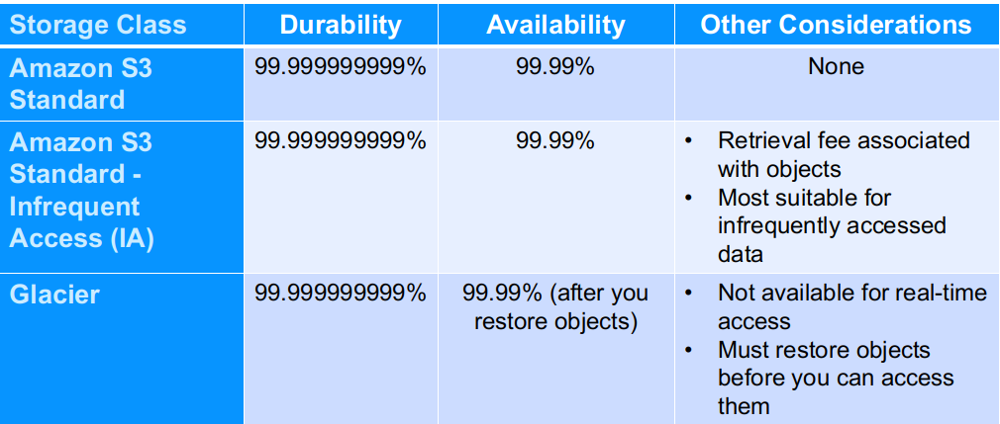

# Cloud storage and databases

---

## Our plan

* Common storage concepts
* NoSQL intro
* AWS, Azure, GCP specifics

---

## Storage

| Services       | AWS                                | Azure                      | GCP                                    |
|----------------|------------------------------------|----------------------------|----------------------------------------|
| Object Storage | Amazon Simple Storage Service (S3) | Blob Storage               | Google Cloud Storage                   |
| Cold Storage   | Amazon Glacier                     | Azure Archive Blob Storage | Google Cloud Storage Nearline          |
| Block Storage  | Amazon Elastic Block Store (EBS)   | Blob Storage               | Google Compute Engine Persistent Disks |
| File Storage   | Amazon Elastic File System (EFS)   | Azure File Storage         | Google Filestore                       |
| Table Storage  | AWS SimpleDB, DynamoDB             | Azure Table Storage        | Google Cloud Storage Nearline          |
| Queue Storage  | AWS Simple Queue Service (SQS)     | Azure Queue Storage        | Google Cloud Storage Nearline          |

<!-- {"left" : 0.63, "top" : 1.62, "height" : 1, "width" : 16.24} -->

Notes:

* Storage comparison
* https://docs.microsoft.com/en-us/azure/architecture/aws-professional/storage
* SQL
* https://stackshare.io/stackups/amazon-sqs-vs-azure-storage

---

## Networking

| Services        | AWS                                | Azure                    | GCP                         |
|-----------------|------------------------------------|--------------------------|-----------------------------|
| Virtual Network | Amazon Virtual Private Cloud (VPC) | Virtual Networks (VNets) | Virtual Private Cloud       |
| Load Balancer   | Elastic Load Balancer              | Load Balancer            | Google Cloud Load Balancing |
| Peering         | Direct Connect                     | ExpressRoute             | Google Cloud Interconnect   |
| DNS             | Amazon Route 53                    | Azure DNS                | Google Cloud DNS            |

<!-- {"left" : 0.64, "top" : 1.62, "height" : 1, "width" : 16.21} -->

---

## Databases

| Services         | AWS                                | Azure           | GCP                                          |
|------------------|------------------------------------|-----------------|----------------------------------------------|
| RDBMS            | Amazon Relational Database Service | SQL Database    | Google Cloud SQL                             |
| NoSQL: Key–Value | Amazon DynamoDB                    | Table Storage   | Google Cloud Datastore Google Cloud Bigtable |
| NoSQL: Indexed   | Amazon SimpleDB                    | Azure Cosmos DB | Google Cloud Datastore                       |

<!-- {"left" : 0.58, "top" : 1.62, "height" : 1, "width" : 16.33} -->

---

## Comparison

| AWS                             | Azure                          | GCP                                           |
|---------------------------------|--------------------------------|-----------------------------------------------|
| Maturity                        | Great for developers           | Aggressive growth                             |
| Service portfolio               | Integration with open source   | Attractive pricing models                     |
| Presence (market and geography) | Private datacenter integration | Best for AI and machine learning applications |

<!-- {"left" : 0.78, "top" : 1.62, "height" : 1, "width" : 15.95} -->

---

## Amazon Simple Storage Service (S3)

* Blob storage for the Internet 
* Store and retrieve any amount of data, any time, from anywhere on the web
* Highly scalable, reliable, fast and durable 

 <!-- {"left" : 13.95, "top" : 0.53, "height" : 2.38, "width" : 3.09} -->

 <!-- {"left" : 1.43, "top" : 6.06, "height" : 5.2, "width" : 4.38} -->

---

## S3 specs

* Unlimited number of objects in a bucket, 100 buckets per account
* Objects up to 5 TB; no bucket size limit
* Designed for 99.999999999% durability and 99.99% availability of objects over a given year 
* HTTP/S endpoint to store and retrieve any amount of data, at any time, from anywhere on the web
* Highly scalable, reliable, fast, and inexpensive
* Optional server-side encryption using AWS or customer-
    managed provided client-side encryption 
* Access logs for auditing

---

## Discussion

* Comment from Patrick Schmitz (Consultant to Internet2 )
* Looks impressive until you compute the loss on an exabyte of data. It works out to 10 MB!
* Also note the "Designed for" which is neither an SLA nor an evidence-backed statement of actual robustness/performance .
* And 99.99% availability means about an hour a year. Not bad, as long as it does not fall in the middle of a two-week compute run that does not check-point.
* Stanford did some experiments with pushing a few PB into Drive, and pulling them back. Not happy.
* UCB found that data integrity in drive was rather poor. Drive != S3, but it is indicative of cloud storage issues.
* Basically, when your data gets big, it is really really hard to make it robust. Bit rot is very real and worse when sunspots are active...
* So, how do you build reliable systems out of unreliable components?

---

## S3 storage classes

 <!-- {"left" : 4.1, "top" : 1.5, "height" : 6.38, "width" : 9.31} -->

* Note from Patrick Schmitz:
    * Note SLA for middle columns allows for >87 hours a year of unavailability (1% of the year). If that happens before a publication deadline folks will be really unhappy. Plan ahead!!!

---

## Common S3 use cases

* Storage and Backup 
* Application File Hosting
* Media Hosting
* Software Delivery
* Store AMIs and Snapshots

 <!-- {"left" : 8.38, "top" : 1.46, "height" : 4.9, "width" : 8.7} -->

---

## Discussion

* Scales to many files and large files, and concurrent access (although gets expensive on heavy access).
* Use-cases 2 and 3 from this are nice:https://aws.amazon.com/blogs/publicsector/five-ways-use-aws-research-starting-now/
* This paper is nearly 5 years old, but quite interesting: https://silo.tips/download/amazon-s3-for-science-grids-a-viable-solution

---

## Amazon S3 Pricing

* Pay only for what you use
* No minimum fee
* Prices based on location of your Amazon S3 bucket
* Estimate monthly bill using the AWS Simple Monthly Calculator
* Pricing is available as:
    * Storage Pricing
    * Request Pricing
    * Data Transfer Pricing: data transferred out of Amazon S3
* https://calculator.aws/#/createCalculator

---

## Amazon S3 Concepts

* Amazon S3 stores data as objects within buckets
* An object is composed of a file and optionally any metadata that describes that file
* You can have up to 100 buckets in each account
* You can control access to the bucket and its objects

 <!-- {"left" : 2.91, "top" : 6.66, "height" : 4.23, "width" : 11.68} -->

---

## Amazon S3 Buckets

* Organize the Amazon S3 namespace at the highest level.
* Identify the account responsible for storage and data transfer charges.
* Play a role in access control.
* Serve as the unit of aggregation for usage reporting.
* Have globally unique bucket names, regardless of the AWS region in which they were created.

---

## Object Keys

* An object key is the unique identifier for an object in a bucket

 <!-- {"left" : 1.47, "top" : 4.91, "height" : 2.56, "width" : 14.55} -->

---

## Amazon S3 Security

* You can control access to buckets and objects with:
    * Access Control Lists (ACLs)
    * Bucket policies
    * Identity and Access Management (IAM) policies
* You can upload or download data to Amazon S3 via SSL encrypted endpoints. 
* You can encrypt data using AWS SDKs.

---

## Amazon S3 Versioning

* Protects from accidental overwrites and deletes with no performance penalty.
* Generates a new version with every upload.
* Allows easily retrieval of deleted objects or roll back to previous versions.
* Three states of an Amazon S3 bucket
    * Un-versioned (default)
    * Versioning-enabled
    * Versioning-suspended

* __Tip:__ You pay for each copy, so be careful with versioning, especially for large objects.
* Object lifecycle management may be useful to "retire" (i.e., to delete or move to a cheaper storage tier) your older versions after some period of time.

---

## S3 versioning price implications

* [Q: How am I charged for using Versioning?](https://aws.amazon.com/s3/faqs/)

* Normal Amazon S3 rates apply for every version of an object stored or requested. For example, let’s look at the following scenario to illustrate storage costs when utilizing Versioning (let’s assume the current month is 31 days long):

1) Day 1 of the month: You perform a PUT of 4 GB (4,294,967,296 bytes) on your bucket.
2) Day 16 of the month: You perform a PUT of 5 GB (5,368,709,120 bytes) within the same bucket using the same key as the original PUT on Day 1.

When analyzing the storage costs of the above operations, please note that the 4 GB object from Day 1 is not deleted from the bucket when the 5 GB object is written on Day 15. Instead, the 4 GB object is preserved as an older version and the 5 GB object becomes the most recently written version of the object within your bucket. 

---

## Pricing cont'd

* At the end of the month:

* Total Byte-Hour usage
[4,294,967,296 bytes x 31 days x (24 hours / day)] + [5,368,709,120 bytes x 16 days x (24 hours / day)] = 5,257,039,970,304 Byte-Hours.

* Conversion to Total GB-Months
5,257,039,970,304 Byte-Hours x (1 GB / 1,073,741,824 bytes) x (1 month / 744 hours) = 6.581 GB-Month

* The fee is calculated based on the current rates for your region on the [Amazon S3 Pricing page](https://aws.amazon.com/s3/pricing/).

---

## Amazon S3 Storage Classes

 <!-- {"left" : 0.99, "top" : 2.9, "height" : 6.59, "width" : 15.51} -->

---

## Quiz

* Amazon S3 is which type of storage service?
    * A. Object
    * B. Block
    * C. Simple
    * D. Secure

Notes:

A.

---

## Quiz

* S3 objects are only accessible from the region they were created in.
    * A. True
    * B. False
    
Notes:

B.

---

## Quiz

* Why is a bucket policy necessary?
    * A. To allow bucket access to multiple users.
    * B. To grant or deny accounts to read and upload files in your bucket.
    * C. To approve or deny users the option to add or remove buckets.
    * D. All of the above
    
Notes:

B.

---

## Azure blob storage

* To begin using Azure Storage, first create an Azure Storage account
* You can create an Azure Storage account by using 
    * Azure portal
    * PowerShell
    * Azure CLI
    
 <!-- {"left" : 3.93, "top" : 6.1, "height" : 4.97, "width" : 9.64} -->

---

## Azure blob use cases

* Serving images or documents directly to a browser.
* Storing files for distributed access.
* Streaming video and audio.
* Storing data for backup and restore, disaster recovery, and archiving.
* Storing data for analysis by an on-premises or Azure-hosted service.
* Storing up to 8 TB of data for virtual machines.

---

## Quiz

* Are there any differences in the Azure vs AWS blob storage uses cases

    * A. Yes
    * B. No

---
Notes:

B. No - I could not find any

---

## Azure blob access tiers

* **Hot access tier**
    * Optimized for storing data that is accessed frequently (for example, images for your website).

* **Cool access tier** 
    * Optimized for data that is infrequently accessed and stored for at least 30 days (for example, invoices for your customers).

* **Archive access tier**
    * Appropriate for data that is rarely accessed and stored for at least 180 days, with flexible latency requirements (for example, long-term backups).

---

## Discussion

* Is Cloud "Archival Storage" what library folks would call an archive (i.e., managed robustness to protect against ANY bit rot?)? Probably not. How would you clarify what this means?
* Is it robust enough for the only copy of sensor data (which cannot be reproduced)?

---

## Configuring Azure blob storage

 <!-- {"left" : 3.93, "top" : 2.33, "height" : 8.62, "width" : 9.64} -->

---

## Quiz

* What is the first step that you would take in order to share an image file as a blob in Azure Storage?

    * A. Create an Azure Storage container to store the image.
    * B. Create an Azure Storage account.
    * C. Upload the image file and create a container.
    * D. Use a Shared Access Signature (SAS) token to restrict access to the image.
    
Notes: 

B.

## Quiz

* Which Azure Storage option is better for storing data for backup and restore, disaster recovery, and archiving?

    * A. Azure Files Storage

    * B. Azure Disk Storage

    * C. Azure Blob Storage
    
Notes: 

C.

---

## GCP blob storage

 <!-- {"left" : 1.66, "top" : 2.84, "height" : 6.7, "width" : 14.17} -->

Notes:

* Cloud Storage is a unified object storage for developers and enterprises that allows
you to serve, analyze, and archive data. Objects are accessed via HTTP requests,
including ranged GETS to retrieve portions of the data. The only key is the object
name. There is object metadata but the object itself is treated as just bytes with no
structure. The scale of the system allows for serving static content or accepting user
uploaded content like photos and videos.
* Cloud Storage is built for availability, durability, scalability, and consistency. It is an
ideal solution for storing images and videos, objects and blobs, and any unstructured
data.
* For more information, see the Cloud Storage Documentation:
https://cloud.google.com/storage/docs/

---

## GCP storage options overview

 <!-- {"left" : 1.95, "top" : 2.94, "height" : 6.51, "width" : 13.59} -->

---

## Discussion

* Let us discuss suggested tiering and data lifecycle management
* When (and how) is data migrated from a performance tier to a less performant (and cheaper) tier? How is this done for structured data 
* For example, when would you recommend transitioning from Datastore to BigQuery?
* How can lifecycle management be combined with versioning and/or replication to provide robust data model at a reasonable cost?

---

## GCP storage classes

| Storage Class          | Characteristics                                                                                    | Use Cases                                            | Price (GB/month) | Name for APIs  |
|------------------------|----------------------------------------------------------------------------------------------------|------------------------------------------------------|------------------|----------------|
| Multi-Regional Storage | 99.95% availability Geo-redundant                                                                  | Serving website content Streaming videos Mobile apps | $0.026           | multi_regional |
| Regional Storage       | 99.9% availability Data stored in a narrow geographic region                                       | Data analytics                                       | $0.02            | regional       |
| Nearline Storage       | 99.0% availability Data retrieval costs Higher per-operation costs 30-day minimum storage duration | Back-up Serving long-tail multimedia content         | $0.01            | nearline       |
| Coldline Storage       | 99.0% availability Data retrieval costs higher per-operation costs 90-day minimum storage duration | Disaster recovery Data archiving                     | $0.007           | coldline       |

<!-- {"left" : 0.52, "top" : 1.4, "height" : 1, "width" : 16.47, "columnwidth" : [2.15, 5.35, 4.26, 2.35, 2.37]} -->

---

## Discussion

* Any robustness figures for these? 
* How safe is data in each tier?

---

## Quiz

* Your application serves users in a specific region and performs
analysis of data. What Cloud Storage class would be most
appropriate?

    * A. Multi-Regional Storage
    * B. Regional Storage
    * C. Nearline Storage
    * D. Coldline Storage
    
Notes: 

B.

---

# Cloud File System (NFS-like)

## AWS file system

* What is cloud file storage?
    * storing data in the cloud
    * provide servers and applications access to data through shared file systems

* What is a cloud file system?
    * A file system with hierarchical storage system
* What is cloud file sharing?
    * Provides simultaneous access for multiple users to a common set of file data 
    in the cloud
    * Security for file sharing in the cloud is managed with user and group permissions enabling administrators to tightly control access to the shared file data.

---

## Azure Files (SMB and NFS)

* Serverless file shares
    * Distributed file system 

* Built for Hybrid with File Sync
    * Transform your Windows Servers into caches of your cloud shares without giving up on-premises performance

* Optimized TCO
    * Different tiers are used to tailor your shares to your performance requirements and competitive price points

* Multiple protocols support
    * Provides support for multiple protocols enabling data to be stored from different sources

---

## GCP Filestore

* Predictable performance
    * Filestore provides a consistent view of your filesystem data and steady performance over time. With speeds up to 480K IOPS and 16 GB/s

* Elasticity to meet big compute needs
    * With High Scale, meet the needs of your high- performance business. If requirements change, easily grow or shrink your instances via the Google Cloud Console GUI, gcloud command line, or via API-based controls.

* Simple to provision, easy to mount
    * Filestore is a fully managed, NoOps service. 
    * Easily mount file shares on Compute Engine VMs
    * Filestore is also tightly integrated with Google Kubernetes Engine so containers can reference the same shared data.

---

# EBS, SSD

---

## Amazon EBS volume types

* Amazon EBS allows you to create storage volumes and attach them to Amazon EC2 instances
* Amazon EBS provides a range of options that allow you to optimize storage performance and cost for your workload
* SSD-backed volumes include the highest performance Provisioned IOPS SSD
* Elastic Volumes is a feature of Amazon EBS that allows you to dynamically increase capacity, tune performance, and change the type of live volumes

Notes:

* Amazon EBS allows you to create storage volumes and attach them to Amazon EC2 instances. Once attached, you can create a file system on top of these volumes, run a database, or use them in any other way you would use block storage. Amazon EBS volumes are placed in a specific Availability Zone where they are automatically replicated to protect you from the failure of a single component. All EBS volume types offer durable snapshot capabilities and are designed for 99.999% availability.

* Amazon EBS provides a range of options that allow you to optimize storage performance and cost for your workload. These options are divided into two major categories: SSD-backed storage for transactional workloads, such as databases and boot volumes (performance depends primarily on IOPS), and HDD-backed storage for throughput intensive workloads, such as MapReduce and log processing (performance depends primarily on MB/s).

* SSD-backed volumes include the highest performance Provisioned IOPS SSD (io2 and io1) for latency-sensitive transactional workloads and General Purpose SSD (gp3 and gp2) that balance price and performance for a wide variety of transactional data. HDD-backed volumes include Throughput Optimized HDD (st1) for frequently accessed, throughput intensive workloads and the lowest cost Cold HDD (sc1) for less frequently accessed data.

* Elastic Volumes is a feature of Amazon EBS that allows you to dynamically increase capacity, tune performance, and change the type of live volumes with no downtime or performance impact. This allows you to easily right-size your deployment and adapt to performance changes.

---

## Solid State Drives (SSD)

 <!-- {"left" : 2.11, "top" : 1.85, "height" : 6.28, "width" : 13.29} -->

* Continue to https://aws.amazon.com/ebs/features/

---

## Hard Disk Drives (HDD)

 <!-- {"left" : 2.66, "top" : 1.77, "height" : 7.63, "width" : 12.19} -->

* Continue to https://aws.amazon.com/ebs/features/

---

# SQL in the cloud

---

## AWS Managed Database Services

 <!-- {"left" : 1.9, "top" : 3.57, "height" : 6.58, "width" : 13.69} -->

Notes:

Common pattern for all clouds

---

## Amazon Relational Database Service (RDS)

 <!-- {"left" : 1.04, "top" : 3.18, "height" : 6.03, "width" : 15.43} -->

---

## Amazon RDS

 <!-- {"left" : 1.02, "top" : 2.68, "height" : 7.02, "width" : 15.46} -->

---

## DB Instances

* DB Instances are the basic building blocks of Amazon RDS
    * Also on Azure
    * Also on GCP
* Automatic backups
* Manual snapshots
* Read-only replica instances
* Foundation for high availability

---

## SQL as a service - security

* Run your DB instance in a VPC
* Use IAM policies to grant access to cloud DB resources
* Use security groups
* Use Transport Layer Security (TSL) connections with DB instances
* Use encryption to secure your DB instances and snapshots at rest
* Use network encryption and transparent data encryption (TDE) with Oracle DB and Microsoft SQL Server instances
* Use the security features of your DB engine to control access to your DB instance.

---

## Multi-AZ DB Deployment

* With Multi-AZ operation, your database is synchronously replicated to another AZ in the same Region
* Failover automatically occurs to the standby in case of master database failure
* Planned maintenance is applied first to standby databases.
* Multi-AZ is the foundation of high availability DB running as cloud service

---  

## Quiz

* A multi-AZ RDS setup consists of: Primary instance, Standby instance and a Read-replica. If the standby instance is not able to catch-up, what is the impact to transactions in primary?
  
    * A. Transactions are impacted
    * B. Transactions are impacted only if you configured it for synchronous replication
    * C. Transactions are impacted only if you configured it for asynchronous replication
    * D. Transactions are not impacted
    
Notes:

* A.

* Explanation
* For multi-AZ high availability, RDS uses synchronous replication between primary and standby systems.  If standby is slow, transactions will take longer to complete.  RDS Read Replica on the other hand uses asynchronous replication and any slowness in Read Replica instance would simply cause data lag in the read - replica.  Transactions in primary is impacted

---

## Quiz

* A multi-AZ RDS database consists of Primary, Standby instances and a read-replica. Application can send the read queries to: (Choose Two)    
    * A. Read replica
    * B. Standby instance
    * C. Primary instance
    * D. Any of the above

Notes:

A., C. 

---

# NoSQL intro

---

## NoSQL is for scaling

 <!-- {"left" : 2.6, "top" : 2.17, "height" : 8.05, "width" : 12.3} -->

---

## NoSQL architecture idea

* NoSQL is a giant persistent hashmap
* Good resume filler
    * I know NoSQL
    * I know NoIBM
    * I know No Oracle
    * Etc.

 <!-- {"left" : 9.06, "top" : 2.04, "height" : 5.29, "width" : 7.93} -->

---

## Rise of NoSQL Data Stores

* NoSQL data stores are primarily designed for scalability
* Designed to run on a cluster of machines
* Fault tolerant
* Flexible Data Model/Schema
* Major use case: write-intensive large volumes
* Discussion: let's look at smart meter data

---

## Advantage of NoSQL

* Ability to handle Big Data
* Fast writes & reads without locking
* Ingest high-velocity data streams 
* Dispense with some niceties
    * NO Secondary indexes!
    * NO JOINS!
    * No (or very little) ACID!
* (Some NoSQL DBs do provide transactions)

 <!-- {"left" : 12, "top" : 0.99, "height" : 7.26, "width" : 4.84} -->

---

## ACID

* Atomicity
    * All or nothing
* Consistency
    * Transaction brings DB from one valid state to another
* Isolation
    * Multiple transactions can execute in parallel, but they won’t interfere with each other
* Durability
    * Once a transaction is committed, data is persisted and available

---

## Transactions problems in distributed systems

* Very hard to scale
* Involves
    * Blocking
    * Locking
    * increased latency 
    * reduced throughput
* Network effect
* What if nodes crash in the middle of a transaction?
* Or network gets partitioned?
* Most NoSQLs don’t offer transactions    

 <!-- {"left" : 9.54, "top" : 2.47, "height" : 5.59, "width" : 7.45} -->

---

## When eventual consistency is OK

 <!-- {"left" : 4.4, "top" : 3.12, "height" : 8.11, "width" : 8.7} -->

---

## CAP Theorem (Eric Brewer)

* Consistency: All replicas agree on the same value
* Availability: Can always read and write to system
* Partition Tolerance: System keeps working even if replicas can’t talk to each other ‘split brain’ scenario

* CAP Theorem says we can have 2 of 3

<!-- {"left" : 10.89, "top" : 1.62, "height" : 5.74, "width" : 6.11} -->

---

## CAP Classification

 <!-- {"left" : 2.66, "top" : 2.57, "height" : 8.57, "width" : 12.18} -->

---

## Quiz

* Most NoSQL data stores are designed to run on a single node.

    * A. True
    * B. False

Notes:

B.

---

## Quiz

* Which one of the features do most NoSQL data stores support?

    * A. Transactions
    * B. Durability
    * C. High speed reads and writes
    * D. Sharding
    * E. Secondary indices
    * F. joins
    
Notes:

B, C, D

---

# NoSQL in the cloud

---

## SQL and NoSQL Databases

 <!-- {"left" : 1.16, "top" : 2.75, "height" : 6.88, "width" : 15.23} -->

---

## Amazon DynamoDB

* Store any amount of data with no limits
* Fast, predictable performance using SSDs
* Easily **provision** (but it will cost you) and change the request capacity needed for each table
* Fully managed, NoSQL database service

 <!-- {"left" : 14.06, "top" : 0.43, "height" : 2.96, "width" : 2.79} -->

---

## DynamoDB Data Model

 <!-- {"left" : 0.88, "top" : 3.32, "height" : 7.09, "width" : 15.75} -->

---

## Primary Keys

 <!-- {"left" : 1.62, "top" : 3.32, "height" : 7.08, "width" : 14.25} -->

---

## Local Secondary Index

 <!-- {"left" : 1.62, "top" : 3.02, "height" : 7.69, "width" : 14.26} -->

Notes:

* If you want to read the data using non-key attributes, you can use a secondary index to do this. A local secondary index is an index that has the same partition key as the table, but a different sort key.
* For more information, see: 
* http://docs.aws.amazon.com/amazondynamodb/latest/developerguide/LSI.html

---

## Global Secondary Index

 <!-- {"left" : 1.05, "top" : 3.21, "height" : 7.31, "width" : 15.41} -->

Notes:

* A Global secondary index is an index with a partition key and sort key that can be different from those on the table. They can be thought of as “pivot charts” for your table.
* For more information, see:
* http://docs.aws.amazon.com/amazondynamodb/latest/developerguide/GSI.html

---

##  Provisioned Throughput

* You specify how much provisioned throughput capacity you need for reads and writes.
* Amazon DynamoDB allocates the necessary machine resources to meet your needs.
* Read capacity unit: 
    * One strongly consistent read per second for items as large as 4 KB. 
    * Two eventually consistent reads per second for items as large as 4 KB.
* Write capacity unit:
    * One write per second for items as large as 1 KB.
    
 <!-- {"left" : 11.89, "top" : 2.15, "height" : 3.11, "width" : 5.17} -->
 

---

## Amazon RDS and Amazon DynamoDB

 <!-- {"left" : 0.84, "top" : 2.41, "height" : 7.56, "width" : 15.81} -->

---

## Quiz

* Name NoSQL or nonrelational uses cases (Choose 2)
    * A. Handling large, unrelated, indeterminate, or rapidly changing data
    * B. Schema-agnostic data or schema dictated by the app
    * C. Handling data that is relational and has logical and discrete requirements that can be identified in advance.
    * D. Schema that must be maintained and kept in sync between the app and database.
    
Notes:

* A. and B.

---

## Quiz

* Name SQL or relational use cases (Choose 2)
    * A. Apps where performance and availability are more important than strong consistency
    * B. Always-on apps that serve users around the world          
    * C. Legacy systems built for relational structures
    * D. Apps requiring complex querying or multi-row transactions
    
Notes:

* C. and D.    

---

## Quiz 

* Choose typical NoSQL scenarios

* A. Mobile apps.
* B. Real-time analytics.
* C. Transaction management systems. 
* D. Content management.
* E. Personalization.

Notes:

* A., B., D., E)

---

## Quiz

* Choose typical SQL scenarios

    * A. Accounting, finance, and banking systems.
    * B. IoT apps.
    * C. Legacy systems built for relational structures
    * D. Inventory management systems.

Notes:

* A., C. 

---

# Storage on Azure

---

## NoSQL on Azure

* Develop with agility
    * With the ability to respond to unplanned situations, NoSQL DBs cater to frequent software release cycles and are suitable for faster and more agile app development.

* Handle data with flexibility
    * NoSQL gives developers more freedom, speed, and flexibility to change both schema and queries to adapt to data requirements. Information stored as an aggregate makes it easier for quick iterative improvements— without having to do up-front schema design.

* Operate at any scale
    * NoSQL DBs can provide compelling operational advantages and savings with the ability to scale "out" horizontally—or add less expensive servers without having to upgrade. They can scale to handle more data or hold a single, large database within a highly distributable clusters of servers.

---

## Types of data models with NoSQL databases

* Key-value
    * Key-value stores pair keys and values using a hash table. Key-value types are best when a key is known and the associated value for the key is unknown.

* Document
    * Document databases extend the concept of the key-value database by organizing entire documents into groups called collections. They support nested key-value pairs and allow queries on any attribute within a document.

* Columnar
    * Columnar, wide-column, or column-family databases efficiently store data and query across rows of sparse data and are advantageous when querying across specific columns in the database.

* Graph
    * Graph databases use a model based on nodes and edges to represent interconnected data—such as relationships between people in a social network—and offer simplified storage and navigation through complex relationships.

---

## Cosmos is part of Azure storage

* Blob storage
    * Store, secure, and access Binary Large Objects (Blobs). Blobs can be any file and this service is often used with image, videos, and other media.
* Queue storage
	* Store messages in a queue to organize communications between systems. Queues help to improve communications, because messages won't be lost at times of high demand. Instead, the queue may lengthen, but the receiving component keeps picking up and processing the messages until it catches up.
* File storage	
    * Store files in file shares in the cloud for access with the Server Message Block (SMB. protocol.
* Table storage
	* Store data in a NoSQL database to underpin applications.

---

## Case for Cosmos DB

* When on Azure, you can run any of
    * SQL
    * NoSQL
        * MongoDB
        * Cassandra
        * Gremlin
        * Tables API
        * **Cosmos** (if using Tables API)

---

## What is the difference between Tables API and Cosmos?

 <!-- {"left" : 2.06, "top" : 2.71, "height" : 8.32, "width" : 13.37} -->

---

# Storage on GCP

---

## Cloud Datastore

 <!-- {"left" : 2.11, "top" : 3.26, "height" : 5.87, "width" : 13.27} -->

Notes:

* Cloud Datastore is a highly-scalable NoSQL database for your applications. Cloud
Datastore automatically handles sharding and replication, providing you with a highly
available and durable database that scales automatically to handle your applications'
load. Cloud Datastore provides a myriad of capabilities such as ACID transactions,
SQL-like queries, indexes and much more. Cloud Datastore scales seamlessly and
automatically with your data allowing applications to maintain high performance as
they receive more traffic.
* Datastore is an ideal solution when your application data is semi-structured or
hierarchical and when you need to store durable key-value data at scale. Typical use
cases for Cloud Datastore include product catalogs, user profiles and transactions
based on ACID properties.
* Cloud Datastore is not ideal for every use case. For example, Cloud Datastore is not
a relational database, and it is not an effective solution for analytic data.
* Cloud Datastore was formerly implemented as an extension of Cloud Bigtable but
future instances will be created using Cloud Firestore to create Cloud Firestore in
Datastore Mode instances. Existing Cloud Datastore instances will be automatically
migrated to Cloud Firestore in Datastore Mode once Cloud Firestore enters general
availability. No functional changes are required to existing Cloud Datastore code in
applications and Cloud Datastore will remain a fully supported GCP storage service.

---

## Cloud Firestore

 <!-- {"left" : 1.89, "top" : 2.75, "height" : 6.89, "width" : 13.73} -->

Notes:

* Cloud Firestore is the next major version of Cloud Datastore. Cloud Firestore is a fast,
fully managed, serverless, NoSQL document database built for automatic scaling,
high performance, and ease of application development.
* Cloud Firestore introduces new features such as:
    * A new, strongly consistent storage layer
    * A collection and document data model
    * Real-time updates
    * Mobile and Web client libraries
* Cloud Firestore is backwards compatible with Cloud Datastore, but the new data
model, real-time updates, and mobile and web client library features are not. To
access all of the new Cloud Firestore features, you must use Cloud Firestore in
Native mode.
* Cloud Firestore is built to scale and takes advantage of GCP's powerful
infrastructure, with automatic horizontal scaling in and out, in response to your
application's load. Security access controls for data are built in and enable you to
handle data validation via a configuration language.
* For more information, see the Firestore Documentation:
https://cloud.google.com/firestore/docs/

---

## Cloud Bigtable

 <!-- {"left" : 2.11, "top" : 3.26, "height" : 5.87, "width" : 13.27} -->

Notes:

* Bigtable is a high performance NoSQL database service. It is a sparsely populated
table that can scale to billions of rows and thousands of columns. Bigtable can store
terabytes to petabytes of data. Bigtable is built for fast key-value lookup and scanning
over a defined key range. It is similar to a spreadsheet that gives you access to any
set of columns from contiguous rows by searching only the value in the first column
(the key). Updates to individual rows are atomic. Due to the fast lookup and write
speed of Bigtable, it's great for user behavior.
* Bigtable supports operational and analytical applications and is ideal for storing large
amounts of single-keyed data and MapReduce operations. Bigtable offers consistent
sub-10ms latency. Bigtable offers seamless scaling: Changes to the deployment
configuration are immediate, so there’s no downtime during reconfiguration.
* Cloud Bigtable supports the open source industry standard HBase API.
* For more information, see the Bigtable Documentation:
https://cloud.google.com/bigtable/docs/

---

## Cloud SQL

 <!-- {"left" : 1.79, "top" : 2.75, "height" : 6.91, "width" : 13.93} -->

Notes:

* Cloud SQL is GCP’s relational database service. It is a managed service that lets
Google manage replication, failover, and backups of your databases so you can focus
on your MySQL- or PostgreSQL-compatible applications. Cloud SQL lets you easily
configure replication and backups to protect your data. You can replicate a master
instance to one or more read replicas. A read replica is a copy of the master that
reflects changes to the master instance in almost-real time. You can enable automatic
failover to make your database highly available. Backups allow you to restore your
Cloud SQL instance to recover lost data or recover from a problem with your instance.
You can enable automated backups for any instance that contains data that you need
to protect from loss or damage.
* The Cloud SQL Proxy works by having a local client, called the proxy, running in the
local environment. Your application communicates with the proxy with the standard
database protocol used by your database. The proxy uses a secure tunnel to
communicate with its companion process running on the server. Cloud SQL Proxy
provides secure access to your Cloud SQL Second Generation instances without your
having to whitelist IP addresses or configure SSL. The proxy uses the Cloud SQL API
to authenticate with the Google Cloud Platform. You must enable the API before
using the proxy, and you must provide the proxy with a valid user account.
* Cloud SQL is ideal for web frameworks, applications requiring structured data, and
online transaction processing (OLTP) workloads. It is ideal for applications using
MySQL/PostgreSQL, with minimal refactoring required for migration to GCP.

* For more information, see:
  Google Cloud SQL Documentation: https://cloud.google.com/sql/docs/
  Replication Options: https://cloud.google.com/sql/docs/mysql/replication/
  Google Cloud SQL Backups:
  https://cloud.google.com/sql/docs/mysql/backup-recovery/backups
  Cloud SQL Proxy: https://cloud.google.com/sql/docs/mysql/sql-proxy
  
---

## Cloud Spanner

 <!-- {"left" : 2.11, "top" : 1.94, "height" : 5.87, "width" : 13.27} -->

* Note that it is a revolutionary implementation even if not applicable to research use cases

Notes:

* Google Cloud Spanner is GCP’s fully managed relational database service offering
both strong consistency and horizontal scalability. It is designed for mission-critical
OLTP applications. Cloud Spanner provides automatic, synchronous replication for
high ability. Spanner is built for multi-region replication and offers one of the highest
SLAs in the industry: 99.999%.
* Spanner is ideal for applications with relational, structured, and semi-structured data
that require high availability, strong consistency, and transactional reads and writes.
* Cloud Spanner and Cloud SQL differ in that Spanner uses real primary keys and has
the notion of interleaved child records instead of foreign keys.
* For more information, see the Cloud Spanner Documentation:
https://cloud.google.com/spanner/docs/

---

## GCP storage at a glance

| Product       | Simple Description                    | Ideal for                                       | Not Ideal for                                         |
|---------------|---------------------------------------|-------------------------------------------------|-------------------------------------------------------|
| Cloud Storage | Binary/object store                   | Large or rarely accessed unstructured data      | Structured data, building fast apps                   |
| Datastore     | Scalable store for structured serve   | GAE apps, structured pure-serve use cases       | Relational or analytic data                           |
| Firestore     | Cloud-native app data at global scale | Real-time NoSQL database to store and sync data | Mobile, web, multi-user, IoT & real-time applications |
| Bigtable      | High-volume, low-latency database     | “Flat,” heavy read/write, or analytical data    | High structure or transactional data                  |
| CloudSQL      | Well-understood VM-based RDBMS        | Web frameworks, existing applications           | Scaling, analytics, heavy writes                      |
| Spanner       | Relational DB service                 | Low-latency transactional systems               | Analytic data                                         |
| BigQuery      | Auto-scaling analytic data warehouse  | Interactive analysis of static datasets         | Building fast apps                                    |

<!-- {"left" : 0.21, "top" : 1.5, "height" : 1, "width" : 16.77, "columnwidth" : [2.16, 4.38, 5.3, 4.94]} -->

---

## Technical considerations for storage options

| Product       | R/W                 | Typical Size | Storage Type |
|---------------|---------------------|--------------|--------------|
| Cloud Storage | Medium (100s of ms) | Any          | Object       |
| Datastore     | Medium (10s of ms)  | < 200 TB     | Document     |
| Firestore     | Medium (10s of ms)  | < 200 TB     | Document     |
| Bigtable      | Low (ms)            | 2TB–10 PB    | Key-Value    |
| CloudSQL      | Low (ms)            | < 10 TB      | Relational   |
| Spanner       | Low (ms)            | Any          | Relational   |
| BigQuery      | High (s)            | Any          | Columnar     |

<!-- {"left" : 1.05, "top" : 1.5, "height" : 6.55, "width" : 15.41} -->

---

## Quiz

* My applications requires mobile SDKs. Which storage option should I
consider?
    * A. Cloud Storage for Firebase
    * B. Cloud Spanner
    * C. Cloud SQL
    * D. BigQuery
    
Notes:

A.

---

## Quiz

* My application has heavy read/write requirements and my workload
is analytics. What storage option should I consider for low-latency
updates?
    * A. Cloud SQL
    * B. BigQuery
    * C. Cloud Storage
    * D. Cloud Bigtable
    
Notes:

D.

---

## Quiz

* My application has structured non-relational data. What storage
option should I consider if I don’t require mobile SDKs?
    * A. Firebase Realtime DB
    * B. Cloud Bigtable
    * C. Cloud Datastore
    * D. Cloud Storage
    
Notes:

C.

---

## Quiz

* My application has structured relational data. What storage option
should I consider if my application requires horizontal scalability?
    * A. Cloud SQL
    * B. Cloud Spanner
    * C. Cloud Storage
    * D. BigQuery
   
Notes:

B.

---

# Cross-cloud storage comparison

---

## Databases - let's review

 <!-- {"left" : 0.65, "top" : 3.43, "height" : 5.52, "width" : 16.2} -->

---

## Quiz

* For AWS Dynamo DB, what are my choices on Azure and GCP?

    * A. Google Cloud SQL
    * B. Google Cloud Datastore
    * C. Azure SQL Database
    * D. Azure Cosmos
    
Notes:

B, D

---

## Quiz 

* For AWS RDS, what are my choices on Azure and GCP?
    * A. Google Cloud SQL
    * B. Google Cloud Datastore
    * C. Azure SQL Database
    * D. Azure Cosmos
    
Notes:

A, C

---

## Discussion

* Question from Patrick Schmitz for the class
* Has anyone done a robustness comparison of the various providers' storage offerings? 
* Not in terms of access (most are 99.9 or 99.99%), but in terms of data integrity? 
* Where is my data safest?

---

## Congrats on completion

 <!-- {"left" : 1.05, "top" : 4.57, "height" : 3.25, "width" : 15.41} -->
