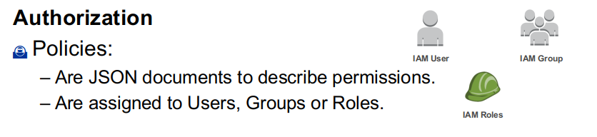
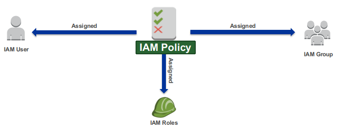

# IAM user management

---

## IAM - Identity and Access Management

* Common cloud ideas

 <!-- {"left" : 2.72, "top" : 3.46, "height" : 7.96, "width" : 12.06} -->

---

## IAM - Identity and Access Management

* Identify, authenticate, and authorize individuals who will be utilizing IT resources
* IAM, as a term, is used across clouds
* In each cloud, IAM is implemented with a different structure
    * Organizations
    * Projects
    * Permissions

---

## Shared security responsibility

 <!-- {"left" : 2.87, "top" : 2, "height" : 5.35, "width" : 11.75} -->


* "Customer" can be a university, a researcher, and the data may be survey data

Notes:

* When we talk about cloud security, we like to start with a discussion of the Shared Security Responsibility Model. While AWS takes care of provisioning and maintaining the underlying cloud infrastructure, you will still need to perform several security configuration tasks to ensure that you stay safe in the cloud. AWS’s responsibility goes from the ground up to the hypervisor. AWS secures the hardware, software, facilities, and networks that run all products and services. Customers are responsible for securely configuring the services they sign up for as well as anything they put on those services. 
* AWS also performs the following responsibilities:
* Obtaining industry certifications and independent third party attestations 
* Publishing information about AWS security and control practices in white papers and web site content
* Providing certificates, reports, and other documentation directly to AWS customers under NDA (as required).
* The amount of security configuration work you have to do varies, depending on how sensitive your data is and which services you select. For example, AWS services such as Amazon EC2 and Amazon S3 are completely under your control and require you to perform all of the necessary security configuration and management tasks. In the case of Amazon EC2, you are responsible for management of the guest OS (including updates and security patches), any application software or utilities you install on the instances, as well as the configuration of the AWS-provided firewall (called a security group) on each instance.
* When you use any of AWS’s managed services like Amazon RDS, Amazon RedShift, or Amazon WorkDocs, you don’t have to worry about launching and maintaining instances or patching the guest OS or applications—AWS handles that for you. For these managed services, basic security configuration tasks like data backups, database replication, and firewall configuration happen automatically. 
* However, there are certain security features—such as IAM user accounts and credentials, SSL for data transmissions, and user activity logging—that you should configure no matter which AWS service you use.
* AWS Support provides a highly personalized level of service for customers seeking technical help. 

---

## Physical security

* 24/7 trained security staff
* Data centers in nondescript and undisclosed facilities
* Two-factor authentication for authorized staff
* Authorization for data center access
* Separate logical and physical access

---

## Physical security video

* https://www.youtube.com/watch?v=kd33UVZhnAA

 <!-- {"left" : 2.28, "top" : 3.55, "height" : 6.87, "width" : 12.94} -->


---

## Certifications and accreditations

 <!-- {"left" : 2.94, "top" : 2.11, "height" : 5.32, "width" : 11.62} -->

* FERPA
    * https://aws.amazon.com/blogs/security/ferpa-compliance-in-the-aws-cloud
* FISMA
    * https://aws.amazon.com/compliance/fisma

---

# IAM According to AWS

---

## AWS IAM  

 <!-- {"left" : 1.47, "top" : 3.2, "height" : 5.98, "width" : 14.56} -->

---

## AWS IAM detail

* IAM users
    * for people
* IAM roles
    * for computers
* IAM Federation
    * to federate your workforce into AWS accounts and business applications
    * AWS Single Sign-On (SSO) or AWS Identity and Access Management (IAM)    

---

## Logging in

 <!-- {"left" : 11.03, "top" : 0.85, "height" : 9.28, "width" : 6.06} -->


* (Followed by MFA authentication)

---

## AWS IAM Command-Line Authentication

 <!-- {"left" : 1.94, "top" : 3.75, "height" : 6.22, "width" : 13.62} -->


---

## AWS IAM User Management - Groups

 <!-- {"left" : 1.7, "top" : 2.88, "height" : 6.63, "width" : 14.11} -->


---

## AWS IAM Authorization

 <!-- {"left" : 1.15, "top" : 3.12, "height" : 3.49, "width" : 15.2} -->


Notes:

* After a user or system has been authenticated, they have to be authorized to access AWS services. To assign permissions to a user, group, role, or resource, you create a policy, which is a document that explicitly lists permissions.
* An IAM role is similar to a user, in that it is an AWS identity with permission policies that determine what the identity can and cannot do in AWS. However, instead of being uniquely associated with one person, a role is intended to be assumable by anyone who needs it. Also, a role does not have any credentials (password or access keys) associated with it. Instead, if a user is assigned to a role, access keys are created dynamically and provided to the user.

---

## AWS IAM Policy Elements

```text
{
    "Version": "2012-10-17",
    "Statement": [
        {
            "Sid": "EC2InstanceConnect",
            "Action": [
                "ec2:DescribeInstances",
                "ec2-instance-connect:SendSSHPublicKey"
            ],
            "Effect": "Allow",
            "Resource": "*"
        }
    ]
}
```
 <!-- {"left" : 0.85, "top" : 1.94, "height" : 4.36, "width" : 9.94} -->

---

## AWS IAM Policy Assignment

 <!-- {"left" : 1.7, "top" : 1.48, "height" : 3.2, "width" : 14.1} -->

* IAM Policies are assigned to IAM users and Groups. 
* These users are bound by the permissions defined in the IAM Policy.

---

## AWS IAM Policy Assignment

* IAM Policies may also be assigned to an IAM Role.
* An IAM role is similar to a user, in that it is an AWS identity with permission policies that determine what the identity can and cannot do in AWS. 
* A role is intended to be assumable by anyone who needs it. 
* Also, a role does not have any credentials (password or access keys) associated with it. 
* Instead, if a user is assigned to a role, access keys are created dynamically and provided to the user.

 <!-- {"left" : 10.3, "top" : 0.53, "height" : 2.65, "width" : 6.74} -->

---

## AWS IAM Roles

* An IAM role uses a policy.
* An IAM role has no associated credentials.
* IAM users, applications, and services may assume IAM roles.

---

## AWS IAM Policy Assignment

 <!-- {"left" : 3.71, "top" : 2.06, "height" : 3.83, "width" : 10.08} -->


* You can use roles to delegate access to users, applications, or services that don't normally have access to your AWS resources. 

---

## AWS IAM Roles - Instance Profiles

 <!-- {"left" : 2.88, "top" : 2.28, "height" : 5.11, "width" : 11.74} -->


* An instance profile is a container for an IAM role that you can use to pass role information to an EC2 instance when the instance starts.

Notes:

* In the example, an IAM role named PythonInEC2AccessS3 is created by an IAM user. The role grants access to an Amazon S3 bucket. 
* Step 1: An application developer selects the PythonInEC2AccessS3 role while creating the Amazon EC2 instance. The instance would host a Python application which would need access to an Amazon S3 bucket. Note: An IAM role may be associated with an EC2 instance only during creation. The policy associated with the role may be modified at any time. A user launching an EC2 instance also needs appropriate permissions to associate an IAM role to the EC2 instance.
* Step 2: Post instance creation the Python application is installed on the EC2 instance. AWS SDK for Python (Boto3) is also installed on the instance. The application tries to access an Amazon S3 bucket. However AWS credentials are not available on the instance.
* Step 3: The Python application then uses the EC2 metadata service to gain access to Temporary Security Credentials. Temporary Security Credentials will be discussed later.
* Step 4: The application interacts with the Amazon S3 bucket specified in the PythonInEC2AccessS3 role.

---

## AWS IAM Roles – Assume Role

 <!-- {"left" : 1.88, "top" : 1.79, "height" : 6.36, "width" : 13.74} -->

* IAM roles may also be associated with users. 

Notes:

* In the above example, there are two AWS accounts A and B. IAM User A-1 is part of Account A and IAM User B-1 is part of Account B.
* Step 1: An IAM policy named IAM Admin Policy with access to an Amazon S3 bucket is associated to an IAM role named IAM Admin Role. User A-1 has an IAM policy with restricted access. This is done as User A-1 does not normally need administrative privileges. However, User A-1 may sometimes have to perform tasks that require administrative privileges.
* Step 2: When required User A-1 assumes the IAM Admin Role. Doing so gives User A-1 access to the S3 bucket. A user who assumes a role temporarily gives up his or her own permissions and instead takes on the permissions of the role. When the user exits, or stops using the role, the original user permissions are restored. It is therefore helpful to use IAM roles instead of changing the user’s policies each time a change is required. 
* Note: User A-1’s policy must contain permissions to assume the role.
* Step 3: User A-1 gains access to the Amazon S3 bucket.
* Step 4: With IAM roles, you can establish trust relationships between your trusting account and other AWS trusted accounts. The trusting account owns the resource to be accessed and the trusted account contains the users who need access to the resource. User B-1 from Account B assumes the IAM Admin Role from Account A.
* Step 5: User B-1 gains access to the Amazon S3 bucket owned by Account A.

---

## Temporary Security Credentials (AWS STS)

 <!-- {"left" : 1.49, "top" : 2.47, "height" : 7.45, "width" : 14.53} -->

Notes:
* AWS Security Token Service (AWS STS) provides trusted users with temporary security credentials that can control access to your AWS resources. These credentials are short-term and work almost identically to the long-term access key credentials. These credentials are generated dynamically and provided to the user when requested.
* A session established with AWS STS consists of an access key ID, secret access key, a session token, and an expiration time. The expiration time could last between 15 minutes to 36 hours. The keys are used to sign API requests and pass in the token as an additional parameter, which AWS uses to verify that the temporary access keys are valid.

---

## AWS IAM Authentication and Authorization

 <!-- {"left" : 0.83, "top" : 2.39, "height" : 5.43, "width" : 15.84} -->


---

## IAM Best Practices

* Delete AWS account (root) access keys.
* Create individual IAM users.
* Use groups to assign permissions to IAM users.
* Grant least privilege.
* Configure a strong password policy.
* Enable MFA for privileged users.

 <!-- {"left" : 11.13, "top" : 1.55, "height" : 4.46, "width" : 5.87} -->


---

## Authenticator apps

 <!-- {"left" : 0.85, "top" : 1.55, "height" : 3.99, "width" : 7.75} -->

 <!-- {"left" : 11.47, "top" : 1.55, "height" : 9.7, "width" : 5.04} -->


---

## IAM Best Practices cont'd

* Use roles for applications that run on cloud instances.
* Delegate by using roles instead of by sharing credentials.
* Rotate credentials regularly.
* Remove unnecessary users and credentials.
* Use policy conditions for extra security.
* Monitor activity in your cloud account.

---

## Quiz

* Your web application needs to read/write an Amazon DynamoDB table and an Amazon S3 bucket. This operation requires AWS credentials and authorization to use AWS services. 
    * What service would you use? 

Notes:

* AWS IAM Role

---

## Quiz

* Which of the following are managed using IAM (choose 2)

    * A) Multi-Factor Authentication

    * B) Bucket Policies

    * C) Billing Reports

    * D) Roles

    * E) Security Groups

Notes:

A and D

---

## Quiz

* Which of the following is NOT required as part of AWS's suggested best practices for new accounts?

    * A) Delete the root account

    * B) Create individual IAM users

    * C) Use user groups to assign permissions

    * D) Apply an IAM password policy

Notes: 

A

---

# IAM According to GCP

---

## GCP Resource Manager

* Resources in GCP are hierarchically managed by organization,
folders, and projects.
* Resources Manager enables you to programmatically manage
these resource containers.

Notes:

* Google Cloud Platform provides resource containers such as Organizations,
Folders, and Projects, which allow you to group and hierarchically organize
cloud resources. This hierarchical organization lets you easily manage
common aspects of your resources, like access control and configuration
settings.

* The Resource Manager enables you to programmatically manage these
resource containers.

---

## GCP objects

* Objects are the various resources members can access and use on GCP.
* Objects hold data and applications, and also help to organize it and secure it.

* Objects can be

    * Organization
    * Folders
    * Projects
    * Resources
    * Members
    * Roles

---

## GCP objects


 <!-- {"left" : 2.51, "top" : 3, "height" : 7.72, "width" : 12.47} -->

Notes:

* Folders are used to group resources that share common IAM policies.
* The use of folders to organize resources is optional.

---

## Projects

 <!-- {"left" : 1.59, "top" : 3.25, "height" : 7.22, "width" : 14.32} -->


Notes:

* Projects are required in GCP 
* Any resource that is deployed must be associated with a project.
    * Track resource and quota usage.
    * Assign projects to different billing accounts.
    * Assign manager permissions and credentials and selectively enable specific services and APIs at the project level

---

## Members

 <!-- {"left" : 1.29, "top" : 2.33, "height" : 4.17, "width" : 14.92} -->


**You create or manage users or groups outside of GCP**

Notes: 

Many new GCP customers get started by logging into the GCP console with a
Gmail account.

Gmail accounts and Google groups are often the easiest to get started, but
they offer no centralized way manage these users.

GCP customers who are also G Suite customers can define GCP policies in
terms of G Suite users and groups. This way, when someone leaves your
organization, an administrator can immediately disable their account and
remove them from groups using the Google Admin Console.

GCP customers who are not G Suite customers can get these same
capabilities through Cloud Identity. Cloud Identity lets you manage users and
groups using the Google Admin Console, but you do not pay for or receive G
Suite’s collaboration products such as Gmail, Docs, Drive, and Calendar. 

Cloud Identity is available in both a free and a premium edition.

---

## Member roles

* Member roles are collections of permissions   
    * Permissions are given to members by granting roles.
    * Roles define which permissions are granted.
    * GCP provides predefined roles and also the ability to create custom roles.

 <!-- {"left" : 12.1, "top" : 2.13, "height" : 3.21, "width" : 4.73} -->


Notes:

* Role is a collection of permissions. You cannot assign a
permission to the user directly; instead you grant them a role.

* Members can be individual users, groups, domains, or even the public as a
whole. When you add a new project member to your project, you can assign
Cloud IAM roles to the new member using Cloud IAM policies.

---

## Service accounts

* Service accounts:
    * Control server-to-server interactions:
    * Used to authenticate from one service to another
    * Used to control privileges used by resources
    
 <!-- {"left" : 3.51, "top" : 6.03, "height" : 4.12, "width" : 10.48} -->


Notes:

* In addition to the members already mentioned, you can also grant roles to
service accounts.
* Service Accounts control server-to-server interactions and are used to
authenticate from one service to another and control what actions
applications running on a service can perform.
* For example, if an application running on a compute engine instance needs to
read a file from cloud storage, a service account with cloud storage object
viewer role can be assigned to the compute engine instance.
* An application running on that instance would then be permitted to read a file
from cloud storage.
* Service accounts are identified with a Google-managed email address in the
gserviceaccount.com domain.
  
---

## Labels in Resource Manager

* Labels in Resource Manager help you organize your Google Cloud instances   
    * Team or cost center labels
    * Component labels
    * Environment or stage labels
    * State labels
    * Virtual machine labels

* **Labels are not designed to hold sensitive information, and doing so may pose
    a security risk to your data.**
        
Notes:

* Labels are created in the form of a “key-value” pair and are used to help you
organize and manage your Cloud resources.
* There are many reasons you might want to use labels:
* To distinguish between resources owned by different teams for
budgeting or billing purposes (team or cost center labels)
* To label the different components of large, distributed applications, like
“frontend” or “dashboard” (component labels)
* To show which systems in your network are for production use and
which are for testing (environment labels)
* To indicate the “state” of an instance of a resource, for example, if it is
the active instance or one that is ready to be archived (state labels)
* To distinguish between virtual machines, which may otherwise be
virtually identical! (VM labels)

---

## Labs for GCP IAM

* Cloud IAM: Qwik Start
* Service Accounts and Roles: Fundamentals
* VPC Network Peering
* User Authentication: Identity-Aware Proxy

---

## IAM Roles in GCP

 <!-- {"left" : 1.09, "top" : 3.18, "height" : 6.03, "width" : 15.32} -->


Notes:

* There are three kinds of roles in Cloud IAM:
* Primitive roles: The roles that have been historically available in the
Cloud Console. These roles existed prior to the introduction of Cloud
IAM.
* Predefined roles: Also sometimes called “curated roles,” are the IAM
roles that give finer-grained access control than the primitive roles.
Each GCP service offers a set of predefined roles.
* Custom roles: You can define roles consisting of permissions and
resources of your choice.

---

## IAM primitive roles

 <!-- {"left" : 3.97, "top" : 2.39, "height" : 4.03, "width" : 9.57} -->


* IAM primitive roles are applied at the project level
* Primitive roles offer fixed, coarse-grained levels of access

---

## IAM primitive roles

 <!-- {"left" : 1.99, "top" : 2.76, "height" : 5.72, "width" : 13.52} -->

* Primitive roles apply across all GCP services in a project

Notes:

* There are three primitive roles: Owner, Editor, and Viewer. These roles are
concentric; that is, the Owner role includes the permissions in the Editor role,
and the Editor role includes the permissions in the Viewer role.
* The viewer role, as its name implies, provides view or read-only access to 
project and all its resources.
* The editor role provides the ability to modify or edit all resources in the project,
as well as all the read-only access from the viewer role.
* The owner role provides the ability to manage the project itself, such as
deleting the project, and adding or removing other members to the project, as
well as all the editor role permissions plus the read-only access from the
viewer role.

---

## IAM predefined roles

* Predefined roles are designed to map to job functions: Compute Network Admin, Security Reviewer, etc.
* Predefined roles provide granular access for a specific service. They are
designed to map to job functions, for example, Compute Network Admin,
Security Reviewer, Storage Admin, etc.
* Predefined roles are managed by Google Cloud. So if a new feature or service
is added in the future, the appropriate permissions will be added to any
predefined role that requires them.  

 <!-- {"left" : 11.24, "top" : 1.73, "height" : 2.37, "width" : 5.84} -->

---

## IAM predefined roles are more fine-grained

* IAM predefined roles offer more fine-grained permissions on particular services

 <!-- {"left" : 1.59, "top" : 4.56, "height" : 5.76, "width" : 14.32} -->


---

## System event audit logs

* System event audit logs record activity that
   modifies the configuration of your resources
    * Driven by Google system events
    * Not triggered by user interaction
    * Always written and cannot be disabled  

Notes:

* System Event audit logs contain log entries for Google Cloud administrative
actions that modify the configuration of resources.
* System Event audit logs are generated by Google systems; they are not driven
by direct user action.
* System Event audit logs are always written; just like Admin Activity audit logs,
you cannot configure or disable them. There is no charge for your System
Event audit logs, however there are logging usage limits.

---

## IAM Policies

* A Cloud IAM policy is used to specify access control policies for Google Cloud resources.
* A policy consists of a list of bindings
* A binding binds a list of members to a role

---

## Resource policies are a UNION

* resource policies are a union of parent and resource
* a less restrictive parent policy will always override a more restrictive resource policy.

---

## IAM recommender

* The Cloud IAM recommender helps you enforce the principle of least privilege
  by ensuring that members have only the permissions that they actually need
  
    * Recommender compares project-level role grants with permissions used within the last 90 days
    * If a permission has not been used within that time, recommender will suggest revoking it
    * You have to review and apply recommendations; they will not be applied automatically
  
---

## Three types of recommendations

* Recommender gives you three types of recommendations
    * Revoke an existing role
    * Replace an existing role
    * Add permissions to an existing role

---

## Apply recommender

* View existing roles by visiting the IAM page
    * Look for the “over-granted permissions” column
    * If there are recommendations, you will see a Recommendation available icon
    * Click the Recommendation available icon for details
    * Choose to “apply” or to “dismiss” a recommendation
    * You can revert your choice within 90 days

 <!-- {"left" : 3.97, "top" : 7, "height" : 4.5, "width" : 9.56} -->

---

## IAM audit logs

* Cloud Audit Logs maintains three logs for each project, folder and organization

    * Admin activity audit logs
    * Data access audit logs
    * System event audit logs

* To view

    * Basic log viewer
    * Advanced log viewer
    * gcloud command-line tool
    * Audit Logs API

---

## IAM best practices

* Adhere to the Principle of Least Privilege,
  which means you should always apply
  only the minimal access level required to
  get the job done
  
 <!-- {"left" : 4.15, "top" : 5.04, "height" : 6.14, "width" : 9.21} -->


---

## IAM best practices

* Use groups when configuring GCP access
* Assign roles to the groups instead of  individual users  
* Utilizing predefined roles offers less
administrative overhead
* Predefined roles are managed by Google
* Custom roles are **not** maintained by Google

Notes:

* It is best to use groups when configuring Google Cloud access - assign roles
to the groups instead of individual users.
* Groups are defined and maintained in the Cloud Console for G Suite or Cloud
Identity domains, they are not configured in Google Cloud, so using groups will
drastically reduce the administration needed by Google Cloud admins. Only
minimal changes will be needed within Google Cloud once groups and roles
are defined. Then users can simply be added or removed from groups by your
G Suite or Cloud Identity admin.
  
---
  
## IAM best practices

* Audit logs record project-level permission changes
* Audit policy changes
* Export audit logs  
* Explore audit logs to Cloud Storage to store your logs for long periods of time

 <!-- {"left" : 4.82, "top" : 6.81, "height" : 4.42, "width" : 7.85} -->

---

## Quiz

* Which FOUR of the following are Cloud IAM Objects that can be used to
organize resources in GCP?

* A) Bucket
* B) Folder
* C) Role
* D) Member
* E) Instance
* F) Container
* G) Organization

Notes:

* B, C, D, G

---

## Quiz

* In Google Cloud IAM, if a policy gives you Owner permissions at the project level, your access to an individual resource in the project may be restricted to View by applying a more restrictive policy to that resource. 

* A) True
* B) False 

Notes:

B) False

---  

## Quiz

* All Google Cloud Platform resources are associated with a project. 

* A) True 
* B) False

Notes:

A) True

---

## Quiz

* What is the difference between IAM primitive roles and IAM predefined roles?

* A) Primitive roles affect all resources in a GCP project, but predefined roles apply to a particular service in a project 
* B) Primitive roles apply to a particular service in a project, but predefined roles affect all resources in a GCP project
* C) Neither

Notes: 

A)

---

# IAM According to Azure

---

## Azure AD

* Azure Active Directory (Azure AD)
* User's account
    * type of user
    * role assignments
    * ownership of individual objects.

Notes:

* [Learning about Azure AD](https://docs.microsoft.com/en-us/learn/paths/az-104-manage-identities-governance/)
* https://docs.microsoft.com/en-us/learn/paths/az-104-manage-identities-governance

---

## Azure account types
 
* Administrators 
    * The highest level of access
* Member user accounts
    * in the Azure AD organization
* Guest users
    * the most restricted level of access. 

---

## Permissions and roles

* Azure AD uses permissions to help you control the access rights a user or group is granted
* This is done through roles. 
* Azure AD has many roles with different permissions attached to them. 
* When a user is assigned a specific role, they inherit permissions from that role. 
    * For example, a user assigned to the User Administrator role can create and delete user accounts.    

---

## Administrator roles

* Elevated access to control who is allowed to do what. 
* Assigned to a limited group of users to manage identity tasks in an Azure AD organization. 
* For User Administrator or Global Administrator role
    * you can create a new user in Azure AD by using either the Azure portal
    * the Azure CLI `az ad user create`
    * or PowerShell `cmdlet New-AzureADUser`

---

## Member users

* A native member of the Azure AD organization 
    * has a set of default permissions like being able to manage their profile information.
    * New users typically have this type of account created for them.
    * for users who are considered internal to an organization and are members of the Azure AD organization. However, these users shouldn't be able to manage other users by, for example, creating and deleting users

---

## Guest users

* Have restricted Azure AD organization permissions
* Invited to collaborate with your organization
    * Either send an invitation email that contains a redemption link or 
    * send a direct link to an app you want to share. 
    * Guest users sign in with their own work, school, or social identities. 
    
* Azure AD member users can invite guest users
* This default can be disabled by someone who has the User Administrator role.

---

## Add user accounts

* Azure

```bash
# create a new user
az ad user create
```
<!-- {"left" : 0.85, "top" : 2.56, "height" : 0.86, "width" : 3.94} -->

* PowerShell

```shell
# create a new user
New-AzureADUser
```
<!-- {"left" : 0.85, "top" : 4.38, "height" : 0.86, "width" : 3.94} -->

---

## Bulk create members

* PowerShell

```shell
$invitations = import-csv c:\bulkinvite\invitations.csv

$messageInfo = New-Object Microsoft.Open.MSGraph.Model.InvitedUserMessageInfo

$messageInfo.customizedMessageBody = "Hello. You are invited to the Contoso organization."

foreach ($email in $invitations)
   {New-AzureADMSInvitation `
      -InvitedUserEmailAddress $email.InvitedUserEmailAddress `
      -InvitedUserDisplayName $email.Name `
      -InviteRedirectUrl https://myapps.microsoft.com `
      -InvitedUserMessageInfo $messageInfo `
      -SendInvitationMessage $true
   }
```
<!-- {"left" : 0.85, "top" : 3.04, "height" : 4.36, "width" : 15.78} -->

---

## Delete user accounts

* Azure

```bash
# delete a user
az ad user delete.
```
<!-- {"left" : 0.85, "top" : 2.56, "height" : 0.86, "width" : 3.78} -->

* PowerShell

```shell
# delete a user
Remove-AzureADUser
```
<!-- {"left" : 0.85, "top" : 4.23, "height" : 0.86, "width" : 3.78} -->

---

## Quiz

* If you delete a user account by mistake, can it be restored?

    * A) When a user account is deleted, it's gone forever and can't be restored.
    * B) The user account can be restored, but only when it's created within the last 30 days.
    * C) The user account can be restored, but only when it's deleted within the last 30 days.
    
Notes: 
* C)      

---

## Quiz

* What kind of account would you create to allow an external organization easy access?

    * A) A guest user account for each member of the external team.
    * B) An external account for each member of the external team.
    * C) An administrator account for each member of the external team.
    
Notes:
* A)

---

## Azure AD is not Windows Server AD

* Azure AD not intended as a complete replacement for an on-premises Active Directory
* If you're already using a Windows AD server, you can connect it to Azure AD to extend your directory into Azure
* You can use the same credentials to access local and cloud-based resources.

 <!-- {"left" : 4.51, "top" : 7.22, "height" : 3.83, "width" : 8.49} -->

---

## Directories, subscriptions, and users

* All these subscriptions can use Azure AD
    * Microsoft Azure
    * Microsoft 365
    * Microsoft Intune
    * Microsoft Dynamics 365

* **Subscriptions** in Azure are both 
    * billing entity
    * security boundary

---

## Directories, subscriptions, and users

* A subscription is associated with a single Azure AD directory. 
* Multiple subscriptions can trust the same directory, but a subscription can only trust one directory.
* Users and groups can be added to multiple subscriptions
    * the user can create, control, and access resources in the subscription. 
* The user in a subscription must be known to the associated directory as shown in the following image.

---

## Directories, subscriptions, and users

 <!-- {"left" : 3.22, "top" : 3.07, "height" : 7.59, "width" : 11.07} -->


---

## Switching directory

* If you belong to multiple directories
    * you can switch the current directory
    * through the Directory + subscription button in the Azure portal header.

 <!-- {"left" : 10.17, "top" : 1.41, "height" : 7.05, "width" : 6.86} -->

---

## Quiz

* An Azure subscription is a _______________.
    * A) billing entity and security boundary
    * B) container that holds users
    * C) monthly charge for Azure services

Notes:

* A)

---

## Quiz

* Which of the following best describes the relationship between a subscription and an Azure AD directory?
    * A) An Azure AD directory has a 1:1 relationship with a subscription.
    * B) An Azure AD directory can be associated with multiple subscriptions, but a subscription is always tied to a single directory.
    * C) An Azure AD directory is associated with a single subscription, but a subscription can trust multiple directories.

Notes: 

B)

---

## Quiz
    
* A organization can have more than one Azure AD directory.

    * A) True
    * B) False

Notes:

A)

---

## Built-in roles for Azure Resources

* **Owner**
    * has full access to all resources, including the right to delegate access to others.
* **Contributor**
    * can create and manage all types of Azure resources but can’t grant access to others.
* **Reader**
    * can view existing Azure resources.

---

## Role definitions

* A set of properties defined in a JavaScript Object Notation (JSON) file
* Try this

```shell
Get-AzureRmRoleDefinition -Name Owner
```
<!-- {"left" : 0.85, "top" : 3.34, "height" : 0.57, "width" : 6.94} -->

* You will get this

```text
Name             : Owner
Id               : 8e3af657-a8ff-443c-a75c-2fe8c4bcb635
IsCustom         : False
Description      : Lets you manage everything, including access to resources.
Actions          : {*}
NotActions       : {}
DataActions      : {}
NotDataActions   : {}
AssignableScopes : {/}
```
<!-- {"left" : 0.85, "top" : 4.95, "height" : 2.9, "width" : 13.61} -->


---

## RBAC: role-based access control

* Contributor role definition in JSON format

```json
{
  "Name": "Contributor",
  "Id": "b24988ac-6180-42a0-ab88-20f7382dd24c",
  "IsCustom": false,
  "Description": "Lets you manage everything except access to resources.",
  "Actions": [
    "*"
  ],
  "NotActions": [
    "Microsoft.Authorization/*/Delete",
    "Microsoft.Authorization/*/Write",
    "Microsoft.Authorization/elevateAccess/Action"
  ],
  "DataActions": [],
  "NotDataActions": [],
  "AssignableScopes": [
    "/"
  ]
}
```
<!-- {"left" : 0.85, "top" : 2.87, "height" : 5.82, "width" : 13.11} -->

---

## Discussion

* Let us describe some patterns for roles and policies for a typical research lab

---

## Congrats on completion


 <!-- {"left" : 1.05, "top" : 4.57, "height" : 3.25, "width" : 15.41} -->
