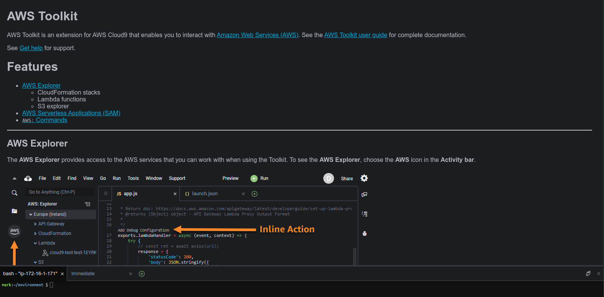

## AWS Services

| Core             | Noteworthy |   |
|------------------|------------|---|
| Compute          | AR/VR      |   |
| Storage          | Blockchain |   |
| Databases        | Robotics   |   |
| Networking       | Quantum    |   |
| Containers       | Game Dev   |   |
| Machine Learning |            |   |

* [See full list here](https://aws.amazon.com/?nc2=h_lg#)

---

## AWS Compute (EC2)

* **EC2** is one of the very first service launched, and one of the most widely used service

* EC2 provides a virtual machine to the users on the cloud, called an instance

* EC2 also provides various instance types for a variety of workloads
    - An instance type determines the number of vCPUs, the amount of memory and storage, and the network speed
    - Users can select an instance type based on their application's needs
    - For example, for a machine running a Database instance, you may want to choose more memory, and flash drives

---

## AWS Lambda

 <!-- {"left" : 2.92, "top" : 7.35, "height" : 1.44, "width" : 2.19} -->

* Lambda is the serverless computing service of AWS

* In serverless computing, the user code is run without the user having to provision any hardware or manage any servers

* Lambda allows the user code to run when required, with the provisioning and scaling of servers being taken care of by AWS

---

## AWS Storage (S3)

 <!-- {"left" : 2.92, "top" : 7.35, "height" : 1.44, "width" : 2.19} -->

* S3 was one of the first services introduced by Amazon for the general public

* S3 is object-based. You can store an unlimited number of objects

* It has multiple classes of storage, each of which has a different cost

* This can scale up to Peta bytes and beyond!

* More on this later

---

## AWS Cloud 9

 <!-- {"left" : 2.92, "top" : 7.35, "height" : 1.44, "width" : 2.19} -->

* Cloud-based IDE that helps users to write, debug, and run their code

* Users do not need to install any local IDE, as you get a code editor, a debugger, and a terminal with AWS Cloud9 in your web browser

* More than 40 programming languages, including popular ones such as Python, PHP, and JavaScript are supported by AWS Cloud9

* AWS Cloud9 connects to AWS EC2 instances to run code

* [Cloud 9](https://aws.amazon.com/cloud9/)

---

## Cloud Shell

* Every cloud offers cloud shell
* Example of AWS Shell
    * Login to AWS
    * Start the shell
    * Install terraform (https://intelligentsysadmin.wordpress.com/2021/01/08/aws-cloudshell-and-terraform/)
    * **Let's do a demo!**
  
---

## References

* CloudBank: Managed Services to Simplify Cloud Access for Computer Science Research and Education

[NFS initiative](https://www.nsf.gov/awardsearch/showAward?AWD_ID=1925001)

[Cloudbank](https://www.cloudbank.org/)

---

Wrapping Up...

---

## Further Reading

* AWS: https://aws.amazon.com/getting-started/fundamentals-core-concepts/ (read the entire document)
* AWS: https://docs.aws.amazon.com/wellarchitected/latest/framework/the-five-pillars-of-the-framework.html (reference only)
* Azure Well-Architected Framework: https://docs.microsoft.com/en-us/learn/paths/azure-well-architected-framework/ (complete all 8 units in the module)
* Google Cloud Architecture Framework: https://cloud.google.com/architecture/framework (only the overview page)
* Google Cloud https://cloud.google.com/architecture/framework/design-considerations (only the systems design considerations page)

---