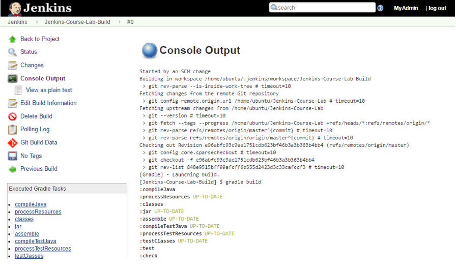
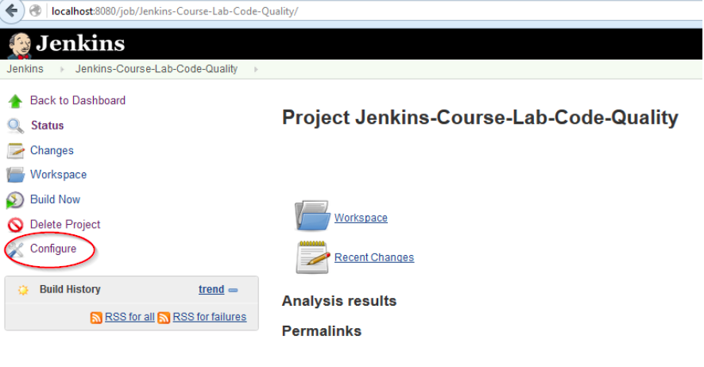
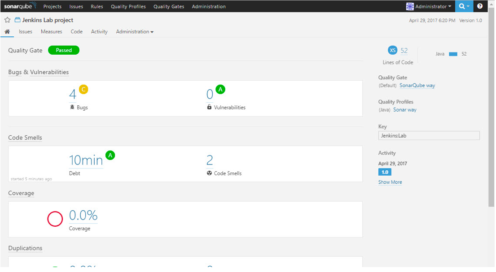

# Continuous Integration with Jenkins (Labs and Solutions)

---

## Introduction

* Your instructor will ask you to perform exercises from this guide during class.  Depending on the topics covered and the length of the course, you may only get to work on some of the exercises during class.  You may use any remaining exercises to continue learning after class is over.

* There may also be additional exercises that your instructor asks you to perform that are not in this guide.  In this case, your instructor will provide you with additional instructions.

* Many of the exercises in this guide may build upon each other, so it is best if you complete each exercise before moving to the next exercise.  Work at your own pace and understand what you are doing.  Remember, the goal is to understand the concepts discussed.


---

# Lab 1 – Install and Configure Jenkins

---

## Overview

* In this exercise, you will be able to:
  - Install and run Jenkins as a standalone application
  - Enable Security to access and use Jenkins
  - Setup the Java, Maven and Email configuration
  - Configure Gradle
  - Configure Git Version Control

<br clear="all" />

---

## Instructions
 
* 1.0 Log into your instance

   - Instructor will provide each participant with a server instance to complete all labs. Your login instruction, for example, may look like the following:

``` ssh ubuntu@<your-instance-url> ```


* If your training computer (laptop) runs Windows, please use the PuTTY utility:

   - If your laptop does not have it, download it by clicking on this link: 

* Run PuTTY, set the host as provided by the trainer.
Save this configuration, giving it the name **jenkins-labs**.  When you re-start a session, you can just select the saved session and click **Load** the **Open**.

---


   - Connect to your server and login with the provided username and password.


* If you are using a Mac, open a terminal and login with the following command using the provided username and password:

---

```
ssh ubuntu@<your-instance-url>

```

* Once you have logged in, verify that Java is installed, using this command:


```
java -version

```

* Your output should read something like this:


```
openjdk version "1.8.0_121"
OpenJDK Runtime Environment (build 1.8.0_121-8u121-b13-0ubuntu1.16.04.2-b13)
OpenJDK 64-Bit Server VM (build 25.121-b13, mixed mode)
```

---


## 1.1   Download and install Jenkins](page link)

```
wget https://s3.amazonaws.com/elephantscale-public/downloads/jenkins.war

```


---


## 1.2 Run Jenkins as a standalone application

```
java –jar jenkins.war

```

* Your output will look like the following the first time you run Jenkins:


```
*******************************************************
*******************************************************
*******************************************************

Jenkins initial setup is required. An admin user has been created and a password generated.
Please use the following password to proceed to installation:

427318b9278642e3be7bd0f1650dc262

This may also be found at: /home/ubuntu/.jenkins/secrets/initialAdminPassword

```


* **Note :**  Copy the password listed above.  You will need it for the setup in the next step. 


* After running the command, you will see the output on the console.  The last line of text will read **INFO:  Jenkins is fully up and running**.  It will appear to be hanging, and that is fine because the process is running in the foreground.

---

## 1.2 Run Jenkins as a standalone application

* Jenkins should be running on port 8080. 


* Open your browser and type `<your-instance-ip>:8080 ` You will see the following page:


* Use the password you just copied to unlock Jenkins.  Click **Save and Finish** to complete.

* The next screen you will see is “Customize Jenkins” allowing you to select and install plugins. Choose the option on the left, **Install suggested plugins**.


* Pay attention to the plugins that are being installed. Then create the first user named **admin**.  The password will also be **admin**.  The user's name will be **MyAdmin** and you can enter any email address. 

* Click **Save and Finish** and on the next screen, also click **Save and Finish**.

---


---
## 1.3 Enable Security to access and use Jenkins

* Jenkins forces you create the first admin, but we will have to give this user the right privileges. After that, you will create more users.


  * **Note :** If you lock yourself out by assigning the wrong privileges to the user, do the following:

               - Return to the Linux terminal.
               - Stop Jenkins by pressing CTRL+C or by killing the process.
               - Enter the following command:
                ` rm -fr ~/.jenkins`
               - Restart Jenkins as written in step 1.2 above.


* **Go to** Manage Jenkins **screen and can click on** Configure Global Security **link**. **It will bring up the main security configuration page**. **First you need to check the** Enable security **checkbox**. 

---
## 1.3 Enable Security to access and use Jenkins

* Select **Jenkin's own user database** for this exercise, which is located under the Security Realm **section**. **The Checkbox for** Allows users to sign up **must also be checked**. 


* Next thing is to select Matrix-based security from the Authorization section. Here you can create a few new users with different permissions. 


* You have already created admin user.  Therefore, **Add** admin to users and give the user all permissions.


* **TIP:**  Scroll to the far right, and you will see a button for all permissions.  Click that button.

---

## 1.3 Enable Security to access and use Jenkins


* **Add** a second user, developer, with all permissions except **Overall Administer** permissions. Save the security changes and go back to the Jenkins home page.


* From the login page, you will see the option for creating a new user 

---

## account

* At this point, you may already have the admin account, so let's create an account for the developer user.  Click **Create an account**.


* You can verify that admin has full permissions while developer will not able to see the **Manage Jenkins** link on the main page by logging in as each user. Now you have enabled the security with two users.

---

## 1.4 Configure Java, Maven and Email

* Java

  * **Let's login** as admin **user**.  Click Manage Jenkins link and click Global Tool Configuration **on the right**.


* Under the **JDK** section, add the Java configuration, and uncheck **Install automatically**.


* TIP: In general, we recommend installing everything manually and configuring the path in Jenkins.


* To determine what the value of JAVA_HOME should be, run the following command:

```
sudo update-alternatives --config java
```


* You will get output as follows:

---

## 1.4 Configure Java, Maven and Email


```
There is only one alternative in link group java (providing /usr/bin/java): /usr/lib/jvm/java-8-openjdk-amd64/jre/bin/java
Nothing to configure.

```

* From the full path, copy up to but not including **jre/bin/java**. In the example above, it will be:

```
/usr/lib/jvm/java-8-openjdk-amd64/

```

* TIP:  To verify a parameter's value, click this help button

---


## Maven

* Find your Maven path. This is accomplished with the following command:  `which mvn`


* Your output will look as follows:

```
ubuntu@ip-172-16-0-234:~$ which mvn
/usr/local/apps/maven/bin/mvn

```

* From the full path, copy up to but not including bin/mvn.  From the example above, MAVEN_HOME has been set as follows:


* Finally, click the Help button, to verify the path.

---

## Email setup

* Click **Manage Jenkins**, then Configure System.


* Scroll down page until you see the **Jenkins Location** section.  Enter the URL your instructor gave you earlier, <your -instance-ip>:8080 into the **Jenkins URL** field:


* Scroll to the bottom of the Configure System page, and enter the appropriate settings in the **Email Notification section**.  Use the settings you see listed here: 


---

## Email setup

* Click **Advanced**… in that section to set up the email SMTP settings.  Ask the instructor for the password.  You can use any valid email address for a test.


---

## Email setup

* Test the email setup by clicking Test configuration by sending test e-mail. Confirm that you received the email in the inbox you specified. Save the settings.

* The test email will look something like this:


---

## 1.5 Configure Gradle

*In the Linux terminal window, check that you have Gradle installed as follows:

```
gradle
The program 'gradle' is currently not installed. You can install it by typing:
sudo apt install gradle
```

* Install Gradle by running:


```
sudo apt install gradle

```

---

## 1.5 Configure Gradle

* The Gradle plugin should already be installed. Verify this in the plug-ins section by clicking Manage Jenkins and then **Manage Plugins**.  Select **Installed** tab.


* The list of plugins is alphabetized, so scroll down and look for **Gradle Plugin**.  It should be checked.  If the Gradle plug-in is not installed, install it.

* Click **Manage Jenkins**, and click Global Tool Configuration.

* Set up the Gradle configuration as seen below: 

* Verify this configuration by clicking the help button * Verify this configuration by clicking the help button  on the right.


---
## 1.6 Configure Git Version Control

* We need to verify that Git is installed on your server first. To do this, type git on the command line in the Linux terminal. Git is there if you get a help message in response as follows:

```
git
usage: git [--version] [--help] [-C <path>] [-c name=value]

```

* Next, we need to configure Git with Jenkins.  Therefore, click **Manage Jenkins** and Global Tool Configuration.  Add the Git configuration as follows:

* Verify this configuration by clicking the help button  on the right.

* Save your changes on the page.


* Congratulations!  With this step, you have successfully completed this lab for installing and configuring Jenkins. 

---

# Lab 2 – Build and Configure your first Jenkins job
---

## Overview

* In this exercise, you will be able to:

   - Create a new Jenkins Freestyle job with Gradle
   - Configure your Jenkins job to poll the changes from a Git project
   - Configure email notifications for failed builds
   - Build and run tests for your Java project

---

## Instructions

* 2.1 Prepare the sample project

   - While the instructor will explain the following commands, highlight the commands below, copy and paste into the Linux terminal window:


```
wget https://s3.amazonaws.com/elephantscale-public/downloads/Jenkins-Course-Lab.zip
unzip Jenkins-Course-Lab.zip
rm -fr .git
cd Jenkins-Course-Lab/
git init
git add .gitignore build.gradle config/ sonar-project.properties src
git commit -a

```

* The visual editor will open displaying the list of files that you want added to the Git repository. 

* Now, press the **I** key to type in the following line:


```
first commit

```
---

## 2.1 Prepare the sample project

* To save and close the file, we want to press the ESC key which puts you in a command mode, then enter the following commands  :**wq**

* The wget command that we pasted above, downloaded the **Jenkins-Course-Lab** zip file.  It contains the sample Java project for our exercise.

* Let's build the project by typing the following:

```
gradle build

```


* It should build successfully.

---


## 2.2 Create a new Freestyle Job


* Go to the Jenkins home page, and click on `New Item` to open the job creation page. 


* Give the job a name, `Jenkins-Course-Lab-Build` and select `Freestyle Project`. Click **OK**. 


---


## 2.3  Configure your Freestyle job to poll the changes from the Git projec

* In Job Configuration screen, select **Source Code Management** tab, and then select `Git`.

* Specify the name of your `Git` project as shown in the URL text box below:


* Select the **Build Triggers** tab, and check `Poll SCM`.


---

## 2.3   Configure your Freestyle job to poll the changes from the Git projec

* Now, let's set the polling schedule to occur every minute.  To specify this schedule, enter five asterisks (*) with a space between each asterisk.


* Save your changes.  You have now configured your Freestyle job to poll your Git repository at every minute.

---

## 2.4   Add Gradle build task and email notification to your job configuration


* You are currently viewing the Project **Jenkins-Course-Lab-Build** page.


---

## 2.4   Add Gradle build task and email notification to your job configuration

* Click **Configure** on the left side of the page.  Select the **Build** tab and click **Add build step** under the `Build` section. 


* Select ` Invoke Gradle script `option. 


---

## 2.4   Add Gradle build task and email notification to your job configuration

* Choose **Invoke Gradle** option if not already selected, which allows you to invoke the Gradle script.  Specify **build** in the Tasks field.

* Select **Post-build Actions** tab, and click **Add post-build action** to choose
` E-mail Notification ` and enter your email address.


* Click **Save** and we are done with all the changes in the job configuration. You are now on the Jenkins home page. 

---


## 2.5 Verify that you are getting an email notification for failed builds
 
* Your new Freestyle job will automatically build your project successfully. You can also build the job manually by clicking on **Build Now** from the left side of the page for this job. That was the first success!

* Now, return to the Linux terminal window and change to the **Jenkins-Course-Lab** directory using the following command:

```
cd ~/Jenkins-Course-Lab

```


* Using your preferred editor, you will modify the file called ` ZipCodeParserTest `. 


```
nano src/test/java/course/jenkins/lab/ZipCodeParserTest.java

-OR- 

vi src/test/java/course/jenkins/lab/ZipCodeParserTest.java

```
---

## 2.5 Verify that you are getting an email notification for failed builds

* You will notice in this script that all test methods are ignored in the ` ZipCodeParserTest ` class.  We will stop ignoring the last test, ` testZipCodeParserShouldSetNullValuesWhenPassesNullValue()`, by replacing the ` @Ignore ` to ` @Tes ` annotation, and we will commit the change to Git.

* With the annotation change, your code should now read as follows:

---

## 2.5 Verify that you are getting an email notification for failed builds


* Save your file and exit your editor.

* To commit to Git, type at the command line:

```
git commit -a

```

* Your job will pick up your changes and build your project again. But this time your build will fail and you should receive the **build failed email** from Jenkins. In the next step, you will fix the error.

---

## 2.5 Verify that you are getting an email notification for failed builds


* To view the build results in Jenkins, click on the build number in the **Build History** section (left side of the screen).


* You can then click **Console Output** (left side of page) to view the details of the build as seen below:





---

## 2.6   Correct the Java code and the build will become stable

* The build failed with a ` null pointer exception ` because the Java code did not check for null values. So let's correct the ` ZipCodeParser ` class. 

* Edit the file using your preferred editor in the Linux terminal window:
 

```

nano src/main/java/course/jenkins/lab/ZipCodeParser.java

-OR- 

vi src/main/java/course/jenkins/lab/ZipCodeParser.java 

```


* Add the code shown in red below, just before the line which starts with Matcher

---

## 2.6   Correct the Java code and the build will become stable

```
public static String[] parseZipCode(String zipInput)   
{
	...				
	if (zipInput == null) {
		return new String[] { zip5, zip4 };
	}
	
	Matcher m = P.matcher(zipInput);
		if (m.matches()) {
	… … … 

```


* Save your file and run the following command to commit the changed file to the Git repository:


```
git commit -a

```
* When the editor opens, enter the following comment:


```
Handled the exception.

```

* Save your change, and return to the Jenkins web page to view the build processing.  Your job will run successfully and you will be able to see the test result trend on your job home page.

* Confirm that you received an email about the status of the build.

---

## Congratulations!

* With this step, you have successfully created your first Jenkins job using Freestyle project with Git and Gradle. 

---

# Lab 3 – Build Jenkins Job to generate code quality reports

---

## Overview

* In this exercise, you will be able to:
  - Add Findbugs, PMD, Checkstyle, and Cobertura plugins in the Gradle project
  - Install the code coverage and static code analysis plugins using the Manage Plugins page
  - Configure new Maven Jenkins job with code coverage and static code analysis plugins 
  - Run the Jenkins job to generate quality reports 


---

## Instructions

* 3.1 Install code coverage and static code analysis plugins in Jenkins

  -  Follow the steps below to install the necessary plugins using the **Manage 
  Plugins** page.

    - Go to the Jenkins Dashboard (home page) and navigate to Manage Jenkins Manage Plugins page.  You are now in the Plugin Manager.
    - Select the Available tab.
    - Use the Filter textbox (top right corner) to locate and install each of these plugins by checking its box:
         - Cobertura
         - Findbugs
         - Checkstyle
         - PMD 
         - Static Analysis Collector Plug-in (used to generate the combined static analysis trend graph)

---

## 3.1 Install code coverage and static code analysis plugins in Jenkins

  * After you have selected these plugins, click Install without restart.

  * **Note :**  Jenkins does not have to be restarted after installing these plugins to make them work.

  * Confirm installing the required plugins as seen in this screen capture:


---

## 3.2 Create a new Jenkins job copying from an existing Jenkins job

* Reusing an existing job by copying it is a quick way to create new Jenkins jobs. 

* Go to the Jenkins Dashboard (click **Back to Dashboard** which is located on the left side of the page) and click **New Item**. 

* We will create a new job, ` Jenkins-Course-Lab-Code-Quality ` by copying an existing job.  Scroll down in the page and enter the name of the existing job, ` Jenkins-Course-Lab-Build ` into the **Copy from** field.  All the existing configuration settings will be copied to the new job.
 
* Tab out of the **Copy from** field, and click **OK** if necessary.

---

## 3.2 Create a new Jenkins job copying from an existing Jenkins job

* We do not want to run this code quality job at every minute. So let's update the ` Build Triggers ` section and check ` Build periodically `. You will also need to uncheck the existing ` Poll SCM ` configuration checkbox.


* Save your changes. 


* You can still run this job anytime by clicking **Build Now**, so let's do that to verify the settings.

---

## 3.3 Configure code coverage and code analysis plugins in a Jenkins job

* In this step, you need to configure the job for code coverage and static code coverage reports. 


* Click **Configure** for the current project and select the` Post-build Actions ` tab.  Select each of the following one at a time as seen in the screen capture:

* These plugins are used only to display different results from report files. The Gradle build is still responsible for generating code coverage and analyzing the code. 

* Verify the added post-build steps using the screenshot below:

* Save your changes.

---

## 3.4 Modify the Jenkins-Course-Lab project from the previous exercise

* Let's make certain that you're in the project's folder by typing the following command:

```
cd ~/Jenkins-Course-Lab

```

* Now, let's open ` ZipCodeParserTest.java ` using your preferred editor:

```
nano src/test/java/course/jenkins/lab/ZipCodeParserTest.java

-OR- 

vi src/test/java/course/jenkins/lab/ZipCodeParserTest.java 

```

---

## 3.4 Modify the Jenkins-Course-Lab project from the previous exercise

* Change the Junit annotation from @Ignore to @Test for all test methods in the ZipCodeParserTest class.


* Save the file.  Run the build again, just to test.

```
gradle build

```

* Then commit the changes and enter whatever comment you want to log about the change.

```
git commit -a

```

---

## 3.5 Add Findbugs plugin into the build.gradle file

* In this step, you will add the Findbug plugin into your ` build.gradle ` file and then run the build with Jenkins.  

* To use Findbugs with Gradle builds, you just need to apply the FindBugs plugin in ` build.gradle `.  The plugin will add tasks ` findbugsMain ` and ` findbugsTest ` to analyze the source code from the main and test source sets.

---

## 3.5 Add Findbugs plugin into the build.gradle file

* You will also need to update a few other findbugs properties in the build.gradle. The ignoreFailures will not fail the build if there are any findbugs warnings. Similarly, you can add more properties like effort and reportLevel and you can include and exclude filters.

* Using your preferred editor, open the **build.gradle** file (located in the **Jenkins-Course-Lab** directory) and add the following lines at the end of the file:

```
apply plugin: 'findbugs'

findbugs {	
	ignoreFailures = true	
	effort = "max"
  reportLevel = "low"
}
```

---

## 3.5 Add Findbugs plugin into the build.gradle file

* Save the changes.

* Commit the **build.gradle** file and enter whatever comment you want to log about the change.

* Now, run the Jenkins job to generate the Findbugs report by going into the Jenkins dashboard, and clicking on the ` Jenkins-Course-Lab-Code-Quality ` job.  Click ` Configure ` to edit the job.

---

## 3.5 Add Findbugs plugin into the build.gradle file





* We need to make two changes in the job.

   - The first one is to update the task for ` Invoke Gradle script ` action.  Select the **Build** tab, and select **Gradle** from the Gradle Version drop list.


---

## 3.5 Add Findbugs plugin into the build.gradle file

* Replace **build** with **check** in the Tasks field to generate code quality metrics.


* The next change is to add the findbugs report location:


```
build/reports/findbugs/main.xml

```


---

## 3.5 Add Findbugs plugin into the build.gradle file


* Save your changes.

* You can build the job manually by clicking ` Build Now ` on this job. 

* Now, click **FindBugs Warnings** (on the left side of the page) to view the results. 


---

## 3.5 Add Findbugs plugin into the build.gradle file


* The main screen for the job, Project Jenkins-Course-Lab-Quality, shows the trend graphs.


---

## 3.6 Add PMD plug-in in build.gradle file

* To apply PMD with the gradle build, you need to apply PMD plugin in build.gradle. 

* By default, the basic rule sets will be applied with PMD analysis. We will add some more rule sets in this exercise as well. Also, we will set the ` ignoreFailures ` property to true so the build will not fail due to PMD warnings. 

* Add the following lines to the end of build.gradle:
 
```
apply plugin: 'pmd'

pmd {
	ignoreFailures = true
	ruleSets = ["java-basic", "java-design", "java-braces"]
}

```

---

## 3.6 Add PMD plug-in in build.gradle file

* Save the changes and commit the build.gradle file.

* Now go to Jenkins and click on ` Jenkins-Course-Lab-Code-Quality ` job. Then click on ` Configure ` to edit the job to include the PMD report location.

* Select **Post-build Actions** tab.  Scroll down to **Publish PMD analysis results**.  The PMD report will be generated at this location:

```
build/reports/pmd/main.xml

```

* Save the job after adding the PMD report location.

---

## 3.6 Add PMD plug-in in build.gradle file


* You can build the job manually by clicking ` Build Now `. Click the build number and the summary displays.

---

## 3.6 Add PMD plug-in in build.gradle file

 &nbsp; &nbsp; &nbsp; 


* **Good Job!!!**  So far you have configured the Findbugs and PMD plugins. 

---

## 3.7 Add Checkstyle plug-in in ` build.gradle ` file

* Let's add the Checkstyle plugin in build.gradle to include checkstyle analysis in our project.

* The plugin looks for the file ` checkstyle.xml ` in the directory ` config/checkstyle ` in your project. That is the default location and file name. 

* So let's verify a checkstyle configuration in config/checkstyle folder by opening the Linux terminal window.  Make sure you are in the **Jenkins-Course-Lab** directory and then type the following command:


```
ls -lR config`


* Your gradle project should have the ` checkstyle.xml ` file.


---

## 3.7 Add Checkstyle plug-in in ` build.gradle ` file

* Let's add the ignoreFailures property for checkstyle as follows in the build.gradle file. 


```
apply plugin: 'checkstyle'
checkstyle {
		ignoreFailures = true
  }

```

* Then commit the build.gradle file.

* Now, return to the Jenkins page and click on ` Jenkins-Course-Lab-Code-Quality ` job.  Click ` Configure ` to edit the job.  Select the **Post-build Actions** tab, and enter the Checkstyle report location as follows:


```
build/reports/checkstyle/main.xml
```


---

## 3.7 Add Checkstyle plug-in in ` build.gradle ` file

* Again do not forget to save the job after adding the Checkstyle report location.


* You can build the job manually by clicking ` Build Now `. You will see the three trends and the combined static code analysis on the console.


---

## 3.8   Add Cobertura plugin in the build.gradle file

* There are a few choices for adding Cobertura functionality to a Gradle project. In this exercise, we will use the Cobertura Gradle plugin maintained by Steve Saliman.

* Let's apply the Cobertura plugin in ` build.gradle `. We also need to add the classpath to the buildscript section as shown below so Gradle can find the plugin.

```
apply plugin: 'cobertura'

buildscript {
	repositories {		
		mavenCentral()
		maven {
			url "https://plugins.gradle.org/m2/"
		  }
	}
	dependencies {
classpath 'net.saliman:gradle-cobertura-plugin:2.4.0'
	}
}

cobertura {
	coverageFormats = ['html', 'xml']	
}

```


---

## 3.8 Add Cobertura plugin in the build.gradle file


* As is the case with other plugins, you can specify additional properties with the Cobertura task in the build.gradle.

* You need to commit ` build.gradle ` after adding the Cobertura plugin.

* Now go to Jenkins and click the ` Jenkins-Course-Lab-Code-Quality ` job. Then click ` Configure ` to edit the job to include the Cobertura plugin changes.\


---

## 3.8 Add Cobertura plugin in the build.gradle file

* **Note :**  In the job configuration screen, go to the ` build ` section of your job and add the gradle task ` check cobertura ` to generate the Cobertura.


* Next, Select the **Post-build Actions** tab, and click **Add post-build action** to select **Publish Cobertura Coverage Report**. 

---

## 3.8 Add Cobertura plugin in the build.gradle file


* The final step is to add the path to the Cobertura xml report pattern field as follows:

```
build/reports/cobertura/coverage.xml

```

---

## 3.8 Add Cobertura plugin in the build.gradle file


* Save your changes, and ` click Build ` now to run the Jenkins job. 

* You will see the Cobertura Coverage report by clicking the build number, and in the summary area, you'll see a link, **Cobertura Coverage Report**.  Click that link and you'll see the report: 

---

## 3.8 Add Cobertura plugin in the build.gradle file


* You will able to see the charts and reports for code coverage and code analysis on your job page. 


* **Congratulations!!** You have successfully generated Findbugs, PMD, Checkstyle, and Cobertura reports.

---


# Lab 4 – Generate your first SonarQube report using Jenkins

---

## Overview

* In this exercise, you will be able to:
  - Download and Configure SonarQube
  - Start SonarQube Server
  - Install and Configure SonarQube Jenkins plugin
  - Configure SonarQube Runner in Jenkins
  - Enable SonarQube analysis in your Jenkins Job
  - Run Jenkins Job to generate SonarQube report

---


## Instructions

* 4.1 Download SonarQube and SonarQube Scanner

  * In the Linux terminal window, type the following:

```

cd
wget 
unzip sonarqube-6.3.1.zip
./sonarqube-6.3.1/bin/linux-x86-64/sonar.sh console &

```

* Next, open the browser at this URL: http://<your-instance-url>:9000.

---


## 4.1 Download SonarQube and SonarQube Scanner


* Login with the user **admin** and the password **admin**


* The page will contain no projects.


---


## 4.1 Download SonarQube and SonarQube Scanner


* Now let's download the scanner.  Open the Linux terminal window and type the following:


```
wget https://s3.amazonaws.com/elephantscale-public/downloads/sonar-scanner-cli-3.0.1.733-linux.zip
unzip sonar-scanner-cli-3.0.1.733-linux.zip
wget https://s3.amazonaws.com/elephantscale-public/downloads/sonar-scanning-examples.zip
unzip sonar-scanning-examples.zip
cd sonar-scanning-examples-master/sonarqube-scanner
~/sonar-scanner-3.0.1.733-linux/bin/sonar-scanner

```

* Now that you have scanned a sample project, you can see it in the SonarQube screen by clicking **All** in the top-left corner of the SonarQube page.


* **Congratulations!** The SonarQube is up and running.


---

## 4.3 Install and Configure SonarQube Jenkins plugin

* In the previous step, we installed SonarQube and SonarQube Scanner. Now we will install the Jenkins plugin to integrate Jenkins with SonarQube.

* Let's follow the steps below to install SonarQube Jenkins plug-in:

  - From the Jenkins dashboard, click ` Manage Jenkins `.
  - Click ` Manage Plugins `.
  - Select the ` Available ` tab, and search for ` SonarQube Scanner for Jenkins ` in the Filter in the top-right corner of the page.
  - Check the plugin, and click on ` Install without restart `.


---

## 4.3 Install and Configure SonarQube Jenkins plugin

* After the installation, you will see this page:


* Click **Manage Plugins** and select the **Installed** tab.  Scroll down the alphabetized list, and you will see the SonarQube Scanner plugin listed.


---

## 4.3 Install and Configure SonarQube Jenkins plugin

* The next thing is to configure SonarQube. Let's go to ` Manage Jenkins ` and select ` Configure System `.  Scroll down the page a bit, and you will find the SonarQube section.


* Click ` Add SonarQube ` to add the SonarQube local installation, and enter the name, **Local SonarQube**, for your SonarQube Server.  For the server URL, enter <your-instance-ip>:9000
 


* Save your changes and return to the Jenkins dashboard.

---

## 4.4 Configure SonarQube Scanner in Jenkins


* Click ` Manage Jenkins `and choose ` Global Tool Configuration `.


* Click **Add SonarQube Scanner**.  Enter the name as:


```
SonarQube Scanner

```

---

## 4.4 Configure SonarQube Scanner in Jenkins

* Uncheck ` Install automatically `, and enter the following path for the variable SONAR_RUNNER_HOME: 


```

/home/ubuntu/sonar-scanner-3.0.1.733-linux

```

* Your screen should look like this:


* Save your changes and return to the Jenkins home page.

* Let's give you some background information.  Our Java project has one more configuration file, 
` sonar-project.properties `, in the root directory of the project being analyzed.  No changes are required to this file.  It contains the required sonar properties, which are needed when using SonarQube Runner with your project. 


---

## 4.5 Enable SonarQube analysis in your Jenkins Job


* We will use the Jenkins job, **Jenkins-Course-Lab-Code-Quality** from the previous exercise by clicking **Jenkins** in the top left corner, then click the project's name.


* Click ` Configure ` for this Jenkins job and select the **Build** tab. Click ` Add build step ` and select ` Execute SonarQube Scanner `.


---

## 4.5 Enable SonarQube analysis in your Jenkins Job

* You are not required to edit anything in the SonarQube analysis section. Just leave everything as it is.


* Save changes and you will be returned to the job's main page. 


---

## 4.6 Run Jenkins Job to generate SonarQube report

* Now it's time to run the Jenkins job. Please make sure that the SonarQube server is running.  You can return to the SonarQube web page from earlier and simply refresh it.  If it refreshes, SonarQube is running. 


* Return to the Jenkins page in the browser, and let's run the job by clicking ` Build Now `. 

---

## 4.6 Run Jenkins Job to generate SonarQube report

* You can verify the SonarQube execution steps by clicking the build number on the job's page, and click **Console Output**.  


* The embedded sonar URL can be clicked to browse the SonarQube report.





* You will see the SonarQube link on the job's main page as well.


---

## 4.6 Run Jenkins Job to generate SonarQube report

* You will see the SonarQube report for ` technical debt, coverage ` , ` duplications ` and 
` structure `. You can get more details by clicking ` Show More ` for each of those areas.


* **Congratulations!** You have generated your first SonarQube report. 

---
# Lab 5 – Configure distributed builds using Master/Slave configuration

---

## Overview

* In this exercise, you will be able to:

  - Create a new slave node
  - Launch new slave node using Java Web Start
  - Configure existing job to run with a slave node
  - Monitor slave nodes through the master node 

---

## Instructions

* 5.1 Create a new slave node using Manage Nodes on the Master node

   -  So far, we have used the master node for every lab. For this lab, you will create a new job, called **Distributed Build**, which you will create as a copy of **Jenkins-Course-Lab-Code-Quality** in the slave node. 

   -  Return to the Jenkins Dashboard and click **New Item**.  Enter the name as **Distributed Build**.

   - Scroll down the page, and enter **Jenkins-Course-Lab-Code-Quality** in the Copy from field.  Click **OK**.  Click **Save**.

---

## 5.1 Create a new slave node using Manage Nodes on the Master node

* Return to the Jenkins home page, and click ` Manage Jenkins -> Manage Nodes `. 


* The Manage Nodes page has only one master node at this point.  Therefore, click New Node to create a slave node with the name **Lab-Slave**. 

---

## 5.1  Create a new slave node using Manage Nodes on the Master node


* Select the **Permanent Agent** option and click **OK**.

* The settings are listed in the screen below:


* The user name and password (Credentials field) were given to you at the beginning of class by the instructor to log into the Linux terminal window.

* Save your settings and your screen will appear as follows:

---


## 5.2   Launch a new slave

* This is done automatically when you create the node.

---

## 5.3   Configure existing job to run with the slave node

* Return to the Jenkins home page, and select the **Distributed Build** job.  Click ` Configure ` and you will update settings to use the slave node to run this job. 

* In the job configuration screen, check ` Restrict where this project can be run ` and enter **Lab-slave** in the Label Expression field to restrict execution of this job to the slave node only.

* Save your configuration changes and click ` Build Now ` to run this 
job. You will see the following on the job console output (click the build number and click **Console Output**). 

---

## 5.4   Monitor slave nodes through the master node

* You can monitor your slave node through the Jenkins master node. Go to the Jenkins Dashboard, and click **Manage Jenkins**.  Click **Manage Nodes**.

* Click the slave node, **Lab-slave**, to see the build history, log, and some load statistics for your slave node.  Click the job's name for more details.


* With this step, you have completed this exercise successfully!

---

# Lab 6 – Build your first pipeline with Jenkins

---

## Overview

* In this lab, you will be able to:

  - Install Build Pipeline and Parameterized Trigger plugins
  - Create jobs to build, test, run code quality, load test and package
  - Configure those jobs to trigger other jobs to establish a pipeline
  - Create new pipeline view 
  - Build your first job and verify pipeline view

---

## Instructions

* 6.1   Install Build Pipeline and Parameterized Trigger plugins

* The plugins used for this part of the exercise are not part of the default Jenkins install.  Therefore, let's first install **Build Pipeline** and **Parameterized Trigger plugins** to our master node. 


* **Note :**  Build Pipeline will install the Parameterized Trigger plugin as part of its installation.	

* Go the Jenkins home page, select **Manage Jenkins**, and click **Manage Plugins**.  Select the **Available** tab.   Search for **Build Pipeline Plugin** and check it.  **Install without restart**.


* You are not required to restart Jenkins after installing the Build Pipeline plugin.

---


## 6.2   Create jobs to build, package, test, run code quality, and deploy

* In this lab, we will create new jobs directly without creating Java projects. 

* You will create the following dumb jobs without any configuration for our pipeline exercise: 

  - --Jenkins-Course-Build--: Just for initial build and quick test
  - --Jenkins-Course-Test--: Running all integration tests
  - --Jenkins-Course-Static-Analysis--: Performing static code analysis
  - --Jenkins-Course-LoadTest--: Running load tests
  - --Jenkins-Course-Package--: Package and deploy to repository

* For each of the jobs above, go to the Jenkins home page and click ` New Item `.  Use the  job name as listed above, and select the ` Freestyle project `, click **OK** and then **Save **and repeat. 


* No job configuration will be done.  So just save the jobs.   

---

## 6.3 Configure those jobs to trigger other jobs to establish pipeline

* The next thing is to add a post-build action to trigger parameterized build on the other projects. 

* Let's start with the **Jenkins-Course-Build** job.  From the Jenkins home, select the **Jenkins-Course-Build** job.  Click **Configure**.  Select the **Post-build Actions** tab, and click **Add post-build action**.  Select **Build other projects**.  Jenkins-Course-Build will trigger **Jenkins-Course-Test** and **Jenkins-Course-Static-Analysis** jobs.  Comma separate the values.


---

## 6.3 Configure those jobs to trigger other jobs to establish pipeline

* We only want to trigger when the **Jenkins-Course-Build** has a stable build.

  - --Jenkins-Course-Test-- and-- Jenkins-Course-Static-Analysis-- will trigger --Jenkins-Course-LoadTest-- job.

  - --Jenkins-Course-LoadTest-- will trigger --Jenkins-Course-Package-- job. For this exercise,
    --Jenkins-Course-LoadTest-- is the final job but in a real scenario, there would be more jobs for deploying the code to test environments after the packaging step.

---


## 6.4   Create a new pipeline view 

* You need to create a view for the build pipeline. Let's navigate to the Jenkins home page and click the + next to the ` All ` tab to create a view.
 

* Select ` Build Pipeline View ` and enter the name as **Jenkins-Course-Pipeline**. Click **OK**.

* Now you can do a few configuration changes such as ` No Of Displayed Builds ` and ` Allow manual trigger ` on pipeline steps. But the most important configuration is to **select initial job** for your pipeline.  Enter **Jenkins-Course-Build** as the initial job to derive your pipeline structure.  Click **OK**.


---

## 6.5 Run the first job to trigger pipeline

* Now the final thing is to run your first job, **Jenkins-Course-Build**. 

* Return to the Jenkins dashboard (click Jenkins link in the top-left corner).

* Build the **Jenkins-Course-Build** job. Then it will automatically trigger the other jobs in the pipeline.

* Return to the Jenkins dashboard, and you can view your build pipeline by clicking the **Jenkins-Course-Pipeline** tab (to the right of the **All tab). 


* You may need to refresh with **F5** or enable the auto refresh to see the progress.

* **Congratulations**, you have created your first build pipeline and completed this lab successfully!


  


  


