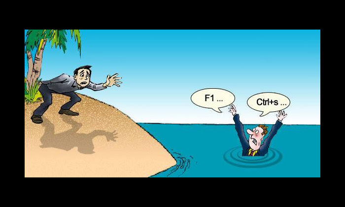

# Bad Programming Jokes

---

# Generic

---

## What is the most commonly used programming language?

---

## What is the most commonly used programming language?

### Profanity!

---

---

## How many programmers does it take to change a lightbulb?

---

## How many programmers does it take to change a lightbulb?

###  None, that's a hardware problem.

---

---

## How to explain the movie Inception to a programmer? 

### When you run a VM inside another VM, inside another VM ... everything runs real slow!

---

---

## Pirates

### Pirates go 'arg!'

### computer pirates go 'argv!'

---

---

## Q: What is the Object Oriented Way to Become Wealthy?

### A : Inheritance

---

---

## Hardware (noun.)

### The part of the computer that you can kick

---

---

## Unix is user friendly. It's just very particular about who its friends are

---

---

## How many Prolog programmers does it take to change a lightbulb?

---

## How many Prolog programmers does it take to change a lightbulb?

###  False

---

---

## There are 10 types of people: those who understand binary and those who don't.

---

---

## There are 10 types of people: those who understand hexadecimal and 15 others.

---

---

## I would tell you a joke about UDP... 

### but you may never get it.

---

---

## Eight bytes walk into a bar. The bartender asks, 'Can I get you anything?' 

### 'Yeah,' replies the bytes. 'Make us a double.'

---

---

## 3 Database Admins walked into a NoSQL bar. A little while later they walked out because they couldn't find a table.

---

---

## An SEO expert walks into a bar, bars, pub, public house, Irish pub, tavern, bartender, beer, liquor, wine, alcohol, spirits...

---

---

## Glass

### Optimist: The glass is half full. 

### Pessimist: The glass is half empty. 

### Programmer: The glass is twice as large as necessary.

---

---

## A programmer got stuck in the shower...

### Because the instructions in the shampoo bottle said

### *Lather, Rinse, Repat.*

---

---

## How to get a programmer to save you

 

---

# Java Jokes

---

## Java: Write once, run away.

---

---

## Knock, knock.

### 'Who's there?' 

### ... very long pause ... 

### 'Who's there?' 

### 'Java.'

---

---

## What did the Java code say to the C code? 

---

## What did the Java code say to the C code? 

### A: You've got no class.

---

---

## Why do Java programmers make terrible spouses?

---

## Why do Java programmers make terrible spouses?

### They don't take out the garbage

---

---

# Chuck Norris Jokes

---

## Chuck Norris Writes Code...

###  That *Optimizes Itself*

---

# End